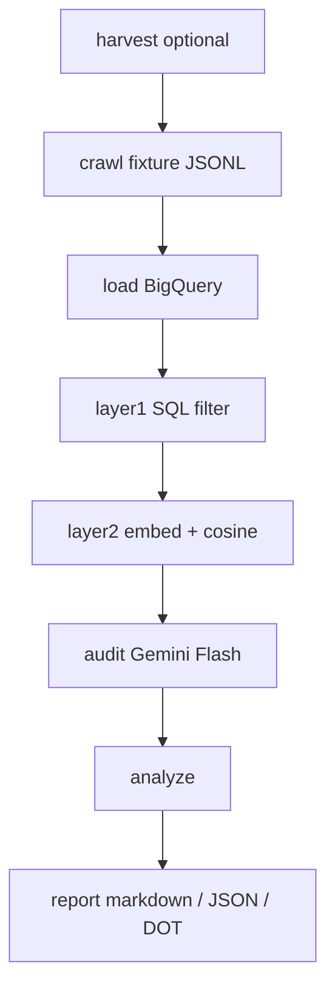
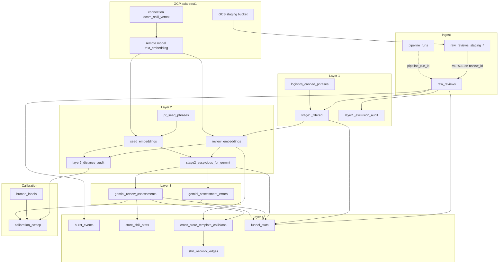

# ecom-shill-review-detector

[](LICENSE)


CLI for detecting Cantonese e-commerce shill / paid-review patterns. Personal research and analysis tool: **statistics are not legal facts**.

Licensed under [GNU GPL-3.0-only](LICENSE). New source files carry `SPDX-License-Identifier: GPL-3.0-only`.

v1 is **fixture-first**: replay reviews from JSONL. It does not implement a live marketplace crawler and does not make public accusations against stores.

## What it does

Hong Kong marketplace reviews mix short five-star logistics boilerplate with longer copy that may be genuine or template-written PR. Sending every review to an LLM is slow and expensive; keyword matching misses paraphrases; embeddings alone mis-flag sincere long reviews.

This tool runs a **four-layer funnel** over a replayable snapshot:

| Layer | Output | Purpose |
| --- | --- | --- |
| 0 | `raw_reviews` | Full ingest. Source of truth. |
| 1 | `stage1_filtered` | Drop noise: too short, not 5-star, logistics-only. |
| 2 | `stage2_suspicious_for_gemini` | Keep reviews whose embedding is close to PR seed phrases. |
| 3 | `gemini_review_assessments` | Gemini Flash scores the suspicious subset with structured evidence. |
| 4 | analysis tables + report | Store-level moisture, burst, cross-store template collisions. |

Funnel percentages (about 35% after Layer 1, about 5% after Layer 2) are **hypotheses for calibration**, not SLAs.[^sla] `shill_score >= 75` and cosine distance `0.28` are tunable defaults, not guarantees.

## Workflow



Typical operator path:

1. **Optional harvest** — scrape public HKTVmall product-page reviews into `FixtureReviewRaw` JSONL (`--i-accept-tos`). Skip this and use `fixtures/reviews/*.jsonl` for local/CI work.
2. **Crawl** — replay JSONL into a batch NDJSON file. Does **not** write `pipeline_runs`.
3. **Load** — GCS[^gcs] NDJSON → staging table → `MERGE` into `raw_reviews`. This is the first command that creates a `pipeline_run_id`.
4. **Layer 1** — SQL: `CHAR_LENGTH >= 25`, `star_rating = 5`, not pure logistics canned phrases.
5. **Layer 2** — embed stage1 reviews and seed phrases with `text-multilingual-embedding-002`; keep rows whose min cosine **distance** is `<= 0.28`.
6. **Audit** — Vertex Gemini Flash (JSON Schema, `p-limit` 8) scores stage2 only. Default `--skip-existing` copy-forwards matching prior scores.
7. **Analyze** — DELETE+INSERT per `pipeline_run_id`: store moisture, bursts, cross-store template/embedding collisions, edge list, `funnel_stats`.
8. **Report** — markdown/JSON from the analysis tables (banner: statistics are not legal facts). `--dot` also writes Graphviz.

`data/runs/latest` remembers `pipeline_run_id`. Re-running the same run: `layer1` / `layer2` / `analyze` DELETE that run then INSERT. `layer2` / `audit` / `analyze` / `report` **must not** create a new `pipeline_runs` row — pass `--pipeline-run-id` or `--continue-latest`.

```bash
# GCP-free (also run in CI)
pnpm cli -- crawl --adapter fixture --input fixtures/reviews/cantonese-mix.jsonl --dry-run

# Sandbox (needs ADC + BQ dataset + staging bucket; see GCP below)
set -a && source .env && set +a

pnpm cli -- crawl --adapter fixture --input fixtures/reviews/cantonese-mix.jsonl
pnpm cli -- load --ndjson data/batches/<crawl_batch_id>/reviews.ndjson --continue-latest
pnpm cli -- layer1 --continue-latest
pnpm cli -- layer2 --continue-latest
# Live audit: if asia-east1 has no generateContent, set GEMINI_LOCATION=global.
# Do not change GCP_LOCATION.
pnpm cli -- audit --continue-latest
pnpm cli -- analyze --continue-latest
pnpm cli -- report --continue-latest --format markdown --dot
```

`crawl --dry-run` and unit tests **do not** need `GCP_*`. `load` / Layer 2+ lazily load GCP.

## Example report

`report` is the last workflow step. It does not scrape again. It reads the analysis tables for one `pipeline_run_id` and writes markdown/JSON (and optional Graphviz). Banner on every report: **statistics are not legal facts**.

Example: one HKTVmall store, 321 reviews in-scope.

**Funnel**

| layer | n | of raw |
| --- | ---: | ---: |
| raw | 321 | 100% |
| stage1 | 19 | 5.9% |
| stage2 | 17 | 5.3% |
| assessed | 17 | — |
| assess errors | 0 | — |

stage2 / stage1: 89.5%. `pct_shill_75` below is **9 / 17 assessed**, not 9 / 321 raw.

Score distributions (`n_in_scope=321`). Bars are the same ASCII histograms the CLI writes.

**Layer 1 — `exclusion_reason`** (no numeric score; priority: non_five_star > too_short (`CHAR_LENGTH` < 25) > pure_logistics > pass)

| bucket | n | of in-scope | |
| --- | ---: | ---: | --- |
| non_five_star | 133 | 41.4% | ████████████████ |
| too_short | 168 | 52.3% | ████████████████████ |
| pure_logistics | 1 | 0.3% |  |
| pass | 19 | 5.9% | ██ |

**Layer 2 — `min_cosine_distance`** (nearest PR-seed cosine **distance**; stage2 keeps `<= 0.28`. Bars include mass **above** T)

| bucket | n | of stage1-in-scope | |
| --- | ---: | ---: | --- |
| 0.00-0.07 | 0 | 0.0% |                      |
| 0.07-0.14 | 0 | 0.0% |                      |
| 0.14-0.21 | 8 | 42.1% | ██████████████████ |
| 0.21-0.28 | 9 | 47.4% | ████████████████████ |
| 0.28-1.00 | 2 | 10.5% | ████ |
| 1.00-2.00 | 0 | 0.0% |                      |
| no_distance | 0 | 0.0% |                      |

**Layer 3 — `shill_score`** (Gemini 0–100 on the 17 assessed; `75-100` is `n_shill_75`. `pct_shill_75` uses this n, not `n_raw`)

| bucket | n | of assessed | |
| --- | ---: | ---: | --- |
| 0-24 | 5 | 29.4% | ███████████ |
| 25-49 | 3 | 17.6% | ███████ |
| 50-74 | 0 | 0.0% |                      |
| 75-100 | 9 | 52.9% | ████████████████████ |

**Store row:** `n_shill_75=9`, `pct_shill_75=52.9%`, `template_hit_rate=52.9%`, `avg_min_seed_distance=0.217`. **Burst events:** none. **Cross-store edges:** none (this run is a single store).

### What this can and cannot show

The report is a stack of statistical indicators on a snapshot. It is **not** a verdict, a ToS finding, or a public accusation.

**Supports a PR-template pattern among the long five-star remainder**

- After Layer 1, 17 of 19 surviving reviews are semantically close to the v0 PR seed phrases (cosine distance `<= 0.28`; mean nearest-seed distance 0.217).
- Gemini assigned `shill_score >= 75` and a template hit to 9 of those 17, with 0 audit errors.

**Does not support “mass shill reviews” for the whole listing**

- 302 of 321 reviews never reached Gemini (short or not five-star). 9 high scores are **2.8% of raw**, not 52.9% of the store.
- Layer 1 kept 5.9% of raw (the ~35% funnel figure is a calibration hypothesis, not a target). Almost everything that survived L1 is seed-like (89.5% stage2/stage1) because the remainder is already tiny — that is a funnel-shape fact, not “89% of reviews are shills”.
- No `burst_events`: review volume did not spike vs that store’s own baseline.
- No `shill_network_edges`: this run cannot show copy-paste across stores.

**Cannot prove**

- Paid posters, fake accounts, or agency coordination. Seeds are replaceable hypotheses; `0.28` and `75` are tunable defaults. Genuine long praise can sit near a seed; a high `shill_score` is model output with a short rationale, not chain-of-custody evidence.

## Requirements

- Node.js 22 LTS (`>=22`)
- pnpm 9+

## Install

```bash
corepack enable
corepack prepare pnpm@9.15.9 --activate
pnpm install
cp .env.example .env
# Set REVIEWER_ID_SALT (at least 16 characters). Empty string is forbidden.
```

## CI-level commands

```bash
pnpm lint
pnpm typecheck
pnpm test
pnpm cli -- --help
pnpm cli -- crawl --adapter fixture --input fixtures/reviews/cantonese-mix.jsonl --dry-run
pnpm cli -- seeds upsert --input fixtures/seeds/v1_example.jsonl --seed-version v1_example --dry-run
```

Help must be `pnpm cli -- --help` (pnpm treats the first `--` as the script-argument separator). `seeds upsert --dry-run` / `seeds calibrate --dry-run` **do not** need `GCP_*`; live upsert / calibrate need BigQuery first.

CI **only** covers TypeScript goldens, mock audit call-count, fixture `crawl --dry-run`, and `seeds upsert --dry-run`. CI **does not** connect to GCP, **does not** run `ML.GENERATE_EMBEDDING`, **does not** validate SQL semantics, and **does not** assert the 35%/5% funnel.

`layer2` embeds seeds and stage1 via a BigQuery remote model (ENDPOINT from `EMBEDDING_MODEL`, default `text-multilingual-embedding-002`), then writes stage2 for cosine distance `<=` the config threshold. If `CREATE MODEL` 404s for multilingual-002 in that region, **stop**. Do not silently fall back to `text-embedding-004`.

`audit` calls Gemini Flash against stage2 (JSON Schema, `p-limit` 8). CI uses a mock for call-count; live Vertex is not a merge gate. `asia-east1` has no Gemini `generateContent`; BQ / embedding stay on `GCP_LOCATION`. For live audit set `GEMINI_LOCATION=global` (or `asia-southeast1` / `asia-northeast1`).

`analyze` writes funnel percentages only to `funnel_stats` and JSON logs. `pct_stage2_of_raw > 0.15` or `< 0.01` **warns**; it does not fail the CLI. After a BQ job the CLI queries `region-${GCP_LOCATION}.INFORMATION_SCHEMA.JOBS_BY_PROJECT` and logs `bq_job_bytes` (do not hardcode the region as `asia-east1`).

## Harvest (operator-explicit; CI never runs live)

`ecom-shill harvest` opens public HKTVmall `/hktv/zh/` product pages, clicks Reviews, paginates, and writes `FixtureReviewRaw` JSONL. After that, still run `crawl --adapter fixture --input <jsonl>`. `harvest` **does not** create `pipeline_runs` and **does not** take `addRunFlags`.

Default `--transport brightdata` (Bright Data Browser API). `--transport scrapingbee` uses the ScrapingBee HTML API (one GET per review page; **no** Playwright). Operator live workflow: [`docs/harvest-live-workflow.md`](docs/harvest-live-workflow.md).

`--dry-run` only validates the URL and prints `plan_*`: **no** CDP / HTML API, no credentials, no `--i-accept-tos`, no `--out` write. A real scrape requires `--i-accept-tos`. `brightdata` needs `BRIGHTDATA_BROWSERAPI_USERNAME` / `BRIGHTDATA_BROWSERAPI_PASSWORD`. `scrapingbee` needs a `SCRAPINGBEE_API_KEY` that is not `YOUR_API_KEY` (no Bright Data creds).

```bash
pnpm cli -- harvest --dry-run --url https://www.hktvmall.com/hktv/zh/main/Store/s/S2090001/cat/p/S2090001_S_4000412
pnpm cli -- harvest --transport scrapingbee --dry-run --url <public-product-url>

pnpm cli -- harvest --url <public-product-url> --i-accept-tos --out data/harvested/batch.jsonl
pnpm cli -- harvest --transport scrapingbee --url <public-product-url> --i-accept-tos --out data/harvested/batch.jsonl
pnpm cli -- crawl --adapter fixture --input data/harvested/batch.jsonl --dry-run
```

Feed crawl only sidecar `ok: true` `--out` JSONL; **do not** crawl `.partial`. Harvest JSONL contains `reviewer_id_raw` — do not commit it (`data/` is gitignored).

Live tests (local opt-in; CI never sets these variables; test files do not hardcode store URLs). The two gates are independent: Bright Data reads `HARVEST_LIVE=1`; ScrapingBee reads `SCRAPINGBEE_LIVE=1` and **does not** read `HARVEST_LIVE`.

```bash
HARVEST_LIVE=1 HARVEST_LIVE_URL=https://www.hktvmall.com/... pnpm test
SCRAPINGBEE_LIVE=1 HARVEST_LIVE_URL=https://www.hktvmall.com/... pnpm test
```

The operator fills `HARVEST_LIVE_URL`. Missing URL/creds skip the test; they do not fail it. `SCRAPINGBEE_API_KEY=YOUR_API_KEY` is treated as absent. `--no-optional` does not support typecheck / Bright Data live harvest (needs `playwright-core` optionalDependency: `pnpm install`). The ScrapingBee path uses zero Playwright.

## Layer 2 seed phrases (`v0_hypothesis`)

The 7 sentences in [`sql/seeds/pr_seed_phrases_v0.sql`](sql/seeds/pr_seed_phrases_v0.sql) are **hypothesis, replaceable**, not a verified “official 7 classics”. Replace them with a new `seed_version` (do not overwrite v0 rows):

```bash
# GCP-free: validate 7 slots
pnpm cli -- seeds upsert --input fixtures/seeds/v1_example.jsonl --seed-version v1_example --dry-run

# Sandbox: INSERT a new version, deactivate other is_active by default, then re-embed seeds + distance
pnpm cli -- seeds upsert --input fixtures/seeds/v1_example.jsonl --seed-version v1_example
pnpm cli -- layer2 --continue-latest --seed-version v1_example
```

`--no-activate` keeps the old version’s `is_active`. Upsert of `v0_hypothesis` is rejected (owned by `sql/seeds/pr_seed_phrases_v0.sql`).

Threshold calibration (human labels `shill | not_shill | unsure`; sweep `{0.18,0.22,0.25,0.28,0.32,0.38}`) writes `human_labels` / `calibration_sweep`. The CLI **does not** change the `0.28` in `config/default.yaml`:

```bash
pnpm cli -- seeds calibrate --label-file fixtures/expected/human-labels.example.jsonl --dry-run
pnpm cli -- seeds calibrate --continue-latest --label-file labels.jsonl
```

Layer 2 SQL lives in [`sql/layer2/`](sql/layer2/) (embed seeds / embed reviews / cosine distance ≤ config threshold). CI **does not** run `ML.GENERATE_EMBEDDING` (needs a Vertex remote model).

## GCP (optional)

[`scripts/bootstrap-gcp.sh`](scripts/bootstrap-gcp.sh) **only echoes steps** (enable APIs, dataset, staging bucket, connection, minimum IAM, CREATE MODEL). Creating the connection / remote model is a sandbox checklist, not a merge gate. BQ / embedding are locked to `asia-east1`. If `CREATE MODEL` 404s for `text-multilingual-embedding-002`, stop — do not switch to 004. If Gemini Flash 404s in that region, set `GEMINI_LOCATION`; do not change `GCP_LOCATION`.

### BigQuery (`ecom_shill`)

Dataset and Vertex connection stay in `asia-east1`. There are no enforced foreign keys. Snapshot tables are keyed by `pipeline_run_id`; reviews by `review_id`. `load` creates a per-batch `raw_reviews_staging_<crawl_batch_id>`, then `MERGE`s into `raw_reviews` (source of truth). Downstream tables are rebuilt per run.



Convenience views `v_stage1_latest` and `v_stage2_latest` read the latest succeeded layer1 / layer2 `pipeline_run_id`. Gemini is a Node worker (Vertex ADC), not a BigQuery remote model.

- **`burst_events`** — review-volume spikes on `raw_reviews` (all star ratings), at day and hour, store and store+product. Day burst: z-score[^zscore] ≥ 3 vs the same group’s past 14 days, and at least 10 reviews. Hour burst: at least 8 reviews and ≥ 90% five-star. A statistical flag, not proof of shilling.
- **`shill_network_edges`** — undirected store–store edges rolled up from `cross_store_template_collisions`. `weight` is the number of colliding review pairs; `template_ids` are the shared templates. `report --dot` draws this as Graphviz.
- **`funnel_stats`** — one row per run: counts and percentages through raw → stage1 → stage2 → assessed (plus Gemini errors). Informational only; not a pass/fail bar. `pct_stage2_of_raw > 0.15` or `< 0.01` warns.

## Security

- Do not commit real store cookies, tokens, or unauthorized API endpoints to git.
- `REVIEWER_ID_SALT` must not enter BigQuery and must not enter git.

[^sla]: **SLA** (service-level agreement): a target the system is expected to hit, and that you would treat as a failure if it missed. The ~35% / ~5% funnel figures are calibration hypotheses, not pass/fail contracts.
[^gcs]: **GCS** (Google Cloud Storage): the object store used as a staging bucket. `load` uploads the crawl NDJSON there, then BigQuery load-jobs it into a staging table before `MERGE` into `raw_reviews`.
[^zscore]: **z-score**: how many standard deviations[^stddev] a day's review count sits above that store/product's own mean over the previous 14 days, excluding the day itself: `(n_reviews - baseline_mean) / baseline_stddev`. ≥ 3 means an unusually large spike. If fewer than 5 baseline days, or stddev is 0 / missing, z-score is null and `is_burst` is false. Hour bursts do not use a z-score.
[^stddev]: **stddev** (standard deviation): how spread out the baseline daily counts are. Small stddev = volume is usually steady, so a modest bump can still score z ≥ 3. Large stddev = volume already jumps around, so the spike must be bigger. If every baseline day is the same, stddev is 0 and z-score is not computed. This pipeline uses BigQuery `STDDEV_SAMP` (sample stddev).
