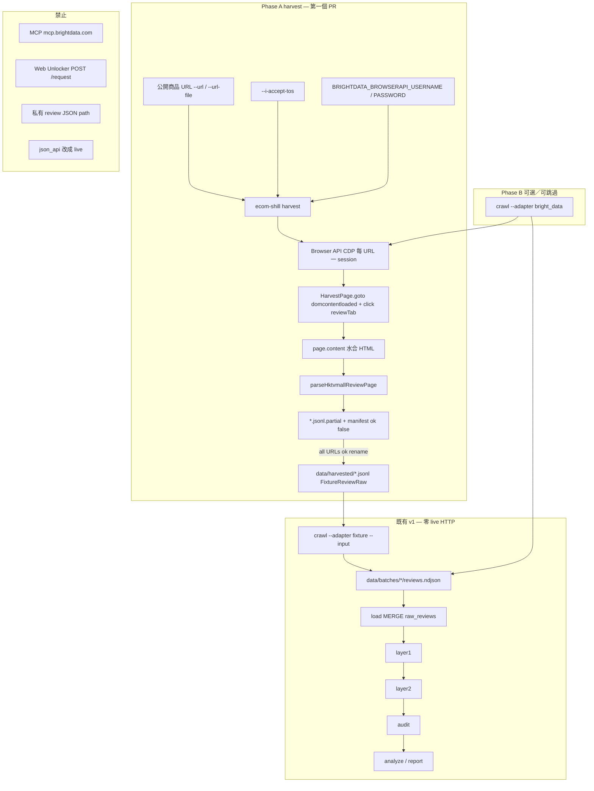
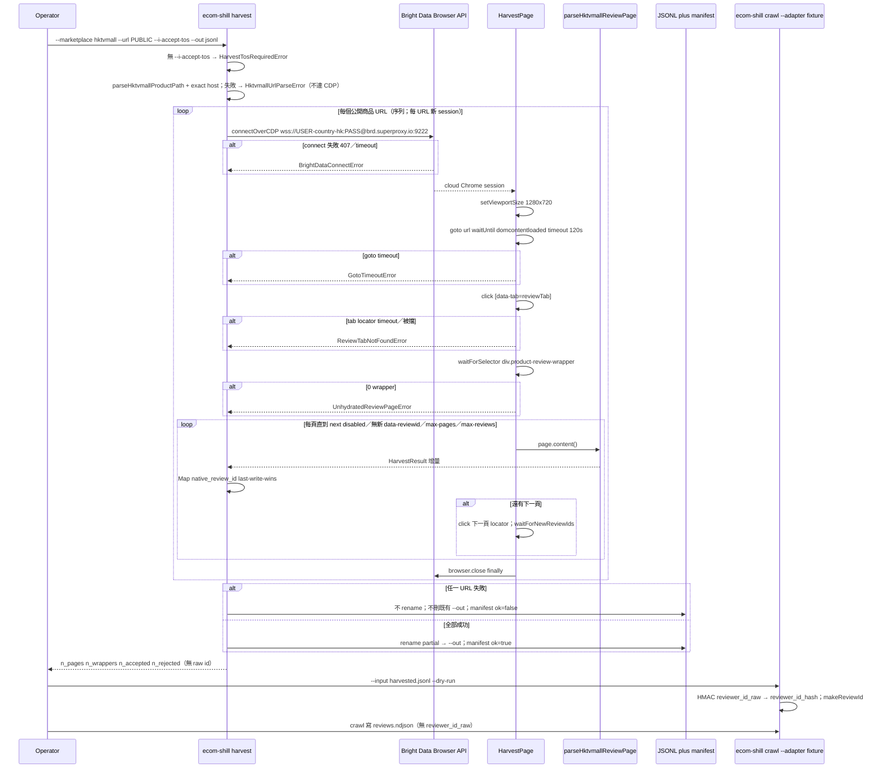

# HKTVmall 公開評論擷取 — Bright Data Browser API（CLI 補充設計）

| 欄位 | 值 |
| --- | --- |
| Title | HKTVmall product-review harvest via Bright Data Browser API |
| Document ID | `ecom-shill-bright-data-browser-hktvmall-supplement-v1` |
| Author | TBD（實作前填入） |
| Date | 2026-09-05 |
| Status | **Draft**（rev 4：CDP disconnect ≠ `unchanged_ids`） |
| Repo | `/Users/mark/ecom-shill-review-detector` |
| Parent | [`docs/design.md`](design.md)（**Accepted**，rev 4）。本文件是補充，**不是**替代。 |
| Filename | `docs/design-bright-data-scrapping-pro-browser-hktvmall.md` — **scrapping** 為歷史拼字，不改檔名以免斷鏈。正確英文是 scraping。 |
| Probe date | 2026-09-05（Bright Data MCP **Pro scraping browser**；Rapid `scrape_as_markdown` 失敗） |
| License | GNU GPL-3.0-only（新檔加 `SPDX-License-Identifier: GPL-3.0-only`） |
| Audience | 資深工程師 / coding agent（實作另開指令；**本文件不授權改 `src/`**） |
| Language | 正文繁體中文；identifier、flag、env、路徑、SQL、TypeScript 維持 English |

---

## Overview

Accepted v1（[`docs/design.md`](design.md)）把 ingest backbone 固定為：公開評論頁 →（解 bot / 取 HTML）→ `FixtureReviewRaw` JSONL → `ecom-shill crawl --adapter fixture --input …` → load → Layer 1/2 → audit → analyze → report。`json_api` 維持零 HTTP stub；CI 零 live HTTP（KD-04、KD-22）。[`docs/chat-session-03.md`](chat-session-03.md) 把「用 Bright Data 收真實粵語評論」分成兩段：先 harvest 成 JSONL，mapping 穩定後才考慮 `--adapter bright_data`。當時的第一稿運輸層是 Web Unlocker REST `POST https://api.brightdata.com/request`。

2026-09-05 對 HKTVmall 公開商品頁的實測推翻了 Unlocker／Rapid markdown 路線：單次 GET 只拿到 SSR 殼（`#reviews` 的 `data-reviews=""`、零個 `div.product-review-wrapper`）。評論列表要在 **雲端 Chrome 裡點「評論」分頁並等待 wrapper 水合** 才出現；之後還要翻頁（10 則／頁）。MCP Pro `scraping_browser_*` 只證明了互動流程，**不能**成為 `ecom-shill` 的 production ingest（不可重跑、token 在 IDE、不是 CLI）。

本補充指定：**CLI 用 Bright Data Browser API（CDP WebSocket）+ Playwright `chromium.connectOverCDP` 重放 MCP Pro 的 navigate → click 評論 → `page.content()` → 既有 `parseHktvmallReviewPage`**。第一個可合併切片是新命令 `ecom-shill harvest`（寫 `FixtureReviewRaw` JSONL，再走現有 `crawl --adapter fixture`），而不是把 live HTTP 塞進 `fixture` 或把 `json_api` 改成 Bright Data。Phase B 才是可選 `--adapter bright_data`。不改 BigQuery DDL、不發明 `FixtureReviewRaw` 欄位、不把任何私有 XHR 寫進 git／config／本文件。

本補充 **不放寬** KD-04 的 CI 契約（fixture／`json_api`／GitHub Actions 仍零 live HTTP）。它是 Accepted 預留的「未來另有指令」：操作者明示的 `harvest`（Browser API → JSONL）。此補充 Accepted 之後，[`docs/design.md`](design.md) KD-04／Security 表加一行交叉引用（PR-H3），避免三份文件對「repo 是否存在 live 流量」說法不一致。

---

## Background & Motivation

### 現況（repo，2026-09-05）

v1 管線已可重放 fixture：`crawl` / `load` / `layer1` / `layer2` / `audit` / `analyze` / `report`。Sandbox 跑過 `fixtures/reviews/cantonese-mix.jsonl`（n=8），校正無意義。下一步需要 **真實粵語商品評論**，但仍須遵守：

- KD-04：v1 merge gate 與 CI **零 live HTTP**；`crawl --adapter fixture` 只讀本地 JSONL。
- KD-06：有 `native_review_id` 時 `review_id = sha256("v1|" + marketplace + "|" + native_review_id)`，不含正文。
- `FixtureReviewRaw`（`src/crawler/types.ts`）欄位名鎖定；harvest 必須映射上去，不得發明鍵。
- `json_api`（`src/crawler/adapters/json-api.ts`）是零 HTTP stub，**不是** Bright Data。
- `config/marketplaces/` git 只允許 `example.yaml` 假 URL（`https://example.invalid/reviews`）。
- HKTVmall HTML → `FixtureReviewRaw` 的 mapper **已經存在**：`src/crawler/harvest/hktvmall.ts`（匯出：`parseHktvmallReviewPage`、`parseHktvmallReviewWrapper`、`hktvmallWrapperToFixtureReviewRaw`、`parseHktvmallProductPath`、`hktvmallReviewTs`、`extractHktvmallReviewWrappers`、`HKTVMALL_MARKETPLACE_ID`、`HKTVMALL_REVIEW_TZ`、`HktvmallHarvestContext`、`HktvmallWrapperReview`）。`tests/unit/harvest-hktvmall.test.ts` 覆蓋 wrapper 欄位、空殼頁、商戶回覆／推薦徽章剔除。檔案內部 helper（`countFilledStars`、`innerByClass`、`contentHasMedia`）**不是** export，driver **不得** import。缺的是 **可重跑的 CLI 生產者**：連 Browser API、點評論、翻頁、寫 JSONL。

Session-03 明確：**MCP ≠ production ingest**。`ecom-shill crawl` 要可重跑、可稽核、CI 零 live HTTP。Token 只在 env；禁止 commit 真實商店 endpoint。

### 痛點：單次 GET 拿不到評論

目標公開商品 URL（Friends Store 汽水箱；本文件只把它當 probe 例，**禁止**寫入 `config/marketplaces/`）：

`https://www.hktvmall.com/hktv/zh/main/Friends-Store/s/S2090001/…/p/S2090001_S_4000412`

Bright Data MCP 預設 Rapid；Pro 要 `&pro=1`（含 `scraping_browser_*`）。

| 方法 | 結果 | 對 CLI 的含義 |
| --- | --- | --- |
| Rapid `scrape_as_markdown` | ~40k markdown，幾乎是 nav chrome；**無評分、無評論** | 不是評論來源 |
| Pro `scrape_as_html`（Web Unlocker 風格單次 GET） | 商品 JSON-LD；SSR `#reviews` 空（`data-reviews=""`）；過期 `averageRating:4.5, numberOfReviews:0`；**零**個 `div.product-review-wrapper` | 與 Unlocker REST 同一失敗模式。**禁止**用 JSON-LD `numberOfReviews` 當 `n_declared_reviews` |
| Pro `scraping_browser_navigate` `{url, country:"HK"}` 然後 `get_text` | 頁面水合：**4.5/5、42則評論**；直方圖 5★32 / 4★5 / 3★2 / 2★1 / 1★2；商店評分 4.0（**不是**商品 `star_rating`）；「問問大家」Q&A **不是**評論 | 需要瀏覽器 + HK geo |
| 再 `scraping_browser_click_ref` 標題 **「評論」**（`h3` / `data-tab="reviewTab"`）然後 `scraping_browser_get_html({full_page:true})` | **10** 個 `div.product-review-wrapper[data-reviewid]`；分頁 **10／頁、5 頁**；可見分頁列 `上一頁 1 2 3 4 5 /共5頁 下一頁` | harvest 必須 click + wait + paginate；第一頁 ≠ 母體 |

未水合 HTML **沒有** wrapper。`extractHktvmallReviewWrappers` 對空殼回傳 `[]`（已有測試）。因此 CLI recipe **不是**「對商品 URL 做一次 Unlocker GET」，而是「Browser API 互動公開商品頁，再把 HTML 交給既有 harvest parser」。

Probe 過程中，水合後的頁面會向某 comms host 拉評論 JSON。那只是觀察，**不是**穩定公開 API。本文件 **不**寫該 URL、**不**把它放進 `config/marketplaces/`、**不**把它當 production recipe。攔截／重放私有 XHR 違反 session-03 與 Accepted 設計的 git／ToS 政策。

### 為什麼不能把 MCP 接進 CLI

| MCP | `ecom-shill` CLI |
| --- | --- |
| IDE session（`https://mcp.brightdata.com/mcp?token=…`） | 本機／CI 可重跑的 commander 子命令 |
| Token 在 User MCP 設定 | Token／zone 密碼只在 env，永不進 git |
| 探索用（對欄位、分頁） | 稽核用（stdout 計數、JSON log、JSONL 產物） |
| 不冪等 | 同一公開 URL + 同一 driver 應可重跑；`review_id` 由 native id 穩定 |

---

## Goals & Non-Goals

### Goals

- 用 **Bright Data Browser API**（不是 MCP、不是 Web Unlocker REST）在 CLI 重放 2026-09-05 probe：CDP connect（country HK）→ `goto` 公開商品 URL → 點評論分頁 → `waitForSelector('div.product-review-wrapper')` → `page.content()` → `parseHktvmallReviewPage` → 翻頁合併 → 寫 `FixtureReviewRaw` JSONL。
- **第一個實作切片（Phase A）**：`ecom-shill harvest`，與 `crawl --adapter fixture` 解耦，保住 KD-04（fixture replay 零 HTTP）。**已凍結，不再開放「改做 crawl adapter 當第一 PR」。**
- **第二切片（Phase B，可選、可跳過）**：同一 driver 上的 `--adapter bright_data`，`crawl()` yield `NormalizedReview`，persist 走既有 `toRawReviewNdjson` / `writeReviewsNdjson`。
- 沿用既有 mapper；`review_id` 仍在 `crawl` 時由 `makeReviewId` 計算（有 `data-reviewid` → `sha256("v1|hktvmall|" + native)`）。
- Live 路徑強制 `--i-accept-tos`（操作者已評估目標站 ToS／robots／當地法律）。Harvest **dry-run 不要求** ToS（不連 CDP）。`json_api` **即使 dry-run 仍要求** ToS（現有行為，不改）。
- 密鑰只從 env 讀。`.env.example` 只有空鍵。CI 預設仍零 live HTTP。Live 測試必須 **明示 opt-in**（`HARVEST_LIVE=1` + `HARVEST_LIVE_URL`），不能「有 creds 就打」；測試檔不得 hardcode 真實商店 URL。
- 分頁必須收齊（probe：42 則、5 頁）。第一頁 10 則不是母體。Locator 在本文件凍結，禁止實作時猜 `.pagination a.next`。
- 可觀測：頁數、wrapper 數、accepted／rejected、goto／click 延遲；info 級不打 token、不打 `reviewer_id_raw`。

### Non-Goals

- **不實作本文件所述程式碼**（另開指令）。不開 live-adapter PR、不改 `src/`。
- 不取代 [`docs/design.md`](design.md)。不放寬 KD-04 的 CI 契約。不把 live HTTP 混進 `fixture` adapter。
- 不把 `json_api` 變成 Bright Data 或任何 live HTTP。
- 不從 CLI 呼叫 MCP。不 commit MCP／API token。不把真實商店 URL 寫進 `config/marketplaces/`。
- 不設計、不文件化、不設定 HKTVmall **私有** review JSON／XHR path。
- 不把 Q&A（問問大家）、商店 4.0、商品彙總 4.5／「42則評論」寫成 `FixtureReviewRaw` 列。
- 不新增 `FixtureReviewRaw` 欄位、不改 BQ DDL、不改 HMAC／`review_id` 公式。
- 不處理圖片／影片內容（只設既有 `has_media`）。
- 不做自動下架或法律取證。操作情境仍是個人研究；report 頂部仍「統計 ≠ 法律事實」。
- 不引入 `rate-limit.ts` / `robots.txt` GET（harvest 對目標站的唯一流量是 Browser API 對 **公開商品頁** 的互動）。

---

## Key Decisions

| ID | 決策 | 選擇 | 理由 |
| --- | --- | --- | --- |
| KD-BD-01 | 運輸層 | **Browser API**（Scraping Browser）：`wss://${AUTH}@brd.superproxy.io:9222` + Playwright `chromium.connectOverCDP` | Probe：Unlocker／`scrape_as_html`／Rapid markdown 拿不到 wrapper。Bright Data 文件：Unlocker **不是**給 Puppeteer／Playwright／click 用的。Browser API 才是雲端 Chrome + 互動。 |
| KD-BD-02 | MCP | **禁止** CLI／CI 連 `mcp.brightdata.com` | Session-03：MCP 是 IDE 探索。CLI 要可重跑、可稽核。Token 不得進 git。 |
| KD-BD-03 | 第一個 CLI 切片 | **Phase A：`ecom-shill harvest`** 寫 `FixtureReviewRaw` JSONL，再 `crawl --adapter fixture --input <jsonl>`。Phase B 可跳過。 | 這就是 Accepted backbone 與 session-03 第 1 段。Live HTTP 不進入 `fixture` replay。**不再開放「第一 PR 改做 crawl adapter」。** |
| KD-BD-04 | Phase B | 可選 `--adapter bright_data`，**同一** browser driver；**第二**個 PR | Mapping／分頁未在真實 JSONL 上驗證前，不要把 live 寫進 `MarketplaceAdapter` 熱路徑。 |
| KD-BD-05 | `json_api` | **維持零 HTTP stub** | Bright Data 是第三方 unlocker／browser，不是商場官方 JSON API。 |
| KD-BD-06 | 目標 URL 來源 | CLI `--url` / `--url-file`（本機公開 URL 清單）。**禁止** git 內真實 `config/marketplaces/hktvmall.yaml` | 與 Accepted「git 只有 `example.yaml` 假 URL」一致。 |
| KD-BD-07 | `--i-accept-tos` | Harvest **非 dry-run** 必填 → `HarvestTosRequiredError`。Phase B live → `BrightDataTosRequiredError`。**不**重用 `TosRequiredError`（其訊息含 `v1 still sends no HTTP`，且 `json_api` dry-run 也要 ToS）。Harvest dry-run **不**要 ToS。 | 避免 live 路徑謊稱零 HTTP；避免 harvest dry-run 抄 `runCrawl` 的 json_api 檢查。 |
| KD-BD-08 | 自動化函式庫 | **`playwright-core` `^1.55.0`**（`optionalDependencies`）+ `connectOverCDP`。第一個 PR **不**加 `@brightdata/sdk` | 與 Bright Data SDK Playwright 範例對齊。SDK `scrapeUrl`＝Unlocker。 |
| KD-BD-09 | `harvest --dry-run` | **只**驗證公開 URL／`parseHktvmallProductPath`、印 `plan_*`，**不** `connectOverCDP`、**不**要求 Browser API creds、**不**寫 `--out` | 連 CDP 就會產生 Bright Data 費用。Dry-run 必須 CI 可跑。 |
| KD-BD-10 | Geo | 預設 `--country HK` → username 後綴 `-country-hk`。env username 若已符合 `/-country-[a-z]{2}$/i` → 拒絕（不要疊兩次）。 | Probe 用 `country:"HK"`。Bright Data：`-country-<iso>` 接在 USER 之後。 |
| KD-BD-11 | 評論 DOM | 點 `[data-tab="reviewTab"]`（fallback `li[data-tab="reviewTab"]`、`getByRole('heading', { name: '評論' })`）。每個 candidate `visible().first().click` 包 try/catch；失敗換下一個；全失敗 → `ReviewTabNotFoundError`（含 click timeout／cookie overlay）。然後 `waitForSelector('div.product-review-wrapper')`。 | `data-tab` 語言無關。禁止點「問問大家」。原始 Playwright `TimeoutError` 不得冒成 unhandled。 |
| KD-BD-12 | 分頁 | 同一 `HarvestPage` 上按 **凍結 locator** 點「下一頁」；`waitForNewReviewIds`（boolean，無 `document`）等新 id；`n_pages` = **已 parse 的頁數**（每成功 parse 後 `+= 1`，再檢查 max／next）。`native_review_id` last-write-wins。H1 只支援 pathname 含 `/hktv/zh/`；**不**用 `/^next$/i`。見「分頁 DOM 契約」。 | 10／頁。第一頁不是母體。禁止猜 `.pagination a.next`。`n_pages` 在 click 後才加會 off-by-one。 |
| KD-BD-13 | Parser | Driver **只**呼叫匯出函式 `parseHktvmallReviewPage`（內部再叫 wrapper mapper）。禁止 import 檔案 private helper。 | `countFilledStars` 等不是 export，import 會編譯失敗。 |
| KD-BD-14 | 私有 XHR | **不**當 recipe、**不**進 config、**不**進本文件 URL 清單 | ToS／git 政策。 |
| KD-BD-15 | 非評論訊號 | 不 ingest Q&A；商店 4.0 ≠ `star_rating`；商品 4.5／42則 ≠ 一列 | `star_rating` 只來自 wrapper 內實心 `span.star`。 |
| KD-BD-16 | 密鑰 | Live：`BRIGHTDATA_BROWSERAPI_USERNAME` + `BRIGHTDATA_BROWSERAPI_PASSWORD`。Harvest **不**需要 `BRIGHTDATA_API_TOKEN` | CDP 用 zone user／pass。API token 易與 MCP token 搞混。 |
| KD-BD-17 | Harvest env | Harvest **不呼叫** `loadEnv`。只 `createLogger(process.env.LOG_LEVEL)`；live 另呼叫 `loadBrightDataBrowserEnv`。**不**要求 `REVIEWER_ID_SALT`／`GCP_*`。JSONL **含** `reviewer_id_raw`。PR-H1 把 `commandRequiresGcp` 改成 GCP **allow-list**（`load\|layer1\|layer2\|audit\|analyze\|report`），新命令預設 GCP-free。 | 現有 `loadEnv` **無條件** `assertSalt`；現有 `commandRequiresGcp` 是 deny-list，只加 `'harvest'` 會讓 live harvest 要 `GCP_PROJECT`。 |
| KD-BD-18 | Live 測試閘 | `describe.skipIf` 除非 **同時**：`HARVEST_LIVE=1`、username、password、**`HARVEST_LIVE_URL` 絕對公開 URL**、`process.env.CI !== 'true'`。缺 URL／creds 時 **skip（不要 fail）**。測試檔 **不得** hardcode 真實商店 URL。對齊 `GEMINI_LIVE=1`。CI 永不設這些變數。 | `source .env && pnpm test` 不得打 live；git 不得進真實商品 path。 |
| KD-BD-19 | Playwright 型別 | `hktvmall-driver.ts` **只**依賴 `HarvestPage`（**無** `waitForFunction`、**無** `document`）。CDP 等新 id 用 `waitForNewReviewIds(): Promise<boolean>`，**只**在 `brightdata-cdp.ts` 以 Playwright **string** page function 實作。`import('playwright-core')` 只在該檔。**不**新增 `playwright-core.d.ts`（`include: src/**/*.ts` 本來就不吃它；與真實套件型別會衝突）。CI frozen-lockfile **會**裝 optional → `tsc` 綠。`--no-optional` **不支援** typecheck／live。hint：`pnpm install`，不是 `pnpm add`。 | `lib: ES2022` + `types: node` 無 DOM。把 `document` 寫進 driver 會讓 CI `pnpm typecheck` 紅。 |
| KD-BD-20 | 空產物 | 下列 **即使沒有 `--strict`** 也非 0 exit，且 **不得**把看起來完整的 JSONL 留在 `--out`：（a）click+wait 後 0 wrapper → `UnhydratedReviewPageError`；（b）`n_wrappers > 0 && n_accepted === 0` → `HarvestEmptyAcceptedError`。 | （a）（b）都是「空檔被當成沒評論」假陰性。 |
| KD-BD-21 | CDP session | **每個商品 URL 一次** `connectOverCDP` → harvest → `finally browser.close()`。v1 **不**跨 `--url` 重用 session。 | Browser API idle **5 min**、max **60 min**（[configuration](https://docs.brightdata.com/scraping-automation/scraping-browser/configuration)）。數十頁共用一個 session 會撞 60 min。 |
| KD-BD-22 | `--out` 原子性 | 寫 `*.jsonl.partial` + sidecar `*.manifest.json`。**全部 URL 成功**才 `rename(partial, outPath)`（rename 可取代舊檔）並 `ok: true`。失敗：**不 unlink** 既有 `--out`；sidecar `ok: false`（含 `n_urls_ok`／`failed_url`）；保留 `.partial`。stamp `YYYYMMDDTHHMMSSZ`。crawl 只吃 `ok: true` 的 `--out`，永不吃 `.partial`。 | 失敗時刪 `--out` 會毀掉上次成功的 harvest。Windows 不接受檔名 `:`。 |
| KD-BD-23 | harvest flags | **不**呼叫 `addRunFlags(harvest)`。只登記 harvest 用的 flag。`--url` 用與 `crawl --store-id` 相同的 collect callback。`--marketplace` 省略 → 預設 `hktvmall`。`--pipeline-run-id` 等不登記 → Commander unknown option。`--strict` help 寫 wrapper reject，不是 fixture Zod。 | `addRunFlags` 會把 crawl 專用的 run id／「Fail crawl on fixture Zod」套到 harvest。 |
| KD-BD-24 | `goto` | `page.goto(url, { timeout: goto_timeout_ms, waitUntil: 'domcontentloaded' })`。預設 timeout 120s。 | Playwright 預設 `load` 常被 analytics 卡住。Bright Data 範例只保證 2 min navigation timeout；probe 未證明 `load` 會返回。 |
| KD-BD-25 | 分頁停滯 vs session drop | `waitForNewReviewIds === false`（**僅** Playwright `TimeoutError`／集合不變）或 next disabled → **停**（`unchanged_ids\|next_disabled`），log `harvest_incomplete_pages`，不當 hard-fail。CDP **斷線／target closed** → **throw** `HarvestSessionDroppedError`（該 URL 失敗，不 `ok: true` rename）。禁止 `catch { return false }`。 | 把 disconnect 當成 timeout 會把第一頁 10 則寫成完整母體。 |

編號 `KD-BD-*` 避免與 Accepted `KD-01`–`KD-26` 碰撞。若衝突，**以 Accepted 文件為準**（本補充不得放寬 fixture-first CI、`review_id`、或 `FixtureReviewRaw` 欄位）。

---

## Proposed Design

### 與 Accepted backbone 的關係

```text
公開商品頁（HKTVmall /hktv/zh/…/s/{store}/…/p/{sku}/）
    → Bright Data Browser API（雲端 Chrome，country HK；**每 URL 一 session**）
    → click 評論 → wait wrapper → paginate
    → parseHktvmallReviewPage (既有 export)
    → FixtureReviewRaw JSONL          ← Phase A: ecom-shill harvest --out …
    → ecom-shill crawl --adapter fixture --input that.jsonl
    → load → layer1 → layer2 → audit → analyze → report
```

HMAC、`review_id`、GCS NDJSON、BQ `MERGE`、三層漏斗 **全部不改**。Bright Data 只取代「JSONL 從哪裡來」。

Phase B 把「Browser API → `NormalizedReview`」收進 `crawl --adapter bright_data`，仍共用 Phase A driver；`NormalizedReview.marketplace` 與 JSONL 一樣是 `HKTVMALL_MARKETPLACE_ID`（`'hktvmall'`），**不是** `'bright_data'`。

### 高層架構



### 時序：harvest → JSONL → fixture crawl



### MCP Pro → CLI 對照（重放，不是呼叫 MCP）

| MCP Pro 工具（探索用） | CLI Browser API 等價 |
| --- | --- |
| `scraping_browser_navigate` `{url, country:"HK"}` | 每 URL `connectOverCDP`（username `-country-hk`）+ `page.goto(url, { timeout: 120_000, waitUntil: 'domcontentloaded' })` |
| `scraping_browser_get_text` | 可選：`page.innerText('body')` 只為 `n_declared_reviews` regex；**不是** ingest |
| `scraping_browser_click_ref` 於「評論」 | `clickReviewTab(page)`（下表） |
| `scraping_browser_get_html({full_page:true})` | `page.content()` |
| Rapid `scrape_as_markdown` / Unlocker `scrape_as_html` | **不使用** |

### `HarvestPage` 與 `HarvestResult`

Driver 不直接依賴 Playwright 型別。單元測試用假 `HarvestPage` 餵兩份 `content()` HTML。

```typescript
// src/crawler/harvest/harvest-page.ts — 本 repo 介面，非 Playwright export

export type HarvestLocator = {
  click(opts?: { timeout?: number }): Promise<void>;
  count(): Promise<number>;
  getAttribute(name: string): Promise<string | null>;
  first(): HarvestLocator;
  /** CDP adapter: Playwright locator.filter({ visible: true }). Mock: return this. */
  visible(): HarvestLocator;
};

export type HarvestPage = {
  goto(
    url: string,
    opts: { timeout: number; waitUntil: 'domcontentloaded' },
  ): Promise<unknown>;
  locator(selector: string): HarvestLocator;
  getByRole(
    role: 'link' | 'button' | 'heading',
    opts?: { name?: string | RegExp },
  ): HarvestLocator;
  getByText(text: string | RegExp, opts?: { exact?: boolean }): HarvestLocator;
  waitForSelector(selector: string, opts?: { timeout: number }): Promise<unknown>;
  /**
   * true = 出現至少一個先前沒有的 data-reviewid。
   * false = **wait timeout／集合不變**（Playwright `TimeoutError` only）。
   * CDP 斷線／target closed：**throw**（adapter 包成 `HarvestSessionDroppedError`），不得回 false。
   * Driver 不 catch 該 throw。禁止在 HarvestPage 上放 page function / `document`。
   */
  waitForNewReviewIds(prevIds: string[], timeoutMs: number): Promise<boolean>;
  content(): Promise<string>;
  innerText(selector: string): Promise<string>;
  setViewportSize(size: { width: number; height: number }): Promise<void>;
};

export type HarvestStoppedReason =
  | 'end'
  | 'max_pages'
  | 'max_reviews'
  | 'unchanged_ids'
  | 'next_disabled';

export type HarvestResult = {
  url: string;
  store_id: string;
  product_id: string;
  accepted: import('../types.js').FixtureReviewRaw[];
  rejected: { reason: import('./hktvmall.js').HktvmallWrapperFailureReason }[];
  n_pages: number; // pages successfully parsed (not clicks)
  n_wrappers: number;
  n_declared_reviews: number | null;
  latency_ms_goto: number;
  latency_ms_click: number;
  latency_ms_total: number;
  stopped_reason: HarvestStoppedReason;
};
```

`harvestHktvmallProductPage(page: HarvestPage, url: string, opts: HarvestDriverOpts): Promise<HarvestResult>`。

### Browser API 連線

Bright Data Browser API 是 **CDP WebSocket**，不是 REST：

```text
wss://${encodeURIComponent(username + '-country-hk')}:${encodeURIComponent(password)}@brd.superproxy.io:9222
```

規則：

- `loadBrightDataBrowserEnv` 讀 `BRIGHTDATA_BROWSERAPI_USERNAME` / `BRIGHTDATA_BROWSERAPI_PASSWORD`。缺一 → `BrightDataCredentialsError`。
- 若 username 已 match `/-country-[a-z]{2}$/i` → `BrightDataCredentialsError`（訊息：remove the country suffix from the env username; harvest appends `-country-<iso>`）。
- USER／PASS 必須 `encodeURIComponent`。
- **禁止** log 完整 WSS URL。
- **每個商品 URL 一個 session**（KD-BD-21）：`connectOverCDP` → harvest 該 URL → `finally { await browser.close() }`。接著才處理下一個 `--url`。v1 不跨 URL 重用、不加 `-session-<id>`（單 URL 分頁已在同一 `page`）。
- `connectOverCDP` timeout 120s。失敗（timeout、HTTP 407、bad zone）→ `BrightDataConnectError`。
- CDP 連上後可能已有 default context／blank page：若 `contexts()[0].pages()[0]` 存在就包成 `HarvestPage`，否則 `newPage()`。
- Session 上限（[Browser API configuration](https://docs.brightdata.com/scraping-automation/scraping-browser/configuration)）：**idle 5 minutes**、**max 60 minutes**。單商品 budget 2–4 min typical／3–8 min session，低於 60 min。分頁迴圈必須持續有 CDP 活動（click／wait），避免 idle 5 min。
- 中途 CDP drop → `HarvestSessionDroppedError`；該 URL 失敗；已成功的**其他** URL 因 KD-BD-22 也不會出現在最終 `--out`。

建議模組：

```text
src/crawler/browser/brightdata-cdp.ts
  buildBrowserWsEndpoint({ username, password, country })
  connectHktvmallBrowser(opts) → { browser, page: HarvestPage }
  PlaywrightPageAdapter.waitForNewReviewIds — string page function; TimeoutError→false; else HarvestSessionDroppedError
  dynamic import('playwright-core')；失敗 → PlaywrightModuleMissingError
  hint: "playwright-core is missing; run pnpm install (optionalDependency). --no-optional is unsupported for typecheck and live harvest."
  **不**新增 playwright-core.d.ts

src/crawler/harvest/harvest-page.ts
  HarvestPage, HarvestLocator, HarvestResult（無 document、無 waitForFunction）

src/crawler/harvest/hktvmall-driver.ts
  harvestHktvmallProductPage(page, url, opts)
  clickReviewTab(page)
  paginateReviewPages(page, ctx, opts)
  只 import HarvestPage + parseHktvmallReviewPage；lib 無 DOM 必須能 typecheck

src/crawler/harvest/merge.ts
  mergeByNativeReviewId(rows) → { rows, n_deduped }

src/crawler/harvest/url-list.ts
  parseHarvestUrls / assertHktvmallPublicProductUrl

src/cli/commands/harvest.ts
  runHarvest / harvestAction
  不呼叫 loadEnv
```

`src/crawler/harvest/hktvmall.ts` **只**負責 HTML → `FixtureReviewRaw`，不 import Playwright。

連線草圖：

```typescript
const COUNTRY_SUFFIX_RE = /-country-[a-z]{2}$/i;

export function buildBrowserWsEndpoint(opts: {
  username: string;
  password: string;
  country: string; // 'HK' → '-country-hk'
}): string {
  if (COUNTRY_SUFFIX_RE.test(opts.username)) {
    throw new BrightDataCredentialsError(
      'BRIGHTDATA_BROWSERAPI_USERNAME must not already end in -country-xx',
    );
  }
  const iso = opts.country.trim().toLowerCase();
  const user = `${opts.username}-country-${iso}`;
  const auth = `${encodeURIComponent(user)}:${encodeURIComponent(opts.password)}`;
  return `wss://${auth}@brd.superproxy.io:9222`;
}

// brightdata-cdp.ts only. STRING source so tsc (lib ES2022 / types node) never sees `document`.
const WAIT_NEW_REVIEW_IDS = `(prev) => {
  const nodes = document.querySelectorAll('div.product-review-wrapper[data-reviewid]');
  const ids = [];
  for (const el of nodes) {
    const id = el.getAttribute('data-reviewid');
    if (id) ids.push(id);
  }
  return ids.some((id) => !prev.includes(id));
}`;

function isPlaywrightTimeoutError(err: unknown): boolean {
  return typeof err === 'object' && err !== null && (err as { name?: string }).name === 'TimeoutError';
}

class PlaywrightPageAdapter implements HarvestPage {
  constructor(private readonly pwPage: import('playwright-core').Page) {}

  async waitForNewReviewIds(prevIds: string[], timeoutMs: number): Promise<boolean> {
    try {
      await this.pwPage.waitForFunction(WAIT_NEW_REVIEW_IDS, prevIds, { timeout: timeoutMs });
      return true;
    } catch (err) {
      // ONLY timeout → false (KD-BD-25 stall). Target closed / browser disconnected MUST NOT return false.
      if (isPlaywrightTimeoutError(err)) {
        return false;
      }
      throw new HarvestSessionDroppedError(err);
    }
  }
  // …goto / locator / content 等委派 pwPage；visible() → locator.filter({ visible: true })
  // click() 若非 TimeoutError（斷線）同樣 wrap 成 HarvestSessionDroppedError，不得吞掉。
}
```

`WAIT_NEW_REVIEW_IDS` 必須是 **string constant**。禁止寫成 TypeScript arrow（會要 DOM lib，CI `pnpm typecheck` 紅）。若 Playwright 的 TS 型別不接受 string 第一參，在 `brightdata-cdp.ts` 內 `as never` 轉型，**不要**把 `document` 洩進 `hktvmall-driver.ts`。

**禁止** `catch { return false }`：那會把 CDP drop 當成 `unchanged_ids`，KD-BD-22 會對單頁 JSONL `ok: true` rename（10/42 假陰性）。

若未來加入 `@brightdata/sdk`（**非**第一 PR）：`client.browser.getConnectUrl({ country: 'hk' })` 等價，且必須 `autoCreateZones: false`。**禁止**呼叫 `client.scrapeUrl`。

### 公開 URL 與身分欄位

`parseHktvmallProductPath`（已實作）從 pathname 取 `/s/{store}/` 與 `/p/{sku}/`。Harvest 在呼叫它之前必須先通過 host allowlist。

**Host 規則（精確相等，小寫後）**：

```typescript
export function isAllowedHktvmallHost(hostname: string): boolean {
  const h = hostname.trim().toLowerCase();
  return h === 'www.hktvmall.com' || h === 'hktvmall.com';
}
```

- **拒絕** `evil.hktvmall.com`、`www.hktvmall.com.evil.example`、任何 `endsWith('hktvmall.com')` 寫法。
- `parseHktvmallProductPath` 今天接受任意 host（只要 path 有 `/s/…/p/`）。harvest／url-list **必須**先 `isAllowedHktvmallHost`，不要只靠 parser。
- H1 **pathname 必須含** `/hktv/zh/`（probe 契約；可見分頁文案是「下一頁」）。`/hktv/en/` → `HktvmallUrlParseError`（避免英文 `Next` 點到非評論 chrome）。
- Unit test 必備：`evil.hktvmall.com`、`https://example.invalid/s/S1/p/P1`、`https://www.hktvmall.com/hktv/en/s/S1/p/P1` → `HktvmallUrlParseError`，且 mock connect **不被呼叫**。

| 來源 | 寫入 |
| --- | --- |
| `/s/S2090001/` | `store_id = "S2090001"` |
| `/p/S2090001_S_4000412` | `product_id = "S2090001_S_4000412"`（**保留底線**） |
| 操作者 URL 的 origin+pathname（去掉 tracking query） | `source_url` |
| 常數 `HKTVMALL_MARKETPLACE_ID` | `marketplace = "hktvmall"` |

`--url` 必須是 `http:`/`https:` 絕對 URL。`--url-file`：本機文字檔，一行一個公開 URL；空行與 `#` 開頭忽略。**不要**把真實 URL 清單 commit 進 repo。

### Click「評論」與等待水合

凍結選擇器（語言盡量無關）：

```typescript
export const HKTVMALL_REVIEW_TAB_CSS = [
  '[data-tab="reviewTab"]',
  'li[data-tab="reviewTab"]',
] as const;

export async function clickReviewTab(page: HarvestPage, timeoutMs: number): Promise<void> {
  const candidates: HarvestLocator[] = [
    page.locator('[data-tab="reviewTab"]'),
    page.locator('li[data-tab="reviewTab"]'),
    page.getByRole('heading', { name: '評論' }),
  ];
  for (const loc of candidates) {
    try {
      // visible() 避免 hidden duplicate；click timeout（cookie overlay）不得冒成 Playwright TimeoutError
      await loc.visible().first().click({ timeout: timeoutMs });
      return;
    } catch {
      continue;
    }
  }
  throw new ReviewTabNotFoundError();
}
```

然後：

```text
waitForSelector('div.product-review-wrapper', { timeout: wrapper_timeout_ms })
```

預設 `wrapper_timeout_ms = 30_000`。超時 → `UnhydratedReviewPageError`。

**不要**點 Q&A／「問問大家」。Cookie banner 擋住 tab：locator 找不到或 click timeout → `ReviewTabNotFoundError`（第一 PR **不**猜 banner 選擇器）。Tab 點到但 0 wrapper（banner 蓋住列表）→ `UnhydratedReviewPageError`。

Viewport：`1280x720`。

`goto`：`waitUntil: 'domcontentloaded'`（KD-BD-24）。超時 → `GotoTimeoutError`。

### 分頁 DOM 契約

Probe 可見列（公開 UI 文案，**不是**私有 API）：`上一頁 1 2 3 4 5 /共5頁 下一頁`。Probe **沒有**提供 pagination 的 CSS class／`data-*`。因此凍結的是 **可見文案 + `data-reviewid` 集合**，明確禁止實作猜 `.pagination a.next`。

```typescript
export const HKTVMALL_PAGE_TOTAL_RE = /共\s*(\d+)\s*頁/;
export const HKTVMALL_DECLARED_REVIEWS_RE = /(\d+)\s*則評論/;

export async function locateNextPage(page: HarvestPage): Promise<HarvestLocator | null> {
  // H1：只認繁中「下一頁」（pathname 已要求 /hktv/zh/）。
  // 不用 /^next$/i：商品 gallery／chrome 常有 Next，first-match 會翻錯 widget。
  const candidates: HarvestLocator[] = [
    page.getByRole('link', { name: '下一頁' }),
    page.getByRole('button', { name: '下一頁' }),
    page.getByText('下一頁', { exact: true }),
  ];
  for (const loc of candidates) {
    if ((await loc.visible().count()) > 0) {
      return loc.visible().first();
    }
  }
  return null;
}

export async function isNextDisabled(loc: HarvestLocator): Promise<boolean> {
  const aria = await loc.getAttribute('aria-disabled');
  if (aria === 'true') return true;
  if ((await loc.getAttribute('disabled')) !== null) return true;
  const cls = (await loc.getAttribute('class')) ?? '';
  return /\bdisabled\b/i.test(cls);
}
```

可見 `body` innerText（同一字串）同時跑 `HKTVMALL_DECLARED_REVIEWS_RE` 與 `HKTVMALL_PAGE_TOTAL_RE`。`n_declared_reviews`：第一個 capture 的 `Number`；失敗 → `null`（不 warn）。**忽略** JSON-LD `numberOfReviews`（probe 為謊言 `0`）。英文 `42 reviews` 第一 PR 不解析。

等待新頁（禁止只 `waitForLoadState('networkidle')`；禁止在 driver 寫 `document`）：

```typescript
const prevIds = [...knownNativeIds];
const gotNew = await page.waitForNewReviewIds(prevIds, 15_000);
// false → unchanged_ids，不 throw
// throw HarvestSessionDroppedError → 該 URL 失敗，不 rename --out
if (!gotNew) {
  // stopped_reason = unchanged_ids
}
```

演算法（同一 `HarvestPage`，同一 session）。`n_pages` 初始 **0**，語意 = **成功 parse 的頁數**：

1. `html = await page.content()`；`parseHktvmallReviewPage(html, ctx)`。
2. `n_wrappers +=` 本頁 wrapper 數；以 `native_review_id` 插入 `Map`（後寫覆蓋）。
3. **`n_pages += 1`**（此頁已 parse）。
4. 若 unique accepted 已達 `--max-reviews` → `stopped_reason=max_reviews`，停。
5. 若 `n_pages >= --max-pages`（預設 **20**）→ `stopped_reason=max_pages`，log `harvest_max_pages`，停（**不會**再 click 出第 21 頁）。
6. `bodyText = await page.innerText('body')`。`HKTVMALL_PAGE_TOTAL_RE` 若 parse 到總頁 `total` 且 `n_pages >= total` → `stopped_reason=end`，停。
7. `next = locateNextPage(page)`。`null` 或 `isNextDisabled(next)` → `stopped_reason=next_disabled`，停。
8. `next.click()`。`waitForNewReviewIds(prevIds, 15_000)`。
   - `false` → `stopped_reason=unchanged_ids`，log `harvest_incomplete_pages`，**停、不 throw**（KD-BD-25 stall）。
   - **throw** `HarvestSessionDroppedError` → 該 URL 失敗；**不要**當成 stall；**不要** `ok: true` rename。
9. 重複從步驟 1（下一頁 HTML）。Driver **不**把 `waitForNewReviewIds` 包進 `catch { false }`。

凍結例子：

| 情境 | `n_pages` |
| --- | --- |
| 1 頁商品、next disabled | `1`（不是 0） |
| probe 5 頁 | `5`（不是 4） |
| `--max-pages 20` | 最多 parse 20 頁，不會第 21 次 parse |

PR-H1 **必做** `tests/unit/harvest-hktvmall-driver.test.ts`：mock `HarvestPage`，第一次 `content()` 10 個 wrapper、第二次不同 `data-reviewid` 的 10 個；`locateNextPage` 第一次可點、第二次 disabled；`waitForNewReviewIds` 第一次 `true`、之後不需再等。斷言 merged unique 20、**`n_pages === 2`**、`stopped_reason=next_disabled`、`parseHktvmallReviewPage` 被叫兩次。另例：第二次 `waitForNewReviewIds` → `false` → `unchanged_ids` 且 `n_pages === 1`。單頁 next disabled：`n_pages === 1`。**另例：mock `waitForNewReviewIds` reject `HarvestSessionDroppedError` → `harvestHktvmallProductPage` reject，不得回 `stopped_reason=unchanged_ids`。** 此測試 **零** Bright Data、零 Playwright 套件也可跑（純 mock）。

`mergeByNativeReviewId` 另測（無 page）：兩組 `FixtureReviewRaw` last-write-wins。語意對齊 `writeReviewsNdjson` 的 `lastWriteWins`，但鍵是 `native_review_id`。

### 既有 HTML 映射（不得改契約）

Driver 對每頁 HTML **只**呼叫 `parseHktvmallReviewPage(html, ctx)`。下列規則已在 parser 內，列出來是為了禁止 driver 重寫一遍：

| DOM（公開商品頁） | `FixtureReviewRaw` 欄位 | 誰負責 |
| --- | --- | --- |
| `div.product-review-wrapper[data-reviewid]` | `native_review_id`（例：24-hex `665ada67e352c56b7736e590`） | `parseHktvmallReviewPage` → `parseHktvmallReviewWrapper` |
| `a[data-user]` | `reviewer_id_raw`。**不要**用顯示名。**不要**把 userId 當 `native_review_id` | 同上 |
| `.product-review-rating` 內 class 含 `star` 且 **不含** `empty-star` 的 `span` 個數 | `star_rating` 1–5 | 同上（private helper，非 export） |
| `.review-title` 純文字 | `comment_text`。丟掉商戶回覆、「我會推薦給朋友。」 | 同上 |
| 第一個 `.review-date` `YYYY-MM-DD` | `review_ts = YYYY-MM-DDT00:00:00+08:00` | `hktvmallReviewTs`（export） |
| `.product-review-content` 有非 `/_ui/` 的 `img` | `has_media` | parser private |

Reject reasons（`HKTVMALL_WRAPPER_FAILURE_REASONS`）：`missing_review_id` | `missing_reviewer_id` | `star_rating` | `empty_comment` | `bad_date`。Harvest 計數 `n_rejected_*`；`--strict` 時任一 reject → exit 1。`n_wrappers > 0 && n_accepted === 0` → `HarvestEmptyAcceptedError`（即使無 `--strict`）。

`language_hint`：**不要**在 harvest JSONL 寫入（現有 test 已 `expect(row).not.toHaveProperty('language_hint')`）。`crawl` 走 `inferLanguageHint`。

`review_id`：**不要**寫進 harvest JSONL。`crawl --adapter fixture` 經 `normalizeFixtureReview` → `toRawReviewNdjson` → `makeReviewId`：

```text
sha256("v1|hktvmall|" + data-reviewid)
```

產出 JSONL 一例（欄位名鎖定；值為 test fixture 風格）：

```json
{"marketplace":"hktvmall","native_review_id":"665ada67e352c56b7736e590","store_id":"S2090001","product_id":"S2090001_S_4000412","reviewer_id_raw":"10611964837892","star_rating":5,"comment_text":"好好味！","review_ts":"2024-06-01T00:00:00+08:00","source_url":"https://www.hktvmall.com/hktv/zh/main/Store/s/S2090001/cat/p/S2090001_S_4000412","has_media":false}
```

之後：

```bash
pnpm cli -- crawl --adapter fixture --input data/harvested/<batch>.jsonl --dry-run
pnpm cli -- crawl --adapter fixture --input data/harvested/<batch>.jsonl
pnpm cli -- load --ndjson data/batches/<id>/reviews.ndjson --continue-latest
```

### `--out` 原子性與 sidecar manifest（PR-H1 範圍）

預設 `--out`：`data/harvested/<stamp>-hktvmall.jsonl`，`stamp = UTC YYYYMMDDTHHMMSSZ`（例 `20260905T120000Z`）。**禁止** ISO-8601 含 `:` 的檔名。

流程：

1. Dry-run：不建立任何檔。
2. Live：`outPartial = `${outPath}.partial``，`manifestPath = outPath.replace(/\.jsonl$/i, '') + '.manifest.json'`。
3. 序列處理 URL。成功列 append 到 partial（仍是 last-write-wins Map，最後一次 serialize）。
4. 任一 URL throw → **不** `rename` 到 `--out`；**不 unlink** 既有 `--out`（只有步驟 5 的 `rename` 可以取代舊檔）。寫 sidecar `ok: false`，計數反映 **已成功的前綴**（fail-fast 在 URL 2 失敗時 `n_urls_ok` 可以是 1）。保留 `.partial` 供 debug。例（placeholder URL，不要把真實商店 path 寫進 repo 測試）：

```json
{"ok":false,"failed_url":"https://www.hktvmall.com/hktv/zh/main/s/STORE/p/SKU_2","n_urls_ok":1,"n_urls_failed":1,"n_accepted":42,"n_pages":5,"n_rejected":0,"stamp":"20260905T120000Z"}
```

5. 全部成功 → `rename(outPartial, outPath)`（同 filesystem 上原子取代），manifest `ok: true`、`failed_url: null`、各計數。
6. Help：只把 **`ok: true` 的 `--out` JSONL** 餵給 `crawl --adapter fixture`。**永不** crawl `.partial`。失敗後若磁碟上仍有舊的 `--out`，必須先看 sidecar：`ok: false` 表示這次 run 沒有更新該檔（舊檔可能是上次成功的產物）。

Fail-fast：第一個 URL 失敗就停後續 URL（不 `--continue-on-error`；該旗標不做 v1）。

### 負載與延遲（個人研究尺度）

| 項目 | 數量級 |
| --- | --- |
| 目標規模 | 數十個公開商品頁，不是全站 crawl |
| 單商品（42 則／5 頁）牆鐘 | 典型 2–4 min；budget：goto 120s + 每頁 wait 15–30s |
| 單商品 Browser API session | 約 3–8 min（< 60 min cap）；每 URL close |
| 多 URL | 序列；N 個商品 ≈ N 個 session，**不**共用 60 min 預算 |
| JSONL 體積 | 42 則 ≪ 100 KB |
| CI | 0 次 Browser API；0 次目標站 HTTP |

### 建議模組邊界

| 模組 | 職責 | 依賴 Playwright 套件？ |
| --- | --- | --- |
| `src/crawler/harvest/hktvmall.ts` | 已存在：HTML／URL path → `FixtureReviewRaw` | 否 |
| `src/crawler/harvest/harvest-page.ts` | `HarvestPage` / `HarvestResult` | 否 |
| `src/crawler/harvest/merge.ts` | `native_review_id` Map | 否 |
| `src/crawler/harvest/url-list.ts` | `--url` / `--url-file`、exact host、`/hktv/zh/` | 否 |
| `src/crawler/harvest/hktvmall-driver.ts` | goto／click／wait／paginate（`waitForNewReviewIds` boolean） | 否（只靠 `HarvestPage`；無 DOM） |
| `src/crawler/browser/brightdata-cdp.ts` | WSS、dynamic import、connect／close、string `waitForFunction` | live only |
| `src/cli/commands/harvest.ts` | flags、ToS、原子寫檔、log | dry-run 不 import CDP |

`src/index.ts` 已 re-export harvest parser；**不要** re-export CDP helper。

---

## API / Interface Changes

本補充尚未實作。以下為凍結契約。

### 對 parent CLI 表的修正（amendment）

[`docs/design.md`](design.md)「CLI 契約（本表為 flags 唯一 source of truth）」**不**含 `harvest`。本補充是 harvest flags 的 SoT。PR-H3 在 parent 表末加一行：「`ecom-shill harvest` 見 supplement；不走 `addRunFlags`」。不把 `--pipeline-run-id` 變成 harvest 合法旗標。

`json_api` 的 `--i-accept-tos` 即使 dry-run 仍必填 — **不改**。

### Phase A — `harvest`（第一 PR；不呼叫 `addRunFlags`）

`src/cli/main.ts`：`program.command('harvest')` **不要**包 `addRunFlags()`。現有 pipeline 命令維持 `addRunFlags`。

`COMMAND_NAMES` 加 `'harvest'`。同時把 `commandRequiresGcp` 改成 allow-list（即使 harvest 不呼叫 `loadEnv`，也避免下一個命令重蹈 deny-list）：

```typescript
export const GCP_COMMANDS = [
  'load',
  'layer1',
  'layer2',
  'audit',
  'analyze',
  'report',
] as const;

export function commandRequiresGcp(command: CommandName, dryRun: boolean): boolean {
  if (dryRun) return false;
  return (GCP_COMMANDS as readonly string[]).includes(command);
}
```

`tests/unit/env.test.ts`：`commandRequiresGcp('harvest', false) === false`；`commandRequiresGcp('seeds', false) === false` 仍成立。

`runHarvest` **不**呼叫 `loadEnv`。`createLogger(process.env['LOG_LEVEL'] ?? 'info')`。非 dry-run 才 `loadBrightDataBrowserEnv(env)`。

```text
ecom-shill harvest
  --marketplace <id>              省略 → hktvmall。第一 PR 只允許 hktvmall；其他 → exit 2
  --url <https://...>             可重複；collect callback 同 crawl --store-id
  --url-file <path>               本機清單（與 --url 可並用）
  --out <jsonl>                   預設 data/harvested/<YYYYMMDDTHHMMSSZ>-hktvmall.jsonl
  --i-accept-tos                  非 dry-run 必填 → HarvestTosRequiredError
  --dry-run                       驗證 URL + 印 plan_*；不 CDP、不寫檔、不需 creds、不需 ToS
  --country HK                    預設 HK；正規化成 -country-hk
  --max-reviews <n>               跨頁 unique native_review_id 上限
  --max-pages <n>                 每 URL 預設 20
  --goto-timeout-ms <n>           預設 120000
  --wrapper-timeout-ms <n>        預設 30000
  --strict                        任一 wrapper reject → exit 1（空產物無論如何 exit 1）
```

`--url` 與 `--url-file` 至少一個。`--store-id` 風格：

```typescript
.option('--url <https://...>', 'Public product URL (repeatable)', (value, previous: string[]) => {
  previous.push(value);
  return previous;
}, [] as string[])
```

不登記 `--pipeline-run-id` / `--continue-latest` / `--resume` / `--i-am-prod`。誤傳 → Commander `unknown option`（exit 1）。Help 一句：`harvest does not create pipeline runs; crawl the JSONL afterwards`。

Dry-run stdout 例：

```text
plan_marketplace=hktvmall
plan_url=https://www.hktvmall.com/hktv/zh/main/Store/s/S2090001/cat/p/S2090001_S_4000412
plan_store_id=S2090001
plan_product_id=S2090001_S_4000412
plan_host=www.hktvmall.com
plan_country=hk
plan_click=css:[data-tab="reviewTab"]
plan_wait=div.product-review-wrapper
plan_next=role:link|button name=下一頁
plan_paginate=waitForNewReviewIds
plan_locale_path=/hktv/zh/
plan_connect=no
plan_goto_waitUntil=domcontentloaded
```

### 為何 harvest 算「原本設計的 CLI」

Accepted 與 session-03 的 ingest 邊界是 **JSONL 契約 + `crawl --adapter fixture`**。Bright Data 是 JSONL 的 **生產者**；`crawl` 仍是 HMAC／`review_id`／NDJSON 的 **唯一入口**。`fixture` adapter 繼續零 HTTP。

### Phase B — `crawl --adapter bright_data`（可選第二 PR；可跳過）

凍結到足以實作，但仍是 H2：

```typescript
export type MarketplaceId = 'fixture' | 'json_api' | 'bright_data';
```

`NormalizedReview.marketplace` / JSONL `marketplace` = `'hktvmall'`（`HKTVMALL_MARKETPLACE_ID`），**不是** `'bright_data'`。Adapter `id` 只識別運輸。

`CrawlOptions` 增加（`--input` 繼續只表示 fixture JSONL）：

```typescript
productUrls?: string[];
urlFile?: string;
country?: string;
maxPages?: number;
gotoTimeoutMs?: number;
wrapperTimeoutMs?: number;
```

`createAdapter` 現有簽名給 fixture／json_api 測試用；加 **可選第四參**：

```typescript
export type BrightDataAdapterDeps = {
  browser: { username: string; password: string };
  country: string;
  gotoTimeoutMs: number;
  wrapperTimeoutMs: number;
  maxPages: number;
  connect?: (opts: unknown) => Promise<{ page: HarvestPage; close: () => Promise<void> }>;
};

export function createAdapter(
  id: MarketplaceId,
  salt: string,
  jsonApiConfigDir?: string,
  brightData?: BrightDataAdapterDeps,
): MarketplaceAdapter {
  switch (id) {
    case 'fixture':
      return new FixtureAdapter(salt);
    case 'json_api':
      return jsonApiConfigDir === undefined ? new JsonApiAdapter() : new JsonApiAdapter(jsonApiConfigDir);
    case 'bright_data':
      if (brightData === undefined) {
        throw new BrightDataCredentialsError('bright_data adapter requires Browser API deps');
      }
      return new BrightDataAdapter(salt, brightData);
    default: {
      const _never: never = id;
      throw new Error(`unknown adapter: ${String(_never)}`);
    }
  }
}
```

`BrightDataAdapter` constructor 讀 deps，**不**在 adapter 內讀 `process.env`（由 `runCrawl` 呼叫 `loadBrightDataBrowserEnv`）。`crawl()` 對每個 URL：connect → `harvestHktvmallProductPage` → `normalizeFixtureReview(raw, salt)` yield。`connect` 可注入，方便單測。

`runCrawl` 分支（H2 必寫）：

| 條件 | 行為 |
| --- | --- |
| `adapter === 'bright_data'` 且 `--input` 有值 | exit 1：`--input is fixture JSONL only; use --url / --url-file` |
| `adapter === 'fixture'` 且 `--url`／`--url-file` 有值 | exit 1：`--url is harvest/bright_data only` |
| `adapter === 'json_api'` 無 `--i-accept-tos`（含 dry-run） | 現有 `TosRequiredError`（訊息仍含 `v1 still sends no HTTP`） |
| `adapter === 'bright_data'` 非 dry-run 無 `--i-accept-tos` | `BrightDataTosRequiredError`（**新 class**，**不**改 `TosRequiredError` 字串，以免 `adapter-fixture.test.ts` 斷） |
| `adapter === 'bright_data' --dry-run` | **不**呼叫 `connectOverCDP`、**不**跑 `adapter.crawl()`。印與 harvest 相同的 `plan_*`。不要求 ToS、要求 salt（現有 crawl `loadEnv`）。`n_read` 不印 0 當成功；stdout 以 `plan_` 為準 |
| `adapter === 'bright_data'` live | salt + ToS + Browser API env；`--url`／`--url-file` 必填；每 URL 一 session |

H2 在 `crawl` 上加（`addRunFlags` 仍包 crawl）：`--url`（repeatable）、`--url-file`、`--country`、`--max-pages`、`--goto-timeout-ms`、`--wrapper-timeout-ms`。`--i-accept-tos` help 改成兩句：json_api stub 仍無 HTTP；`bright_data` 會打 Browser API。

`--max-reviews` 已存在。git 仍然只有 `example.yaml`。`bright_data` **不**讀 marketplace yaml。

### `json_api` 與 env 分組

| 命令 | ToS | Salt | GCP | Browser API creds | 網路 |
| --- | --- | --- | --- | --- | --- |
| `crawl --adapter fixture` | 否 | 是（`loadEnv`） | 否 | 否 | 否 |
| `crawl --adapter json_api`（含 dry-run） | 是（`TosRequiredError`） | 是 | 否 | 否 | **否** |
| `harvest --dry-run` | 否 | 否（不呼叫 `loadEnv`） | 否 | 否 | 否 |
| `harvest` live | 是（`HarvestTosRequiredError`） | 否 | 否 | 是 | 每 URL 一 Browser API session → 公開商品頁 |
| `crawl --adapter bright_data --dry-run` | 否 | 是 | 否 | 否 | 否（只 `plan_*`） |
| `crawl --adapter bright_data` live | 是（`BrightDataTosRequiredError`） | 是 | 否 | 是 | 同上 |
| `load` 及之後 | n/a | 是 | 是 | 否 | GCP |

`.env.example`（PR-H1）：

```text
# Live harvest / Browser API only. Never commit values. CI does not set these.
# Live test skipUnless HARVEST_LIVE=1 AND both creds AND HARVEST_LIVE_URL AND CI!=true.
# Missing URL/creds → skip (do not fail). Never hardcode a shop URL in tests/.
BRIGHTDATA_BROWSERAPI_USERNAME=
BRIGHTDATA_BROWSERAPI_PASSWORD=
# HARVEST_LIVE=
# HARVEST_LIVE_URL=
```

**不要**把 `BRIGHTDATA_API_TOKEN` 加成必填鍵。

### 錯誤型別（凍結）

所有 live harvest 錯誤 `exitCode = 1`，除非另註。

| class | 何時 |
| --- | --- |
| `HarvestTosRequiredError` | live harvest 無 `--i-accept-tos`。訊息含 ToS／robots／當地法律；**不含** `v1 still sends no HTTP` |
| `BrightDataTosRequiredError` | Phase B live 無 `--i-accept-tos`。同樣不含「no HTTP」。**不**改 `TosRequiredError` |
| `TosRequiredError` | **僅** `json_api`（含 dry-run）。字串維持現有測試契約 |
| `BrightDataCredentialsError` | 缺 username／password，或 username 已有 `-country-xx` |
| `PlaywrightModuleMissingError` | `import('playwright-core')` 失敗。hint：`pnpm install`（optionalDependency） |
| `HktvmallUrlParseError` | 非絕對 URL、host 不是精確 `www.hktvmall.com`/`hktvmall.com`、無 `/s/` `/p/`、pathname 不含 `/hktv/zh/`（H1） |
| `BrightDataConnectError` | `connectOverCDP` timeout／407／bad zone |
| `GotoTimeoutError` | `goto` 超過 `--goto-timeout-ms` |
| `ReviewTabNotFoundError` | 評論 tab locator 全失敗或 click timeout（含 cookie banner 擋住 tab） |
| `UnhydratedReviewPageError` | tab 已 click，`waitForSelector` 後仍 0 個 `div.product-review-wrapper` |
| `HarvestEmptyAcceptedError` | `n_wrappers > 0 && accepted.length === 0` |
| `HarvestSessionDroppedError` | 分頁中途 CDP 斷線／target closed（`waitForFunction`／`click` 丟出 **非** `TimeoutError`）。該 URL 失敗；**不** `ok: true` rename |

分頁停滯（第 1 頁已成功 **且** wait 只是 timeout）：**不是**錯誤 class；`stopped_reason=unchanged_ids|next_disabled` + `harvest_incomplete_pages`。Session drop **不是**停滯。

---

## Data Model Changes

**無 BQ DDL 變更。無新 `FixtureReviewRaw` 欄位。**

| 層 | 內容 |
| --- | --- |
| Harvest JSONL | `FixtureReviewRaw`（含 `reviewer_id_raw`、`native_review_id`、`source_url`） |
| Harvest sidecar | `*.manifest.json`（`ok`、計數、`failed_url`；**無** raw reviewer id） |
| Crawl NDJSON | `RawReviewNdjson`（`reviewer_id_hash`，**禁止** `reviewer_id_raw`／cookie／Authorization） |
| `raw_reviews` | 不變 |

冪等：跨頁 harvest 用 `native_review_id` last-write-wins；crawl／load 用 `review_id`。`product_id` 用完整 SKU `S2090001_S_4000412`。

---

## Alternatives Considered

### 1. 只做 Web Unlocker REST `POST https://api.brightdata.com/request`

Session-03 第一稿：`Authorization: Bearer $BRIGHTDATA_API_TOKEN` 或 `bdclient.scrapeUrl`。

- **優點**：無 Playwright、無 CDP。
- **缺點**：Unlocker **不要**搭配互動頁（[target API endpoints](https://docs.brightdata.com/products/web-unlocker/target-api-endpoints)）。**2026-09-05 實測失敗**。
- **結論**：**拒絕**作為 HKTVmall 評論 recipe。

### 2. 攔截／重放頁面的 review JSON XHR

- **優點**：少 DOM 脆弱度。
- **缺點**：私有 path、ToS、不穩定。Accepted／session-03 禁止未授權 endpoint 進 git／文件。
- **結論**：**拒絕**當 production recipe。

### 3. 從 CLI 呼叫 MCP

- **結論**：**禁止**。

### 4. 只有 `harvest` JSONL vs 第一個 PR 就做 `crawl --adapter bright_data`

**已凍結 KD-BD-03**：先 harvest。Phase B 可跳過。不再列為 Open Question。

### 5. Playwright vs Puppeteer-core vs `@brightdata/sdk` `scrapeUrl`

**已凍結**：`playwright-core ^1.55.0` + 手組 WSS。不把 SDK 當必依。`scrapeUrl` 是 Unlocker。

---

## Security & Privacy Considerations

### 威脅模型（本補充增量）

| 威脅 | 嚴重度 | 緩解 |
| --- | --- | --- |
| Marketplace ToS／未經授權存取 | **High** | 僅公開商品頁；`HarvestTosRequiredError`；不私有 API；個人研究免責 |
| MCP／API token commit | **High** | `.gitignore` `.env`；空鍵；不 log WSS |
| Harvest JSONL 含真實 `reviewer_id_raw` | **Medium–High** | `data/harvested/`（`data/` 已 gitignore）。禁止當 fixture commit。info 不打 raw id |
| 顯示名／電郵進 JSONL | Medium | 只用 `data-user` |
| Cookie／Authorization 進產物 | Medium | 只有 `FixtureReviewRaw` 鍵 |
| Browser API 指到任意 URL | Medium | **精確** host `www.hktvmall.com` \| `hktvmall.com`；H1 另要求 `/hktv/zh/`；拒絕 `evil.hktvmall.com` |
| 費用爆炸／60 min session | Medium | 每 URL close；`--max-pages` 20；dry-run 不連；序列 URL |
| `source .env && pnpm test` 打 live | **High** | `HARVEST_LIVE=1` + `HARVEST_LIVE_URL` + creds + `CI !== 'true'`；測試不 hardcode URL |
| 空／部分 JSONL 被當完整母體 | **High** | KD-BD-20／22；manifest `ok` |
| Q&A／商店 4.0 當評論 | Medium | 只 parse wrapper |
| 憑產物指控商店 | Medium | report 橫幅不變 |

### Harvest 產物敏感度

Harvest 輸出尚未 HMAC：

- 準 PII。不要貼 issue／chat／commit。
- `data/harvested/`；PR-H1 `.gitignore` 註解 `# includes data/harvested/*.jsonl (reviewer_id_raw)`。
- 不要把真實 harvested 檔複製到 `fixtures/reviews/`。

### `--i-accept-tos` 語意

操作者聲明已評估目標站 ToS、robots、當地法律。**不是**法律意見。統計 ≠ 法律事實。

---

## Observability

沿用 `pino` JSON。Harvest 結束打一筆 info。

| event | 何時 | 欄位（不得含 secret／raw reviewer id） |
| --- | --- | --- |
| `harvest_plan` | dry-run | `store_id`, `product_id`, `country`, `n_urls`, `host` |
| `harvest_started` | live | `marketplace`, `n_urls`, `country`, `max_pages`, `max_reviews` |
| `harvest_url_done` | 每 URL | `store_id`, `product_id`, `n_pages`, `n_wrappers`, `n_accepted`, `n_rejected`, `n_deduped`, `n_declared_reviews`（可 null）, `stopped_reason`, `latency_ms_goto`, `latency_ms_click`, `latency_ms_total` |
| `harvest_wrapper_rejected` | debug | `reason` enum only |
| `harvest_unhydrated` | error | `store_id`, `product_id`, `wait_ms` |
| `harvest_incomplete_pages` | warn | `n_accepted`, `n_declared_reviews`, `n_pages`, `stopped_reason` |
| `harvest_finished` | 總計 | 加總、`out_path`、`ok` |
| `harvest_browser_closed` | finally | `ok` boolean |

`n_declared_reviews`：可見文字 `/(\d+)\s*則評論/`。失敗 → 省略該欄，**不** warn。有值且 `n_accepted < n_declared_reviews` 才 `harvest_incomplete_pages`。第一 PR **不**因 declared > accepted 而失敗。

info：**禁止** `reviewer_id_raw`、password、WSS、`Authorization`。可 log `native_review_id`。Bright Data session：只 log `connected=true`，不 log inspect URL。

---

## Rollout Plan

本任務 **不實作**。

1. **PR-H1**：`harvest` + Browser API driver + 原子 JSONL + sidecar manifest + **mocked `HarvestPage` 分頁測試** + skipIf live 檔（CI 永不跑）。**Merge 前提**（操作者，非 CI）：對一條已評估 ToS 的公開商品 URL 跑 live harvest，確認 5 頁、unique 接近 42，再 `crawl --adapter fixture --dry-run`。沒有這次探針，H1 不算完成。
2. **PR-H2（可選）**：`--adapter bright_data`。
3. **PR-H3**（可與 H1 同 PR）：README + parent `docs/design.md` 一行交叉引用。
4. **永不**：CI live HTTP；`json_api` 發請求；真實 URL 進 `config/marketplaces/` 或 `tests/`；MCP token 進 repo；`.github/workflows/ci.yml` 設 `HARVEST_LIVE`、`HARVEST_LIVE_URL` 或 `BRIGHTDATA_BROWSERAPI_*`。

CI 指令集合不變：

```bash
pnpm cli -- crawl --adapter fixture --input fixtures/reviews/cantonese-mix.jsonl --dry-run
```

**Rollback**：停用 harvest。禁止 DELETE `raw_reviews`。錯 JSONL 不要 load。DOM 大改只修 driver；不改 `review_id`。

---

## Risks

| 風險 | 嚴重度 | 緩解 |
| --- | --- | --- |
| HKTVmall ToS／法律 | **High** | `--i-accept-tos`；只公開頁；個人研究免責 |
| DOM／tab 改變 → 0 wrapper | **High** | `UnhydratedReviewPageError`／`ReviewTabNotFoundError`；selector 凍結 |
| 只收第一頁（10／42） | **High** | 凍結「下一頁」+ `waitForNewReviewIds`；H1 mock 兩頁且 `n_pages===2`；**CDP drop 不得 `return false`**；declared-reviews warn；探針為 H1 merge 前提 |
| 誤用 Unlocker／MCP | **High** | KD-BD-01/02 |
| Harvest JSONL 外洩 `reviewer_id_raw` | **Medium–High** | gitignore；禁止當 fixture |
| Browser API idle 5 min／max 60 min | **Medium** | 每 URL 一 session 並 close；單商品 < 8 min；不跨 URL 重用 |
| 未 close session 計費 | **Medium** | `try/finally` |
| Cookie banner／geo | **Medium** | `-country-hk`；失敗即具名錯誤 |
| `playwright-core` optional vs `tsc` | **Low–Med** | driver 無 DOM；string page function 只在 CDP adapter；CI 裝 optional；無 ambient `.d.ts` |
| 英文 `Next` 點到 gallery | **Medium** | H1 只允許 `/hktv/zh/` + 「下一頁」 |
| CDP default page | **Medium** | 既有 page 優先 |
| `source .env && pnpm test` 打 live | **High** | `HARVEST_LIVE=1` + `HARVEST_LIVE_URL` + creds + `CI!=='true'` |
| 失敗 run 刪掉上次成功的 `--out` | **Medium** | 只在成功時 rename；失敗不 unlink |
| 部分 `--out` 被當完整 | **High** | 原子 rename + `ok` manifest；不 crawl `.partial` |
| Q&A／商店評分 | **Medium** | 只 parse wrapper |
| Username 已含 `-country-xx` | **Low** | 拒絕疊加 |
| 操作者把 pct_shill 當指控 | **Medium** | report 橫幅 |

---

## Open Questions

KD-BD-03（harvest 第一）已凍結，不再提問。

1. **`harvest --strict` 是否在 `n_declared_reviews > n_accepted` 時失敗？**  
   **H1 預設：否**（只 warn）。0 wrapper 與 0 accepted 已硬失敗。

2. **Cookie consent 的具體 dismiss locator？**  
   Probe 未記錄。H1 映射為 `ReviewTabNotFoundError` / `UnhydratedReviewPageError`。若操作者探針撞到穩定 banner，另開 PR 加 **具名** locator，不要 silent skip。

3. **`--url-file` 是否允許 commit 進 `fixtures/`？**  
   **否。**

4. **英文版 `/hktv/en/` 的 next locator 與 `n_declared_reviews`？**  
   **H1 不支援 `/hktv/en/`**（pathname 必須含 `/hktv/zh/`；next 只認「下一頁」）。英文 `Next`／`42 reviews` 等操作者對 en 頁 live 探針後再開 PR，且 next 必須限制在評論列表附近（不能 first-match 全頁 `Next`）。

5. **多商品 `--continue-on-error`？**  
   **v1 不做。** Fail-fast；失敗不 rename、不 unlink 既有 `--out`。

---

## PR Plan

本任務不開 PR、不改 `src/`。每個 PR 可獨立合併；CI 始終零 live HTTP。

### PR-H1 — `ecom-shill harvest`

- **Depends on**：現有 `src/crawler/harvest/hktvmall.ts`。
- **Title**：`feat: harvest HKTVmall reviews via Bright Data Browser API to FixtureReviewRaw JSONL`
- **Merge 前提（操作者）**：本機對一條已評估 ToS 的公開商品 URL live 跑通（約 5 頁、unique ≈ 42），並 `crawl --adapter fixture --dry-run` 該 JSONL。**不是** merge 後才探針。
- **Files（預期）**：
  - `src/cli/main.ts`（`harvest` **不**走 `addRunFlags`）
  - `src/cli/commands/harvest.ts`
  - `src/crawler/browser/brightdata-cdp.ts`（`waitForNewReviewIds`：**string** page function；`TimeoutError` → `false`；其餘 → `HarvestSessionDroppedError`。**禁止** `catch { return false }`。**無** `playwright-core.d.ts`）
  - `src/crawler/harvest/harvest-page.ts`
  - `src/crawler/harvest/hktvmall-driver.ts`
  - `src/crawler/harvest/merge.ts`
  - `src/crawler/harvest/url-list.ts`
  - `src/shared/env.ts`（`COMMAND_NAMES` + **allow-list** `commandRequiresGcp` + `loadBrightDataBrowserEnv`；harvest 路徑不呼叫 `loadEnv`）
  - `tests/unit/harvest-cli-dry-run.test.ts`
  - `tests/unit/harvest-merge.test.ts`
  - `tests/unit/harvest-url-list.test.ts`（含 `evil.hktvmall.com`、`example.invalid`、`/hktv/en/`）
  - `tests/unit/harvest-hktvmall-driver.test.ts`（**mocked `HarvestPage` 兩頁分頁**；斷言 `n_pages === 2`；session-drop throw 不得變成 `unchanged_ids`）
  - `tests/unit/env.test.ts`（harvest 不需 GCP；allow-list）
  - `tests/unit/harvest-hktvmall.test.ts`（契約不改）
  - `tests/integration/harvest-live.hktvmall.test.ts`（`skipIf` 除非 `HARVEST_LIVE==='1'` **且** 兩 creds **且** `HARVEST_LIVE_URL` **且** `CI!=='true'`。**不** hardcode 商品 URL。缺 URL 時 skip 不是 fail）
  - `package.json`（`optionalDependencies`: `"playwright-core": "^1.55.0"`）
  - `.env.example`、`.gitignore` 註解、`README.md`（live 測試：`HARVEST_LIVE=1 HARVEST_LIVE_URL=https://www.hktvmall.com/... pnpm test`；URL 由操作者填，不進 git）
- **Description**：KD-BD-01–25。Live `--i-accept-tos`。Dry-run 零 CDP。原子 `--out` + manifest。不改 `MarketplaceId`。不碰 `json_api`。
- **Tests**：parser 綠；dry-run 無 creds；無 ToS 的 live exit 1；merge last-write-wins；driver mock 兩頁且 `n_pages===2`；缺 host／path／`/hktv/zh/` 不 connect；CI 預設 skip live。
- **Out of scope**：`--adapter bright_data`；MCP；Unlocker；私有 XHR。

### PR-H2 — 可選 `crawl --adapter bright_data`

- **Depends on**：PR-H1。
- **Title**：`feat: optional crawl --adapter bright_data reusing harvest Browser API driver`
- **Files**：`adapter.ts` union；`adapters/bright-data.ts`；`adapters/index.ts` 可選第四參；`cli/main.ts` / `crawl.ts` 分支（`--input` vs `--url`、dry-run `plan_*`、`BrightDataTosRequiredError`）；`tests/unit/adapter-bright-data.test.ts`。
- **Description**：reviews.marketplace = `hktvmall`。不改 `TosRequiredError` 字串。git 仍只有 `example.yaml`。
- **Out of scope**：CI live；fixture 發 HTTP。

### PR-H3 — parent 交叉引用（可併入 H1）

- **Title**：`docs: note operator-only harvest as named KD-04 exception`
- **Files**：`docs/design.md` — KD-04 與 Security「爬蟲法律」各加一行：操作者明示的 `ecom-shill harvest`（Browser API → JSONL）是 named exception；CI／`fixture`／`json_api` **不變**。README 連到本補充。
- **Description**：**不要**重寫 KD-04 的 CI 契約。**零**真實商店 URL 進 git（含 `tests/`；live URL 只從 `HARVEST_LIVE_URL` 讀）、**零** comms host。

### 明確不做的 PR

- 「把 `json_api` 接到 Bright Data」
- 「把 MCP token 配進 `ecom-shill crawl`」
- 「HKTVmall private review API adapter」
- 「CI 打真實 hktvmall.com／brd.superproxy.io」

---

## References

### 本 repo

- [`docs/design.md`](design.md) — Accepted v1 rev 4（KD-04、KD-06、`FixtureReviewRaw`、`MarketplaceAdapter`、`--i-accept-tos`、CLI 表、CI 零 live HTTP）
- [`docs/chat-session-03.md`](chat-session-03.md) — harvest vs adapter；MCP ≠ production ingest
- `src/cli/main.ts` — `addRunFlags`；`--store-id` collect callback；`--adapter fixture|json_api`
- `src/cli/commands/crawl.ts` — `runCrawl`；json_api ToS **含 dry-run**；dry-run 跑 adapter 印 `n_read`／3 樣本
- `src/crawler/adapter.ts` — `MarketplaceId`；`TosRequiredError` 固定 json_api 文案
- `src/crawler/types.ts` — `FixtureReviewRaw`
- `src/crawler/harvest/hktvmall.ts` — **exports**：`HKTVMALL_MARKETPLACE_ID`、`HKTVMALL_REVIEW_TZ`、`HktvmallHarvestContext`、`HktvmallWrapperReview`、`parseHktvmallProductPath`、`hktvmallReviewTs`、`extractHktvmallReviewWrappers`、`parseHktvmallReviewWrapper`、`hktvmallWrapperToFixtureReviewRaw`、`parseHktvmallReviewPage`。private：`countFilledStars`、`innerByClass`、`contentHasMedia`
- `src/crawler/hash.ts` / `src/shared/ids.ts` — `makeReviewId`、`REVIEW_ID_VERSION === 'v1'`
- `src/crawler/persist/ndjson.ts` — `toRawReviewNdjson`、`lastWriteWins`、`FORBIDDEN_NDJSON_KEYS`
- `src/crawler/adapters/index.ts` — `createAdapter` `never`-exhaustive；可選第四參留給 H2
- `src/shared/env.ts` — `loadEnv` 無條件 `assertSalt`；`commandRequiresGcp` 現為 deny-list（H1 改 allow-list）
- `config/marketplaces/example.yaml` — 假 URL only
- `tests/unit/harvest-hktvmall.test.ts`、`tests/unit/adapter-fixture.test.ts`（`TosRequiredError` + 禁止 fetch）
- `tests/integration/audit-mock.test.ts` — `describe.skipIf(process.env['GEMINI_LIVE'] !== '1')`
- `.github/workflows/ci.yml` — 只有 dummy `REVIEWER_ID_SALT`

### Bright Data

- [Introduction to Browser API](https://docs.brightdata.com/products/scraping-browser/introduction)
- [Browser API 5-minute how-to](https://docs.brightdata.com/products/scraping-browser/five-minute-how-to) — `wss://${AUTH}@brd.superproxy.io:9222`
- [How to configure the Browser API](https://docs.brightdata.com/scraping-automation/scraping-browser/configuration) — **idle session timeout 5 minutes**；**maximum session length 60 minutes**；`goto` timeout 2 min
- [JavaScript SDK](https://docs.brightdata.com/api-reference/SDK-JS) — `BRIGHTDATA_BROWSERAPI_USERNAME` / `BRIGHTDATA_BROWSERAPI_PASSWORD`；`scrapeUrl`＝Unlocker
- [Standard CDP / country targeting](https://docs.brightdata.com/scraping-automation/scraping-browser/cdp-functions/standard) — `-country-<iso>`
- [Geolocation targeting](https://docs.brightdata.com/scraping-automation/scraping-browser/features/proxy-location)
- [Send your first Web Unlocker request](https://docs.brightdata.com/products/web-unlocker/send-your-first-request)
- [Web Unlocker: no browser libraries](https://docs.brightdata.com/products/web-unlocker/target-api-endpoints)
- [Playwright integration](https://docs.brightdata.com/integrations/playwright) — proxy ≠ Browser API

### Probe（2026-09-05）

- 公開商品頁：host `www.hktvmall.com`，path 含 `/s/S2090001/` 與 `/p/S2090001_S_4000412`
- Rapid markdown：無評論
- Unlocker 風格 HTML：零 wrapper；JSON-LD `numberOfReviews:0` 不可信
- Pro browser + click「評論」：10 wrappers／頁、5 頁、42 則；可見 `上一頁 1 2 3 4 5 /共5頁 下一頁`；商店 4.0 與 Q&A 排除

---

## 實作備註（給下一道指令，不是本任務）

- 不要在本補充尚未 Accepted／未另開實作指令時改 `src/`。
- 實作時保持 SPDX `GPL-3.0-only`。
- 任何 PR 若加入真實 HKTVmall comms URL、MCP token、或 `config/marketplaces/` 非 example 檔，**必須拒絕合併**。
