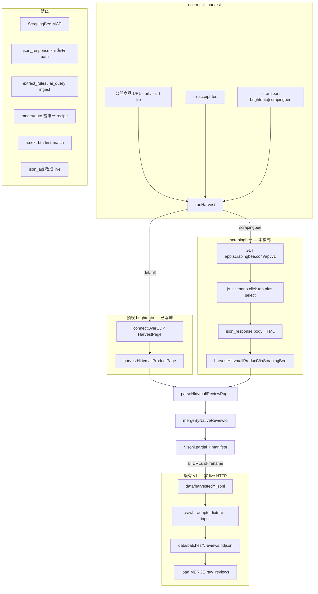
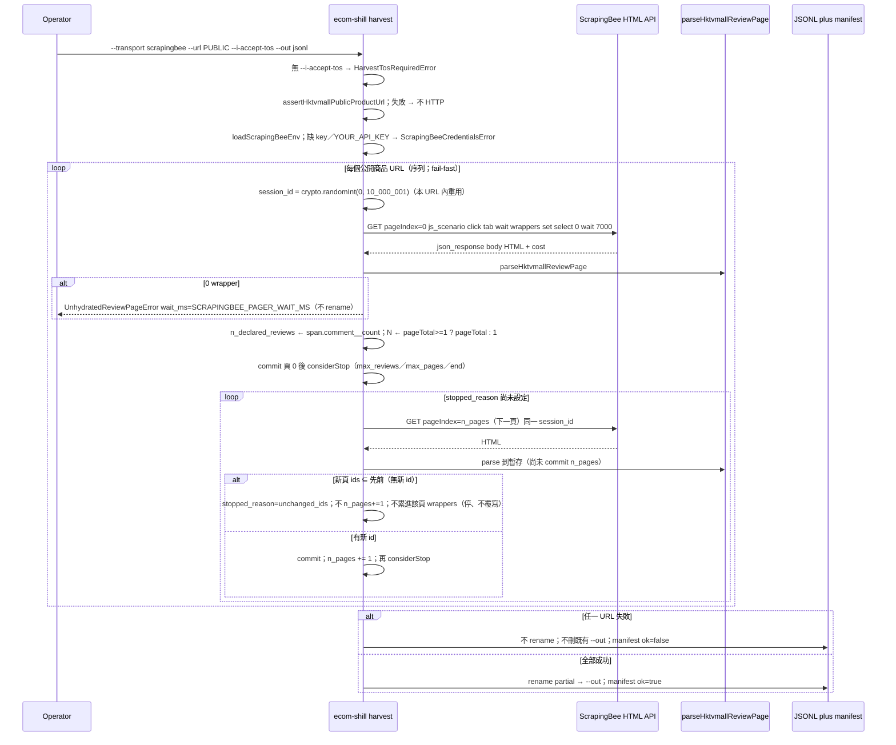

<!-- SPDX-License-Identifier: GPL-3.0-only -->
# HKTVmall 公開評論擷取 — ScrapingBee HTML API（CLI 補充設計）

| 欄位 | 值 |
| --- | --- |
| Title | HKTVmall product-review harvest via ScrapingBee HTML API |
| Document ID | `ecom-shill-scrapingbee-hktvmall-reviews-supplement-v1` |
| Author | TBD（實作前填入） |
| Date | 2026-09-06 |
| Status | **Draft**（rev 3：`stopped_reason` after-commit／三頁 mock 含 `/共N頁/`／`N>=1`／scrapingbee timeout 含 dry-run） |
| Repo | `/Users/mark/ecom-shill-review-detector` |
| Parent | [`docs/design.md`](design.md)（**Accepted**，rev 4）+ [`docs/design-bright-data-scrapping-pro-browser-hktvmall.md`](design-bright-data-scrapping-pro-browser-hktvmall.md)（Bright Data harvest **已在 CLI 落地**）。本文件是補充，**不是**替代。 |
| Filename | `docs/design-scrapingbee-hktvmall-reviews.md` |
| Probe date | 2026-09-06（ScrapingBee MCP HTML API + `js_scenario`；MCP **禁止**進 CLI） |
| License | GNU GPL-3.0-only（新檔加 `SPDX-License-Identifier: GPL-3.0-only`） |
| Audience | 資深工程師 / coding agent（實作另開指令；**本文件不授權改 `src/`**） |
| Language | 正文繁體中文；identifier、flag、env、路徑、SQL、TypeScript 維持 English |

---

## Overview

Accepted v1（[`docs/design.md`](design.md)）把 ingest backbone 固定為：公開評論頁 →（解 bot / 取 HTML）→ `FixtureReviewRaw` JSONL → `ecom-shill crawl --adapter fixture --input …` → load → Layer 1/2 → audit → analyze → report。CI 零 live HTTP（KD-04、KD-22）。`ecom-shill harvest` 已依 Bright Data 補充落地：Browser API CDP + Playwright `HarvestPage` + 既有 `parseHktvmallReviewPage`，寫原子 JSONL。

2026-09-06 對同一類 HKTVmall 公開商品頁用 ScrapingBee 實測，結論與 Bright Data 探針一致、運輸層不同：

- 單次 GET／`mode=auto`／AI extract **拿不到**水合評論（`#reviews` 的 `data-reviews=""`；JSON-LD `numberOfReviews` 可為 0，分頁卻顯示 25 則）。
- 評論只在 **JS 互動後**出現：click `[data-tab=reviewTab]`，再等 `div.product-review-wrapper`。`?scrollTo=reviewTab` **不夠**。
- ScrapingBee 每次 HTTP **無 DOM 狀態**。`session_id` 只黏 IP ~5 分鐘，不黏分頁。因此 **一頁評論 = 一次 HTML API 請求**。
- 分頁 DOM **不是**編號 `<a>2</a>`。兩個 `a.next-btn`（上一頁／下一頁）同 class；first-match 會點到上一頁。生產分頁是 **評論 pager 的 `<select>`**（`value '0'`=第 1 頁）。
- `extract_rules` 在此頁失敗。長 async evaluate 一次收齊所有頁會 timeout。

本補充指定：在 **既有** `ecom-shill harvest` 加 `--transport scrapingbee|brightdata`（預設 **`brightdata`**，現有 CLI／測試保持綠）。ScrapingBee 路徑 **不**實作 `HarvestPage`、**不**依賴 `playwright-core`。它是另一個 driver：對每頁 `GET https://app.scrapingbee.com/api/v1` + 凍結 `js_scenario` → JSON envelope 的 `body` HTML → **只**呼叫匯出的 `parseHktvmallReviewPage` → 既有 `mergeByNativeReviewId`／原子 `--out`。Phase B `--adapter bright_data` **不**因此變成 ScrapingBee。

本補充 **不放寬** KD-04。它是 Accepted 預留的「未來另有指令」之第二個 harvest 運輸。PR-SB3 在 parent KD-04／Security 加一行交叉引用（與 PR-H3 同姿態），避免文件對「repo 是否存在 live 流量」說法不一致。

---

## Background & Motivation

### 現況（repo，2026-09-06）

Bright Data harvest **已合併進 CLI**：

| 模組 | 職責 | ScrapingBee 是否重寫 |
| --- | --- | --- |
| `src/crawler/types.ts` `FixtureReviewRaw` | JSONL 欄位名鎖定 | **否** |
| `src/crawler/harvest/hktvmall.ts` | HTML wrapper → `FixtureReviewRaw`。匯出：`parseHktvmallReviewPage`、`parseHktvmallReviewWrapper`、`hktvmallWrapperToFixtureReviewRaw`、`parseHktvmallProductPath`、`hktvmallReviewTs`、`extractHktvmallReviewWrappers`、`HKTVMALL_MARKETPLACE_ID`、`HKTVMALL_REVIEW_TZ` | **否**。Driver **只**呼叫 export。private helper（`countFilledStars` 等）**不得** import |
| `src/crawler/harvest/url-list.ts` | `assertHktvmallPublicProductUrl`：精確 host `www.hktvmall.com`\|`hktvmall.com`、pathname 含 `/hktv/zh/`、`source_url = origin+pathname`（去 query） | **否** |
| `src/crawler/harvest/merge.ts` | `mergeByNativeReviewId` last-write-wins | **否** |
| `src/crawler/harvest/harvest-page.ts` | `HarvestPage` / `HarvestResult` | **不實作** `HarvestPage`。**回傳** `HarvestResult` |
| `src/crawler/harvest/hktvmall-driver.ts` | CDP：click 評論、`locateNextPage`「下一頁」、`waitForNewReviewIds` | **不走此函式**（`harvestHktvmallProductPage` 仍專給 Bright Data） |
| `src/crawler/browser/brightdata-cdp.ts` | `connectOverCDP` | **不 import** |
| `src/cli/commands/harvest.ts` `runHarvest` | ToS、dry-run、原子 `.partial` + manifest、**不**呼叫 `loadEnv` | **擴充** `--transport`；預設路徑不變 |
| `src/shared/env.ts` | `loadBrightDataBrowserEnv`；`commandRequiresGcp` allow-list；harvest 不在 GCP 名單 | 加 `loadScrapingBeeEnv`。harvest 仍不呼叫 `loadEnv` |
| `.env.example` | 已有 `SCRAPINGBEE_API_KEY=YOUR_API_KEY` | 只補註解／live gate；**永不**填真實 key |

缺的是 **第二個可重跑的 CLI 生產者**：ScrapingBee HTML REST（不是 MCP）→ 同一 JSONL 契約。

### 痛點：SSR／auto_mode／extract_rules 都不是評論來源

目標公開商品（probe 例；**禁止**寫入 `config/marketplaces/` 或 `tests/`）：

`https://www.hktvmall.com/hktv/zh/main/BIKIDO-…/s/H9605001/…/p/H9605001_S_drserum30`（可選 `?scrollTo=reviewTab`）

| 方法 | 結果 | 對 CLI 的含義 |
| --- | --- | --- |
| SSR／單次 GET／`mode=auto` AI extract | 商品 chrome、價、JSON-LD；**無**水合評論。`#reviews` `data-reviews=""` | Unlocker 失敗模式的 ScrapingBee 版 |
| JSON-LD `numberOfReviews` | probe 可為 **0**，分頁卻顯示 **25** 則 | **禁止**當 `n_declared_reviews` |
| 只加 `?scrollTo=reviewTab` | **不夠** | 必須 click 評論 tab |
| click `[data-tab=reviewTab]`（XPath `//*[@data-tab='reviewTab']`）然後等 `div.product-review-wrapper` | 水合：**10 wrappers／頁**；probe **25 則**、`span.comment__count`=25、pager **共 3 頁** | 生產 recipe |
| click `//a[contains(@class,'next-btn')]` | 命中 **上一頁**（兩個 next-btn 同 class）→ 留在第 1 頁 | **禁止** locator |
| click `//a[normalize-space()='下一頁']` | probe **至少一次** selector miss／未 ready | **不要**當唯一 pager |
| `evaluate` 設 pager `<select>` `value='1'` + `change` bubbling，等 6–7s，再取 HTML | **成功**翻到第 2 頁 | 生產分頁。必須收緊 select（頁上有其他 `<select>`） |
| `extract_rules` `"selector": "."` | `Expected ident, got <EOF at 1>` | **禁止**當 ingest parser |
| nested `"review_id": "@data-reviewid"` | `Expected selector, got <EOF at 0>` | 同上 |
| 長 async evaluate 迴圈「下一頁」並注入 `#all-reviews-json` | `pollinator function has timed-out` | **禁止**一請求收齊所有頁 |
| `ai_query` | 最長 **300**；無穩定 `data-reviewid` | **禁止**當 ingest |

Probe 收 25/25 wrapper；既有 mapper 全接受（0 rejected）。

水合後頁面會對某 comms host 打評論 JSON。那只是觀察，**不是**穩定公開 API。本文件 **不**寫該 URL、**不**把它放進 config、**不**當 production recipe。`json_response=true` 的 envelope 含 `xhr[]`——CLI **必須忽略**，不得 log URL、不得 parse body。攔截／重放私有 XHR 違反 session-03、Accepted、與 Bright Data 補充。

### 為什麼不能把 MCP 接進 CLI

與 KD-BD-02 同一政策：

| ScrapingBee MCP | `ecom-shill` CLI |
| --- | --- |
| IDE session | 本機／CI 可重跑的 commander 子命令 |
| Token 在 User MCP 設定 | `SCRAPINGBEE_API_KEY` 只在 env，永不進 git |
| 探索用（2026-09-06 probe） | 稽核用（stdout 計數、JSON log、JSONL） |
| 不冪等 | 同一公開 URL + 同一 `js_scenario` 應可重跑；`review_id` 仍由 crawl 算 |

CLI 呼叫 **`GET https://app.scrapingbee.com/api/v1`**（[HTML API](https://www.scrapingbee.com/documentation/)），**不是** MCP。不新增 npm 套件 `scrapingbee`（官方 SDK 是 CJS；本 repo ESM + Node 22 **native `fetch`**）。

---

## Goals & Non-Goals

### Goals

- 用 **ScrapingBee HTML REST API** 在 CLI 重放 2026-09-06 probe：每頁一次 `render_js` + `premium_proxy` + `js_scenario`（click 評論 tab → wait wrapper → 設 pager select → wait）→ envelope `body` HTML → `parseHktvmallReviewPage` → 跨頁 `native_review_id` last-write-wins → 既有原子 JSONL。
- **擴充既有** `ecom-shill harvest`：`--transport scrapingbee|brightdata`，預設 **`brightdata`**。不是新的 top-level 命令。
- ScrapingBee driver **不**實作 `HarvestPage`。仍回傳 `HarvestResult`。仍 **只**呼叫匯出的 `parseHktvmallReviewPage`。
- Live 仍要 `--i-accept-tos`。Dry-run 仍零網路、零 key、零 ToS、不寫 `--out`。
- 同一 URL allowlist、同一 `--out` 原子性（KD-BD-22）、同一空產物硬失敗（KD-BD-20）。
- 凍結 ScrapingBee locators／`js_scenario`／wait。`n_declared_reviews` 優先 `span.comment__count` 整數，fallback `HKTVMALL_DECLARED_REVIEWS_RE`；**總頁**優先 `span.total` `/共N頁`（`共N頁` **不是**評論則數）。**忽略** JSON-LD／`metadata['json-ld']`。
- 有 credits 就 log（envelope `cost` 或 header `Spb-cost`）。成本模型 = **每評論頁一次 rendered request**。不 screenshot。
- 單元測試 `js_scenario` JSON（合法 JSON、evaluate **原始碼**無 `\`、pager select 不是 `next-btn` first-match）。Live opt-in **不**與 Bright Data `HARVEST_LIVE=1` 撞車：`SCRAPINGBEE_LIVE=1` + `HARVEST_LIVE_URL` + key + `CI!=='true'`。測試檔 **不得** hardcode BIKIDO／任何真實商店 URL。
- `playwright-core` 維持 Bright Data 的 optionalDependency。ScrapingBee 路徑 **零** Playwright。

### Non-Goals

- **不實作本文件所述程式碼**（另開指令）。不開 live-adapter PR、不改 `src/`。
- 不取代 [`docs/design.md`](design.md) 或 Bright Data 補充。不放寬 KD-04。不把 live HTTP 混進 `fixture`。
- 不把 `json_api` 變成 ScrapingBee。
- 不從 CLI 呼叫 MCP。不 commit API key。不把真實商店 URL 寫進 `config/marketplaces/`。
- 不設計、不文件化、不設定 HKTVmall **私有** review JSON／XHR path。`json_response.xhr` **當不存在**。
- 不把 Q&A（問問大家）、商店評分、商品彙總星／「N則評論」chrome 寫成 `FixtureReviewRaw` 列。
- 不新增 `FixtureReviewRaw` 欄位、不改 BQ DDL、不改 HMAC／`review_id` 公式。
- 不處理圖片／影片內容（只設既有 `has_media`）。
- 不做自動下架或法律取證。
- 不引入 `rate-limit.ts` / `robots.txt` GET。
- 不把 Bright Data `harvestHktvmallProductPage` 改成走 ScrapingBee。兩條 driver 並列。
- 不把 `--adapter bright_data` 接到 ScrapingBee（Phase B 仍是 CDP，可跳過）。

---

## Key Decisions

編號 `KD-SB-*` 避免與 Accepted `KD-*`、Bright Data `KD-BD-*` 碰撞。若衝突，**以 Accepted 文件為準**（本補充不得放寬 fixture-first CI、`review_id`、或 `FixtureReviewRaw` 欄位）。Bright Data 路徑（預設 `--transport brightdata`）契約不變。

| ID | 決策 | 選擇 | 理由 |
| --- | --- | --- | --- |
| KD-SB-01 | 運輸層 | **ScrapingBee HTML REST** `GET https://app.scrapingbee.com/api/v1`。Node 22 native `fetch`。**不**加 npm `scrapingbee` | Probe 證明需要 JS 互動。官方 Node SDK 是 CJS；repo 已是 ESM。對齊 Bright Data「不把 vendor SDK 當必依」。 |
| KD-SB-02 | MCP | **禁止** CLI／CI 連 ScrapingBee MCP | 與 KD-BD-02 同一政策。Probe 只證明流程。 |
| KD-SB-03 | CLI 形狀 | 既有 `harvest` 加 `--transport scrapingbee\|brightdata`，**預設 `brightdata`**。**不**新增 `harvest-scrapingbee` 子命令 | 現有 dry-run／ToS／原子寫檔／測試保持綠。新命令會複製 ToS／manifest／allowlist。 |
| KD-SB-04 | 生產 recipe | **HTML API + `js_scenario` + envelope `body` HTML + `parseHktvmallReviewPage`**。拒絕 `extract_rules`、`ai_query`、純 GET／`mode=auto` 當 ingest | Probe：extract_rules 炸；AI 無 `data-reviewid`；SSR 無 wrapper。 |
| KD-SB-05 | 每頁一次 HTTP | ScrapingBee **無 DOM 狀態**。`session_id` 只黏 IP **5 min**。每 URL 用 `crypto.randomInt(0, 10_000_001)`（含 0…10_000_000）抽一次，該 URL 的頁重用。**一評論頁 = 一請求**：goto URL → click tab → wait wrappers → set select → wait → HTML | 長 async IIFE timeout。不能假設上一頁的 DOM 還在。牆鐘 >5 min 時後頁可能換 IP；recipe 仍無狀態，見 Risks。 |
| KD-SB-06 | 分頁 | **評論 pager `<select>`**（與 `span.total` `/共N頁` 及 `a.next-btn` 同祖先）。`value '0'`=頁 1。**禁止** `//a[contains(@class,'next-btn')]`。**不要**把「下一頁」當唯一 pager | 兩個 next-btn 同 class；first-match = 上一頁。頁上還有商品規格 `<select>`。 |
| KD-SB-07 | `n_declared_reviews` | 優先 `span.comment__count` 整數；fallback 既有 `HKTVMALL_DECLARED_REVIEWS_RE`（HTML 字串）。總頁優先 `span.total` `/共N頁`。**忽略** JSON-LD／`metadata['json-ld']` | Probe：JSON-LD 可為 0，tab 顯示 25。 |
| KD-SB-08 | `js_scenario` JSON | `JSON.stringify` 合法物件。**evaluate 原始碼字元不得含 `\`**（禁止 `\d` `\s`）。用 `indexOf`／`getElementsByClassName`／`[0-9]` 風格的純字串，不要 regex literal | Probe：YAML/JSON `unknown escape character 'd'`。 |
| KD-SB-09 | Playwright | ScrapingBee 路徑 **零** `HarvestPage`／`playwright-core` import | optionalDependency 只服務 Bright Data。`--no-optional` 仍應能跑 ScrapingBee unit test。 |
| KD-SB-10 | Parser | Driver **只**呼叫 `parseHktvmallReviewPage`。不改 `hktvmall.ts` 契約、不 import private helper | 與 KD-BD-13 相同。 |
| KD-SB-11 | 私有 XHR | **不**當 recipe。`json_response.xhr` **不讀、不 log、不寫盤** | ToS／git。Envelope 為了 `cost` + `body` + `js_scenario_report`，不是為了攔截 API。 |
| KD-SB-12 | 非評論訊號 | 不 ingest Q&A；商店／商品彙總星 ≠ `star_rating` | 與 KD-BD-15 相同。 |
| KD-SB-13 | 密鑰 | Live ScrapingBee：`SCRAPINGBEE_API_KEY`。**不**把 query `api_key=` 當推薦（官方 deprecated；改 `Authorization: Bearer`）。Placeholder `YOUR_API_KEY` **視為缺席** | `.env.example` 已有空／placeholder。Harvest **不**呼叫 `loadEnv`（無 salt／GCP）。 |
| KD-SB-14 | 憑證分流 | `--transport scrapingbee` live **只**要 ScrapingBee key，**不要** Bright Data user／pass。預設 `brightdata` **只**要 Browser API creds | 互不強迫裝另一家的帳。 |
| KD-SB-15 | Harvest env | 延續 KD-BD-17：harvest **不**呼叫 `loadEnv`。**保持** `runHarvest` 現有 stderr pino helper（`pino({ level, base: null }, process.stderr)`）。**不要**改成 `createLogger`（預設打 stdout，會弄髒 `plan_*`／`n_pages=`）。若要共用，抽出 `defaultHarvestLogger`，仍綁 stderr。GCP allow-list 不變 | JSONL **含** `reviewer_id_raw`。 |
| KD-SB-16 | Live 測試閘 | **獨立**檔。`describe.skipIf` 除非 **同時**：`SCRAPINGBEE_LIVE=1`、非空且非 placeholder 的 `SCRAPINGBEE_API_KEY`、`HARVEST_LIVE_URL` 絕對公開 URL、`CI !== 'true'`。缺一 **skip 不 fail**。**不**用 `HARVEST_LIVE=1`（那是 Bright Data） | `source .env && pnpm test` 不得因為 example key 打 live。 |
| KD-SB-17 | 空產物 | 延續 KD-BD-20：0 wrapper → `UnhydratedReviewPageError`；`n_wrappers > 0 && n_accepted === 0` → `HarvestEmptyAcceptedError`。即使無 `--strict` | 假陰性。 |
| KD-SB-18 | `--out` | 延續 KD-BD-22：`.partial` + sidecar；全部 URL 成功才 rename；失敗不 unlink 既有 `--out` | 不重做一套寫檔。 |
| KD-SB-19 | 請求參數（凍結） | `render_js=true`、`premium_proxy=true`、`country_code` 來自 `--country`（預設 `hk`）、`block_resources=false`、viewport **1280×720**、API `timeout` = `--goto-timeout-ms`（harvest **兩運輸預設 120000**，見 KD-SB-27）、`wait_browser=domcontentloaded`、`json_response=true`、**不** `mode=auto`、**不** screenshot、**不** `stealth_proxy`（v1） | Probe 工作形狀。v1 顯式 `render_js`+`premium_proxy` 以鎖定 ≈25 credits／請求（`mode=auto` 可能升 stealth 75，見 Alternative 5）。`block_resources` 預設 true 會擋 CSS／圖；評論列表靠 XHR 水合。`country_code` 需 premium／stealth。screenshot 加成本且無 ingest 價值。 |
| KD-SB-20 | `js_scenario` 時限 | 整段 scenario **≤ 40s**（官方）。凍結 pager `wait: 7000`（probe 6–7s）。**不要**再加第二段長 wait | 長 IIFE 已 timeout。 |
| KD-SB-21 | ToS 文案 | `HarvestTosRequiredError` 改成 **運輸無關**（仍不含 `v1 still sends no HTTP`）。Bright Data 與 ScrapingBee live 都走同一 class。PR-SB2／SB3 在 Bright Data 補充加一行 pointer，避免兩份 SoT 各寫一套 constructor 字串 | 現有 unit test 只斷言 ToS、不斷言「Bright Data」字串。 |
| KD-SB-22 | 成本 | premium + JS ≈ **25 credits／請求**。N 頁 ≈ 25N。log `cost`／`Spb-cost`；缺席不 fail。probe 3 頁 ≈ 75 | 個人研究尺度。 |
| KD-SB-23 | 序列 | 同一 URL 的頁 **序列**（先頁 0 才知道 N）。多 URL 仍 fail-fast 序列（既有 `runHarvest`） | 頁 0 才能讀 `共N頁`。v1 不平行頁。 |
| KD-SB-24 | 不放寬 KD-04 | CI／`fixture`／`json_api` 仍零 live HTTP。PR-SB3 在 parent 加一行 pointer | 與 PR-H3 同姿態。 |
| KD-SB-25 | `review_id` | harvest JSONL **不**寫 `review_id`。仍由 `crawl --adapter fixture` → `makeReviewId` | `sha256("v1\|hktvmall\|" + data-reviewid)`。 |
| KD-SB-26 | flags | **不**呼叫 `addRunFlags`。只加 `--transport`。其餘 harvest **旗標名與預設值**不變（含 `--goto-timeout-ms` 預設 **120000**）。PR-SB2 把 **help 字串**改成運輸無關（KD-SB-27） | 與 KD-BD-23 一致。Commander 對 `--goto-timeout-ms` 永遠有字串預設，沒有「未傳 → 用 vendor 140000」路徑。 |
| KD-SB-27 | `--goto-timeout-ms` / `--wrapper-timeout-ms` | **兩運輸** harvest 預設 `--goto-timeout-ms=120000`（**不要**宣稱 140000 是 harvest 預設）。**只要** `transport === 'scrapingbee'`（**含 dry-run**），在 `parsePositiveInt` **之後立刻**驗證 `[1000, 140000]`，否則 `HarvestUsageError`（不 HTTP、不 ToS、不讀 key）。**不要**把此區間套到 `brightdata`（999 對 Bright Data 仍是合法正整數）。`--wrapper-timeout-ms` **不**進 scenario；只打 debug log。Pager wait 凍結 7000。`UnhydratedReviewPageError.wait_ms` **一律** = `SCRAPINGBEE_PAGER_WAIT_MS` | ScrapingBee HTML API `timeout` 文件為 1000–140000。`timeout=1` 非法。help 必須寫清 wrapper 旗標在 ScrapingBee 無效。 |
| KD-SB-28 | `n_pages`／`stopped_reason` | `n_pages` = **已 commit** 的成功 parse 頁數。stall（ids ⊆ 先前）**不** commit。`stopped_reason` 在 **每次 commit 之後**依序：unique accepted ≥ `maxReviews` → `max_reviews`（然後 slice，與 Bright Data 相同）；else `n_pages >= maxPages` → `max_pages`；else `n_pages >= N` → `end`；else 繼續抓下一頁。`unchanged_ids` 是 **非 commit** 的唯一中斷。收尾 **不得**覆寫已設定的 reason（禁止「走完迴圈就 `end`」）。`n_http_requests` 仍含 stall GET | 與 `harvestHktvmallProductPage` 對齊，否則 `harvest_max_pages` 在 ScrapingBee 永遠不打。`N=3, maxPages=2` 必須是 `max_pages` 不是 `end`。 |
| KD-SB-29 | GET `href` 長度 | 生產永遠 **GET** query（官方：POST `/api/v1` 會把 POST **轉發到目標站**）。建好的 API `href`（不含 key）必須 `< 6144` 字元（6 KiB）；超出 → `HarvestUsageError`。單測必做。v1 **不做** POST-for-params | 凍結 evaluate + 長 `/hktv/zh/…` path 仍應遠低於 6 KiB。未來 evaluate 變長才 414。 |

---

## Proposed Design

### 與 Accepted backbone 的關係

```text
公開商品頁（HKTVmall /hktv/zh/…/s/{store}/…/p/{sku}/）
    → ecom-shill harvest --transport brightdata|scrapingbee
         brightdata（預設）：Browser API CDP + HarvestPage（已落地）
         scrapingbee：HTML API js_scenario，每頁一 HTTP（本補充）
    → parseHktvmallReviewPage（既有 export）
    → FixtureReviewRaw JSONL
    → ecom-shill crawl --adapter fixture --input that.jsonl
    → load → layer1 → layer2 → audit → analyze → report
```

HMAC、`review_id`、GCS NDJSON、BQ `MERGE`、三層漏斗 **全部不改**。ScrapingBee 只取代「JSONL 從哪裡來」的其中一條運輸。

### 高層架構



### 時序：每頁一 HTTP



### 建議模組邊界

| 模組 | 職責 | Playwright？ | HTTP？ |
| --- | --- | --- | --- |
| `src/crawler/harvest/hktvmall.ts` | **不動** mapper | 否 | 否 |
| `src/crawler/harvest/hktvmall-pager-html.ts`（新） | 從 **HTML 字串**讀 `span.comment__count`、`span.total` `/共N頁`。v1 **不** export option-count。無 DOM lib | 否 | 否 |
| `src/crawler/harvest/scrapingbee-js-scenario.ts`（新） | 凍結 locators + `buildHktvmallReviewJsScenario(pageIndex)` | 否 | 否 |
| `src/crawler/harvest/scrapingbee-client.ts`（新） | URLSearchParams、Bearer、parse envelope、credits | 否 | live only（`fetch` 可注入） |
| `src/crawler/harvest/scrapingbee-driver.ts`（新） | 頁迴圈、呼叫 parser／merge、回 `HarvestResult` | 否 | 經 client |
| `src/crawler/harvest/hktvmall-driver.ts` | **不動** Bright Data | 否（只靠 HarvestPage） | 否 |
| `src/shared/env.ts` | 加 `loadScrapingBeeEnv` / `ScrapingBeeCredentialsError` | 否 | 否 |
| `src/cli/commands/harvest.ts` | `--transport` 分支；scrapingbee **不**呼叫 `defaultConnect` | dry-run 不 import client | scrapingbee live |
| `src/index.ts` | **不要** re-export ScrapingBee client（對齊「不 re-export CDP」） | — | — |

`tsc` `lib: ES2022` + `types: node`：pager／scenario 檔 **禁止**寫 `document` 當 TypeScript（evaluate 必須是 **string constant**，與 `WAIT_NEW_REVIEW_IDS` 同一手法）。

### 凍結 `js_scenario`

官方：[JavaScript Scenario](https://www.scrapingbee.com/documentation/js-scenario/)。指令可用 CSS 或 XPath（以 `/` 開頭才當 XPath）。`strict` 預設 true：一步失敗整段 abort。整段 **40s** cap。

**凍結 click／wait_for（CSS，無引號，避免 JSON 跳脫）**：

```text
[data-tab=reviewTab]
div.product-review-wrapper
```

等價 XPath（probe 用過，builder **不要**當第二套生產 click）：`//*[@data-tab='reviewTab']`。

**禁止寫進 instructions 的 click**：

| selector | 原因 |
| --- | --- |
| `//a[contains(@class,'next-btn')]` 或 CSS `a.next-btn` 當 click 目標 | 上一頁與下一頁同 class；first-match = 上一頁 |
| `//a[normalize-space()='下一頁']` 當 **唯一** pager | probe 至少一次 miss |
| heading「評論」當 **唯一** tab | Bright Data 可作 fallback；ScrapingBee 一次 scenario 沒有 try/catch 迴圈。v1 只凍 `data-tab` |

**凍結 pager evaluate**（`PAGE_INDEX` 由 builder 插入十進位整數，例如 `1`。**整段 evaluate 字元不得出現 `\`**）：

```javascript
var s=null;
var totals=document.getElementsByClassName('total');
for(var i=0;i<totals.length;i++){
  var t=totals[i];
  var txt=t.textContent||'';
  if(txt.indexOf('共')===-1||txt.indexOf('頁')===-1) continue;
  var root=t.parentElement;
  while(root&&!s){
    var cand=root.querySelector('select');
    var btn=root.querySelector('a.next-btn');
    if(cand&&btn) s=cand;
    else root=root.parentElement;
  }
  if(s) break;
}
if(s){
  s.value='PAGE_INDEX';
  s.dispatchEvent(new Event('change',{bubbles:true}));
}
```

規則：

- **不要** `document.querySelector('select')` 當唯一查找（商品規格 select）。
- 必須要求祖先同時有 `span.total`（文案含「共」與「頁」）與 `a.next-btn`。
- `value '0'`=第 1 頁、`'1'`=第 2 頁（probe 3 頁：`'0'|'1'|'2'`）。
- 用 `indexOf`，不用 regex。
- 頁 0 仍設 `'0'`（與「每頁同一 recipe」一致）。若 select 缺失（單頁商品），evaluate 為 no-op，不 throw（`if(s)`）。

**凍結 instructions 順序**（`strict: true`）：

```json
{
  "strict": true,
  "instructions": [
    { "wait_for": "[data-tab=reviewTab]" },
    { "click": "[data-tab=reviewTab]" },
    { "wait_for": "div.product-review-wrapper" },
    { "evaluate": "<pager script with s.value='N'>" },
    { "wait": 7000 },
    { "wait_for": "div.product-review-wrapper" }
  ]
}
```

常數：

```typescript
export const HKTVMALL_SB_REVIEW_TAB_CSS = '[data-tab=reviewTab]';
export const HKTVMALL_SB_WRAPPER_CSS = 'div.product-review-wrapper';
export const SCRAPINGBEE_PAGER_WAIT_MS = 7_000;
export const SCRAPINGBEE_JS_SCENARIO_MAX_MS = 40_000;
export const SCRAPINGBEE_MAX_HREF_CHARS = 6144; // 6 KiB; GET query budget
export const SCRAPINGBEE_TIMEOUT_MS_MIN = 1_000;
export const SCRAPINGBEE_TIMEOUT_MS_MAX = 140_000;
```

**不要** export `HKTVMALL_REVIEWS_PER_PAGE = 10`。Probe 的「10／頁」只是觀察，**禁止**用 `ceil(n_declared_reviews / 10)` 推 `N`（`N` 的 SoT 是 `span.total` `/共N頁`，見 driver）。

`buildHktvmallReviewJsScenario(pageIndex: number): { strict: true; instructions: unknown[] }`：

- `pageIndex` 必須 `Number.isInteger` 且 `>= 0`，否則 throw `HarvestUsageError`。
- evaluate 字串用 concatenation／template **只插入數字**，然後 **assert `!evaluate.includes('\\')`**（程式內 invariant，單測也斷言）。
- 回傳物件；client 端 `JSON.stringify` 才放進 query。

單元測試（PR-SB1 **必做**）：

1. `JSON.parse(JSON.stringify(scenario))` 成功。
2. 取出 `evaluate` 字串：`expect(evaluate.includes('\\')).toBe(false)`。
3. `evaluate` 含 `getElementsByClassName('total')`；**不含** `document.querySelector('select')` 作為開頭查找。
4. `instructions` 的 `click`／`wait_for_and_click` **沒有** `next-btn`。
5. `pageIndex=1` → evaluate 含 `s.value='1'`，不含 `s.value='2'`。
6. 凍結物件 **沒有** `extract_rules`、沒有 screenshot、沒有 `\\d`。
7. （可選同檔）`JSON.stringify(scenario)` 後與典型商品 URL 組成的 query 長度遠低於 6144。

### ScrapingBee HTTP client

Endpoint：`https://app.scrapingbee.com/api/v1`（[HTML API](https://www.scrapingbee.com/documentation/)）。

凍結 query（布林用 `'true'`/`'false'` 字串，與官方 curl 例一致）：

| param | 值 |
| --- | --- |
| `url` | 操作者商品 URL（`target.href`）。JSONL `source_url` 仍是 origin+pathname |
| `render_js` | `true` |
| `premium_proxy` | `true` |
| `country_code` | `--country` 小寫（預設 `hk`）。無 premium／stealth 時官方忽略；本路徑永遠 premium |
| `block_resources` | `false` |
| `json_response` | `true` |
| `window_width` / `window_height` | `1280` / `720`（`HARVEST_VIEWPORT`） |
| `timeout` | `--goto-timeout-ms`（harvest 預設 **120000**）。ScrapingBee 路徑（**含 dry-run**）：必須落在 `[1000, 140000]`，否則 `HarvestUsageError`。**永遠送出**此 query（不省略來「用 vendor 140000」——Commander 沒有未傳路徑）。此區間 **不**套用 brightdata |
| `wait_browser` | `domcontentloaded`（對齊 KD-BD-24） |
| `js_scenario` | `JSON.stringify(scenario)` |
| `session_id` | 本 URL 內固定整數 |
| **不傳** | `api_key`、`mode`、`screenshot`、`screenshot_full_page`、`extract_rules`、`ai_query`、`ai_extract_rules`、`stealth_proxy`、`return_page_source`、`return_page_markdown` |

Header：

```text
Authorization: Bearer ${SCRAPINGBEE_API_KEY}
```

**禁止**把 key 放進 URL（避免 access log／error message 外洩）。**禁止** log 完整 URL 若它被誤加 key。建好的 `href` 長度必須 `< SCRAPINGBEE_MAX_HREF_CHARS`（6144）；超出 → `HarvestUsageError`。v1 **只用 GET**；**禁止**為了塞 `js_scenario` 改 POST（POST 會轉發到 HKTVmall）。

`fetch` 可注入：

```typescript
export type ScrapingBeeHttpResponse = {
  status: number;
  headers: Headers;
  bodyText: string;
};

export type ScrapingBeeHttpGet = (opts: {
  href: string; // fully built API URL, must not contain the API key
  headers: Record<string, string>;
  timeoutMs: number;
}) => Promise<ScrapingBeeHttpResponse>;
```

預設實作：`fetch(href, { method: 'GET', headers, signal: AbortSignal.timeout(timeoutMs + 10_000) })`。Client 端 timeout 略大於 API `timeout`，讓 ScrapingBee 先裁。`timeoutMs` 來自已通過 `[1000, 140000]` 驗證的 `--goto-timeout-ms`（預設 120000）。AbortError → `ScrapingBeeHttpError`（**不要** `GotoTimeoutError`／`HarvestSessionDroppedError`）。

**Envelope**（`json_response=true`，[文件](https://www.scrapingbee.com/documentation/)）：

```typescript
type ScrapingBeeJsonEnvelope = {
  body: string; // type==='html' 時為 HTML 字串
  type?: string;
  cost?: number;
  'initial-status-code'?: number;
  'resolved-url'?: string;
  evaluate_results?: unknown;
  js_scenario_report?: {
    task_failure?: number;
    task_success?: number;
    tasks?: { success?: boolean; task?: string }[];
  };
  xhr?: unknown; // 忽略
  cookies?: unknown; // 忽略
  metadata?: unknown; // 忽略 json-ld
  screenshot?: unknown; // 不應出現
};
```

`parseScrapingBeeHtmlEnvelope(bodyText)`：

1. `JSON.parse`。失敗 → `ScrapingBeeHttpError`。
2. `typeof body === 'string'` 且（`type` 缺席或 `'html'`）→ 該字串當 HTML。
3. `cost`：number 則採用；否則讀 header `Spb-cost`（**大小寫不敏感**，HTTP/2 會 lowercase）。
4. **丟棄** `xhr`、`cookies`、`metadata`、`screenshot`、`evaluate_results` 內容（可 log `evaluate_results.length`，**不要**把回傳值寫進 info——可能含 DOM 字串／user id）。
5. `js_scenario_report.task_failure > 0`：依失敗 task 名映射錯誤（見下）。仍要檢查 HTML：有時 report 成功但 0 wrapper。

Credits fallback：`envelope.cost` → `Spb-cost` → `null`（省略 log 欄，不 warn）。

### Driver 演算法（無 HarvestPage）

```typescript
export async function harvestHktvmallProductViaScrapingBee(
  url: string,
  opts: {
    fetchPage: (pageIndex: number) => Promise<{ html: string; credits: number | null; latency_ms: number }>;
    maxPages?: number;      // default DEFAULT_MAX_PAGES 20
    maxReviews?: number;
    wrapperTimeoutMs?: number; // 只 log，不送進 scenario
  },
): Promise<HarvestResult>
```

1. `parsed = assertHktvmallPublicProductUrl(url)`；組 `HktvmallHarvestContext`（`source_url` 無 query）。
2. `started = Date.now()`。`session_id` 由 CLI 在進入 driver 前用 `crypto.randomInt(0, 10_000_001)` 抽好並關進 `fetchPage`。
3. 請求 **pageIndex=0**。`latency_ms_goto =` 該次 `latency_ms`。`latency_ms_click = 0`（click 在 scenario 內；**不要**改 `HarvestResult` 形狀）。
4. `parseHktvmallReviewPage(html, ctx)`。累加 wrappers／rejected；Map 合併 accepted。
5. 若 `n_wrappers === 0` → `throw new UnhydratedReviewPageError(SCRAPINGBEE_PAGER_WAIT_MS)`。`--wrapper-timeout-ms` 只打 debug log（`wrapper_timeout_ms_ignored`），**不得**寫進 `wait_ms`。
6. `n_declared_reviews = parseHktvmallDeclaredReviewCount(html)`（`span.comment__count`；fallback `HKTVMALL_DECLARED_REVIEWS_RE` 跑在去 tag 後的文字）。**永不**讀 JSON-LD。
7. `pageTotal = parseHktvmallReviewPageTotal(html)`（`span.total` `/共N頁`；fallback `HKTVMALL_PAGE_TOTAL_RE`）。**`N = pageTotal !== null && pageTotal >= 1 ? pageTotal : 1`**（`共0頁`、缺席、`null` 都是 `N === 1`）。v1 **不**用 pager `<select>` option 數、**不**用 `ceil(declared/10)`、**不**用 wrapper 個數推 N。
8. `n_pages = 1`（頁 0 已 commit）。`stopped_reason` 初始為 **未設定**（`null`），**不是**先填 `end` 再覆寫。
9. 定義 `considerStopAfterCommit()`（**每次 commit 後立刻呼叫**，含頁 0）：
    1. 若 `maxReviews !== undefined && uniqueAccepted >= maxReviews` → `stopped_reason = 'max_reviews'`（之後 slice `accepted` 到 `maxReviews`，與 `harvestHktvmallProductPage` 相同）。
    2. else 若 `n_pages >= maxPages` → `stopped_reason = 'max_pages'`。
    3. else 若 `n_pages >= N` → `stopped_reason = 'end'`。
    4. else 保持未設定（繼續下一頁）。
10. 當 `stopped_reason` 仍未設定時，序列請求 **`pageIndex = n_pages`**（0-based 下一頁；**不要**寫成 `1 .. min(N, maxPages)-1`，那會讓 `N=3, maxPages=2` 被標成 `end`）：
    - `n_http_requests` 含此次，即使隨後 stall。
    - `parsedPage = parseHktvmallReviewPage(html, ctx)` 放**暫存**。
    - 令 `newIds` = 本頁 accepted 且尚未在 Map 裡的 `native_review_id`。
    - 若 `newIds.length === 0`（ids ⊆ 先前）→ `stopped_reason = 'unchanged_ids'`，**不** `n_pages += 1`，**不**把暫存累進結果，**停、不 throw、不呼叫 `considerStopAfterCommit`**（對齊 KD-BD-25：`n_pages === 1`）。HTTP 非 2xx 則 throw `ScrapingBeeHttpError`。
    - 否則 commit 暫存，**`n_pages += 1`**，立刻 `considerStopAfterCommit()`。
11. 離開迴圈後 **不得**把 `stopped_reason` 設成 `end`（若仍未設定——理論上 `considerStopAfterCommit` 在 `N>=1` 時必收斂——才 fallback `end`）。無 pager 的單頁（`N===1`）在頁 0 的 considerStop 已是 `end`，**不是** `next_disabled`。**不要**在 ScrapingBee 路徑 click 下一頁。
12. `n_wrappers > 0 && accepted.length === 0` → `HarvestEmptyAcceptedError`。
13. 回 `HarvestResult`。credits／`n_http_requests` **不**塞進 `HarvestResult`；CLI 用閉包或回傳交叉型別 log。`runHarvest` 仍只在 `stopped_reason === 'max_pages'` 打 `harvest_max_pages`。

凍結例子（PR-SB1 **必測**）：

| 輸入 | `stopped_reason` | `n_pages` | `fetchPage` 呼叫 |
| --- | --- | --- | --- |
| 頁 0 HTML 含 `/共3頁/`，三頁 10+10+5 新 id，`maxPages=20` | `end` | `3` | `0,1,2` |
| 同上，`maxPages=2` | `max_pages` | `2` | `0,1` |
| 同上，`maxPages=1` | `max_pages` | `1` | `0` |
| 頁 0 無 `共N頁`（`N===1`），有 wrappers | `end` | `1` | `0` |
| 頁 0 含 `/共3頁/` 且 10 新 id；頁 1 HTML 同一 10 id | `unchanged_ids` | `1` | `0,1` |

`js_scenario_report` 映射：

| 失敗 task | 錯誤 |
| --- | --- |
| `wait_for`／`click` 且 params 含 `reviewTab` | `ReviewTabNotFoundError` |
| `wait_for` 且 params 含 `product-review-wrapper` | `UnhydratedReviewPageError` |
| 其他／timeout／`pollinator function has timed-out` | `ScrapingBeeJsScenarioError` |
| HTTP 401／403 | `ScrapingBeeCredentialsError` 或 `ScrapingBeeHttpError`（401 用 credentials） |
| HTTP 非 2xx、AbortError | `ScrapingBeeHttpError` |

Cookie banner 擋住 tab：v1 不猜 banner locator → `ReviewTabNotFoundError`（與 KD-BD 相同）。**沿用既有 error class 訊息**（可含 heading「評論」fallback 文案）；v1 **不**為 ScrapingBee 改 constructor 字串。除錯靠 log 欄 `transport: 'scrapingbee'`（`harvest_unhydrated`／`harvest_url_done`）。

HTML 200 但 0 wrapper：即使 report success 也 `UnhydratedReviewPageError(SCRAPINGBEE_PAGER_WAIT_MS)`。

### Pager HTML 解析（無 DOM）

新檔 `hktvmall-pager-html.ts`，字串／regex 掃描（允許 Node 側 regex；**evaluate 內禁止**）。v1 **只** export 兩個函式：

```typescript
export function parseHktvmallDeclaredReviewCount(html: string): number | null
export function parseHktvmallReviewPageTotal(html: string): number | null
```

**凍結：**

- `comment__count`：`/<span\b[^>]*\bclass="[^"]*\bcomment__count\b[^"]*"[^>]*>\s*(\d+)\s*</i` → `n_declared_reviews`。
- `span.total`：在 `class` 含 `\btotal\b` 的 span 內抓 `/共\s*(\d+)\s*頁/`；否則 fallback `HKTVMALL_PAGE_TOTAL_RE`（可從 `hktvmall-driver.ts` **重用常數**，或 pager 檔複製同一 RE 字面。**不要**改 Bright Data 語意）。結果是 **pageTotal**，**不是** `n_declared_reviews`。
- Driver：`N = pageTotal !== null && pageTotal >= 1 ? pageTotal : 1`。`parseHktvmallReviewPageTotal` 對 `共0頁` 可回 `0` 或 `null`；driver 都收成 `N === 1`。
- **不** export `parseHktvmallPagerSelectOptionCount`。evaluate 已用 DOM 祖先謂詞找 select；Node 側「共N頁 附近片段」會因 probe DOM（`<select>` 是 `span.total` **的 sibling**，不是 inner `div` 的 descendant）而數到 0 或掃進規格 `<select>`。v1 避免這條不可實作的 parser。

單測用 **合成 HTML**（store/product 用既有 fixture 風格 `S2090001`／假 wrapper，**不要** BIKIDO URL）：

```html
<span class="comment__count">25</span>
<a class="next-btn" href="javascript:void(0)">上一頁</a>
<select>
  <option value="0">1</option>
  <option value="1">2</option>
  <option value="2">3</option>
</select>
<div><span class="total">/共3頁</span></div>
<a class="next-btn" href="javascript:void(0)">下一頁</a>
<select><option>規格A</option><option>規格B</option></select>
<script type="application/ld+json">{"numberOfReviews":0}</script>
```

必斷言：`parseHktvmallDeclaredReviewCount` = **25**（JSON-LD 0 不得蓋過）；`parseHktvmallReviewPageTotal` = **3**；driver 在此 HTML 上 `N === 3`（規格 `<select>` **不得**改變 `N`）。另例：無 `共N頁`、只有規格 select → parser `null`、driver `N === 1`。另例：`/共0頁/` → driver `N === 1`。

**三頁 driver／CLI mock 凍結：** 頁 0 HTML **必須**含 pager 樣品的 `<span class="total">/共3頁</span>`（可另帶 JSON-LD 0 與規格 `<select>`）。**禁止**用 wrapper 個數或 option 數推 `N`。沒有這段 chrome，`N === 1`，`fetchPage(1)` 不會被呼叫，unique 會停在 10。頁 1／頁 2 的 HTML 不需要再含 `/共3頁/` 來決定 `N`（`N` 只看頁 0）。

### CLI：`--transport`

`src/cli/main.ts` harvest（**仍不**包 `addRunFlags`）：

```typescript
.addOption(
  new Option('--transport <id>', 'Harvest transport: brightdata (default) | scrapingbee')
    .choices(['brightdata', 'scrapingbee'])
    .default('brightdata'),
)
```

Help（PR-SB2；**旗標名與預設值不變**，字串運輸無關）：

- command description：`Harvest public HKTVmall reviews to FixtureReviewRaw JSONL via Bright Data Browser API or ScrapingBee HTML API. harvest does not create pipeline runs; crawl the JSONL afterwards.`
- `--country`：`ISO country for proxy geo (default HK)`
- `--goto-timeout-ms`：`navigation/API timeout (default 120000; ScrapingBee requires 1000–140000)`
- `--wrapper-timeout-ms`：`Bright Data review-tab/wrapper wait (default 30000); ScrapingBee logs only, does not change the 7000ms pager wait`

`HarvestCliOptions.transport?: string`。`runHarvest`：`const transport = opts.transport ?? 'brightdata'`。其他值（若有人直接呼 `runHarvest`）→ `HarvestUsageError` exit 2。

`runHarvest` 在 `parsePositiveInt(--goto-timeout-ms)` **之後立刻**：若 `transport === 'scrapingbee'` 且值不在 `[1000, 140000]` → `HarvestUsageError`。此檢查在 dry-run／ToS／讀 key **之前**。`brightdata` 維持既有「正整數即可」（999 合法）。

Dry-run：

- **不** HTTP、不 CDP、不讀 key、不 ToS、不寫檔（既有測試）。越界 `--goto-timeout-ms` 除外：scrapingbee dry-run 仍 `HarvestUsageError`。
- 可加 `plan_transport=brightdata`（`toContain` 測試仍綠）。
- `--transport scrapingbee` 另印：

```text
plan_transport=scrapingbee
plan_marketplace=hktvmall
plan_url=…
plan_store_id=…
plan_product_id=…
plan_host=www.hktvmall.com
plan_country=hk
plan_click=css:[data-tab=reviewTab]
plan_wait=div.product-review-wrapper
plan_pager_select=span.total ancestor select (not document.querySelector('select'))
plan_paginate=js_scenario evaluate select.value pageIndex
plan_forbidden_locator=a.next-btn first-match
plan_render_js=true
plan_premium_proxy=true
plan_block_resources=false
plan_json_response=true
plan_screenshot=false
plan_locale_path=/hktv/zh/
plan_connect=no
plan_http=no
```

**不要**在 scrapingbee dry-run 宣稱 `plan_next=role:link|button name=下一頁`（那是 Bright Data）。預設 transport 的既有 `plan_next`／`plan_paginate=waitForNewReviewIds` **一字不改**。

Live／dry-run 分支（順序）：

| 條件 | 行為 |
| --- | --- |
| `transport === 'scrapingbee'` 且 `--goto-timeout-ms` 不在 `[1000,140000]` | `HarvestUsageError`（dry-run 也是；在 ToS／key／HTTP **之前**） |
| 任何 transport，無 `--i-accept-tos`（非 dry-run） | `HarvestTosRequiredError`；不讀 key、不 HTTP |
| `brightdata`（預設）live | 既有：`loadBrightDataBrowserEnv` → `connect` → `harvestHktvmallProductPage` |
| `scrapingbee` live | `loadScrapingBeeEnv`；**不** `loadBrightDataBrowserEnv`；**不**呼叫 `opts.connect`；走 ScrapingBee driver |
| `scrapingbee` 且 key 缺席／`YOUR_API_KEY` | `ScrapingBeeCredentialsError` |

`HarvestTosRequiredError` 訊息改為運輸無關，例如：

```text
harvest requires --i-accept-tos (operator must evaluate target ToS / robots / local law). Live harvest uses a third-party browser or HTML API against a public product page.
```

現有 `harvest-cli-dry-run.test.ts` 只要求訊息 match `/ToS/` 且不含 `v1 still sends no HTTP`。PR-SB2 或 PR-SB3 **必須**在 [`docs/design-bright-data-scrapping-pro-browser-hktvmall.md`](design-bright-data-scrapping-pro-browser-hktvmall.md) 加一行 amendment：`HarvestTosRequiredError` 文案改為運輸無關，以本補充為準；unit-test 契約不變。

`opts.connect` 只給 brightdata。加可選 `scrapingBeeGet?: ScrapingBeeHttpGet` 給 scrapingbee 單測（mock envelope，零真 HTTP）。

### 既有 HTML 映射（不得改契約）

Driver 對每頁 HTML **只**呼叫 `parseHktvmallReviewPage(html, ctx)`。欄位表見 Bright Data 補充「既有 HTML 映射」與 `tests/unit/harvest-hktvmall.test.ts`。本補充不重寫 mapper。

重申：

- `language_hint`：**不要**寫進 harvest JSONL。
- `review_id`：**不要**寫進 harvest JSONL。
- JSONL **含** `reviewer_id_raw`；`data/` 已 gitignore。
- info log **永不**印 `reviewer_id_raw`、API key、`Authorization`。
- 可 log `native_review_id`、`store_id`、`product_id`、credits、`n_pages`。

### 負載與成本（個人研究尺度）

| 項目 | 數量級 |
| --- | --- |
| 目標規模 | 數十個公開商品頁，不是全站 |
| Probe 商品 | 25 則／3 頁／10 則每頁 |
| Credits | ≈ 25 × N 頁（premium + JS）。3 頁 ≈ 75；`--max-pages 20` 上限 ≈ 500／URL |
| 單頁牆鐘 | goto+scenario 常 15–40s；受 `--goto-timeout-ms`（預設 120s，上限 140s）與 40s scenario cap |
| 單商品 3 頁 | 約 1–3 min |
| JSONL | 25 則 ≪ 100 KB |
| CI | 0 次 ScrapingBee；0 次目標站 HTTP |
| 並發 | v1 序列；不平行頁、不平行 URL |

---

## API / Interface Changes

本補充尚未實作。以下為凍結契約。

### 對 parent／Bright Data CLI 的修正（amendment）

- [`docs/design.md`](design.md) harvest 列仍指向 Bright Data 補充；PR-SB3 加「或 ScrapingBee `--transport scrapingbee`」。
- Bright Data 補充的 flags 表仍是 **預設運輸** 的 SoT。本文件是 `--transport scrapingbee` 的 SoT。
- PR-SB2／SB3：Bright Data 補充的 `HarvestTosRequiredError` 一句改為「文案見 ScrapingBee 補充（運輸無關）」——兩個補充不得長期各寫一套 constructor 字串。
- `json_api` 的 `--i-accept-tos`（含 dry-run）**不改**。
- `HarvestPage` **不改**。ScrapingBee 不實作它。

### `runHarvest` 環境表（增量）

| 命令 | ToS | Salt | GCP | Bright Data creds | ScrapingBee key | 網路 |
| --- | --- | --- | --- | --- | --- | --- |
| `harvest --dry-run`（任一 transport） | 否 | 否 | 否 | 否 | 否 | 否 |
| `harvest` 預設／`--transport brightdata` | 是 | 否 | 否 | 是 | 否 | 每 URL 一 CDP session |
| `harvest --transport scrapingbee` | 是 | 否 | 否 | 否 | 是 | 每 **評論頁** 一 HTML API GET |
| `crawl --adapter fixture` | 否 | 是 | 否 | 否 | 否 | 否 |

### env

```typescript
export class ScrapingBeeCredentialsError extends Error {
  readonly exitCode = 1;
  constructor(message = 'SCRAPINGBEE_API_KEY is required for --transport scrapingbee live harvest') {
    super(message);
    this.name = 'ScrapingBeeCredentialsError';
  }
}

export function loadScrapingBeeEnv(env: NodeJS.ProcessEnv = process.env): { apiKey: string } {
  const apiKey = env['SCRAPINGBEE_API_KEY'];
  if (apiKey === undefined || apiKey === '' || apiKey === 'YOUR_API_KEY') {
    throw new ScrapingBeeCredentialsError();
  }
  return { apiKey };
}
```

`.env.example`（PR-SB3；**保持** `YOUR_API_KEY` placeholder，另加註解）：

```text
# ScrapingBee HTML API (harvest --transport scrapingbee only). Never commit values.
# Live test skipUnless SCRAPINGBEE_LIVE=1 AND key (not YOUR_API_KEY) AND HARVEST_LIVE_URL AND CI!=true.
# Independent of HARVEST_LIVE=1 (Bright Data). Missing → skip (do not fail).
SCRAPINGBEE_API_KEY=YOUR_API_KEY
# SCRAPINGBEE_LIVE=
```

### 錯誤型別（增量）

沿用：`HarvestTosRequiredError`、`HktvmallUrlParseError`、`ReviewTabNotFoundError`、`UnhydratedReviewPageError`、`HarvestEmptyAcceptedError`、`HarvestUsageError`。

**不要**在 ScrapingBee 路徑丟 `HarvestSessionDroppedError`／`PlaywrightModuleMissingError`／`BrightDataConnectError`（文案含 CDP）。

新增：

| class | 何時 |
| --- | --- |
| `ScrapingBeeCredentialsError` | 缺 key、placeholder、或 HTTP 401 |
| `ScrapingBeeHttpError` | 非 2xx、AbortError、envelope 非 JSON、`body` 非 HTML 字串 |
| `ScrapingBeeJsScenarioError` | scenario timeout／未歸類的 `task_failure` |

`harvestErrorExitCode` 已讀 `exitCode`；新 class 設 `exitCode = 1`。

---

## Data Model Changes

**無 BQ DDL 變更。無新 `FixtureReviewRaw` 欄位。**

| 層 | 內容 |
| --- | --- |
| Harvest JSONL | 同一 `FixtureReviewRaw`（含 `reviewer_id_raw`） |
| Harvest sidecar | 同一 `HarvestManifest`。可加可選 `transport?: 'brightdata' \| 'scrapingbee'`（既有測試只斷言 `ok`／`failed_url`） |
| Crawl NDJSON | 不變；`FORBIDDEN_NDJSON_KEYS` 仍禁 `reviewer_id_raw` |
| `raw_reviews` | 不變 |

冪等：跨頁 `native_review_id` last-write-wins；crawl／load 用 `review_id`。

**不要**把 ScrapingBee envelope、`xhr`、cookies 寫進 `data/`。

---

## Alternatives Considered

### 1. 維持 Bright Data 為唯一 harvest 運輸（現狀）

- **優點**：CLI 已綠；一條 driver；無第二份 credits。
- **缺點**：單點供應商；CDP／`playwright-core` optional 對部分操作者重。Probe 證明 ScrapingBee HTML API **可以**在不開 Playwright 的情況下拿到 25/25。
- **結論**：**拒絕當唯一選項**。預設仍 brightdata，ScrapingBee 為顯式 `--transport`。

### 2. 新命令 `ecom-shill harvest-scrapingbee`

- **優點**：零機會改到 Bright Data 分支。
- **缺點**：複製 ToS、allowlist、原子 `--out`、manifest、dry-run、`--strict`；help 表面分裂。
- **結論**：**拒絕**。用 `--transport`。

### 3. 一次 ScrapingBee 請求、async evaluate 收齊所有頁

- **優點**：1×25 credits；單一 session DOM。
- **缺點**：Probe **已 timeout**（`pollinator function has timed-out`）。Scenario 40s cap。頁數一多必爆。
- **結論**：**拒絕**當生產 recipe。若未來官方延長 cap，另開 PR 並設硬性頁數／時間上限；v1 不做。

### 4. `extract_rules` / `ai_query` 當 parser

- **優點**：少 HTML 脆弱度。
- **缺點**：Probe extract_rules 語法失敗；`ai_query` 300 字、無穩定 `data-reviewid`；會繞過已測試的 `parseHktvmallReviewPage`。
- **結論**：**拒絕**當 ingest。既有 mapper 是 SoT。

### 5. Unlocker 風格 GET，或 `mode=auto`（有／無 `js_scenario`）

分兩層，**不要**混成「auto 一定 400」：

**(a) 無 `js_scenario` 的 GET／`mode=auto`／AI extract（probe 做過）**

- **優點**：便宜（auto 可能 1–5–10 credits）、無 scenario。
- **缺點**：SSR 無 wrapper；JSON-LD 說謊；`?scrollTo=reviewTab` 不夠。
- **結論**：**拒絕**當 HKTVmall 評論 recipe。

**(b) `mode=auto` **加上**本文件凍結的 `js_scenario`／`wait_for`／`block_resources=false`／`country_code`**

- 現行 HTML API：Auto-Mode **只**在 `render_js`／`premium_proxy`／`stealth_proxy` 之間擇便宜成功檔；`js_scenario` 等應由呼叫者**一併傳入**。與手動 `render_js`／`premium_proxy` 並用才是 400（auto 會自己選這三鍵）。本補充 **沒有**「auto + js_scenario → 400」的 probe log，**不**把 400 當凍結事實。
- **優點**：同一 click／select recipe，credits 可能低於固定 25。
- **缺點**：成本非確定（成功檔可能 stealth **75**）；失敗路徑難重放；與「每頁 25 credits」log 模型不合。
- **結論**：v1 **不做 `mode=auto`**。凍結顯式 `render_js=true&premium_proxy=true`（確定 ≈25 credits／請求）。若之後要省錢，另開 PR 並設 `max_cost`。

### 6. 在 ScrapingBee 路徑實作 `HarvestPage`

- **優點**：重用 `harvestHktvmallProductPage` 的「下一頁」迴圈。
- **缺點**：ScrapingBee 無持久 page；`waitForNewReviewIds` 無意義；「下一頁」locator 在此 DOM **錯誤**。會把 Playwright 契約強加在 REST 上。
- **結論**：**拒絕**。並列 driver，共用 parser／merge／CLI 寫檔。

---

## Security & Privacy Considerations

### 威脅模型（本補充增量）

| 威脅 | 嚴重度 | 緩解 |
| --- | --- | --- |
| Marketplace ToS／未經授權存取 | **High** | 僅公開商品頁；`HarvestTosRequiredError`；不私有 API；個人研究免責 |
| API key commit／log | **High** | `.gitignore` `.env`；Bearer header 不進 query；info 不打 key；placeholder 不當合法 key |
| `json_response.xhr` 洩漏私有 review path | **High** | **不讀、不 log、不寫盤、不文件化 URL** |
| Harvest JSONL 含 `reviewer_id_raw` | **Medium–High** | `data/` gitignore。禁止當 fixture commit。info 不打 raw id |
| 顯示名／電郵進 JSONL | Medium | 只用 mapper 的 `data-user` |
| Cookie／Authorization 進產物 | Medium | 只有 `FixtureReviewRaw` 鍵；忽略 envelope cookies |
| HTML API 指到任意 URL | Medium | 同一精確 host + `/hktv/zh/` |
| 費用爆炸（20 頁 × 25 credits × 多 URL） | Medium | `--max-pages` 20；dry-run 不 HTTP；序列；log credits |
| `source .env && pnpm test` 打 live | **High** | `SCRAPINGBEE_LIVE=1` 與 Bright Data `HARVEST_LIVE` **分開**；缺 URL skip；不 hardcode 商店 URL；`YOUR_API_KEY` 不當 live |
| JSON-LD 0 則被當成沒評論 | **High** | KD-SB-07；KD-SB-17 |
| `a.next-btn` first-match 只收第 1 頁 | **High** | 禁止該 locator；單測 js_scenario |
| Q&A／商店評分當評論 | Medium | 只 parse wrapper |
| 憑產物指控商店 | Medium | report 橫幅不變 |

### `--i-accept-tos` 語意

操作者聲明已評估目標站 **與** ScrapingBee 使用條款、robots、當地法律。**不是**法律意見。統計 ≠ 法律事實。

---

## Observability

沿用 `pino` JSON。**禁止** raw reviewer id、API key、`Authorization`、xhr URL。

| event | 何時 | 欄位 |
| --- | --- | --- |
| `harvest_plan` | dry-run | 加 `transport` |
| `harvest_started` | live | 加 `transport` |
| `harvest_url_done` | 每 URL | 既有欄位 + `transport` + `n_http_requests` + `scrapingbee_credits`（可省略）+ `stopped_reason` |
| `harvest_wrapper_rejected` | debug | `reason` enum only |
| `harvest_unhydrated` | error | 既有 + 可選 `transport`（ScrapingBee 路徑應帶 `scrapingbee`；error class 訊息維持 Bright Data 原文） |
| `harvest_incomplete_pages` | warn | 既有：`n_accepted < n_declared_reviews` 或 `unchanged_ids` |
| `harvest_finished` | 總計 | 加 `transport`；可加總 credits |
| `harvest_browser_closed` | **僅** brightdata | ScrapingBee **不**打此 event（無 browser） |

`js_scenario_report`：debug 可打 `task_success`／`task_failure` 整數，不打 HTML。

`Spb-request-id`：error 時可打（官方支援用），不含 key。

---

## Rollout Plan

本任務 **不實作**。

1. **PR-SB1**：client + env + js_scenario builder + pager HTML parser + driver（inject fetch）+ **零網路**單測。不接 CLI live。
2. **PR-SB2**：`--transport scrapingbee` 接到 `runHarvest`；live opt-in 測試 skipUnless。
3. **PR-SB3**：README、`.env.example` 註解、parent `docs/design.md` 一行 KD-04 pointer。
4. **永不**：CI live HTTP；真實 URL 進 `config/marketplaces/` 或 `tests/`；MCP／key 進 git；`.github/workflows` 設 `SCRAPINGBEE_LIVE` 或真實 `SCRAPINGBEE_API_KEY`；把 `xhr` URL 寫進文件。

**Merge 前提（操作者，非 CI，PR-SB2）**：對一條已評估 ToS 的公開商品 URL 跑 `--transport scrapingbee`，確認頁數與 unique 接近 `span.comment__count`，再 `crawl --adapter fixture --dry-run`。沒有這次探針，SB2 不算完成。

CI 指令集合不變：

```bash
pnpm cli -- crawl --adapter fixture --input fixtures/reviews/cantonese-mix.jsonl --dry-run
```

**Rollback**：停用 `--transport scrapingbee`（預設仍 Bright Data）。禁止 DELETE `raw_reviews`。錯 JSONL 不要 load。DOM 大改只修 scenario／pager parser；不改 `review_id`。

---

## Risks

| 風險 | 嚴重度 | 緩解 |
| --- | --- | --- |
| HKTVmall ToS／法律 | **High** | `--i-accept-tos`；只公開頁；個人研究免責 |
| 點到上一頁／錯 select → 只收 10/25 | **High** | 凍結 pager evaluate；單測禁止 next-btn click；declared-reviews warn |
| Scenario 40s timeout | **High** | 每頁一請求；wait 7000 一次；拒絕 all-pages IIFE |
| `block_resources=true`（預設）擋 XHR 水合 | **High** | 凍結 `false`；單測 query 含 `block_resources=false` |
| JSON-LD 0 則假陰性 | **High** | 禁止 JSON-LD；空 wrapper 硬失敗 |
| envelope `xhr` 洩 path | **High** | 不讀不 log |
| API key 進 query／log | **High** | Bearer only；單測 params 無 `api_key` |
| `YOUR_API_KEY` 打 live | Medium | `loadScrapingBeeEnv` 拒絕 placeholder |
| 與 `HARVEST_LIVE=1` 同時跑兩家 live | Medium | 分開 env；兩檔 skipIf 獨立 |
| 25 credits × max-pages 費用 | Medium | log credits；序列；dry-run 零 HTTP |
| Cookie banner | Medium | `ReviewTabNotFoundError`；不 silent skip |
| evaluate 含 `\` 導致 400 | Medium | invariant + 單測 |
| `session_id` 只黏 IP ~5 min；`--max-pages 20` 牆鐘常 5–13+ min | Medium | 每頁 recipe 無 DOM 狀態，換 IP 仍應能水合。v1 每 URL 只抽一次 `crypto.randomInt`；**不**強制每 4 min 換 id。後頁若變 `unchanged_ids`／unhydrated，log `n_http_requests` 再查。可選後續：每 4 min 換 `session_id`、scenario 不變 |
| GET `js_scenario` query 過長 414 | Low | `href.length < 6144` invariant + 單測；v1 不 POST-for-params |
| 操作者把 pct_shill 當指控 | Medium | report 橫幅 |

---

## Open Questions

1. **`--transport scrapingbee` 是否在 `n_declared_reviews > n_accepted` 時 `--strict` 失敗？**  
   **v1 預設：否**（只 `harvest_incomplete_pages`）。0 wrapper／0 accepted 已硬失敗。與 Bright Data H1 相同。

2. **頁 0 是否省略 `evaluate`+`wait 7000` 以省 7s／避免重觸發 change？**  
   **v1 凍結：不省略**（每頁同一 scenario，較少分支）。若操作者探針證明設 `'0'` 會閃爍／丟 wrapper，另開 PR 讓 pageIndex===0 跳過 evaluate+wait。

3. **發現 N 之後是否平行抓頁 1..N-1？**  
   **v1 不做。** 省複雜度與 burst。credits 相同。

4. **`stealth_proxy` fallback？**  
   **v1 不做。** 75 credits；probe 用 premium 已夠。

5. **Cookie consent 的具體 dismiss locator？**  
   Probe 未凍結。映射為 `ReviewTabNotFoundError`／`UnhydratedReviewPageError`。穩定 banner 另開 PR 加 **具名** instruction，不要 silent skip。

6. **`--url-file` 是否允許 commit 進 `fixtures/`？**  
   **否。**

7. **英文 `/hktv/en/`？**  
   **不支援**（同一 `assertHktvmallPublicProductUrl`）。

8. **`json_response=false` 只靠 `Spb-cost`，避免下載 `xhr`？**  
   **v1 用 `json_response=true`**（`js_scenario_report` 對 timeout 除錯有用）。以程式忽略 `xhr`。若 envelope 過大成問題，另開 PR 改 header-only cost。

---

## References

### 本 repo

- [`docs/design.md`](design.md) — Accepted v1；KD-04 named exception 含 Bright Data 與 `--transport scrapingbee`
- [`docs/design-bright-data-scrapping-pro-browser-hktvmall.md`](design-bright-data-scrapping-pro-browser-hktvmall.md) — harvest CLI／mapper／原子 `--out`／ToS
- `src/crawler/types.ts` — `FixtureReviewRaw`
- `src/crawler/harvest/hktvmall.ts` — **唯一** HTML→JSONL mapper
- `src/crawler/harvest/hktvmall-driver.ts` — Bright Data 分頁（本路徑不呼叫）
- `src/crawler/harvest/url-list.ts` — host／`/hktv/zh/`／`source_url`
- `src/crawler/harvest/merge.ts` — last-write-wins
- `src/crawler/harvest/errors.ts` / `harvest-page.ts` — 錯誤與 `HarvestResult`
- `src/cli/commands/harvest.ts` — `runHarvest`；不 `loadEnv`
- `src/shared/env.ts` — `loadBrightDataBrowserEnv`；GCP allow-list
- `src/crawler/hash.ts` — `makeReviewId`
- `tests/unit/harvest-hktvmall.test.ts`、`harvest-hktvmall-driver.test.ts`、`harvest-cli-dry-run.test.ts`
- `tests/integration/harvest-live.hktvmall.test.ts` — Bright Data `HARVEST_LIVE=1`（**不要**改成 ScrapingBee）
- `.env.example` — `SCRAPINGBEE_API_KEY=YOUR_API_KEY`
- `docs/test-scrapingbee-hktvmall.html` — 未水合 dump；**不是** wrapper golden；**不要**當 parser fixture

### ScrapingBee

- [HTML API](https://www.scrapingbee.com/documentation/) — params、`timeout` 1000–140000（vendor 預設 140000）、`json_response` envelope（`body`、`cost`、`js_scenario_report`、`xhr`、`metadata`）、`Spb-cost`／`Spb-request-id`
- [JavaScript Scenario](https://www.scrapingbee.com/documentation/js-scenario/) — instructions、strict、evaluate、**40s** cap
- `session_id`：同一 IP **5 minutes**；建議 0–10_000_000（本 CLI：`crypto.randomInt(0, 10_000_001)`）
- `premium_proxy` + JS：**25 credits**；`stealth_proxy`：**75 credits**
- Auth：`Authorization: Bearer`；query `api_key` deprecated
- `mode=auto` 只自動選 `render_js`／`premium_proxy`／`stealth_proxy`；可與呼叫者提供的 `js_scenario` 並用。v1 **仍不**用 auto（成本非確定）。**不要**與手動 `render_js`／`premium_proxy` 同時傳（400）
- `timeout` 文件區間 **1000–140000**（vendor 預設 140000；本 harvest 預設送 **120000**）
- `country_code` 需 premium 或 stealth
- `block_resources` 預設 **true**
- POST `/api/v1` 會把 method／body **轉發到目標 URL**，不是「長 query 的 GET 替代」

### Probe（2026-09-06）

- 公開商品 path 含 `/s/H9605001/` 與 `/p/H9605001_S_drserum30`（**不要**進 git config／tests）
- 10 wrappers／頁、25 則、3 頁；`span.comment__count`=25
- pager：`<select>` option 0..2 + `/共3頁` + 兩個 `a.next-btn`
- 25/25 mapper accepted

---

## 實作備註（給下一道指令，不是本任務）

- 不要在本補充尚未另開實作指令時改 `src/`。
- 實作時保持 SPDX `GPL-3.0-only`。
- 任何 PR 若加入真實 HKTVmall comms／XHR URL、MCP token、真實 `SCRAPINGBEE_API_KEY`、或 `config/marketplaces/` 非 example 檔，**必須拒絕合併**。
- 不要把 Bright Data live 測試閘改成「有任何 creds 就打」。

---

## PR Plan

本任務不開 PR、不改 `src/`。PR **依 Depends on 順序合併**（SB2 依賴 SB1；SB3 依賴 SB2）。允許 SB3 與 SB2 **同一 PR**，以免 README 在中間過期。CI 始終零 live HTTP。**第一個 PR 必須能在不發明 locator 的前提下實作**（全部 CSS／evaluate 已在上文凍結）。ScrapingBee 路徑 **不**要求 Playwright。

### PR-SB1 — ScrapingBee client + `js_scenario` + pager parser + driver（無 CLI live）

- **Depends on**：既有 `parseHktvmallReviewPage`、`assertHktvmallPublicProductUrl`、`HarvestResult`、`mergeByNativeReviewId`。
- **Title**：`feat: ScrapingBee HTML client and HKTVmall js_scenario builder (no live CLI)`
- **Files（預期）**：
  - `src/crawler/harvest/scrapingbee-js-scenario.ts`
  - `src/crawler/harvest/scrapingbee-client.ts`
  - `src/crawler/harvest/scrapingbee-driver.ts`
  - `src/crawler/harvest/hktvmall-pager-html.ts`
  - `src/crawler/harvest/errors.ts`（新 error class）
  - `src/shared/env.ts`（`loadScrapingBeeEnv`；**不**改 `loadEnv`／GCP allow-list 語意）
  - `tests/unit/harvest-scrapingbee-js-scenario.test.ts`
  - `tests/unit/harvest-scrapingbee-client.test.ts`（注入 fetch；params 無 `api_key`；忽略 `xhr`；典型 js_scenario + 長 `/hktv/zh/…` path 的 `href.length < 6144`；`timeout=120000` 出現在 query）
  - `tests/unit/harvest-hktvmall-pager-html.test.ts`（declared=25 vs JSON-LD 0；pageTotal=3；規格 select 不得改變 pageTotal；無 `共N頁` → parser `null`、driver `N===1`；`/共0頁/` → driver `N===1`）
  - `tests/unit/harvest-scrapingbee-driver.test.ts`：
    - **三頁成功：** 頁 0 HTML **必須**含 `<span class="total">/共3頁</span>` + 10 wrappers；頁 1／2 另 10+5 新 id。斷言 `fetchPage` 以 `0,1,2` 呼叫、`n_pages===3`、unique 25、`stopped_reason=end`。**不要**從 wrapper 數推 N。
    - **`maxPages=2`：** 同上頁 0 含 `/共3頁/` → `stopped_reason=max_pages`、`n_pages===2`、`fetchPage` 僅 `0,1`。
    - **`maxPages=1`：** `stopped_reason=max_pages`、`n_pages===1`、`fetchPage` 僅 `0`。
    - **無 `共N頁`：** `stopped_reason=end`、`n_pages===1`、`fetchPage` 僅 `0`。
    - **stall：** 頁 0 含 `/共3頁/` 且 10 新 id；頁 1 同一 10 id → `unchanged_ids`、`n_pages===1`、`fetchPage` 為 `0,1`（stall GET 計入 `n_http_requests`）。
    - 0 wrapper → `UnhydratedReviewPageError` 且 `wait_ms === 7000`；JSON-LD 0 不得當 declared。
  - `tests/unit/env.test.ts`（placeholder `YOUR_API_KEY` 拒絕；缺 key 拒絕）
- **Description**：KD-SB-01–11、19–20、22、27–29。凍結 locators。evaluate 無 `\`。不改 `runHarvest` 預設路徑。不 import `playwright-core`。不新增 npm 依賴。
- **Tests**：上列全綠；`pnpm typecheck` 無 DOM lib。既有 `harvest-cli-dry-run`／`harvest-live.hktvmall` **不改行為**。
- **Out of scope**：`--transport` CLI；live HTTP；README。

### PR-SB2 — `harvest --transport scrapingbee` + live skipUnless

- **Depends on**：PR-SB1。
- **Title**：`feat: harvest --transport scrapingbee wiring with independent live gate`
- **Files（預期）**：
  - `src/cli/main.ts`（`--transport` choices；**運輸無關** help：`--country`／`--goto-timeout-ms`／`--wrapper-timeout-ms`；**不** `addRunFlags`）
  - `src/cli/commands/harvest.ts`（分支；scrapingbee 不 `connect`、不 `loadBrightDataBrowserEnv`；ToS 文案運輸無關；stderr pino **維持**；`transport === 'scrapingbee'` 時在 `parsePositiveInt` 後立刻驗證 `--goto-timeout-ms` ∈ `[1000,140000]`（**含 dry-run**）；原子寫檔重用）
  - `tests/unit/harvest-cli-dry-run.test.ts`（或 sibling `harvest-cli-scrapingbee.test.ts`；**既有** brightdata 例保持綠）**必做**：
    1. `--transport scrapingbee --dry-run`：stdout 含 `plan_transport=scrapingbee`、`plan_pager_select=`；**不含** `plan_next=role:link|button name=下一頁`；`connect` 未呼叫；env 無 key；不寫 `--out`。
    2. scrapingbee live、無 ToS：`HarvestTosRequiredError`；不讀 key；`scrapingBeeGet` 未呼叫。
    3. ToS + 缺 key 或 `YOUR_API_KEY`：`ScrapingBeeCredentialsError`；`scrapingBeeGet` 未呼叫；env **無** `BRIGHTDATA_*` 也不得走到 `loadBrightDataBrowserEnv`。
    4. ToS + 非 placeholder `SCRAPINGBEE_API_KEY`、**無** Bright Data creds、注入 `scrapingBeeGet` 回三個 envelope（頁 0 HTML **含** `<span class="total">/共3頁</span>` + 10 wrappers，頁 1／2 為 10+5 新 id）：JSONL + manifest `ok: true`；`n_pages===3`；`connect` 從未呼叫；**不**要求 `harvest_browser_closed`。
    5. 同上 mock，第二 URL throw：既有 `--out` 內容保留；sidecar `ok: false`（KD-SB-18／KD-BD-22）。
    6. `--transport scrapingbee --dry-run --goto-timeout-ms 999` 與 `140001`：`HarvestUsageError`（**不要** ToS、**不要** key、`scrapingBeeGet`／`connect` 未呼叫）。對照：`--transport brightdata --dry-run --goto-timeout-ms 999` **不**因此失敗。
  - `tests/integration/harvest-live.scrapingbee.hktvmall.test.ts`（`skipIf` 除非 `SCRAPINGBEE_LIVE==='1'` **且** 合法 key **且** `HARVEST_LIVE_URL` **且** `CI!=='true'`。**不** hardcode 商店 URL。**不**讀 `HARVEST_LIVE`。傳 `maxPages: '5'`（對齊 probe 尺度，避免 20×140s）。vitest timeout **`15 * 60 * 1000`**，因 5×(140s API + 10s slack) 可超過 Bright Data live 的 8 分鐘）
  - （可選同 PR）[`docs/design-bright-data-scrapping-pro-browser-hktvmall.md`](design-bright-data-scrapping-pro-browser-hktvmall.md) 一行：`HarvestTosRequiredError` 改為運輸無關（pointer 本補充）
- **Merge 前提（操作者）**：本機 `--transport scrapingbee --i-accept-tos` 對已評估 ToS 的公開 URL 跑通，unique 接近 `comment__count`，並 `crawl --adapter fixture --dry-run`。
- **Description**：預設 transport 仍 brightdata。KD-BD-20／22／KD-SB-14 適用。Live 測試與 Bright Data 閘獨立。
- **Out of scope**：parent design.md 長文改寫（那是 SB3）；MCP；私有 XHR。

### PR-SB3 — docs / README / `.env.example` / parent 一行

- **Depends on**：PR-SB2（可與 SB2 同 PR，但文件 diff 應可審）。
- **Title**：`docs: ScrapingBee harvest transport and KD-04 pointer`
- **Files**：
  - `README.md` — harvest 節加 `--transport scrapingbee`、`SCRAPINGBEE_LIVE=1` 例；連到本補充
  - `.env.example` — ScrapingBee live gate 註解（key 維持 `YOUR_API_KEY`）
  - [`docs/design.md`](design.md) — KD-04 與 Security「爬蟲法律」各加一行：操作者明示的 `ecom-shill harvest --transport scrapingbee`（HTML API → JSONL）同屬 named exception；CI／`fixture`／`json_api` **不變**
  - [`docs/design-bright-data-scrapping-pro-browser-hktvmall.md`](design-bright-data-scrapping-pro-browser-hktvmall.md) — 若 SB2 未改：`HarvestTosRequiredError` 一句改為運輸無關並 pointer 本補充（unit-test 契約 `/ToS/`、不含 `v1 still sends no HTTP` 不變）
- **Description**：**不要**重寫 KD-04 的 CI 契約。**零**真實商店 URL、**零** xhr host。

### 明確不做的 PR

- 「把 `json_api` 接到 ScrapingBee」
- 「把 MCP 配進 `ecom-shill harvest`」
- 「HKTVmall private review API adapter」
- 「CI 打真實 hktvmall.com／app.scrapingbee.com」
- 「用 extract_rules／ai_query 取代 `parseHktvmallReviewPage`」
- 「ScrapingBee 路徑加 Playwright」
- 「新增 `ecom-shill harvest-scrapingbee` 子命令」
