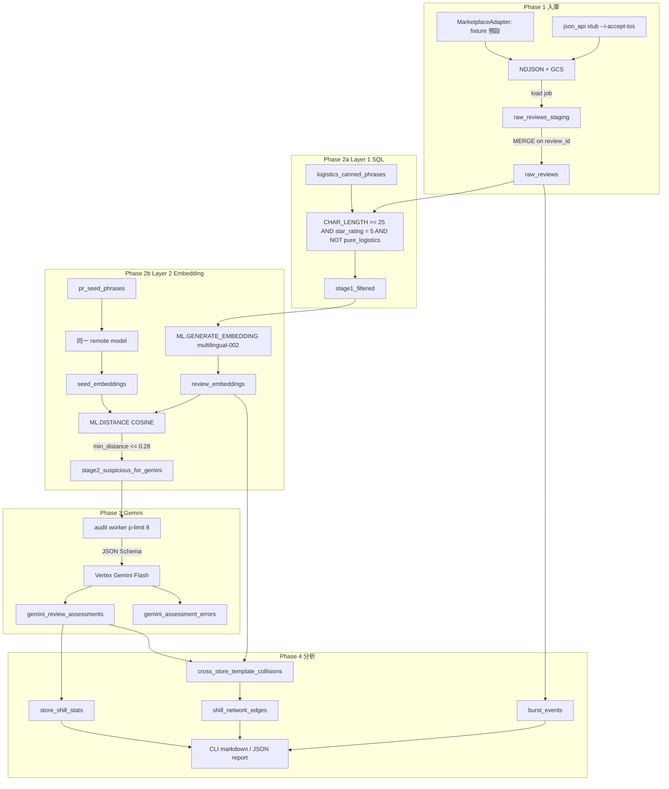
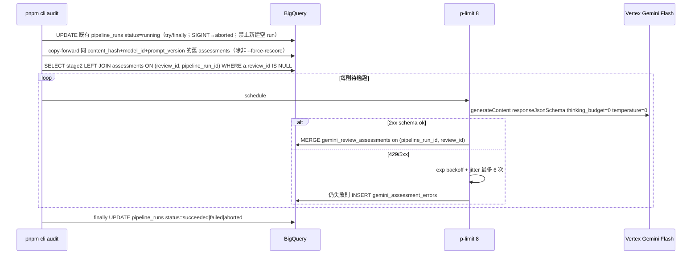

# 廣東話電商鱔稿評論偵測系統 — 設計文件

| 欄位 | 值 |
| --- | --- |
| Title | Cantonese E-commerce Shill Review Detector |
| Document ID | `ecom-shill-review-detector-design-v1` |
| Author | TBD（實作前填入） |
| Date | 2026-08-27（rev 4：使用者 Open Questions 決策已納入） |
| Status | **Accepted** |
| Repo | `/Users/mark/ecom-shill-review-detector` |
| License | GNU GPL-3.0-only（現有 `LICENSE` 維持不變；新檔加 `SPDX-License-Identifier: GPL-3.0-only`） |
| Audience | 資深工程師 / coding agent（本文件為 `/execute-plan` 的唯一架構來源） |
| Language | 正文為繁體中文；identifier、table name、SQL、CLI flag、程式碼維持英文 |

---

## Overview

本 repo 目前為綠地專案：只有 GPL-3.0 `LICENSE` 與一行 README（「Use LLM identify shill review」），**沒有**應用程式碼、schema、CI 或 GCP 設定。目標是建立一條可重跑、可稽核的管線，從電商商店抽出評論，用三層漏斗找出廣東話（粵語）PR 鱔稿／水軍好評，並做單店水分與跨店模版碰撞分析。

系統 backbone 固定為使用者提出的架構：Node.js TypeScript CLI 爬蟲 → BigQuery `raw_reviews`（全量）→ SQL 第 1 層清洗 → Vertex AI 文字 embedding（已確認預設 `text-multilingual-embedding-002`，`text-embedding-004` 僅顯式覆寫）經 BigQuery `ML.GENERATE_EMBEDDING`（舊名 `ML.GENERATE_TEXT_EMBEDDING`）與 7 條 PR 種子句做餘弦距離 → `stage2_suspicious_for_gemini`（假設約 5%，非正式 SLA / 非 CI）→ Node.js audit worker（`p-limit` + Vertex Gemini Flash JSON Schema）→ 分析 SQL。v1 SQL 只用 `ML.*`。v1 資料來源只做 fixture/replay；`json_api` 維持零 HTTP stub，在使用者另行點名 marketplace 之前不實作 live crawler。GCP 區域確認 `asia-east1`。操作情境為個人研究／分析工具（統計 ≠ 法律事實）。`raw_reviews` 是唯一 source of truth；下游表皆可從頭重建。

---

## Background & Motivation

### 現況

- 路徑 `/Users/mark/ecom-shill-review-detector` 僅含：
  - `LICENSE`（GPL-3.0）
  - `README.md`（兩行：標題 + `Use LLM identify shill review`）
- 無 `package.json`、無 `src/`、無 SQL、無 fixture、無 `.env.example`。
- 香港電商評論常見「五星 + 物流罐頭」（「送貨快」「包裝完好」）與真正有鑑證價值的長評混在一起；PR 寫手／agency 會用高度相似的廣東話模版（親身試用、回購、CP 值、對比舊品牌）跨店複製。

### 痛點

1. **全量丟給 LLM 太貴且慢**：多數評論是短評、非五星或純物流，沒有鑑證價值。
2. **只靠關鍵字會漏掉改寫鱔稿**：同一模版會換詞、加語氣詞（「真係」「喺」）。
3. **只靠 embedding 會誤殺真誠長評**：需要 Gemini 做證據級鑑證，且只打高危子集。
4. **跨店水軍無法用單店統計看見**：必須有穩定 `template_id` / embedding 才能 self-join。
5. **marketplace 反爬與 ToS**：把單一非法 scrape 寫死會讓專案無法測試、也無法合規演進。

### 為什麼是這條漏斗

目標漏斗（**假設值，Phase 5 用 labeled set 校正**，不是 SLA）：

| 層 | 產出表 | 預期殘留 | 目的 |
| --- | --- | --- | --- |
| 0 | `raw_reviews` | 100% | 全量、可重跑 |
| 1 | `stage1_filtered` | ~35% | 去掉無鑑證價值雜訊 |
| 2 | `stage2_suspicious_for_gemini` | ~5% | 語意接近 PR 種子 |
| 3 | `gemini_review_assessments` | 對 stage2 的 100%（失敗走 DLQ） | 結構化分數與證據 |
| 4 | 分析表 | 聚合列 | 單店水分 + 跨店碰撞 |

---

## Goals & Non-Goals

### Goals

- 可從 fixture JSONL **重放**完整 4 phase 管線；v1 **不碰 live marketplace**（使用者 2026-08-27 確認 fixture-first）。
- 評論以 **遮蔽 reviewer id**（HMAC，非明文 PII）入 BigQuery。
- Layer 1：長度、**僅五星**、物流罐頭，規則在 **資料表** 而非只寫死在 SQL 字串。
- Layer 2：BigQuery remote model → **`text-multilingual-embedding-002`**（768 維，已確認預設）→ `ML.DISTANCE(..., 'COSINE')`，**cosine distance ≤ 0.28** 為可調預設（先跑管線、之後再校正；~5% 非 SLA）。`text-embedding-004` 僅為 config 覆寫。
- Layer 3：只對 stage2 呼叫 **Vertex AI** Gemini Flash（同 GCP 專案 IAM；型號只來自 config/env，thinking 關閉），JSON Schema 由 Zod 生成，強制輸出 `shill_score`、`template_detected`、`template_id`、`template_name`、`linguistic_style`、`detected_signals`、`rationale_short`。
- Layer 4：單店統計、burst、跨店 template self-join、簡易 edge list（不做 graph DB）。
- 所有寫入冪等：重跑不複製 `raw_reviews`（同 `review_id` 且同 `content_hash`）；Gemini 以 **`(pipeline_run_id, review_id)`** 為單位 checkpoint，可 copy-forward 舊分數。
- 本文件列出具體檔名、DDL、CLI、SQL、測試與验收標準，agent 不應再發明架構。

### Non-Goals（v1）

- 不做即時串流／網站產品／Chrome extension。
- 不做自動下架、對商店公開指控、或法律取證 chain-of-custody。report 必須寫「統計 ≠ 法律事實」（個人研究／分析工具）。
- 不引入 Neo4j / Neptune；v1 用 BigQuery edges + 可選 Graphviz/JSON。
- 不訓練自有分類器、不 fine-tune Gemini。
- 不處理圖片／影片評論內容（可存 `has_media` flag，不送 multimodal）。
- 不在 git 內提交任何真實商店 cookie、token、或未授權 API endpoint 清單。
- 不支援除 BigQuery 以外的分析倉（Snowflake/本地 DuckDB 可列為 Phase 5+ 實驗，非 v1）。
- 不把「7 句種子」當成已驗證的經驗真理；**現在就用 v0 假說句**，使用者稍後以 `seed_version` 替換。
- v1 **不實作 live HTTP crawler**；無 live-marketplace PR。

---

## Key Decisions

| ID | 決策 | 選擇 | 理由 |
| --- | --- | --- | --- |
| KD-01 | 語言 | **TypeScript**（Node.js 22 LTS），不用裸 JS | 與 JSON Schema / Zod 對齊、agent 實作較不易漂型別；使用者指定 Node CLI，不改 runtime。 |
| KD-02 | repo 形狀 | **單一 package** + 資料夾分區，**不是** pnpm multi-package monorepo | 綠地、一個 CLI 產物；拆 `packages/*` 在只有 crawler+worker 時增加無謂邊界。SQL 獨立在 `sql/`。 |
| KD-03 | package manager | **pnpm** | lockfile 嚴格、CI 可重現。 |
| KD-04 | 預設 adapter | **`fixture`**（JSONL replay）；`json_api` 為介面 + **零 HTTP stub** | **2026-08-27 使用者確認**：v1 fixture-first，不實作 live crawler / HTTP。未來若另有指令點名 marketplace 才開 PR。任何未來 live adapter 的 ToS 風險仍 **High**。 |
| KD-05 | BQ 寫入 | **GCS NDJSON → load job → 每批次獨立 staging 表 → `MERGE`**，不用 production streaming insert | Load 對批次更便宜、可重放檔案、`insertId` 去重視窗太短。獨立 staging 避免平行 `load` 互 truncate。Fixture 測試可用 `insertAll` 捷徑（`--load-mode=direct`）。 |
| KD-06 | 冪等鍵 | `review_id` 穩定（有 native id 則不含內文）；`content_hash` 偵測改寫 | 同則重爬不複製。`content_hash` 變更時 **UPDATE 正文並作廢下游** embedding/assessment（不改 `review_id`）。BQ `MERGE` **沒有** `DO NOTHING`；未匹配才 INSERT，匹配且 hash 變才 UPDATE。 |
| KD-07 | `stage1_filtered` / `stage2_*` | **TABLE**（每次 `pipeline_run_id` 物化），另附 debug **VIEW** | Embedding / Gemini 需要穩定快照；VIEW 每次重掃 raw 會重複計費。 |
| KD-08 | 長度定義 | Layer 1 用 BigQuery **`CHAR_LENGTH(comment_text) >= 25`**（Unicode code points） | 對應需求「字」；**不是** bytes、**不是** LLM tokens、**不是** grapheme cluster。Accepted default（使用者未覆寫）。 |
| KD-09 | 星等 | **只保留 `star_rating = 5`** | **2026-08-27 使用者確認**產品決策，不再 pending。1–4 星不進 Layer 1 / Gemini。 |
| KD-10 | 物流雜訊 | 獨立表 `logistics_canned_phrases`，SQL/TS **共用** longest-first regex 編譯器 | 可版本化。v1 **忽略** `match_type=regexp` 列（只編譯 `contains`/`exact`），避免 SQL 與 TS 分叉。 |
| KD-11 | Embedding 模型 | **`text-multilingual-embedding-002`**（768 維，`task_type = 'SEMANTIC_SIMILARITY'`）為 **已確認預設**；`text-embedding-004` 為 **顯式覆寫** | **2026-08-27 使用者確認**。004/005 為英語特化。`gemini-embedding-001` 維度不同，非 v1 預設。 |
| KD-12 | BQ ML 函數名 | SQL **只**用 **`ML.GENERATE_EMBEDDING`** | 舊名 `ML.GENERATE_TEXT_EMBEDDING`。平行 API `AI.GENERATE_EMBEDDING` v1 **禁用**，避免 agent 混用。 |
| KD-13 | 距離 | `ML.DISTANCE(a, b, 'COSINE')`；通過條件 **`<= 0.28`** | **2026-08-27 使用者確認**：可調預設，先跑管線、之後校正。此值為 **distance**。跨店 0.20 同狀態。**禁止**把「stage2 ≈ 5% raw」當 SLA/CI。 |
| KD-14 | Gemini 呼叫位置 | **Node audit worker**，不用 `ML.GENERATE_TEXT` 做 v1 鑑證 | 使用者指定 `p-limit`、JSON Schema、checkpoint、429 重試；BQ ML 難做 per-row checkpoint 與 schema 嚴格輸出。 |
| KD-15 | Gemini 型號 | **只 pin 在 config/env**；thinking **關閉**；禁止把即將下線的 ID 寫死在程式碼 | 範例 ID 為 3.x Flash。client **必須**依 model family 設 thinking：2.5 → `thinkingBudget: 0`；3.x → `thinkingLevel: 'MINIMAL'`（實作當日核對 enum；若 GA 有 `OFF` 則用 `OFF`）。兩鍵都進 yaml。未確認 `thoughtsTokenCount===0` 前不得相信成本公式。 |
| KD-16 | Gemini 通道 | **Vertex AI**（與 BQ 同 GCP 專案 IAM） | **2026-08-27 使用者確認**為 v1 主路徑。`GEMINI_API_KEY` 可留在 env 當本機 fallback，**不是** v1 預設。 |
| KD-17 | 併發 | `p-limit` **default 8**（flag `--concurrency` 範圍 5–10） | 尊重指定區間；8 為中位。 |
| KD-18 | 種子句 | **7 個 category slot** + **現在就用** v0 假說文本，`seed_version = 'v0_hypothesis'` | **2026-08-27 使用者確認**：先用 v0，稍後以新 `seed_version` 替換。 |
| KD-19 | 圖分析 | BigQuery edge 表 + `report` 可匯出 Graphviz DOT / JSON | v1 不上 graph DB。 |
| KD-20 | 原始評論保留 | `raw_reviews.comment_text` 全量保留 | 下游可重建；PII 政策針對 **身份** 而非評論正文（正文是分析對象）。 |
| KD-21 | 失敗處理 | `gemini_assessment_errors` DLQ；worker 不因單列失敗而中止 batch | 可重試；與 checkpoint 互補。`pipeline_runs` 以 try/finally + SIGINT → `aborted`；心跳欄避免永遠 `running`。 |
| KD-22 | 測試策略 | CI **零真實 GCP、零 live HTTP**；只保證 **TS Layer 1 predicates / Zod / hash / mock audit** | **不宣稱** CI 測試了 SQL≡TS。Sandbox BQ/Vertex 為可選 checklist。 |
| KD-23 | Gemini 分數範圍 | **按 run 計分** `(pipeline_run_id, review_id)` | 分析 SQL 過濾同一 `pipeline_run_id` 才不會漏算。`--skip-existing` copy-forward 僅當同 `content_hash` **且** 同 `model_id` **且** 同 `prompt_version`；否則 log `copy_skipped_model_mismatch` 並重打。`--force-rescore` 全量重打。 |
| KD-24 | Env 載入 | **懶載入、分命令** | `crawl --dry-run` / unit test 不要求 `GCP_*`。`REVIEWER_ID_SALT` 最少 16 字元，禁止預設 `""`。`--limit` 非 prod 預設 100；prod 需 `--i-am-prod` 或 `APP_ENV=prod`。 |
| KD-25 | Zod | **鎖定 major 4**（`zod@^4`） | 禁止 Zod 3 datetime API 與 Zod 4 `toJSONSchema` 混用。fixture 用 `z.iso.datetime`；schema 用 `z.toJSONSchema`。 |
| KD-26 | `pipeline_runs` 寫入點 | crawl **不寫 BQ**；`load`/`layer1` 才 INSERT；`layer2`/`audit`/`analyze`/`report` 禁止新建空 run | 否則 PR-02 GCP-free 與「省略 id → 寫 pipeline_runs」互相矛盾。 |

---

## Proposed Design

### 高層架構



### Layer 3 時序



### Repo layout（將存在的檔案）

單一 npm package，根目錄即 CLI。**實作時建立這些路徑，不要另起 monorepo。**

```text
ecom-shill-review-detector/
  LICENSE
  README.md                          # 改寫：如何跑 fixture 管線（仍 GPL）
  package.json
  pnpm-lock.yaml
  tsconfig.json
  tsconfig.build.json
  eslint.config.js
  .gitignore
  .env.example
  .github/workflows/ci.yml
  config/
    default.yaml                     # 門檻、模型、thinking、batch size、併發
    gcp.example.yaml                 # project/dataset/location 範本，不含密鑰
    marketplaces/example.yaml        # 假 URL 範本；禁止真實 endpoint
  src/
    index.ts                         # re-export
    cli/main.ts                      # commander entry（package.json "bin": "ecom-shill"）
    cli/commands/crawl.ts
    cli/commands/load.ts
    cli/commands/layer1.ts
    cli/commands/layer2.ts
    cli/commands/audit.ts
    cli/commands/analyze.ts
    cli/commands/report.ts
    cli/commands/seeds.ts            # Phase 5；Phase 0–4 help 列為 not implemented（exit 2）
    crawler/types.ts                 # FixtureReviewRaw + NormalizedReview
    crawler/adapter.ts               # MarketplaceAdapter interface
    crawler/normalize.ts             # NFC、空白、language_hint 啟發式
    crawler/hash.ts                  # review_id / content_hash / reviewer HMAC / url hash
    crawler/adapters/fixture.ts
    crawler/adapters/json-api.ts     # Phase 1：零 HTTP stub
    crawler/adapters/index.ts
    # crawler/rate-limit.ts、robots.ts：v1 不新增。僅當未來另有指令點名 marketplace 時才開 PR
    crawler/persist/ndjson.ts
    crawler/persist/gcs.ts
    crawler/persist/bq-load.ts
    crawler/persist/merge-raw.ts
    audit/worker.ts
    audit/gemini-client.ts
    audit/schema.ts                  # Zod + JSON Schema
    audit/prompt.ts
    audit/checkpoint.ts
    audit/retry.ts
    analysis/report.ts
    shared/env.ts
    shared/logger.ts                 # pino JSON logs
    shared/bq.ts
    shared/ids.ts
    shared/types.ts
    shared/layer1-predicates.ts      # 與 SQL 對齊的 TS 實作，供 golden test
    shared/layer1-regex.ts           # longest-first phrase compiler（SQL 註解同步）
    shared/metrics.ts
    shared/run-id.ts                 # 列印 / 寫 data/runs/latest / --continue-latest
  sql/
    ddl/00_dataset.sql
    ddl/01_pipeline_runs.sql
    ddl/02_raw_reviews.sql
    ddl/03_logistics_canned_phrases.sql
    ddl/04_pr_seed_phrases.sql
    ddl/05_stage1_filtered.sql
    ddl/05b_layer1_exclusion_audit.sql
    ddl/06_remote_models.sql
    ddl/07_review_embeddings.sql
    ddl/08_seed_embeddings.sql
    ddl/09_stage2_suspicious.sql
    ddl/10_gemini_review_assessments.sql
    ddl/11_gemini_assessment_errors.sql
    ddl/12_store_shill_stats.sql
    ddl/13_burst_events.sql
    ddl/14_cross_store_template_collisions.sql
    ddl/15_shill_network_edges.sql
    ddl/16_funnel_stats.sql
    seeds/logistics_canned_phrases.sql
    seeds/pr_seed_phrases_v0.sql
    layer1/filter_stage1.sql
    layer2/embed_seeds.sql
    layer2/embed_reviews.sql
    layer2/distance_filter.sql
    analysis/store_shill_stats.sql
    analysis/burst_events.sql
    analysis/cross_store_collisions.sql
    analysis/semantic_collisions.sql
    analysis/shill_network_edges.sql
    analysis/funnel_counts.sql
  fixtures/
    reviews/cantonese-mix.jsonl
    reviews/logistics-only.jsonl
    reviews/short-five-star.jsonl
    reviews/genuine-long.jsonl
    reviews/shill-like-v0.jsonl
    reviews/non-five-star.jsonl
    reviews/overlap-logistics.jsonl  # 包裝完好 vs 包裝完好無損；含「順豐」的長真誠評
    reviews/same-native-id-edit.jsonl
    expected/stage1_review_ids.json
    expected/gemini-payload-valid.json
    expected/gemini-payload-coerced.json  # shill_score: 87.0、未知 code
    recordings/README.md             # 說明如何合法保存 API 錄製；不提交真實流量
  tests/
    unit/hash.test.ts
    unit/layer1-predicates.test.ts
    unit/layer1-regex.test.ts
    unit/adapter-fixture.test.ts
    unit/gemini-schema.test.ts
    unit/retry.test.ts
    unit/env.test.ts
    unit/burst-zscore.test.ts        # 不需 BQ；baseline n < N → 非 burst
    integration/crawl-replay.test.ts
    integration/audit-mock.test.ts
  scripts/
    bootstrap-gcp.sh                 # dataset、connection、IAM 提示
    bq-apply.sh                      # 依序套用 sql/ddl
    bq-run-layer1.sh
    bq-run-layer2.sh
```

`package.json` scripts（名稱固定）：

```text
pnpm lint
pnpm typecheck
pnpm test
pnpm cli -- --help
pnpm cli crawl --adapter fixture --input fixtures/reviews/cantonese-mix.jsonl --dry-run
pnpm cli crawl --adapter fixture --input <path> --out-dir data/batches
pnpm cli load --ndjson <path> [--gcs-uri gs://...]
pnpm cli layer1 --pipeline-run-id <uuid>
pnpm cli layer2 --pipeline-run-id <uuid>
pnpm cli audit --pipeline-run-id <uuid> --concurrency 8
pnpm cli analyze --pipeline-run-id <uuid>
pnpm cli report --pipeline-run-id <uuid> --format markdown --out reports/
```

Bin 名稱：`ecom-shill`。實作可用 `tsx` 跑 `src/cli/main.ts`，build 後 `dist/cli/main.js`。

### 命名慣例

| 資源 | 慣例 | 範例 |
| --- | --- | --- |
| GCP project | env `GCP_PROJECT` | 不在文件寫死 |
| Dataset | `ecom_shill` | `{GCP_PROJECT}.ecom_shill` |
| Location | env `GCP_LOCATION=asia-east1` | **2026-08-27 確認**。dataset、connection、Vertex **必須同區** |
| Connection | `ecom_shill_vertex` | `{GCP_PROJECT}.{GCP_LOCATION}.ecom_shill_vertex` |
| Remote models | `text_embedding`（ENDPOINT 來自 `EMBEDDING_MODEL`） | Gemini **不**走 BQ remote model（KD-14） |
| GCS bucket | `gs://{GCP_PROJECT}-ecom-shill-staging` | NDJSON 暫存，lifecycle 7 天 |
| 表 | snake_case 複數或描述性 | `raw_reviews` |
| CLI flags | kebab-case | `--pipeline-run-id` |
| 日誌欄位 | snake_case JSON | `review_id`, `pipeline_run_id` |

---

## API / Interface Changes

綠地：以下即為 v1 公開介面。

### MarketplaceAdapter

```typescript
// src/crawler/adapter.ts
export type MarketplaceId = 'fixture' | 'json_api';

export interface CrawlOptions {
  storeIds?: string[];
  productIds?: string[];
  since?: Date;
  until?: Date;
  maxReviews?: number;
  /** fixture 用 */
  inputPath?: string;
  dryRun?: boolean;
  /**
   * json_api 必填（即便 Phase 1 零 HTTP）。沒有此旗標必須非 0 exit。
   * 表示操作者已自行評估目標站 ToS / robots / 當地法律。
   * Phase 1 即使有旗標也不得發出 HTTP。
   */
  iAcceptTos?: boolean;
}

export interface NormalizedReview {
  marketplace: string;
  native_review_id: string | null;
  store_id: string;
  product_id: string;
  /** 已 HMAC 遮蔽，adapter 不得傳入明文 */
  reviewer_id_hash: string;
  star_rating: number; // 1–5 integer
  comment_text: string;
  review_ts: Date;
  source_url_canonical: string | null;
  language_hint: LanguageHint;
  has_media: boolean;
  raw_payload_hash: string; // SHA-256 of sanitized JSON; 不得含 cookie
}

export interface MarketplaceAdapter {
  readonly id: MarketplaceId;
  crawl(opts: CrawlOptions): AsyncIterable<NormalizedReview>;
}

export type LanguageHint =
  | 'yue'
  | 'zh-Hant'
  | 'zh-Hans'
  | 'en'
  | 'mixed'
  | 'unknown';
```

- `fixture`：讀 JSONL，每行是 **hash 前** 的 `FixtureReviewRaw`（可含 `reviewer_id_raw` 僅存在記憶體，寫出前必經 `hash.ts`）。
- `json_api`（**Phase 1 / v1 範圍**）：
  1. 無 `--i-accept-tos` → exit ≠ 0，訊息說明 ToS 旗標。
  2. 有旗標但無 `config/marketplaces/<id>.yaml` → throw `MarketplaceNotConfiguredError`。
  3. **禁止任何 HTTP**（含 robots.txt GET）。`rate-limit.ts` / `robots.ts` / `MARKETPLACE_COOKIE` **不存在於 Phase 1 檔案樹**。
  4. git 只允許 `config/marketplaces/example.yaml`（假 URL `https://example.invalid/reviews`）。v1 **沒有** live-marketplace PR。

### Fixture 輸入 schema（`src/crawler/types.ts`）

Phase 1 不得發明其他欄位名。JSONL 一列一個 JSON object。

```typescript
export const FixtureReviewRaw = z.object({
  marketplace: z.string().min(1).default('fixture'),
  native_review_id: z.string().min(1).nullable().default(null),
  store_id: z.string().min(1),
  product_id: z.string().min(1),
  reviewer_id_raw: z.string().min(1),          // 只在記憶體；不得寫 NDJSON/BQ
  star_rating: z.number().int().min(1).max(5), // 否則拒絕該列並計數 rejected_star
  comment_text: z.string().min(1),
  review_ts: z.iso.datetime({ offset: true }), // Zod 4；必含時區。若此 option 不存在：z.iso.datetime() + refine /[+-]\d{2}:\d{2}$|Z$/
  source_url: z.string().url().nullable().default(null),
  has_media: z.boolean().default(false),
  language_hint: z
    .enum(['yue', 'zh-Hant', 'zh-Hans', 'en', 'mixed', 'unknown'])
    .optional(), // 缺則 normalize.ts 啟發式
});
export type FixtureReviewRaw = z.infer<typeof FixtureReviewRaw>;
```

拒絕規則：JSON 解析失敗、Zod 失敗、`star_rating` 非 1–5 整數 → 該列 skip + `n_rejected++`，不使整次 crawl 失敗（除非 `--strict`，進階旗標）。`review_ts` 無時區（`2026-01-15T08:30:00` 或 `2026-01-15`）→ reject。正規化後寫入 BQ 的 `review_ts` 為 UTC TIMESTAMP。

範例 JSONL（**同一檔內 `native_review_id` 必須唯一**；完整 fixture 分檔，見 `fixtures/reviews/`）：

```json
{"marketplace":"fixture","native_review_id":"n001","store_id":"store_a","product_id":"prod_shampoo","reviewer_id_raw":"user-aaa","star_rating":5,"comment_text":"用咗兩個禮拜，暗瘡真係少咗，成個 toning 都穩咗，晚上面霜會再補一層。","review_ts":"2026-01-15T08:30:00+08:00","source_url":null,"has_media":false}
{"marketplace":"fixture","native_review_id":"n002","store_id":"store_a","product_id":"prod_shampoo","reviewer_id_raw":"user-bbb","star_rating":5,"comment_text":"送貨好快，包裝完好","review_ts":"2026-01-16T09:00:00+08:00","source_url":null,"has_media":false}
{"marketplace":"fixture","native_review_id":"n003","store_id":"store_a","product_id":"prod_shampoo","reviewer_id_raw":"user-ccc","star_rating":5,"comment_text":"好用","review_ts":"2026-01-16T10:00:00+08:00","source_url":null,"has_media":false}
{"marketplace":"fixture","native_review_id":"n004","store_id":"store_a","product_id":"prod_shampoo","reviewer_id_raw":"user-ddd","star_rating":3,"comment_text":"用完覺得一般，味道有啲刺鼻，未必會回購。","review_ts":"2026-01-17T11:00:00+08:00","source_url":null,"has_media":false}
{"marketplace":"fixture","native_review_id":"n005","store_id":"store_b","product_id":"prod_cream","reviewer_id_raw":"user-eee","star_rating":5,"comment_text":"今次係我親身試用過先敢講，真係同廣告講嘅一樣，用落好舒服，效果好明顯。","review_ts":"2026-01-18T12:00:00+08:00","source_url":null,"has_media":false}
```

**禁止**把改寫版 `n001` 放進與原文同一個 JSONL／同一 crawl。改寫專測只存在 `fixtures/reviews/same-native-id-edit.jsonl`，且必須是 **第二次** `crawl` + `load`（此時 `review_id` 不變、`content_hash` 變、MERGE UPDATE）。單次 staging 若仍出現重複 `review_id`，load 路徑必須 last-write-wins 去重，**不得**把重複鍵丟進 `MERGE`（GoogleSQL 會直接失敗）。

### 身分與冪等（`src/crawler/hash.ts`）

```typescript
// 全部 hex lowercase SHA-256 / HMAC-SHA256
// REVIEWER_ID_SALT 來自 env，不得進 git、不得進 BigQuery

export function hashReviewerId(raw: string, salt: string): string {
  // HMAC-SHA256(salt, raw).digest('hex')
}

export function contentHash(commentText: string): string {
  // SHA-256( NFC(commentText).replace(/\s+/g, ' ').trim() )
}

export function sourceUrlHash(canonicalUrl: string | null): string | null {
  // null in → null out; else SHA-256(canonicalUrl without tracking query params)
}

export function makeReviewId(input: {
  marketplace: string;
  nativeReviewId: string | null;
  storeId: string;
  productId: string;
  reviewerIdHash: string;
  contentHash: string;
  reviewTsIso: string;
}): string {
  // if nativeReviewId present:
  //   sha256(`v1|${marketplace}|${nativeReviewId}`)
  //   // 不含 content_hash：同一則評論改寫仍是同一列
  // else:
  //   sha256(`v1|${marketplace}|${storeId}|${productId}|${reviewerIdHash}|${contentHash}|${reviewTsIso}`)
}
```

`REVIEWER_ID_SALT`：長度 **< 16** 或未設 → crawl/load **硬失敗**（`env.ts` `assertSalt()`）。CI 用 `.env.test` 的 32 hex，**永不** fallback 成 `""`。

`pipeline_run_id` 生命週期見下方 CLI 表（**crawl 不 INSERT BigQuery `pipeline_runs`**）。非 dry-run 的 crawl 只寫本地 `data/runs/latest`（JSON：`pipeline_run_id`, `crawl_batch_id`, `phase`, `started_at`）並 stdout `pipeline_run_id=<uuid>`。`crawl_batch_id`：一次 crawl 指令一個 UUID。

**改寫政策（KD-06）**：`review_id` 在有 `native_review_id` 時穩定。正文變更靠 `content_hash`。load MERGE 對 hash 不同的 matched 列 UPDATE 正文相關欄，然後：

1. `DELETE FROM review_embeddings WHERE review_id IN (updated_ids)`（任何 model；強制重 embed）
2. **不**刪歷史 `gemini_review_assessments`（舊 `pipeline_run_id` 報告仍可重現）
3. copy-forward 只在 `content_hash` **且** `model_id` **且** `prompt_version` 皆吻合時發生；改寫或換模型後必須重新 Gemini（若該則仍進 stage2）

### CLI 契約（本表為 flags 唯一 source of truth）

全域 flags（**不**表示每個命令都會 INSERT `pipeline_runs`）：

| Flag | Default | 說明 |
| --- | --- | --- |
| `--pipeline-run-id <uuid>` | 無 | 指定既有或即將建立的 id；與 `--continue-latest` 互斥 |
| `--continue-latest` | 見下表 | 讀 `data/runs/latest` |
| `--resume` | false | 若該 run `status=running` 且心跳過期（>15 min）或手動指定，從 checkpoint 續跑 |
| `--i-am-prod` | false | 或 `APP_ENV=prod`。關掉 audit `--limit` 預設 100 |
| `--strict` | false | fixture 任一列 Zod 失敗則 crawl 非 0 exit |

`pipeline_run_id` 誰可以「新建」：

| 命令 | 本地 `data/runs/latest` | BigQuery `pipeline_runs` |
| --- | --- | --- |
| `crawl --dry-run` | **不寫** | **不寫**、不讀 `GCP_*` |
| `crawl` | 寫新 UUID + `crawl_batch_id` | **不寫**（PR-02 必須 GCP-free） |
| `load` | 若未傳 `--pipeline-run-id` 且 latest 存在 → 視為 `--continue-latest`；否則可新建 UUID | **第一個** INSERT 該 id（若不存在） |
| `layer1` | 同 load：latest 存在且無旗標 → 視為 continue；latest 不存在才可新建 | INSERT 若不存在 |
| `layer2` / `audit` / `analyze` / `report` | 必須 `--pipeline-run-id` **或** `--continue-latest`（latest 不存在 → exit 2） | **禁止新建**；只 UPDATE 既有列（如 `status`/`heartbeat`）。找不到該 id → exit 2 |

```text
ecom-shill crawl
  --adapter fixture|json_api          default: fixture
  --input <jsonl>                     fixture 必填
  --out-dir <dir>                     default: ./data/batches/<crawl_batch_id>
  --marketplace <id>                  json_api 用（Phase 1 仍零 HTTP）
  --store-id <id>                     可重複
  --dry-run                           只印計數與樣本 3 列；不寫檔、不寫 BQ、不讀 GCP_*
  --i-accept-tos                      json_api 必填
  --max-reviews <n>
  --strict                            見全域

ecom-shill load
  --ndjson <file>
  --gcs-uri <gs://...>                若省略且非 dry-run：上傳到 staging bucket
  --load-mode gcs|direct              default gcs；direct 僅測試
  --dataset ecom_shill                default env BQ_DATASET
  --pipeline-run-id / --continue-latest   見上表

ecom-shill layer1
  --pipeline-run-id <uuid>
  --continue-latest                   latest 存在時可省略並自動 continue；否則可新建

ecom-shill layer2
  --pipeline-run-id <uuid>            與 --continue-latest 必居其一；禁止新建
  --continue-latest
  --seed-version <id>                 default: 現行 is_active 版本或 config seed_version

ecom-shill audit
  --pipeline-run-id <uuid>            與 --continue-latest 必居其一；禁止新建
  --continue-latest
  --concurrency <5-10>                default 8；越界拒絕
  --limit <n>                         最多 N 則新 Gemini 呼叫。非 prod 預設 100；prod 預設無上限但仍受 MAX_GEMINI_REVIEWS_PER_RUN
  --skip-existing                     default true：copy-forward 同 content_hash+model+prompt 舊分
  --force-rescore                     忽略舊分，本 run stage2 全部重打 Gemini（仍受 --limit）
  --resume                            見全域

ecom-shill analyze
  --pipeline-run-id <uuid>            與 --continue-latest 必居其一；禁止新建空 run
  --continue-latest

ecom-shill report
  --pipeline-run-id <uuid>            與 --continue-latest 必居其一
  --continue-latest
  --format markdown|json              default markdown
  --dot                               另寫 Graphviz .dot
  --out <path>                        default reports/<pipeline_run_id>.md|.json

ecom-shill seeds                     Phase 5；v1 help 顯示、呼叫 exit 2 not implemented
```

Help：`pnpm cli -- --help`（pnpm 把第一個 `--` 當 script 參數分隔）。子命令已登記但未實作 → **exit 2** + `not implemented`。Phase 0 的 `seeds` 屬此類；`json_api` crawl 已實作但零 HTTP，**不是** not implemented。

Dry-run 不得建立 GCP 資源、不得寫 `data/`（含 `data/runs/latest`）。`shared/env.ts` 分組：

| 命令 | 必備 env |
| --- | --- |
| `crawl --adapter fixture --dry-run`、unit test | `REVIEWER_ID_SALT`（≥16） |
| `crawl` 寫 NDJSON（仍無 GCP） | `REVIEWER_ID_SALT` |
| `load` / `layer1` | `REVIEWER_ID_SALT` + `GCP_PROJECT` + `GCP_LOCATION` + `BQ_DATASET`（可 INSERT `pipeline_runs`） |
| `layer2` / `audit` / `analyze` / `report` | 同上，但 **必須**已有 `--pipeline-run-id` 或 `--continue-latest`；禁止新建 run |
| `audit` live Gemini | 上列 + Vertex ADC（或明確 `GEMINI_API_KEY` fallback） |

BQ client **懶建立**（第一次 query 才 `new BigQuery()`）。`GCP_PROJECT` 缺席時 fixture 測試仍綠。

### Gemini 輸出型別（Layer 3）

```typescript
// src/audit/schema.ts
import { z } from 'zod';

export const LinguisticStyle = z.enum([
  'canned_pr',
  'fake_oral_cantonese',
  'genuine_oral',
  'mixed_code_switch',
  'formal_written_chinese',
  'english_heavy',
  'unknown',
]);

export const DetectedSignal = z.object({
  code: z.enum([
    'STOCK_PRAISE',
    'NO_PRODUCT_SPECIFICS',
    'TEMPLATE_OPENER',
    'TEMPLATE_CLOSER',
    'FAKE_ORALITY',
    'SOCIAL_PROOF_CLICHE',
    'REPURCHASE_CLICHE',
    'BRAND_COMPARE_CLICHE',
    'CP_VALUE_CLICHE',
    'PACKAGING_PRAISE_ONLY',
    'SKIN_RESULT_VAGUE',
    'URGENCY_MARKETING',
    'GENUINE_DETAIL',          // 負向證據：降低 shill_score
    'GENUINE_FLAW_MENTION',
  ]),
  span: z.string().max(80),   // 必須是 comment_text 的子字串；worker 驗證
  start_char: z.number().int().nonnegative().optional(),
  end_char: z.number().int().nonnegative().optional(),
});

export const GeminiAssessmentJson = z.object({
  shill_score: z.number().int().min(0).max(100),
  template_detected: z.boolean(),
  template_id: z.string().nullable(),
  template_name: z.string().nullable(),
  linguistic_style: LinguisticStyle,
  detected_signals: z.array(DetectedSignal).max(12),
  rationale_short: z.string().max(280),
});

export const GeminiAssessment = GeminiAssessmentJson.extend({
  shill_score: z.coerce.number().min(0).max(100).transform((n) => Math.round(n)),
});

export type GeminiAssessment = z.infer<typeof GeminiAssessment>;

/** Vertex 用的 JSON Schema：必須由 Zod 生成，禁止手寫第二份。
 *  生成用「無 transform」的 object（shill_score: integer 0–100）；
 *  parse 路徑才用 coerce + Math.round。 */
export const geminiResponseJsonSchema = z.toJSONSchema(GeminiAssessmentJson);
```

Phase 0 鎖定 **`zod@^4`**。禁止 Zod 3 的 `z.string().datetime()` 與 Zod 4 `z.toJSONSchema` 混用。

v1 Vertex 呼叫路徑（`src/audit/gemini-client.ts`）**鎖定**：

```typescript
import { GoogleGenAI } from '@google/genai';

const ai = new GoogleGenAI({
  vertexai: true,
  project: env.GCP_PROJECT,
  location: env.GCP_LOCATION,
});

/** 2.5 家族用 thinkingBudget；3.x 用 thinkingLevel。只設其一會在範例模型 3.5-flash 上關不掉 thinking。 */
function thinkingConfigForModel(model: string): Record<string, unknown> {
  const id = model.toLowerCase();
  if (id.includes('2.5')) {
    return { thinkingBudget: 0 };
  }
  // 3.x：實作當日核對 SDK enum。優先 'OFF'，否則 'MINIMAL'。
  return { thinkingLevel: env.GEMINI_THINKING_LEVEL }; // default yaml: MINIMAL
}

await ai.models.generateContent({
  model: env.GEMINI_MODEL, // 只從 config/env 讀；禁止 import 常數 pin 退役 ID
  contents: [...],
  config: {
    temperature: 0,
    maxOutputTokens: 1024,
    responseMimeType: 'application/json',
    responseJsonSchema: geminiResponseJsonSchema, // JSON Schema，不是 OpenAPI responseSchema
    thinkingConfig: thinkingConfigForModel(env.GEMINI_MODEL),
  },
});
```

Live 或 mock 必须讀 usage metadata：`usageMetadata.thoughtsTokenCount === 0`（或 SDK 對等欄）。非 0 → log `thinking_not_off` 且 **該 run 不得採用成本公式**；Phase 3 sandbox checklist 失敗。YAML 同時有 `thinking_budget` 與 `thinking_level`。

**不要**同時傳 `responseSchema`（OpenAPI subset）與 `responseJsonSchema`。生成 schema 時 `DetectedSignal.code` 必須帶 **enum**（與 Zod 15 碼相同）。

Worker 後驗證（失敗是 **降級** 不是 DLQ，除非整份 JSON 無法 parse）：

| 檢查 | 動作 |
| --- | --- |
| `span` 不是 `comment_text` 的 substring | 剝掉該 signal；`signal_span_mismatch_count++` |
| `start_char`/`end_char` 與 `span` 對不上（或越界） | 丟掉 offsets，保留 span（若 span 合法） |
| `template_detected=false` 但 id/name 非 null | 強制 `template_id=template_name=null` |
| `template_detected=true` 且 id 不在 `seed_id ∪ {unlisted_template}` | 改 `unlisted_template` |
| `shill_score` 為 `87.0` | coerce + round → 87，**不** DLQ |
| `code` 不在 enum | 剝掉該 signal（structured output 理論上不該發生；仍防） |
| JSON 完全無法 parse / 缺 required | DLQ `error_class=schema`，不重試 |

Golden：`fixtures/expected/gemini-payload-valid.json`（合法）、`gemini-payload-coerced.json`（`shill_score: 87.0`、未知 `code`、span 不在正文）→ 測試必須分別：accept / coerce+strip 且 **不**進 DLQ。

### System prompt 大綱（`src/audit/prompt.ts`）

固定 `PROMPT_VERSION = 'v1'` 字串常數，寫入 assessments 列。

**角色**：你是香港電商評論鑑證員，專門分辨廣東話／書面中文「PR 鱔稿」與真誠五星長評。輸入是單則評論 + 可選的最接近種子 category。

**要抓的訊號**：

- 空泛讚美無產品細節（容量、氣味、使用天數、膚質、味道、型號）。
- 經典模版：親身試用、用咗 N 日皮膚變好、會回購、朋友／同事推薦、CP 值高、對比之前某個品牌、包裝好用心。
- 語氣像廣告 copy 而非口語；或「假口語」（堆砌「真係」「好正」但零細節）。
- 與所附 seed category 高度同構（但 **不得** 只因為 Layer 2 命中就打高分）。

**不要打成鱔稿**：

- 有具體使用情境、時間線、可驗證細節的五星長評。
- 提到小缺點仍給五星。
- 純個人經歷且用字不套模版。
- 粵英混雜本身不是罪證。

**輸出**：只輸出 schema JSON。`shill_score>=75` 表示高信心鱔稿。`rationale_short` 不得重複全文。不要輸出 reviewer 身分。種子列表以 tool/context 方式注入（7 個 category 名稱 + 短描述），不要在 prompt 假裝它們是法庭證據。

---

## Data Model Changes

### Dataset

```sql
-- sql/ddl/00_dataset.sql
-- 由 scripts/bq-apply.sh 以 bq mk 建立（CREATE SCHEMA 亦可）
CREATE SCHEMA IF NOT EXISTS `ecom_shill`
OPTIONS (
  location = 'asia-east1',  -- 已確認；必須與 env GCP_LOCATION 一致
  description = 'Cantonese e-commerce shill review pipeline'
);
```

所有表：`project.ecom_shill.<table>`。以下 DDL 省略 project qualifier，實作時用 `` `{GCP_PROJECT}.ecom_shill.<table>` ``。

### `pipeline_runs`

```sql
CREATE TABLE IF NOT EXISTS `ecom_shill.pipeline_runs` (
  pipeline_run_id STRING NOT NULL,
  parent_run_id STRING,                 -- 可空：重跑分析時指向原 ingest run
  phase STRING NOT NULL,                -- crawl|load|layer1|layer2|audit|analyze
  status STRING NOT NULL,               -- running|succeeded|failed|aborted
  crawl_batch_id STRING,
  seed_version STRING,
  embedding_model STRING,               -- 預設 text-multilingual-embedding-002
  gemini_model STRING,                  -- 來自 env，例 gemini-3.5-flash
  heartbeat_at TIMESTAMP,               -- worker 每 30s 更新；>15 min 且 status=running 視為可 --resume
  cosine_distance_threshold FLOAT64,
  started_at TIMESTAMP NOT NULL,
  finished_at TIMESTAMP,
  rows_in INT64,
  rows_out INT64,
  error_message STRING,
  extra JSON
)
PARTITION BY DATE(started_at);
```

### `raw_reviews`（source of truth）

```sql
CREATE TABLE IF NOT EXISTS `ecom_shill.raw_reviews` (
  review_id STRING NOT NULL,            -- 冪等鍵
  marketplace STRING NOT NULL,
  native_review_id STRING,
  store_id STRING NOT NULL,
  product_id STRING NOT NULL,
  reviewer_id_hash STRING NOT NULL,     -- HMAC-SHA256 hex；禁止明文
  star_rating INT64 NOT NULL,
  comment_text STRING NOT NULL,
  content_hash STRING NOT NULL,
  review_ts TIMESTAMP NOT NULL,
  ingested_at TIMESTAMP NOT NULL,
  crawl_batch_id STRING NOT NULL,
  pipeline_run_id STRING NOT NULL,
  source_url_hash STRING,
  language_hint STRING NOT NULL,
  has_media BOOL NOT NULL,
  raw_payload_hash STRING,
  char_length INT64 NOT NULL,           -- CHAR_LENGTH(comment_text) 入庫時計算，避免重複掃描
  updated_at TIMESTAMP NOT NULL
)
PARTITION BY DATE(review_ts)
CLUSTER BY marketplace, store_id, product_id
OPTIONS (description = 'Full-fidelity reviews; PII-hashed reviewer ids');
```

BigQuery **不 enforce** PK；冪等靠 `MERGE`。可選 `ALTER TABLE ... ADD PRIMARY KEY(review_id) NOT ENFORCED`（v1 建議加上，方便 INFORMATION_SCHEMA 與文件，不改變執行語意）。

**禁止**使用固定表名 `raw_reviews_staging` 並 TRUNCATE（平行 `load` 會互踩）。每次 load 建：

```sql
CREATE TABLE `ecom_shill.raw_reviews_staging_<crawl_batch_id>`
LIKE `ecom_shill.raw_reviews`;
-- load job → MERGE → DROP TABLE staging
```

GoogleSQL `MERGE` **沒有** `WHEN MATCHED THEN DO NOTHING`（那是 PostgreSQL）。插入-若不存在、內容變則更新。

**Staging 鍵必須唯一**：同一 `crawl` / 同一 NDJSON 若出現重複 `review_id`（含誤把改寫列與原文放同一檔），`MERGE` 源端多列對同一 target key 會 **整句失敗**。因此：

1. `persist/ndjson.ts`：寫檔前用 `Map<review_id, row>` last-write-wins（後列覆蓋前列）。
2. load 在 MERGE **之前**再去重一次（SQL 為準，防止手改 NDJSON）：

```sql
CREATE OR REPLACE TABLE `ecom_shill.raw_reviews_staging_<crawl_batch_id>_dedup` AS
SELECT * EXCEPT(rn)
FROM (
  SELECT
    s.*,
    ROW_NUMBER() OVER (PARTITION BY review_id ORDER BY updated_at DESC) AS rn
  FROM `ecom_shill.raw_reviews_staging_<crawl_batch_id>` AS s
)
WHERE rn = 1;
```

然後 `MERGE ... USING ..._dedup`。禁止 `USING` 未去重的 staging。

```sql
-- crawler/persist 邏輯；batch 建議每檔 5_000–20_000 列
-- 「匹配且 hash 相同 → 不動作」= 省略該 WHEN MATCHED 分支，不是 DO NOTHING 關鍵字。
MERGE `ecom_shill.raw_reviews` T
USING `ecom_shill.raw_reviews_staging_<crawl_batch_id>_dedup` S
ON T.review_id = S.review_id
WHEN MATCHED AND T.content_hash != S.content_hash THEN UPDATE SET
  comment_text = S.comment_text,
  content_hash = S.content_hash,
  char_length = S.char_length,
  star_rating = S.star_rating,
  review_ts = S.review_ts,
  language_hint = S.language_hint,
  has_media = S.has_media,
  raw_payload_hash = S.raw_payload_hash,
  crawl_batch_id = S.crawl_batch_id,
  pipeline_run_id = S.pipeline_run_id,
  ingested_at = S.ingested_at,
  updated_at = S.updated_at
WHEN NOT MATCHED THEN INSERT ROW;
```

MERGE 後對 `content_hash` 變更的 `review_id` 執行 `DELETE FROM review_embeddings WHERE review_id IN (...)`（見改寫政策）。log `n_inserted` / `n_updated` / `n_unchanged`。

**Load vs streaming 理由**：一次商店 crawl 是封閉批次；load job 不計 streaming insert 費用、失敗可重丟同一個 NDJSON、與 GCS lifecycle 對齊。Streaming 適合永遠在線的 collector，本系統不是。

**NDJSON 欄位名**與表一致。`review_ts` RFC3339。Load 選項：`--source_format=NEWLINE_DELIMITED_JSON --ignore_unknown_values=false --max_bad_records=0`。

### `logistics_canned_phrases`

```sql
CREATE TABLE IF NOT EXISTS `ecom_shill.logistics_canned_phrases` (
  phrase_id STRING NOT NULL,
  phrase STRING NOT NULL,               -- 小寫比對前先 LOWER
  match_type STRING NOT NULL,           -- exact | contains | regexp
  lang STRING NOT NULL,                 -- yue | zh | en
  category STRING NOT NULL,             -- shipping_speed | packaging | courier | generic_thanks
  is_active BOOL NOT NULL,
  phrase_version STRING NOT NULL,
  notes STRING
);
```

v0 初始列（`sql/seeds/logistics_canned_phrases.sql`，**可擴充，非完備**）：

| phrase_id | phrase | match_type | category |
| --- | --- | --- | --- |
| log_01 | 送貨快 | contains | shipping_speed |
| log_02 | 送貨好快 | contains | shipping_speed |
| log_03 | 到貨快 | contains | shipping_speed |
| log_04 | 好快收到 | contains | shipping_speed |
| log_05 | 很快就收到 | contains | shipping_speed |
| log_06 | 第二日就到 | contains | shipping_speed |
| log_07 | 第二日送到 | contains | shipping_speed |
| log_08 | 包裝完好 | contains | packaging |
| log_09 | 包裝完好無損 | contains | packaging |
| log_10 | 包裝好好 | contains | packaging |
| log_11 | 包裝完整 | contains | packaging |
| log_12 | 順豐好快 | contains | courier |
| log_13 | 順豐 | contains | courier |
| log_14 | 快遞好快 | contains | shipping_speed |
| log_15 | 物流快 | contains | shipping_speed |
| log_16 | 物流好快 | contains | shipping_speed |
| log_17 | 運費 | contains | shipping_speed |
| log_18 | 未拆已經好滿意 | contains | generic_thanks |
| log_19 | 正品 | contains | generic_thanks |
| log_20 | 好快就送到 | contains | shipping_speed |
| log_21 | fast delivery | contains | shipping_speed |
| log_22 | well packed | contains | packaging |
| log_23 | 多謝賣家 | contains | generic_thanks |
| log_24 | 賣家態度好 | contains | generic_thanks |
| log_25 | 回覆得快 | contains | generic_thanks |

「純物流罐頭」定義（Layer 1）：

1. `star_rating = 5` 且 `CHAR_LENGTH >= 25` 仍可能是物流文；故 **獨立於長度**。
2. 將 `comment_text` 內所有 `is_active` 且 match 的 phrase **剝除**後，剩餘 `CHAR_LENGTH(TRIM(stripped)) < 25` → 視為純物流／罐頭，**丟棄**。
3. 另外：若剝除後空字串 → 丟棄。

此規則讓「送貨好快，包裝完好，已經用咗兩個禮拜，暗瘡真係少咗，成個 toning 都穩咗」能留下。

**v0 詞表攻擊性**：`順豐`、`正品`、`運費`、`多謝賣家` 會從真誠長評剝字。剝完仍 ≥25 字則留下（golden：`overlap-logistics.jsonl` 必須有一則含「順豐」的長評 `pass`）。Layer 1「~35%」是 **此詞表 + 長度 + 五星** 的函數，**不是** CI 目標。v1 `match_type` 只用 `contains`/`exact`；`regexp` 列可存在於表中但編譯器 **跳過**，TS 與 SQL 必須同一行為。

### `pr_seed_phrases`（7 slot，v0 假說）

**這不是實證「官方 7 大經典」**。標籤：`seed_version = 'v0_hypothesis'`。實作必須在 README 與種子 SQL 註解寫明 *hypothesis, replaceable*。使用者若提供真 7 句，走 `ecom-shill seeds upsert`（Phase 5）或直接 INSERT 新 `seed_version`。

```sql
CREATE TABLE IF NOT EXISTS `ecom_shill.pr_seed_phrases` (
  seed_id STRING NOT NULL,              -- 穩定 ID，跨 version 可重用同一 slot
  category STRING NOT NULL,             -- 7 個 slot 之一
  seed_text STRING NOT NULL,
  seed_version STRING NOT NULL,
  is_active BOOL NOT NULL,
  created_at TIMESTAMP NOT NULL
);
```

| seed_id | category | v0 `seed_text`（假說，廣東話） |
| --- | --- | --- |
| seed_personal_trial | `personal_trial` | 今次係我親身試用過先敢講，真係同廣告講嘅一樣，用落好舒服，效果好明顯。 |
| seed_skin_result | `skin_result` | 用咗幾個禮拜，皮膚真係變好咗，暗瘡少咗，個 toning 都均淨晒，成個人都有光澤。 |
| seed_repurchase | `repurchase` | 用完一枝已經決定回購，自己用完仲介紹俾屋企人，以後都會繼續支持呢個品牌。 |
| seed_social_proof | `social_proof` | 朋友極力推薦我先買，佢用完話效果好好，我試過之後都覺得冇令我失望。 |
| seed_cp_value | `value_for_money` | CP 值真係好高，呢個價已經買到咁好嘅質素，性價比超高，好抵用。 |
| seed_brand_compare | `brand_comparison` | 對比之前用開嗰個品牌，呢隻明顯好好多，唔會再換返去舊嗰隻。 |
| seed_packaging | `packaging_care` | 包裝好用心，一打開已經覺得好有質感，連細節都處理得好專業，賣家好有誠意。 |

**版本流程**：

1. 新版本 INSERT 新列（不要覆寫舊列），設新 `seed_version`，把舊版 `is_active=false` 或讓 job 只讀 `--seed-version`。
2. 只重跑 `embed_seeds.sql` + `distance_filter.sql`（review embeddings 可留）。
3. `pipeline_runs.seed_version` 必填。
4. 換 embedding 模型時：review + seed **兩邊**重 embed。

### `stage1_filtered`（TABLE）+ debug VIEW

```sql
CREATE TABLE IF NOT EXISTS `ecom_shill.stage1_filtered` (
  pipeline_run_id STRING NOT NULL,
  review_id STRING NOT NULL,
  marketplace STRING NOT NULL,
  store_id STRING NOT NULL,
  product_id STRING NOT NULL,
  reviewer_id_hash STRING NOT NULL,
  star_rating INT64 NOT NULL,
  comment_text STRING NOT NULL,
  content_hash STRING NOT NULL,
  review_ts TIMESTAMP NOT NULL,
  language_hint STRING NOT NULL,
  char_length INT64 NOT NULL,
  stripped_char_length INT64 NOT NULL,
  filter_reason STRING NOT NULL         -- 'pass' 才會出現在此表；debug 表另計
)
PARTITION BY DATE(review_ts)
CLUSTER BY pipeline_run_id, store_id;
```

**Layer 1 精確 SQL**（`sql/layer1/filter_stage1.sql`）：

```sql
-- 參數: @pipeline_run_id STRING
-- 先剝物流詞，再套三道門檻。
-- 字 = CHAR_LENGTH = Unicode code points（BigQuery STRING）。
-- RE2 交替是 leftmost-first，必須 ORDER BY LENGTH(phrase) DESC 才能 longest-match。

CREATE TEMP TABLE _phrases AS
SELECT phrase, match_type
FROM `ecom_shill.logistics_canned_phrases`
WHERE is_active = TRUE
  AND match_type IN ('contains', 'exact');  -- v1 忽略 regexp

CREATE TEMP TABLE _regex AS
SELECT
  CONCAT(
    '(?i)',
    ARRAY_TO_STRING(
      ARRAY_AGG(
        REGEXP_REPLACE(phrase, r'([\\.^$|?*+()[\]{}])', r'\\\1')
        ORDER BY LENGTH(phrase) DESC
      ),
      '|'
    )
  ) AS pattern
FROM _phrases;

-- 同一 run 重跑必須先刪，否則 INSERT 複製列
DELETE FROM `ecom_shill.stage1_filtered`
WHERE pipeline_run_id = @pipeline_run_id;

DELETE FROM `ecom_shill.layer1_exclusion_audit`
WHERE pipeline_run_id = @pipeline_run_id;

INSERT INTO `ecom_shill.stage1_filtered`
WITH stripped AS (
  SELECT
    r.*,
    CHAR_LENGTH(
      TRIM(
        REGEXP_REPLACE(r.comment_text, (SELECT pattern FROM _regex), '')
      )
    ) AS stripped_char_length
  FROM `ecom_shill.raw_reviews` AS r
)
SELECT
  @pipeline_run_id AS pipeline_run_id,
  review_id,
  marketplace,
  store_id,
  product_id,
  reviewer_id_hash,
  star_rating,
  comment_text,
  content_hash,
  review_ts,
  language_hint,
  char_length,
  stripped_char_length,
  'pass' AS filter_reason
FROM stripped
WHERE star_rating = 5
  AND char_length >= 25
  AND stripped_char_length >= 25;
```

漏斗 debug（`sql/layer1/debug_exclusions.sql`）：與 `filter_stage1.sql` **同一 script、同一 `_regex`**，禁止第二份 phrase 清單。`layer1_exclusion_audit` 是 TABLE，按 run **DELETE+INSERT**（禁止 `CREATE OR REPLACE TABLE AS` 抹掉其他 run）。

```sql
CREATE TABLE IF NOT EXISTS `ecom_shill.layer1_exclusion_audit` (
  pipeline_run_id STRING NOT NULL,
  review_id STRING NOT NULL,
  store_id STRING NOT NULL,
  star_rating INT64 NOT NULL,
  char_length INT64 NOT NULL,
  stripped_char_length INT64,
  exclusion_reason STRING NOT NULL  -- non_five_star | too_short | pure_logistics | pass
)
CLUSTER BY pipeline_run_id;
```

```sql
INSERT INTO `ecom_shill.layer1_exclusion_audit`
SELECT
  @pipeline_run_id AS pipeline_run_id,
  review_id,
  store_id,
  star_rating,
  char_length,
  stripped_char_length,
  CASE
    WHEN star_rating != 5 THEN 'non_five_star'
    WHEN char_length < 25 THEN 'too_short'
    WHEN stripped_char_length < 25 THEN 'pure_logistics'
    ELSE 'pass'
  END AS exclusion_reason
FROM stripped;
```

DDL：`layer1_exclusion_audit` 含 `pipeline_run_id`，`CLUSTER BY pipeline_run_id`。`funnel_stats` 從 `exclusion_reason` COUNT。優先級固定：非五星 > 過短 > 純物流。

**TS 必須與 SQL 共用編譯規則**（`src/shared/layer1-regex.ts`）：

```typescript
/** 與 sql/layer1/filter_stage1.sql 的 ARRAY_AGG ORDER BY LENGTH DESC 對齊 */
/** 回傳 pattern source（非全域 RegExp）。空清單 → null（剝除為 identity，不得 `new RegExp('', 'gi')`）。 */
export function compileLogisticsPattern(
  phrases: { phrase: string; match_type: string }[],
): string | null {
  const parts = phrases
    .filter((p) => p.match_type === 'contains' || p.match_type === 'exact')
    .map((p) => p.phrase)
    .sort((a, b) => b.length - a.length || a.localeCompare(b))
    .map((p) => p.replace(/[\\.^$|?*+()[\]{}]/g, '\\$&'));
  if (parts.length === 0) return null;
  return parts.join('|');
}

/**
 * 對齊 BigQuery CHAR_LENGTH：Unicode code points。
 * - s.length 是 UTF-16 code units（❌ 不要用來比 25 字）
 * - Array.from(s).length 是 code points（✅ 與 CHAR_LENGTH 對 BMP+非 BMP 一致）
 * - [...s].length 對字串同樣走 code-point iterator，結果與 Array.from 相同；
 *   文件禁止用 s.length，不是禁止 spread。
 * 不等於 grapheme cluster（🧑‍🚀 會 > 1）。
 */
export function charLengthBqCompatible(s: string): number {
  return Array.from(s).length;
}

export function strippedCharLength(comment: string, patternSource: string | null): number {
  if (patternSource === null) return charLengthBqCompatible(comment.trim());
  // 每次 new RegExp：禁止共用 /g 實例（lastIndex 會讓後續列漏匹配）。
  const pattern = new RegExp(patternSource, 'gi');
  return charLengthBqCompatible(comment.replace(pattern, '').trim());
}
```

Golden：`overlap-logistics.jsonl` 必須鎖定 `包裝完好無損` 整段被剝（不得只剝到 `無損`）。`layer1-regex.test.ts` 必須用 **同一個** `patternSource` 連續剝兩則評論（證明無 `lastIndex` 殘留），以及 `compileLogisticsPattern([]) === null` 時 `strippedCharLength` 不變。

Emoji ZWJ 序列：BQ `CHAR_LENGTH` 計多個 code point；TS `Array.from` 同樣。Grapheme 不對齊 — 已列 Open Question。

每次 Layer 1：**先 DELETE 該 `pipeline_run_id` 再 INSERT**（`stage1_filtered` 與 `layer1_exclusion_audit` 都要）。採 **按 `pipeline_run_id` 累積列**，讓歷史 run 可對照。Report 永遠 filter 單一 run。v1 `CLUSTER BY pipeline_run_id`；不在 v1 改成 partition-by-run。另加：

```sql
-- 可選：最新 run 方便 ad-hoc
CREATE OR REPLACE VIEW `ecom_shill.v_stage1_latest` AS
SELECT * FROM `ecom_shill.stage1_filtered`
WHERE pipeline_run_id = (SELECT pipeline_run_id FROM `ecom_shill.pipeline_runs`
  WHERE phase = 'layer1' AND status = 'succeeded'
  ORDER BY finished_at DESC LIMIT 1);
```

### Remote models（`sql/ddl/06_remote_models.sql`）

```sql
-- 先：
-- bq mk --connection --location=$GCP_LOCATION \
--   --connection_type=CLOUD_RESOURCE ecom_shill_vertex
-- Connection SA：roles/aiplatform.user（BQ ML 呼叫 embedding）
-- ENDPOINT 來自 env EMBEDDING_MODEL，預設 text-multilingual-embedding-002
-- 覆寫 EMBEDDING_MODEL=text-embedding-004 時同一模型物件重建（須重 embed 全部）

CREATE OR REPLACE MODEL `ecom_shill.text_embedding`
REMOTE WITH CONNECTION `{GCP_PROJECT}.{GCP_LOCATION}.ecom_shill_vertex`
OPTIONS (ENDPOINT = 'text-multilingual-embedding-002');

-- 不要為 Gemini 建 BQ remote model（KD-14：Node worker + responseJsonSchema）
```

若 `CREATE MODEL` 對 `text-multilingual-embedding-002` 在該區 404：記錄錯誤並 **停止**，不要默默改 004。004 只能由使用者設 `EMBEDDING_MODEL`。實作當日須 smoke：一對粵語（種子句 vs shill-like vs genuine-long）印出 cosine distance，**然後**才談 0.28。

IAM 最小集：

| 主體 | Role | 範圍 |
| --- | --- | --- |
| 開發者 / CI SA（若有 sandbox） | `roles/bigquery.jobUser` | project |
| 同上 | `roles/bigquery.dataEditor` | dataset `ecom_shill` |
| 同上 | `roles/storage.objectAdmin` | staging bucket only |
| Worker SA（audit） | 自訂 role 或 `roles/aiplatform.user` **僅當無法自訂時** | 能 `aiplatform.endpoints.predict` 即可；避免開發者帳號長期持有 project-wide `aiplatform.user` |
| Connection SA | `roles/aiplatform.user` | **只有這個 SA 預設拿 project `aiplatform.user`**（BQ ML embedding） |
| 禁止 | `roles/owner`, `roles/bigquery.admin` | — |

### `review_embeddings` / `seed_embeddings`

```sql
CREATE TABLE IF NOT EXISTS `ecom_shill.review_embeddings` (
  pipeline_run_id STRING NOT NULL,
  review_id STRING NOT NULL,
  store_id STRING NOT NULL,
  product_id STRING NOT NULL,
  content_hash STRING NOT NULL,         -- 與 raw 對帳；改寫後 DELETE 重 embed
  embedding ARRAY<FLOAT64> NOT NULL,    -- status='error' 時為 []，禁止 NULL（會 abort INSERT）
  embedding_model STRING NOT NULL,      -- 預設 text-multilingual-embedding-002
  task_type STRING NOT NULL,            -- SEMANTIC_SIMILARITY
  status STRING NOT NULL,               -- ok | error
  status_detail STRING,
  embedded_at TIMESTAMP NOT NULL
)
PARTITION BY DATE(embedded_at)
CLUSTER BY pipeline_run_id, store_id;

CREATE TABLE IF NOT EXISTS `ecom_shill.seed_embeddings` (
  seed_version STRING NOT NULL,
  seed_id STRING NOT NULL,
  category STRING NOT NULL,
  embedding ARRAY<FLOAT64> NOT NULL,
  embedding_model STRING NOT NULL,
  embedded_at TIMESTAMP NOT NULL
);
-- seed_embeddings 列數極少；v1 不 partition。讀取必須：
--   seed_version = @seed_version AND embedding_model = @embedding_model
--   且 seed_id IN (SELECT seed_id FROM pr_seed_phrases WHERE is_active OR seed_version=@)
```

**Embedding SQL**（`sql/layer2/embed_reviews.sql`）：

```sql
-- 預設模型 text-multilingual-embedding-002：768 維；max input 2048 tokens。
-- CJK 最壞約 1 token/字 → 2048 tokens ≈ 2k–4k 字。LEFT(..., 6000) 會超過視窗，
-- Vertex autoTruncate 預設 true 只 embed 前綴，距離失真。v1 顯式 LEFT(..., 1500)
-- 作為保守 CJK bound（仍可能截長評；pipeline_runs.extra 記 n_truncated）。
-- 錯誤列必須寫入 status='error' 且 embedding=[]，不得讓 NULL 炸掉整 job。

-- 1) 作廢內容已變的向量（與 raw/stage1 content_hash 對不上）
DELETE FROM `ecom_shill.review_embeddings` e
WHERE e.embedding_model = @embedding_model
  AND e.review_id IN (
    SELECT s.review_id
    FROM `ecom_shill.stage1_filtered` s
    WHERE s.pipeline_run_id = @pipeline_run_id
      AND s.content_hash != e.content_hash
  );

INSERT INTO `ecom_shill.review_embeddings`
SELECT
  @pipeline_run_id AS pipeline_run_id,
  review_id,
  store_id,
  product_id,
  content_hash,
  IFNULL(ml_generate_embedding_result, []) AS embedding,
  @embedding_model AS embedding_model,
  'SEMANTIC_SIMILARITY' AS task_type,
  IF(LENGTH(IFNULL(ml_generate_embedding_status, '')) = 0
     AND ARRAY_LENGTH(IFNULL(ml_generate_embedding_result, [])) > 0,
     'ok', 'error') AS status,
  ml_generate_embedding_status AS status_detail,
  CURRENT_TIMESTAMP() AS embedded_at
FROM ML.GENERATE_EMBEDDING(
  MODEL `ecom_shill.text_embedding`,
  (
    SELECT
      s.review_id,
      s.store_id,
      s.product_id,
      s.content_hash,
      LEFT(s.comment_text, 1500) AS content
    FROM `ecom_shill.stage1_filtered` s
    WHERE s.pipeline_run_id = @pipeline_run_id
      AND s.review_id NOT IN (
        SELECT review_id FROM `ecom_shill.review_embeddings`
        WHERE embedding_model = @embedding_model
          AND status = 'ok'
      )
  ),
  STRUCT(
    TRUE AS flatten_json_output,
    'SEMANTIC_SIMILARITY' AS task_type
  )
);
```

種子同理，`content = seed_text`，且只 embed `pr_seed_phrases` 中 `@seed_version AND is_active` 列。DELETE 的 correlated `s.content_hash != e.content_hash` 若在該 BQ 版本不被接受，改成 `JOIN e` 於 DELETE 的 `USING` 子句（`DELETE e FROM review_embeddings e JOIN stage1_filtered s ON e.review_id = s.review_id WHERE ...`）。

**維度檢查**：`WHERE status='ok'` 時 `ARRAY_LENGTH(embedding)` 必須全為 768（002 與 004）。error 列長度 0，**不要**納入此檢查。`gemini-embedding-001` 不在 v1 預設（維度不同）。

**批次 / quota**：Vertex text embedding 線上請求常見限制為每 request 最多約 250 instances；BQ ML 內部拆批。`scripts/bq-run-layer2.sh` 以 5000 列分片。失敗列 `status='error'`，可重跑。

### Cosine 定義（務必精確）

BigQuery `ML.DISTANCE(v1, v2, 'COSINE')` 回傳 **cosine distance**：

```text
cosine_similarity(v1, v2) = dot(v1, v2) / (||v1|| * ||v2||)
cosine_distance           = 1 - cosine_similarity
```

- 範圍理論上約 `[0, 2]`（相似度 `[-1, 1]`）。
- `text-multilingual-embedding-002` / `text-embedding-004` 輸出皆近似 L2-normalized → distance ≈ `1 - dot`。
- **不是** cosine similarity。架構圖「Cosine Distance <= 0.28 / 相似度 >= 72%」成立當且僅當：

```text
distance <= 0.28  ⇔  similarity >= 0.72
```

**0.28 是超參**，不是物理常數。校準程序見 Phase 5 / 下方「門檻校準」。v1 程式與 SQL 只讀 `config/default.yaml`：

```yaml
layer2:
  cosine_distance_threshold: 0.28          # 假說；禁止當 CI 的 5% 漏斗斷言
  embedding_model: text-multilingual-embedding-002
  # override: text-embedding-004（英語特化，需使用者明示）
  task_type: SEMANTIC_SIMILARITY
  review_embed_batch_rows: 5000
  comment_char_cap: 1500
cross_store:
  cosine_distance_threshold: 0.20          # 第二個未校正切點
gemini:
  model: gemini-3.5-flash                  # 實作當日改成當時 GA Flash；禁止寫死 2.5
  thinking_budget: 0                       # 僅 2.5 家族
  thinking_level: MINIMAL                  # 3.x；若 GA 支援 OFF 則改 OFF
  temperature: 0
  max_output_tokens: 1024
audit:
  concurrency: 8
  default_limit_non_prod: 100
  max_reviews_per_run: 5000
seed_version: v0_hypothesis
```

### `stage2_suspicious_for_gemini`

```sql
CREATE TABLE IF NOT EXISTS `ecom_shill.stage2_suspicious_for_gemini` (
  pipeline_run_id STRING NOT NULL,
  review_id STRING NOT NULL,
  store_id STRING NOT NULL,
  product_id STRING NOT NULL,
  comment_text STRING NOT NULL,
  review_ts TIMESTAMP NOT NULL,
  matched_seed_id STRING NOT NULL,
  matched_seed_category STRING NOT NULL,
  min_cosine_distance FLOAT64 NOT NULL,
  min_cosine_similarity FLOAT64 NOT NULL,  -- 1 - min_cosine_distance，除錯用
  threshold FLOAT64 NOT NULL,
  PRIMARY KEY (pipeline_run_id, review_id) NOT ENFORCED
)
PARTITION BY DATE(review_ts)
CLUSTER BY pipeline_run_id, store_id;
```

```sql
-- sql/layer2/distance_filter.sql
-- 同一 pipeline_run_id 重跑必須先刪，否則 stage2 重複、audit/analyze 雙計。
DELETE FROM `ecom_shill.stage2_suspicious_for_gemini`
WHERE pipeline_run_id = @pipeline_run_id;

INSERT INTO `ecom_shill.stage2_suspicious_for_gemini`
WITH dist AS (
  SELECT
    r.review_id,
    r.store_id,
    r.product_id,
    s1.comment_text,
    s1.review_ts,
    se.seed_id,
    se.category,
    ML.DISTANCE(r.embedding, se.embedding, 'COSINE') AS cosine_distance
  FROM `ecom_shill.review_embeddings` AS r
  JOIN `ecom_shill.stage1_filtered` AS s1
    ON s1.review_id = r.review_id
   AND s1.pipeline_run_id = @pipeline_run_id
  CROSS JOIN `ecom_shill.seed_embeddings` AS se
  WHERE r.status = 'ok'
    AND se.seed_version = @seed_version
    AND r.embedding_model = @embedding_model
    AND se.embedding_model = @embedding_model
    AND se.seed_id IN (
      SELECT seed_id FROM `ecom_shill.pr_seed_phrases`
      WHERE seed_version = @seed_version AND is_active = TRUE
    )
),
ranked AS (
  SELECT
    *,
    ROW_NUMBER() OVER (PARTITION BY review_id ORDER BY cosine_distance ASC) AS rn
  FROM dist
)
SELECT
  @pipeline_run_id AS pipeline_run_id,
  review_id,
  store_id,
  product_id,
  comment_text,
  review_ts,
  seed_id AS matched_seed_id,
  category AS matched_seed_category,
  cosine_distance AS min_cosine_distance,
  1 - cosine_distance AS min_cosine_similarity,
  @threshold AS threshold
FROM ranked
WHERE rn = 1
  AND cosine_distance <= @threshold;
```

Cross join 規模：stage1 35k × 7 seeds = 245k `ML.DISTANCE`，對 BQ 可忽略。**不要**對 10 萬 raw 做 review–review pairwise。

### `gemini_review_assessments` / DLQ

```sql
CREATE TABLE IF NOT EXISTS `ecom_shill.gemini_review_assessments` (
  review_id STRING NOT NULL,
  pipeline_run_id STRING NOT NULL,
  store_id STRING NOT NULL,
  product_id STRING NOT NULL,
  content_hash STRING NOT NULL,         -- copy-forward 必須與現時 raw 相同
  shill_score INT64 NOT NULL,
  template_detected BOOL NOT NULL,
  template_id STRING,
  template_name STRING,
  linguistic_style STRING NOT NULL,
  detected_signals JSON NOT NULL,
  rationale_short STRING,
  model_id STRING NOT NULL,             -- env GEMINI_MODEL 快照
  prompt_version STRING NOT NULL,       -- v1
  score_source STRING NOT NULL,         -- gemini | copied
  input_tokens INT64,
  output_tokens INT64,
  assessed_at TIMESTAMP NOT NULL,
  signal_span_mismatch_count INT64 NOT NULL,
  PRIMARY KEY (pipeline_run_id, review_id) NOT ENFORCED
)
PARTITION BY DATE(assessed_at)
CLUSTER BY pipeline_run_id, store_id;

CREATE TABLE IF NOT EXISTS `ecom_shill.gemini_assessment_errors` (
  review_id STRING NOT NULL,
  pipeline_run_id STRING NOT NULL,
  attempt_count INT64 NOT NULL,
  http_status INT64,
  error_class STRING NOT NULL,          -- rate_limit | server | schema | timeout | unknown
  error_message STRING,
  retryable BOOL NOT NULL,
  failed_at TIMESTAMP NOT NULL
)
PARTITION BY DATE(failed_at);
```

**計分模型（KD-23，v1 唯一允許的語意）**：每一 `pipeline_run_id` 的 stage2 都必須在 **該 run** 的 `gemini_review_assessments` 有一列，分析才不會低估。Checkpoint **必須** join `(review_id, pipeline_run_id)`。

`audit` 啟動（try/finally 包整段；SIGINT/SIGTERM → `status=aborted`；每 30s `heartbeat_at=CURRENT_TIMESTAMP()`）：

1. 若非 `--force-rescore` 且 `--skip-existing`（預設 true）：**copy-forward**

```sql
MERGE `ecom_shill.gemini_review_assessments` T
USING (
  SELECT
    s.review_id AS review_id,
    @pipeline_run_id AS pipeline_run_id,
    s.store_id AS store_id,
    s.product_id AS product_id,
    raw.content_hash AS content_hash,
    prev.shill_score AS shill_score,
    prev.template_detected AS template_detected,
    prev.template_id AS template_id,
    prev.template_name AS template_name,
    prev.linguistic_style AS linguistic_style,
    prev.detected_signals AS detected_signals,
    prev.rationale_short AS rationale_short,
    prev.model_id AS model_id,
    prev.prompt_version AS prompt_version,
    'copied' AS score_source,
    prev.input_tokens AS input_tokens,
    prev.output_tokens AS output_tokens,
    CURRENT_TIMESTAMP() AS assessed_at,
    prev.signal_span_mismatch_count AS signal_span_mismatch_count
  FROM `ecom_shill.stage2_suspicious_for_gemini` s
  JOIN `ecom_shill.raw_reviews` raw USING (review_id)
  JOIN `ecom_shill.gemini_review_assessments` prev
    ON prev.review_id = s.review_id
   AND prev.content_hash = raw.content_hash
   AND prev.model_id = @gemini_model
   AND prev.prompt_version = @prompt_version
   AND prev.pipeline_run_id != @pipeline_run_id
  QUALIFY ROW_NUMBER() OVER (PARTITION BY s.review_id ORDER BY prev.assessed_at DESC) = 1
  WHERE s.pipeline_run_id = @pipeline_run_id
) S
ON T.pipeline_run_id = S.pipeline_run_id AND T.review_id = S.review_id
WHEN NOT MATCHED THEN INSERT (
  review_id, pipeline_run_id, store_id, product_id, content_hash,
  shill_score, template_detected, template_id, template_name,
  linguistic_style, detected_signals, rationale_short,
  model_id, prompt_version, score_source, input_tokens, output_tokens,
  assessed_at, signal_span_mismatch_count
) VALUES (
  S.review_id, S.pipeline_run_id, S.store_id, S.product_id, S.content_hash,
  S.shill_score, S.template_detected, S.template_id, S.template_name,
  S.linguistic_style, S.detected_signals, S.rationale_short,
  S.model_id, S.prompt_version, S.score_source, S.input_tokens, S.output_tokens,
  S.assessed_at, S.signal_span_mismatch_count
);
```

禁止此處 `INSERT ROW`（來源欄位順序與 DDL 不同會錯位）。hash 吻合但 `model_id`/`prompt_version` 不同 → 不 copy，log `copy_skipped_model_mismatch`，該則走 Gemini。

2. 待打 Gemini 的列：

```sql
SELECT s.review_id, s.comment_text, s.store_id, s.product_id,
       s.matched_seed_id, s.matched_seed_category, raw.content_hash
FROM `ecom_shill.stage2_suspicious_for_gemini` s
JOIN `ecom_shill.raw_reviews` raw USING (review_id)
LEFT JOIN `ecom_shill.gemini_review_assessments` a
  ON a.review_id = s.review_id
 AND a.pipeline_run_id = s.pipeline_run_id
WHERE s.pipeline_run_id = @pipeline_run_id
  AND a.review_id IS NULL
  AND s.review_id NOT IN (
    SELECT review_id FROM `ecom_shill.gemini_assessment_errors`
    WHERE retryable = FALSE
      AND pipeline_run_id = @pipeline_run_id
  );
```

3. `--force-rescore`：跳過 copy-forward；對本 run 已有列仍重打並 MERGE UPDATE。`--limit` 只計算 **新的 Gemini HTTP 呼叫**（copied 不計）。

4. 寫入成功列用同一組 **具名欄位** `MERGE ... ON (pipeline_run_id, review_id) WHEN NOT MATCHED THEN INSERT (review_id, pipeline_run_id, …) VALUES (...) WHEN MATCHED THEN UPDATE SET …`（或 `insertAll` + `insertId = pipeline_run_id + ':' + review_id`，物件鍵名與 DDL 欄名一致）。禁止 `INSERT ROW`，禁止無鍵重複 insert。

可重試錯誤不寫 `retryable=FALSE`。`finally` 依結果設 `succeeded|failed|aborted`，**禁止**留下 `running`。

`--resume`：若 `status=running` 且 `TIMESTAMP_DIFF(CURRENT_TIMESTAMP(), heartbeat_at, MINUTE) > 15`（或操作者明確要求），繼續步驟 2（copy-forward 已有的本 run 列會被 JOIN 擋下）。

### 分析表

```sql
CREATE TABLE IF NOT EXISTS `ecom_shill.store_shill_stats` (
  pipeline_run_id STRING NOT NULL,
  store_id STRING NOT NULL,
  marketplace STRING NOT NULL,
  n_raw INT64 NOT NULL,
  n_stage1 INT64 NOT NULL,
  n_stage2 INT64 NOT NULL,
  n_assessed INT64 NOT NULL,
  n_shill_75 INT64 NOT NULL,            -- shill_score >= 75
  pct_shill_75 FLOAT64,
  n_template_hit INT64,
  template_hit_rate FLOAT64,
  avg_min_seed_distance FLOAT64,        -- 語意集中度代理：越低越像模版
  p50_shill_score FLOAT64,
  computed_at TIMESTAMP NOT NULL
)
PARTITION BY DATE(computed_at)
CLUSTER BY pipeline_run_id, store_id;

CREATE TABLE IF NOT EXISTS `ecom_shill.burst_events` (
  pipeline_run_id STRING NOT NULL,
  store_id STRING NOT NULL,
  product_id STRING,
  bucket_ts TIMESTAMP NOT NULL,         -- 對齊 DATE 或 TIMESTAMP_TRUNC(..., HOUR)
  granularity STRING NOT NULL,          -- day | hour
  n_reviews INT64 NOT NULL,
  n_five_star INT64 NOT NULL,
  baseline_mean FLOAT64,
  baseline_stddev FLOAT64,
  z_score FLOAT64,
  is_burst BOOL NOT NULL
)
PARTITION BY DATE(bucket_ts)
CLUSTER BY pipeline_run_id, store_id;

CREATE TABLE IF NOT EXISTS `ecom_shill.cross_store_template_collisions` (
  pipeline_run_id STRING NOT NULL,
  store_id_a STRING NOT NULL,
  store_id_b STRING NOT NULL,           -- 保證 store_id_a < store_id_b
  review_id_a STRING NOT NULL,
  review_id_b STRING NOT NULL,
  template_id STRING,                   -- embedding 碰撞可為 NULL
  cosine_distance FLOAT64,              -- template 碰撞可為 NULL
  shill_score_a INT64,
  shill_score_b INT64,
  pair_type STRING NOT NULL,            -- template | embedding
  computed_at TIMESTAMP NOT NULL
)
PARTITION BY DATE(computed_at)
CLUSTER BY store_id_a, store_id_b;

CREATE TABLE IF NOT EXISTS `ecom_shill.shill_network_edges` (
  pipeline_run_id STRING NOT NULL,
  src_store_id STRING NOT NULL,
  dst_store_id STRING NOT NULL,
  weight INT64 NOT NULL,                -- 碰撞 pair 數
  template_ids ARRAY<STRING>,
  computed_at TIMESTAMP NOT NULL
)
CLUSTER BY pipeline_run_id;

CREATE TABLE IF NOT EXISTS `ecom_shill.funnel_stats` (
  pipeline_run_id STRING NOT NULL,
  n_raw INT64,
  n_stage1 INT64,
  n_stage2 INT64,
  n_assessed INT64,
  n_assess_errors INT64,
  pct_stage1 FLOAT64,
  pct_stage2_of_raw FLOAT64,
  pct_stage2_of_stage1 FLOAT64,
  computed_at TIMESTAMP NOT NULL
);
```

### 儲存粗估

| 物件 | 假設 | 體積 |
| --- | --- | --- |
| `raw_reviews` 100k 列 | ~1 KB/列 | ~100 MB |
| `review_embeddings` 35k × 768 × 8 B | | ~215 MB |
| assessments 5k | ~2 KB | ~10 MB |
| 一年每日 10k 新評 | | 仍遠低於 BQ 最小費感量 |

---

## Layer 2 / 3 成本與容量

數字為 **2026-08 量級**，實作當日必須 vis-à-vis [Vertex Generative AI pricing](https://cloud.google.com/vertex-ai/generative-ai/pricing) 覆核。以下用於預算保險絲，不是報價單。

### Embedding（預設 `text-multilingual-embedding-002`）

官方 Embeddings for Text（非 Gemini Embedding）常見標價約 **USD $0.000025 / 1,000 characters**（online）。粵語五星長評假設平均 **120 字**（已過 25 字濾）。004 覆寫時價位同級。

| 規模 | 約 characters | 約 USD |
| --- | --- | --- |
| 10k stage1 | 1.2e6 | ~$0.03 |
| 100k stage1 | 1.2e7 | ~$0.30 |
| 7 條種子 | 可忽略 | ~$0 |

**≪ Gemini。** Embedding 不是成本主因。延遲：5k 列/job；100k 建議 20 個分片 job。

### Gemini Flash（只打 stage2；漏斗 ~5% 為假說）

型號 **只從 config 讀**。`thinking_budget = 0` 是成本公式成立的前提：thinking token 以 **output** 計價；動態 thinking（2.5 預設 -1）可把單則輸出打到數千 token，下表立刻失效。

每則假設（thinking **關**）：system+schema+種子 ~700 + 評論 ~150 input；JSON ~250 output。

| 模型（實作當日核對） | Input / 1M | Output / 1M | ≈ USD / review | 1k | 5k stage2 |
| --- | --- | --- | --- | --- | --- |
| `gemini-3.1-flash-lite`（較便宜分類候選） | $0.25 | $1.50 | ~$0.00059 | ~$0.59 | ~$2.9 |
| `gemini-3.5-flash`（config 範例） | $1.50 | $9.00 | ~$0.00353 | ~$3.53 | ~$17.6 |
| `gemini-2.5-flash`（**約 2026-10-16 退役，禁止當永久 pin**） | $0.30 | $2.50 | ~$0.00091 | ~$0.91 | ~$4.6 |

「3.x 比較貴」不是把 2.5 寫死在程式裡的理由。保險絲必須按 **實際 `GEMINI_MODEL` list price × (input+output)** 重算，log `gemini_token_cost_usd_est`。

若誤把 threshold 放寬到 50% 進 LLM，成本 ×10。這是 Layer 2 存在的原因。

**成本保險絲**：

- `--limit` **非 prod 預設 100**（`APP_ENV!=prod` 且無 `--i-am-prod`）
- env `MAX_GEMINI_REVIEWS_PER_RUN` 預設 5000（prod 上限）
- 超過則 abort 並寫 `pipeline_runs.status=aborted`
- 未做 labeled sweep 前，**不要**把 `MAX_GEMINI_REVIEWS_PER_RUN` 提高到 5000 以上
- copy-forward 的列不計入 `--limit`

Worker 延遲：8 併發、~1–2 s/則 → 5k 則約 10–20 分鐘。

### 重試

`src/audit/retry.ts`：

- 重試：HTTP 429、500–504、網路 timeout
- 不重試：400 schema/safety block（進 DLQ `schema` / `unknown`）
- `attempt k` 等待 `min(30_000, 500 * 2^k) + uniform(0, 250)` ms，k=0..5（最多 6 次嘗試）
- 429 若有 `Retry-After` 則取其秒數

---

## Phase 4 分析 SQL 要點

### 單店水分（`sql/analysis/store_shill_stats.sql`）

- `n_shill_75 = COUNTIF(shill_score >= 75)`
- `template_hit_rate = COUNTIF(template_detected) / n_assessed`
- `avg_min_seed_distance`：該店 **stage2** 的 `min_cosine_distance` 平均（越低 → 語意越貼種子／越集中）
- 不對全量 stage1 做 pairwise（O(n²)）。v1 「語意集中度」= `avg_min_seed_distance` + `template_hit_rate`，足夠。

### Burst（`sql/analysis/burst_events.sql`）

對 `raw_reviews`（全星等，因刷評也可能混星；另輸出五星比）：

```sql
-- 日粒度；baseline = 同一 store 過去 14 天（不含當日）的日均與樣本標準差
-- baseline_days = 有資料的天數
-- 若 baseline_days < 5 OR baseline_stddev IS NULL OR baseline_stddev = 0
--    → z_score NULL, is_burst = FALSE
-- 否則 is_burst = (z_score >= 3 AND n_reviews >= 10)
-- 小時粒度：n_reviews >= 8 且五星比 >= 0.9 另標 is_burst
--          （仍要求該 store 至少 5 個有資料的小時桶，否則 FALSE）
```

實作兩次 `INSERT`（`granularity='day'` / `'hour'`）。`product_id` 可空：先做 store 級，再做 store+product 級（`product_id` 填值）。z-score 純函數放 `src/analysis/burst.ts` 供 `tests/unit/burst-zscore.test.ts`（**不需 BQ**）。

### 跨店碰撞

**A. Template self-join**（主路徑，便宜）：

```sql
SELECT
  @pipeline_run_id AS pipeline_run_id,
  a.store_id AS store_id_a,
  b.store_id AS store_id_b,
  a.review_id AS review_id_a,
  b.review_id AS review_id_b,
  a.template_id,
  CAST(NULL AS FLOAT64) AS cosine_distance,
  a.shill_score AS shill_score_a,
  b.shill_score AS shill_score_b,
  'template' AS pair_type,
  CURRENT_TIMESTAMP() AS computed_at
FROM `ecom_shill.gemini_review_assessments` a
JOIN `ecom_shill.gemini_review_assessments` b
  ON a.template_id = b.template_id
 AND a.store_id < b.store_id
WHERE a.template_detected
  AND b.template_detected
  AND a.template_id IS NOT NULL
  AND a.template_id != 'unlisted_template'  -- unlisted 太雜，可選 INCLUDE via flag
  AND a.shill_score >= 75
  AND b.shill_score >= 75
  AND a.pipeline_run_id = @pipeline_run_id
  AND b.pipeline_run_id = @pipeline_run_id;
```

**B. Embedding 碰撞**（輔路徑，只在 stage2）：

對每個 store 的 stage2 embedding，`VECTOR_SEARCH` 或受限制 JOIN：只比較 `a.store_id < b.store_id` 且 `ML.DISTANCE <= 0.20`（**更緊**，獨立超參 `cross_store_cosine_distance_threshold: 0.20`）。

若 stage2 > 20k 列，改為：

```sql
-- 偽代碼：VECTOR_SEARCH base=review_embeddings(stage2), query=同一表, top_k=15
-- 然後濾 store_id 不同且 distance <= 0.20
```

v1 若未建 VECTOR INDEX：5k×5k/2 ≈ 1.25e7 次距離，BQ 可接受。**禁止**對 stage1 35k 做全 pairwise。

### Edges 與報告

```sql
INSERT INTO `ecom_shill.shill_network_edges`
SELECT
  pipeline_run_id,
  store_id_a AS src_store_id,
  store_id_b AS dst_store_id,
  COUNT(*) AS weight,
  ARRAY_AGG(DISTINCT template_id IGNORE NULLS) AS template_ids,
  CURRENT_TIMESTAMP()
FROM `ecom_shill.cross_store_template_collisions`
WHERE pipeline_run_id = @pipeline_run_id
GROUP BY 1, 2, 3;
```

`ecom-shill report` 產出：

- `reports/<pipeline_run_id>.md`：漏斗、Top 商店 `pct_shill_75`、burst 列表、Top 跨店邊。
- `.json`：機器可讀同一內容。
- 可選 `--dot` → `reports/<id>.dot`（Graphviz：`store_a -- store_b [label=weight]`）。

不做 Looker/Streamlit（Open Question）。

---

## 門檻校準（v1 設計，實作可在 Phase 5）

1. 人工標 200–400 則（從 stage1 分層抽樣：近種子、遠種子、genuine long、物流邊緣）。
2. 標籤：`shill | not_shill | unsure`。
3. Sweep cosine distance `{0.18, 0.22, 0.25, 0.28, 0.32, 0.38}`。
4. 對每個門檻算：stage2 召回（相對人工 shill）、stage2 精確、**預估 Gemini 成本**。
5. v1 先用 0.28 跑通；labeled sweep 屬 Phase 5，不阻擋 v1。
6. Gemini `shill_score>=75` 另算 precision/recall；必要時調分數切點而非只調 embedding。

**假陰性風險（High）**：真正鱔稿若用種子未覆蓋的模版，Layer 2 會丟。緩解：種子版本化 + 抽樣 stage1\stage2 送少量 Gemini（budget 1%）做漏斗監控 — Phase 5，非 v1 範圍。

Phase 2 **CI 验收** = TS Layer 1 golden +（sandbox 才做）dim=768 且 `min_cosine_distance <= threshold`。漏斗百分比只 log。未完成 labeled sweep 前不得把 `MAX_GEMINI_REVIEWS_PER_RUN` 當已驗證產能。

---

## Alternatives Considered

### A. 全量 LLM、無 embedding 預篩

- 做法：stage1 之後全部進 Gemini。
- 優點：不會因種子覆蓋不足而漏；實作較短。
- 缺點：100k raw → ~35k LLM；以 Flash 單價 ≈ $32+/run，且延遲數小時；無法做「先便宜後貴」的預算控制。
- **結論**：否決為 v1。漏斗是成本與速度的核心。可在 Phase 5 做 1% 對照樣本。

### B. 本地 embeddings（sentence-transformers / gte-multilingual）而非 BQ+Vertex

- 優點：離線、無 Vertex embedding 費用、粵語可用 multilingual-e5；迭代種子快。
- 缺點：破壞使用者指定的 BQ ML 骨幹；要自管 GPU/CPU、向量表同步、與 BQ 分析斷裂；CI 變重。
- **結論**：v1 不採用。若 Vertex 區域無 embedding 或 quota 為零，Phase 5 可加 `adapter: local_onnx` 作為 fallback，但預設仍是 BQ ML。

### C. Python worker（pandas + google-genai）而非 Node

- 優點：資料科學生態、校正 notebook 方便。
- 缺點：與 crawler CLI 雙語言、兩套 lockfile；使用者指定 Node + `p-limit`。
- **結論**：v1 全 TypeScript。校正 notebook 若需要，Phase 5 可加 `notebooks/` 但不成為管線 runtime。

### D. `stage1` 用 VIEW 而非 TABLE

- 優點：永遠最新、無物化延遲。
- 缺點：每次 embedding 重掃 raw + 重算 regex，費用與結果不凍結，難重現某次 Gemini 批次。
- **結論**：TABLE + 可選 debug VIEW。

### E. Streaming insert 進 `raw_reviews`

- 優點：crawl 時即時可見。
- 缺點：較貴、`insertId` 去重短暫、與「批次 crawl」不匹配。
- **結論**：load + MERGE。

### F. 仍用使用者原指定的 `text-embedding-004` 當靜默預設

- 優點：完全不偏離原始架構圖字面。
- 缺點：004（與 005）為 **英語特化**；粵語／繁中 STS 品質無官方評估。Layer 2 假陰性（已 High）會更差。004 是否仍在 BQ ML ENDPOINT 表為實作當日未驗證項。
- **結論**：**已確認**預設 `text-multilingual-embedding-002`（同 768 維）。004 保留為 `EMBEDDING_MODEL` 顯式覆寫。

### G. `text-multilingual-embedding-002` vs `gemini-embedding-001` vs `text-embedding-004`

| 模型 | 語言 | 預設維 | BQ ML 形狀 | 備註 |
| --- | --- | --- | --- | --- |
| `text-multilingual-embedding-002` | 多語，評估含 `zh` | 768 | 與 004 相同 | **v1 預設** |
| `text-embedding-004` | 英語 | 768 | 相同 | 覆寫項；可能退役 |
| `text-embedding-005` | 英語 + code | 768 | 相同 | 不比 004 更適合粵語 |
| `gemini-embedding-001` | 多語（含繁/簡） | 3072（可 Matryoshka 768） | 要 `output_dimensionality` | 品質可能最好；v1 不預設以免維度/成本分叉 |

**結論**：預設 002；001 留 Phase 5。換模型必須重 embed 種子+評論。

### H. 無種子：minhash / embedding clustering 抓跨店近複製

- 做法：stage1 向量做近鄰／SimHash，不靠 7 句假說種子。
- 優點：覆蓋種子沒寫到的 agency 模版（Layer 2 假陰性主因）。
- 缺點：要另調距離、解釋性差、與使用者「7 slot 種子」backbone 不合。
- **結論**：v1 不做。Phase 5 可加為漏斗監控，不取代種子路徑。

---

## Security & Privacy Considerations

### 威脅模型（摘要）

| 威脅 | 嚴重度 | 緩解 |
| --- | --- | --- |
| Marketplace ToS / 違法存取 | **High** | **v1 無 live HTTP**；不在 git 放 endpoint/cookie；README 法律免責。未來 adapter 才需 `--i-accept-tos` |
| Reviewer PII 入倉 | Medium | HMAC salt；不存 email/phone/payment；不爬帳號頁 |
| Salt 外洩導致可反查 | Medium | Secret 在 env/Secret Manager；輪換則舊 hash 不可連，需記錄 `salt_version`（v1 單 salt，文件化輪換=重爬） |
| Prompt 把 PII 送到 Google | Medium | 只送 `comment_text` + store/product id，不送 reviewer hash 亦可（worker **不要**把 `reviewer_id_hash` 放進 prompt） |
| Gemini 捏造證據 span | Medium | substring 校驗 |
| GCS NDJSON 含評論正文被公開 | High | bucket 一律 `uniform access`、禁止 allUsers；lifecycle 刪 |
| Credential 進 git | High | `.gitignore` `.env`；pre-commit 可選 detect-secrets（Phase 0 建議） |
| 成本炸彈（threshold 失效） | Medium | `MAX_GEMINI_REVIEWS_PER_RUN` |
| 操作者把「pct_shill_75」當公開指控 | Medium | report 加醒目橫幅：統計分數 ≠ 法律事實 |

### 爬蟲法律

反向工程 JSON API **風險 High**。本設計（**2026-08-27 確認**）：

1. **v1 不實作 live crawler**；不提供具體目標站 path、header、簽名算法。
2. 操作情境為 **個人研究／分析工具**（GPL）；report「統計 ≠ 法律事實」；無自動下架。
3. 正文 retention：不自動刪（Accepted default）。

### Auth

- 本機：`gcloud auth application-default login`
- 無終端使用者 OAuth；無公開 HTTP API
- Gemini：**Vertex ADC**（已確認 v1 主路徑），不用 API key 進 repo。`GEMINI_API_KEY` 僅可選本機 fallback，非預設。

### 不存

- 支付資料、地址、電話、電郵
- Cookie 檔、HAR 含 Authorization（v1 無 live HTTP，此條約束未來 adapter PR）
- 未遮蔽的 reviewer 顯示名若可對應真人：fixture 用假名；live adapter 對 display name 做 HMAC 或丟棄（**只保留 hash**）

---

## Observability

結構化 log：`pino`，每行 JSON。必要欄位：`ts`, `level`, `event`, `pipeline_run_id`, `crawl_batch_id`, `review_id`（可選）。

### 事件名（固定字串，方便 grep）

| event | 何時 |
| --- | --- |
| `crawl_started` / `crawl_finished` | 含 `n_emitted`, `adapter` |
| `load_started` / `load_merged` | `n_inserted`, `n_already_present` |
| `funnel_layer1` | `n_in`, `n_out`, `n_non_five_star`, `n_too_short`, `n_pure_logistics` |
| `funnel_layer2` | `n_embedded_ok`, `n_embedded_err`, `n_suspicious`, `threshold` |
| `gemini_request` / `gemini_ok` / `gemini_retry` / `gemini_dlq` | tokens, latency_ms |
| `analyze_done` | 各分析表列數 |

### 漏斗指標（寫入 `funnel_stats` + log）

目標觀察：100% → ~35% → ~5%。若 `pct_stage2_of_raw > 0.15`，告警（threshold 可能過鬆或種子污染）。若 `< 0.01`，可能過緊。

### BigQuery

每次 job 後查：

```sql
-- 區域來自 env GCP_LOCATION，禁止寫死 asia-east1
SELECT total_bytes_processed, total_slot_ms, cache_hit
FROM `region-${GCP_LOCATION}`.INFORMATION_SCHEMA.JOBS_BY_PROJECT
WHERE job_id = @job_id;
```

log event `bq_job_bytes`。

### 告警（v1 最小）

無獨立 PagerDuty。CLI exit ≠0 即失敗。可選：`pipeline_runs.status=failed` 查詢。Phase 5 再接 Cloud Monitoring。

計數器（process 內，結束時 log 一次）：`gemini_cost_usd_est`, `gemini_error_rate`, `signal_span_mismatch_total`。

**卡住的 run**：`status=running` 且 `heartbeat_at` 超過 15 分鐘 → `--resume` 續跑（checkpoint 已寫入的 assessments 會 skip）。SIGINT 必須進 `finally` 寫 `aborted`。CI **只**保證 TS goldens；不得在 README/验收寫「CI 驗證了 SQL 語意」。

---

## Rollout Plan

v1 在另有明確指令之前 **只跑 fixture**（不實作 live crawler）。區域 **`asia-east1`**；embedding **`text-multilingual-embedding-002`**；Gemini **Vertex AI**；Layer 1 **僅五星**；種子 **v0_hypothesis**。

1. **本地 / CI**：僅 `fixture` adapter + 不連 GCP 的 unit test。`layer1-predicates` golden 必須綠。
2. **Sandbox GCP（asia-east1）**：空專案、fixture JSONL load 進 BQ。套 `scripts/bootstrap-gcp.sh`。跑完 4 phase，人工看 20 則 Gemini 輸出。`MAX_GEMINI_REVIEWS_PER_RUN` 維持保險絲。
3. **重複 fixture 批次**：以新 `pipeline_run_id` 重跑；0.28 / 0.20 當可調預設，**不**把 ~5% 當 SLA。
4. **校正（可選 Phase 5）**：labeled sweep 之後才改門檻；種子以新 `seed_version` 替換。

**Rollback**：

- 停 worker 即可；不寫 assessments 不會破壞 raw。
- 錯的 Layer 1/2：用新 `pipeline_run_id` 重建。**禁止 DELETE `raw_reviews`** 作為 rollback。
- 錯模型／種子：停用 `is_active`，重跑 embed seeds + distance + audit `--force-rescore` 僅對受影響列（v1 `--force-rescore` 全量 stage2 可接受，因 5k 成本低）。
- Feature flag：`--adapter`、`--limit`、`COSINE_DISTANCE_THRESHOLD`、`GEMINI_MODEL`。無服務端 flag 系統。

---

## Risks

| 風險 | 嚴重度 | 緩解 |
| --- | --- | --- |
| Marketplace API ToS / 法律 | High | **v1 無 live HTTP**；未來 adapter 仍需顯式旗標；不提供違法操作指南 |
| 種子未覆蓋的鱔稿 → Layer 2 假陰性 | High | 假說種子標示清楚；Phase 5 抽樣監控；版本化種子 |
| 0.28 未校正導致 5% 目標失準 | High | 校準程序；漏斗告警 |
| Gemini 幻覺 evidence | Medium | span substring 檢查；分數不當法律證據 |
| stage2 過寬成本爆炸 | High | MAX_GEMINI_REVIEWS_PER_RUN；threshold 監控 |
| 粵英普混雜 | Medium | language_hint；prompt 說明混雜≠鱔稿；預設 multilingual-002（**不是**英語 004） |
| Gemini thinking 未關導致成本爆炸 | High | `thinking_budget=0`；成本公式只在 thinking 關時成立 |
| `gemini-2.5-flash` 退役 | High | 型號只在 config；實作當日換 GA Flash |
| BQ ML / Vertex quota | Medium | 分片 embed；429 backoff |
| `CHAR_LENGTH` vs 使用者心中的「字」 | Low–Med | Accepted default：Unicode code points |
| 跨區：HK dataset vs Vertex 模型不可用 | High | **鎖定 asia-east1**；dataset / connection / Vertex 同區 |
| GPL-3.0 與內部產品閉源 | Low | 操作情境為個人研究工具，維持 GPL；report 統計 ≠ 法律事實 |
| Connection SA 權限過大 | Low | 只給 `aiplatform.user` |

---

## 實作 Phases

> 本節是 coding agent 的執行順序。每一 phase 可獨立 PR 合併。未完成 Phase N 的验收標準，不得開始把 Phase N+1 的 SQL/worker 當「已完成」。

### Phase 0 — Repo bootstrap

**Goal**：可 `pnpm install && pnpm lint && pnpm typecheck && pnpm test` 的空管線骨架，含 env 契約與 CI，**不含**爬蟲業務邏輯。

**Deliverables（檔案）**：

- `package.json`, `pnpm-lock.yaml`, `tsconfig.json`, `tsconfig.build.json`, `eslint.config.js`
- `.gitignore`（`node_modules`, `dist`, `.env`, `data/`, `reports/`, `*.ndjson` 大檔）
- `.env.example`（下列鍵）
- `.github/workflows/ci.yml`（Node 22, pnpm, lint, typecheck, test）
- `src/cli/main.ts`（`pnpm cli -- --help` 列出所有子命令，未實作者 `exit 2` 並印 `not implemented`）
- `src/shared/env.ts`, `logger.ts`, `types.ts`
- `config/default.yaml`, `config/gcp.example.yaml`
- README 更新：如何跑 CI 級指令；保留 GPL 精神與現有 LICENSE
- `scripts/bootstrap-gcp.sh`（可先 echo 步驟）

**.env.example 鍵**：

```text
APP_ENV=dev
# 必填於任何會 HMAC 的命令；CI 用 ≥16 字元測試值。禁止空字串。
REVIEWER_ID_SALT=
# 以下僅 load/layer/audit/analyze 需要（lazy）
GCP_PROJECT=
GCP_LOCATION=asia-east1
BQ_DATASET=ecom_shill
GCS_STAGING_BUCKET=
BQ_CONNECTION_ID=ecom_shill_vertex
# 實作當日改成當時 GA Flash；不要提交 gemini-2.5-flash 當不可改常數
GEMINI_MODEL=gemini-3.5-flash
GEMINI_THINKING_BUDGET=0
GEMINI_THINKING_LEVEL=MINIMAL
GEMINI_TEMPERATURE=0
GEMINI_MAX_OUTPUT_TOKENS=1024
EMBEDDING_MODEL=text-multilingual-embedding-002
COSINE_DISTANCE_THRESHOLD=0.28
CROSS_STORE_COSINE_DISTANCE_THRESHOLD=0.20
AUDIT_CONCURRENCY=8
MAX_GEMINI_REVIEWS_PER_RUN=5000
PROMPT_VERSION=v1
LOG_LEVEL=info
# 可選 local fallback（預設不用）
# GEMINI_API_KEY=
```

**Schema / interfaces**：僅 `shared/types.ts` 的 `LanguageHint`、`PipelinePhase`。

**步驟**：

1. 初始化 pnpm、TypeScript strict、`vitest`、`commander`、`pino`、**`zod@^4`**、`yaml`。`package.json` 必須寫 `"zod": "^4"`，禁止未 pin major。
2. CLI skeleton。
3. CI。
4. `bootstrap-gcp.sh` 寫明：enable `bigquery`, `aiplatform`, `storage`, `iam` API；建 dataset；建 Cloud Resource connection；提示 IAM。

**Tests / 验收**：

- `pnpm cli -- --help` 成功（此為 Phase 0 唯一 help 指令寫法）。
- CI 綠；`REVIEWER_ID_SALT` 由 CI 注入測試值。
- 無任何 live 網路呼叫。
- `src/` 不含 marketplace URL。
- `unit/env.test.ts`：缺 salt 或 salt 太短 → throw；缺 `GCP_PROJECT` 時 dry-run 仍可載入。

**Dependencies**：Node 22、pnpm 9+、GitHub Actions。GCP 此時可尚未開。`bootstrap-gcp.sh` 在 Phase 0 只 echo 步驟；真正 IAM/connection 是 Phase 2 sandbox **可選 checklist**，不是 PR-00 merge gate。

**本 phase 不做**：adapter 實作、SQL DDL 套用、Gemini。

**工期**：約 0.5–1 工程師日（含 agent）。

---

### Phase 1 — 數據入庫（crawl + `raw_reviews`）

**Goal**：fixture JSONL → 正規化 + 遮蔽 ID → NDJSON →（可選）BQ `MERGE` 進 `raw_reviews`。重跑不複製。

**Deliverables**：

- `src/crawler/types.ts`, `adapter.ts`, `normalize.ts`, `hash.ts`, `adapters/fixture.ts`, `adapters/json-api.ts`（stub）, `persist/ndjson.ts`, `gcs.ts`, `bq-load.ts`, `merge-raw.ts`
- **不**新增 `rate-limit.ts` / `robots.ts`
- `sql/ddl/00_dataset.sql`, `01_pipeline_runs.sql`, `02_raw_reviews.sql`
- `scripts/bq-apply.sh`（能套 ddl 00–02）
- `fixtures/reviews/*.jsonl`（mix、logistics、short、genuine、shill-like、non-five-star、overlap-logistics、same-native-id-edit）
- `tests/unit/hash.test.ts`, `adapter-fixture.test.ts`, `tests/integration/crawl-replay.test.ts`
- `src/cli/commands/crawl.ts`, `load.ts`
- `config/marketplaces/example.yaml`（假 URL）

**Schema / interfaces**：`FixtureReviewRaw`、`MarketplaceAdapter`、`NormalizedReview`、`raw_reviews` DDL、上文的 `MERGE`（無 `DO NOTHING`）。

**步驟**：

1. 實作 `hash.ts` 與測試（固定 salt 的向量）。
2. fixture adapter：Zod `FixtureReviewRaw`；缺欄位 / 無時區 / `star_rating` 非 1–5 → 拒列並計數。
3. `crawl --dry-run` 印 3 列樣本（已 hash）；不讀 `GCP_*`。
4. `crawl` 寫 `data/batches/<crawl_batch_id>/reviews.ndjson` + `manifest.json` + 本地 `data/runs/latest`（**不** INSERT BQ `pipeline_runs`）。NDJSON writer `Map<review_id, row>` last-write-wins。
5. `json_api` stub：**零 HTTP（v1 永久如此，直到未來另有指令）**。無 `--i-accept-tos` → 非 0 exit；有旗標仍 **不發 HTTP**，無 yaml → `MarketplaceNotConfiguredError`。
6. `load --load-mode=direct`：`describe.skipIf(!process.env.GCP_PROJECT)`。獨立 staging 表名含 `crawl_batch_id`，**禁止**共用 truncate。
7. 預設 `load-mode=gcs`：upload + load job + MERGE + DROP staging。
8. `same-native-id-edit.jsonl`：第二次 load 後 `comment_text` 已更新、`review_id` 不變。
9. `language_hint` 啟發式（v1 簡單）：若含 `嘅|喺|唔|咗|係` → `yue`；若 CJK 為主 → `zh-Hant`；若拉丁為主 → `en`；兩者 → `mixed`；否則 `unknown`。

**Tests / 验收**：

- 同一 fixture crawl 兩次，產生相同 `review_id` 集合。
- MERGE 兩次（內文不變），`COUNT(*)` 不變。
- 同 native id 新內文 → 1 列、新 `content_hash`（**第二次** load `same-native-id-edit.jsonl`，不得與原文同批）。
- 同一 NDJSON 故意放兩列相同 `review_id` → persist 去重後 MERGE **成功**，BQ 只有 last-write 一列（不是 MERGE 編譯／執行錯誤）。
- `crawl` 後 `pipeline_runs` 表不存在或列數不增加（無 GCP / mock BQ 零 insert）。
- NDJSON **沒有** `reviewer_id_raw`、cookie、Authorization 鍵。
- dry-run 零檔案寫入、零 GCP 呼叫（mock）。
- fixture 至少 30 列覆蓋 6 類 + overlap + edit。

**Dependencies**：`@google-cloud/bigquery`, `@google-cloud/storage`。GCP APIs 僅 load 路徑。

**本 phase 不做**：Layer 1、embedding、Gemini、分析、**任何 HTTP crawler**、robots、cookie 處理、真實 HKTVmall/Shopee client。

---

### Phase 2 — 雙重無損初篩（SQL + embeddings）

**Goal**：raw → stage1（長度/五星/物流）→ 與 7 種子 cosine distance ≤ config threshold → stage2。全程可重跑。**不**把 ~35% / ~5% 當验收數字。

**Deliverables**：

- `sql/ddl/03`–`09`、`05b_layer1_exclusion_audit.sql` + seeds SQL
- `sql/layer1/*`, `sql/layer2/*`
- `src/shared/layer1-predicates.ts`, `layer1-regex.ts`
- `tests/unit/layer1-predicates.test.ts`, `layer1-regex.test.ts`
- `src/cli/commands/layer1.ts`, `layer2.ts`
- `fixtures/expected/stage1_review_ids.json`
- `scripts/bq-run-layer1.sh`, `bq-run-layer2.sh`
- `sql/ddl/06_remote_models.sql` + bootstrap 補 connection IAM（sandbox checklist）
- **不要**提交 `fixtures/expected/stage2_review_ids.json`（需 Vertex，會腐爛）

**Schema**：phrase/seed/stage1/exclusion_audit/embeddings/stage2。

**步驟**：

1. 套 phrase / seed 表並 INSERT v0。
2. TS predicates + longest-first regex；golden：short / non-five-star 排除；genuine-long 留下；logistics-only 排除；shill-like 留下；overlap 最長詞；含「順豐」長評 pass。
3. Layer1 SQL 與 TS 對帳僅 **sandbox skipIf**，**不是** merge 必過項。
4. 建 `ecom_shill.text_embedding`（ENDPOINT=config）；粵語三元組 smoke **印出距離**（種子 vs shill-like vs genuine）。
5. embed seeds（`is_active` + version）→ embed reviews（error 列 `[]`）→ `distance_filter.sql`（**先 DELETE 該 `pipeline_run_id` 再 INSERT**）。同一 run 跑兩次 `layer2`，stage2 `COUNT(*)` 不變。`layer2` 無 `--pipeline-run-id`/`--continue-latest` → exit 2。
6. 寫 `funnel_stats`；把百分比當 log，不當 assert。
7. CLI `layer2` 讀 yaml；`--seed-version`。

**Tests / 验收（CI merge）**：

- TS golden 100% 與 `stage1_review_ids.json` 一致；overlap fixture 鎖定。
- 無 GCP 時 CI 仍綠。
- 種子 SQL 註解含 `v0_hypothesis`。

**Sandbox checklist（非 merge gate）**：`status='ok'` 列 `ARRAY_LENGTH=768`；stage2 所有 `min_cosine_distance <= threshold`；error 列不炸 job。

**Dependencies**：Vertex AI、connection SA。npm 無新必需。

**本 phase 不做**：Gemini worker、跨店分析、宣稱 0.28 已校正、CI 斷言 5%。

---

### Phase 3 — 精準深度鑑證（Gemini worker）

**Goal**：只對 stage2 打 Gemini Flash，結構化 JSON 寫回，可斷點續跑。

**Deliverables**：

- `src/audit/**`
- `src/cli/commands/audit.ts`
- `sql/ddl/10_gemini_review_assessments.sql`, `11_gemini_assessment_errors.sql`
- `tests/unit/gemini-schema.test.ts`, `retry.test.ts`, `tests/integration/audit-mock.test.ts`
- `src/audit/prompt.ts` 完整 system prompt（粵語任務）

**Schema**：assessments / DLQ；Zod `GeminiAssessment`。

**步驟**：

1. JSON Schema **從 Zod 生成** + roundtrip；enum 含 `code`。
2. `gemini-client.ts`：`@google/genai` Vertex + **`responseJsonSchema`**；`thinkingConfigForModel`（2.5：`thinkingBudget: 0`；3.x：`thinkingLevel: MINIMAL|OFF`）；`temperature=0`；model **只**從 env。sandbox：`thoughtsTokenCount === 0`。
3. Mock：合法 JSON → MERGE insert；`87.0` coerce；未知 code / 壞 span 降級不 DLQ；完全壞 JSON → DLQ；429 → retry。
4. offsets 與 span 對帳。
5. `p-limit` default 8，越界 5–10 拒絕。
6. `--limit` 非 prod 100；`--force-rescore`；copy-forward。
7. Mock **必須計 call 次數**：20 則第一次 20 calls；立刻重跑同一 `pipeline_run_id` → **0** 次；新 `pipeline_run_id` + skip-existing + 同 model/prompt → 0 Gemini + 20 列 `score_source=copied`；換 `GEMINI_MODEL` 後 skip-existing → **20** 次新呼叫（不 copy）。`audit` 無 run id 旗標 → exit 2。
8. try/finally + SIGINT → `aborted`；心跳。

**Tests / 验收**：

- schema：0、100、`87.0`、未知 code。
- mock worker：20 則、concurrency 8、2 次 429；call-count 如上。
- prompt 不含 `reviewer_id_hash`。
- 真實 Vertex skipIf。

**Dependencies**：`@google/genai`, `p-limit`。成本見上表（依實際模型，thinking 必須關）。

**本 phase 不做**：Looker、自動改種子、跨店 SQL。

---

### Phase 4 — 跨店關聯與報告

**Goal**：單店水分、burst、template/embedding 碰撞、edge list、markdown/JSON report。

**Deliverables**：

- `sql/ddl/12`–`16`
- `sql/analysis/*`
- `src/cli/commands/analyze.ts`, `report.ts`
- `src/analysis/report.ts`
- 測試：用小型 in-memory 或 SQL 註解 + fixture assessments JSON 驗證 markdown 含漏斗數字

**前置**：Phase 3 / KD-23 的 **按 run 計分** 必須已寫進 worker。分析一律 `WHERE pipeline_run_id = @`。

**步驟**：

1. 分析 SQL 全部參數化 `pipeline_run_id`（assessments **不過濾其他 run** 當「全域最新」）。每個分析表先 `DELETE WHERE pipeline_run_id=@` 再 INSERT，使第二次 `analyze` 冪等。
2. `store_id_a < store_id_b`。
3. report 頂部免責聲明；`--dot`。
4. burst：`baseline_days < 5` 或 stddev=0 → `is_burst=FALSE`。

**Tests / 验收**：

- 構造 2 店、同一 `template_id`、分數 80、**同一 pipeline_run_id** → 恰好 1 collision、1 edge。第二次 `analyze` 同一 run 先 DELETE 該 run 的分析列再 INSERT，不得變成 2 條。
- 同店兩則不產生 edge。
- burst z-score **unit**（無 BQ）：n_baseline<5 → false；spike z≥3 → true。
- report 含 `pct_shill_75`。

**Dependencies**：無新 GCP API。無 graph DB。

**本 phase 不做**：互動儀表板、Louvain。Burst 的 SQL 檔可在 PR-04b 先合入（只依 `raw_reviews`），但完整 report 仍在本 phase。

---

### Phase 5（可選）— 校正、種子 CLI、儀表板

**Goal**：sweep 門檻、種子 upsert、1% 漏斗抽樣、可選 Looker/Data Studio。

**Deliverables（若做）**：`src/cli/commands/seeds.ts`、`sql/ddl/human_labels.sql`、`sql/analysis/calibration.sql`。`human_labels` **只在本 phase 出現**；0.28 在此之前維持假說。

**本 phase 不做**：把 graph DB 或全量 LLM 納入主幹。可實驗 Alternative H 抽樣。

---

## Open Questions

使用者已於 **2026-08-27** 拍板部分題目（**Resolved**）。其餘維持 Accepted default，實作者 **不要**再開產品辯論或發明新 OQ。

### Resolved（2026-08-27）

1. **v1 marketplace？** **Resolved：fixture-first。** 不實作 live crawler / HTTP `json_api`。零 HTTP stub 保留到未來**另有明確指令**點名商店為止。v1 **沒有** live-marketplace PR。
2. **GCP region？** **Resolved：`asia-east1`（台灣）。** 不再是「建議待確認」。project id 仍由 env `GCP_PROJECT` 提供（不寫死在 git）。
4. **cosine 0.28 是否先校正？** **Resolved：當作可調預設，先跑管線、之後再校正。** ~5% 不是 SLA/CI。跨店 0.20 同狀態。
5. **Gemini 通道？** **Resolved：Vertex AI**（與 BQ 同專案 IAM）。Studio API key **不是** v1 主路徑；env 可留 `GEMINI_API_KEY` 作本機 fallback。
6. **操作情境？** **Resolved：個人研究／分析工具。** GPL 研究姿態；report 必須「統計 ≠ 法律事實」；不做自動下架。未來任何 live adapter 的 ToS 仍 High。
7. **7 句種子？** **Resolved：現在就用 v0 假說句**（`seed_version = 'v0_hypothesis'`）。使用者稍後以新 version 替換。
12. **Embedding 模型？** **Resolved：`text-multilingual-embedding-002` 為真正預設**（非僅建議）。`text-embedding-004` 僅顯式 config 覆寫。
13. **1–4 星？** **Resolved：只 5 星。** KD-09 為已確認產品決策。

### Accepted default（使用者未覆寫；維持，不開新辯論）

3. **「25 字」計數單位？** Unicode **code points**（`CHAR_LENGTH`）。
8. **Report 消費者？** CLI markdown/JSON only（v1）。
9. **`unlisted_template` 進跨店 collision？** 否。
10. **評論正文 retention？** 不自動刪。
11. **`salt_version` 欄？** v1 省略，單 salt。
14. **`shill_score >= 75`？** 分析可調預設（精神同 0.28：先跑再校正，非 CI SLA）。
15. **Gemini GA Flash 型號？** 範例 `GEMINI_MODEL=gemini-3.5-flash`；實作當日核對當時 GA。thinking 必須關。

---

## References

- 現有 repo：`/Users/mark/ecom-shill-review-detector/README.md`, `LICENSE`（GPL-3.0）
- BigQuery `ML.GENERATE_EMBEDDING`：https://cloud.google.com/bigquery/docs/reference/standard-sql/bigqueryml-syntax-generate-embedding
- BigQuery `ML.DISTANCE`：https://cloud.google.com/bigquery/docs/reference/standard-sql/bigqueryml-syntax-distance
- Remote embedding `CREATE MODEL`：https://cloud.google.com/bigquery/docs/reference/standard-sql/bigqueryml-syntax-create-remote-model
- Vertex Generative AI pricing：https://cloud.google.com/vertex-ai/generative-ai/pricing
- Gemini structured output：https://ai.google.dev/gemini-api/docs/structured-output
- Text embeddings 模型表（004 英語 vs multilingual-002 / gemini-embedding-001）：Vertex / Agent Platform Text embeddings docs（實作當日覆核）
- `text-multilingual-embedding-002`：768 維、多語（評估含 zh）；`text-embedding-004`：英語、768 維、可作覆寫
- GoogleSQL `MERGE`：`WHEN MATCHED THEN {UPDATE|DELETE}`，無 `DO NOTHING`
- BigQuery `CHAR_LENGTH`：https://cloud.google.com/bigquery/docs/reference/standard-sql/string_functions
- Gemini 2.5 Flash Vertex 生命週期：約 2026-10-16/20 退役；thinking 預設動態，token 計入 output

---

## PR Plan

每個 PR 必須可獨立 review：有測試、不依賴未合併的「稍後再補 schema」。順序即合併順序。

**Merge gate：PR-00–02 必須保持 GCP-free**（CI 零真實 GCP、零 live HTTP）。PR-03+ 的 integration 一律 `skipIf(!GCP_PROJECT)`。

**工期粗估**（一名資深 + coding agent，假設 sandbox GCP 自 PR-03 起可用）：PR-00–02 約 2–3 日；PR-03–04 約 2 日；PR-05a/b 約 2–3 日（IAM 可能卡住）；PR-06 約 2 日；PR-07–08 約 2 日。無 sandbox 則 Layer 2/3 只能 mock。

### PR-00 — chore: TypeScript CLI skeleton, CI, env contract

- **Files/components**：`package.json`, `pnpm-lock.yaml`, `tsconfig*.json`, `eslint.config.js`, `.gitignore`, `.env.example`, `.github/workflows/ci.yml`, `src/cli/main.ts`, `src/shared/env.ts`, `src/shared/logger.ts`, `src/shared/types.ts`, `src/shared/run-id.ts`, `config/default.yaml`, `config/gcp.example.yaml`, `scripts/bootstrap-gcp.sh`（echo-only）, `README.md`, `tests/unit/env.test.ts`
- **Depends on**：無
- **Description**：Phase 0。`pnpm cli -- --help`、懶載入 env、salt 長度檢查。不新增應用行為。

### PR-01 — feat: reviewer hashing, review_id, content_hash

- **Files/components**：`src/crawler/hash.ts`, `src/shared/ids.ts`, `tests/unit/hash.test.ts`
- **Depends on**：PR-00
- **Description**：鎖定冪等與 HMAC 契約（native id 穩定；無 native 才納 content_hash）。

### PR-02 — feat: fixture marketplace adapter and crawl CLI

- **Files/components**：`src/crawler/adapter.ts`, `types.ts`（`FixtureReviewRaw`）, `normalize.ts`, `adapters/fixture.ts`, `adapters/json-api.ts`（**零 HTTP**）, `adapters/index.ts`, `persist/ndjson.ts`, `cli/commands/crawl.ts`, `fixtures/reviews/*.jsonl`, `config/marketplaces/example.yaml`, `tests/unit/adapter-fixture.test.ts`, `tests/integration/crawl-replay.test.ts`
- **Depends on**：PR-01
- **Description**：`crawl --adapter fixture --dry-run` 與寫 NDJSON + 本地 `data/runs/latest`。**不** INSERT `pipeline_runs`。`json_api` **維持零 HTTP stub**（v1 無 live-marketplace PR）。無 BQ。NDJSON last-write-wins。

### PR-03 — feat: BigQuery raw_reviews DDL, load job, MERGE

- **Files/components**：`sql/ddl/00_dataset.sql`, `01_pipeline_runs.sql`, `02_raw_reviews.sql`, `src/crawler/persist/gcs.ts`, `bq-load.ts`, `merge-raw.ts`, `cli/commands/load.ts`, `scripts/bq-apply.sh`, `src/shared/bq.ts`
- **Depends on**：PR-02
- **Description**：每批次獨立 staging 表；MERGE 前 `_dedup`（`review_id` 唯一）；`content_hash` 變更 UPDATE + 刪 embedding。`same-native-id-edit` 為第二次 load。`load` 才 INSERT `pipeline_runs`。`direct` skipIf 無 GCP。

### PR-04 — feat: Layer 1 SQL filters and logistics phrase table

- **Files/components**：`sql/ddl/03_logistics_canned_phrases.sql`, `05_stage1_filtered.sql`, `05b_layer1_exclusion_audit.sql`, `sql/seeds/logistics_canned_phrases.sql`, `sql/layer1/filter_stage1.sql`, `sql/layer1/debug_exclusions.sql`, `src/shared/layer1-predicates.ts`, `layer1-regex.ts`, `src/cli/commands/layer1.ts`, `fixtures/expected/stage1_review_ids.json`, `fixtures/reviews/overlap-logistics.jsonl`, `tests/unit/layer1-predicates.test.ts`, `layer1-regex.test.ts`, `scripts/bq-run-layer1.sh`
- **Depends on**：PR-03
- **Description**：longest-first regex；DELETE+INSERT 按 `pipeline_run_id`。TS golden 為 merge gate；SQL 對帳 skipIf。

### PR-04b — feat: burst SQL + z-score unit tests (raw only)

- **Files/components**：`sql/ddl/13_burst_events.sql`, `sql/analysis/burst_events.sql`, `src/analysis/burst.ts`, `tests/unit/burst-zscore.test.ts`
- **Depends on**：PR-03（只需 `raw_reviews` 時間戳；可不等人 Layer 2）
- **Description**：baseline n<5 → 非 burst。可與 PR-04 平行。

### PR-05a — feat: seed phrases + Layer 2 DDL/SQL files (no live Vertex)

- **Files/components**：`sql/ddl/04_pr_seed_phrases.sql`, `07_review_embeddings.sql`, `08_seed_embeddings.sql`, `09_stage2_suspicious.sql`, `sql/seeds/pr_seed_phrases_v0.sql`, `sql/layer2/*.sql`（檔案進 git，CI 不執行 ML）
- **Depends on**：PR-04
- **Description**：7 slot v0 假說、distance SQL（**DELETE 該 run 再 INSERT**）、error 列 `embedding=[]`。無 connection IAM。

### PR-05b — feat: Vertex remote model + embed smoke

- **Files/components**：`sql/ddl/06_remote_models.sql`, `src/cli/commands/layer2.ts`, `scripts/bq-run-layer2.sh`, `scripts/bootstrap-gcp.sh`（真 IAM）
- **Depends on**：PR-05a
- **Description**：`CREATE MODEL` ENDPOINT=config 預設 multilingual-002。Sandbox smoke：768 維、粵語距離列印。IAM 卡住時本 PR 可停、不阻擋 PR-06 mock。

### PR-06 — feat: Gemini Flash audit worker with JSON Schema and p-limit

- **Files/components**：`src/audit/*`, `src/cli/commands/audit.ts`, `sql/ddl/10_gemini_review_assessments.sql`, `11_gemini_assessment_errors.sql`, `tests/unit/gemini-schema.test.ts`, `tests/unit/retry.test.ts`, `tests/integration/audit-mock.test.ts`, `fixtures/expected/gemini-payload-*.json`
- **Depends on**：PR-05a（讀 stage2 schema；**不**硬依賴 PR-05b live Vertex）
- **Description**：`responseJsonSchema`、3.x `thinkingLevel` + 2.5 `thinkingBudget` 分支、按 run 具名欄 MERGE、copy-forward 含 model/prompt、`--force-rescore`、mock **call-count**、try/finally。禁止新建空 run。

### PR-07 — feat: store stats, cross-store collisions, report CLI

- **Files/components**：`sql/ddl/12`, `14`–`16`, `sql/analysis/store_shill_stats.sql`, `cross_store_collisions.sql`, `semantic_collisions.sql`, `shill_network_edges.sql`, `src/analysis/report.ts`, `src/cli/commands/analyze.ts`, `report.ts`，對應 tests
- **Depends on**：PR-06（碰撞用 assessments；burst 已在 PR-04b）
- **Description**：分析過濾本 `pipeline_run_id`（KD-23）。`--dot`、免責聲明。

### PR-08 — chore: funnel metrics, job-bytes logging, README pipeline walkthrough

- **Files/components**：`src/shared/metrics.ts`, `sql/analysis/funnel_counts.sql`, `README.md`、CI fixture 回歸
- **Depends on**：PR-07
- **Description**：漏斗數字寫 `funnel_stats`（**資訊性**，CI 不斷言 35%/5%）。`INFORMATION_SCHEMA` 用 `region-${GCP_LOCATION}`。

### PR-09（可選）— feat: seed upsert CLI and threshold calibration table

- **Files/components**：`src/cli/commands/seeds.ts`, `sql/ddl/human_labels.sql`, `sql/analysis/calibration.sql`
- **Depends on**：PR-08
- **Description**：Phase 5。真種子、sweep 0.28。無此 PR 不阻 v1。

合併策略：PR-00→01→02 無 GCP 必須先綠。每個 PR 不得夾帶下一 phase 的半套 worker。不把即將退役的 Gemini ID 或英語 004 寫死在 `src/` 常數。**v1 不排 live-marketplace PR**；PR-02 的 `json_api` 永遠是 stub，直到未來另有指令。
