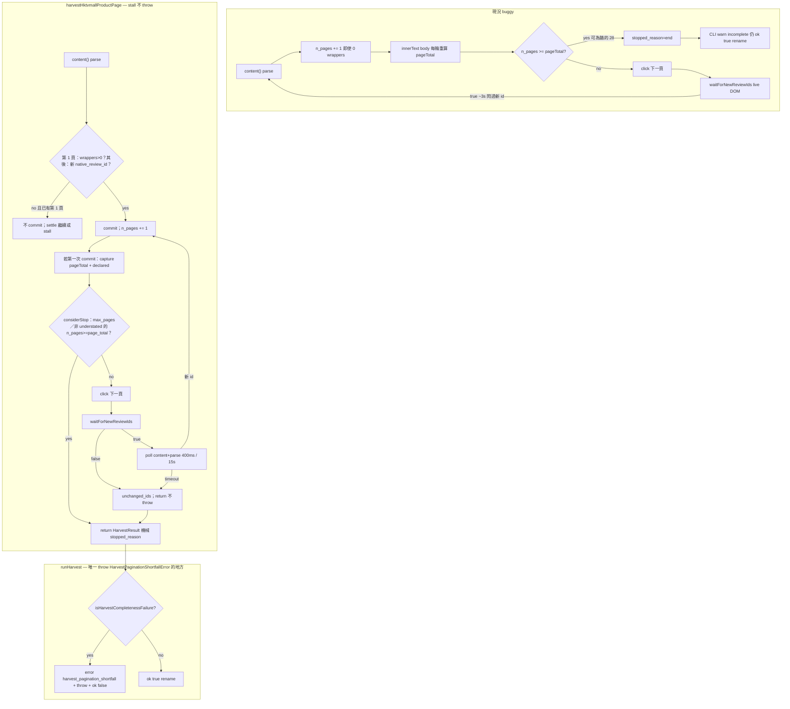
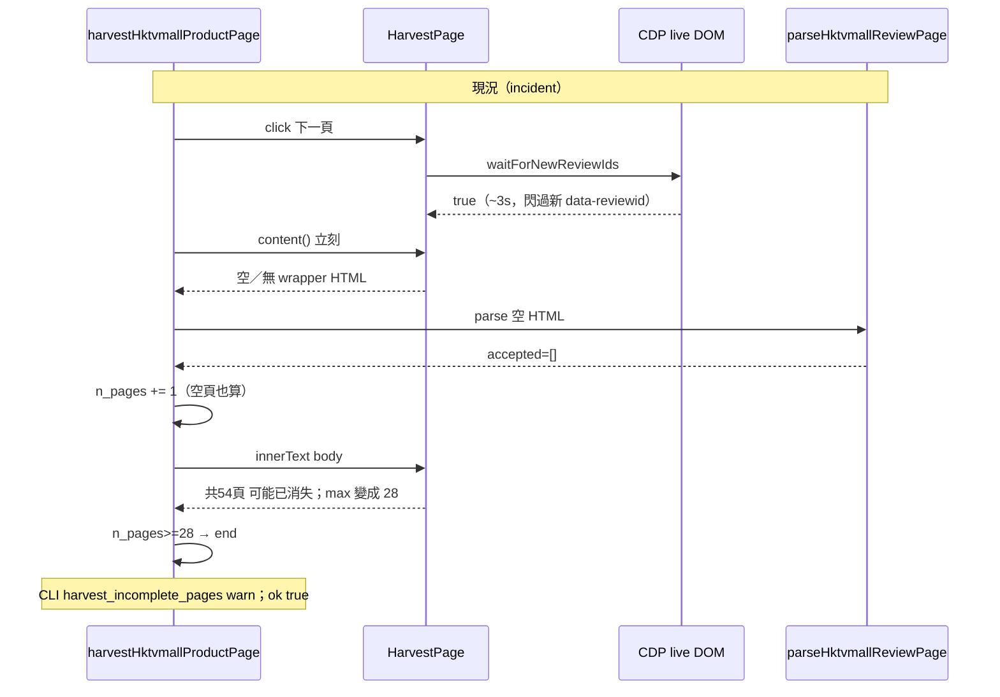
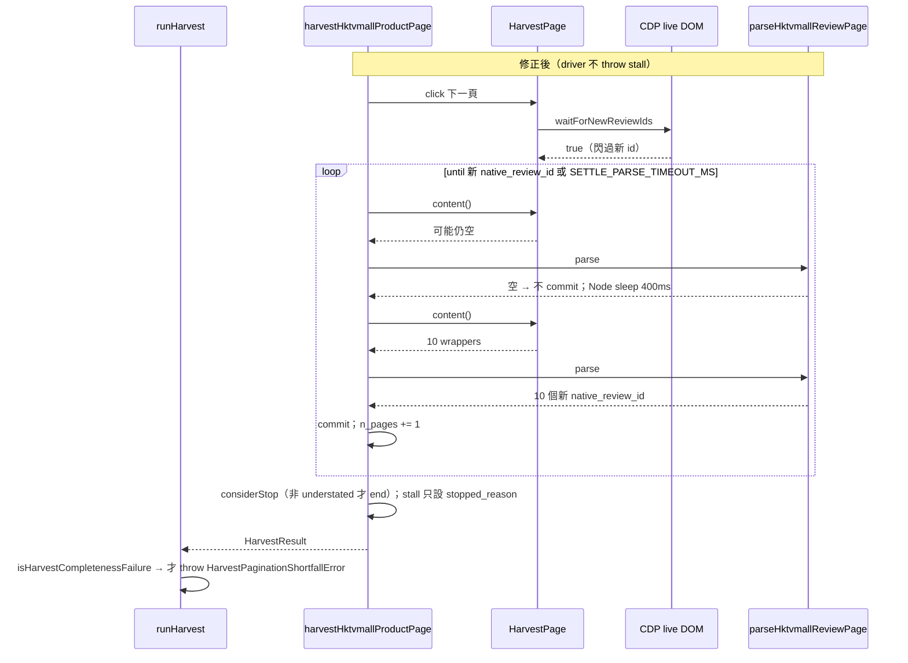

<!-- SPDX-License-Identifier: GPL-3.0-only -->
# Fix Bright Data HKTVmall harvest pagination（empty pages counted as `end`）

| 欄位 | 值 |
| --- | --- |
| Title | Fix Bright Data HKTVmall harvest pagination (empty pages counted as `end`) |
| Document ID | `ecom-shill-fix-harvest-bright-data-hktvmall-v1` |
| Author | TBD（Accepted 前填入；與 parent supplements 相同。Draft 不填假名） |
| Date | 2026-09-09 |
| Status | **Draft** |
| Repo | `/Users/mark/ecom-shill-review-detector` |
| Parent | [`docs/design.md`](design.md)（**Accepted**）。Direct supplement：[`docs/design-bright-data-scrapping-pro-browser-hktvmall.md`](design-bright-data-scrapping-pro-browser-hktvmall.md)。Related：[`docs/design-scrapingbee-hktvmall-reviews.md`](design-scrapingbee-hktvmall-reviews.md)、[`docs/harvest-live-workflow.md`](harvest-live-workflow.md) |
| Filename | `docs/fix-harvest-bright-data-hktvmall.md` |
| Incident date | 2026-09-08/09（CLI Bright Data live harvest；CDP 對照；workaround script 收齊 54 頁） |
| License | GNU GPL-3.0-only（實作時新檔加 `SPDX-License-Identifier: GPL-3.0-only`） |
| Audience | 資深工程師 / coding agent（實作另開指令；**本文件不授權改 `src/`**） |
| Language | 正文繁體中文；identifier、flag、env、路徑、SQL、TypeScript 維持 English |

本文件是 Bright Data harvest 補充的 **amendment**，**不是**重寫整份 harvest 設計。編號 `KD-BD-FIX-*`。若與 [`docs/design.md`](design.md) Accepted 衝突，**以 Accepted 為準**。若與 [`docs/design-bright-data-scrapping-pro-browser-hktvmall.md`](design-bright-data-scrapping-pro-browser-hktvmall.md) 的 KD-BD-12／20／22／25 衝突，以本文件對「commit／settle／false `end`／**CLI `ok`（throw 點在 `runHarvest`，不是 driver）**」的修正為準。KD-BD-25 的 **driver** 半邊（stall 不 throw）不變。其餘 Bright Data 契約不變。THE FOODIES URL 只當 incident 證據；**禁止**寫入 `tests/` 或 `config/marketplaces/`。

---

## Overview

2026-09-08/09 對 THE FOODIES 泡菜公開商品頁跑 `pnpm cli -- harvest --max-pages 80 --i-accept-tos`（Bright Data Browser API）時，CLI 在 **~49s** 結束並宣稱完成：

```text
n_pages=28 n_wrappers=10 n_accepted=10 n_declared_reviews=536
stopped_reason=end
event=harvest_incomplete_pages (warn)
harvest_finished ok=true   ← 仍 rename --out
```

同一 URL 的獨立探針與 raw Playwright CDP 證明評論 pager 是 **536 則／54 頁**，「下一頁」**可以**翻到新的 10 個 `data-reviewid`。稍後的 workaround script（**不是** CLI）用 `page.content()` + `parseHktvmallReviewPage` 輪詢直到出現新 `native_review_id`，收齊 **54 頁、538 accepted**。先前成功的 CLI harvest（例如 `H0888001_S_10136033`，361 則／39 頁）也證明這不是「Bright Data 永遠不能翻頁」。

根因是 `harvestHktvmallProductPage`（`src/crawler/harvest/hktvmall-driver.ts`）把 **transitional／空 HTML 當成一頁**、每輪重算 `pageTotal`、以及 `waitForNewReviewIds` 看到 live DOM 閃過新 id 後立刻 `content()`。KD-BD-20／22 只硬失敗「第 1 頁 0 wrapper」或「0 accepted」；假 `end`（10 vs 536）只打 `harvest_incomplete_pages` warn，然後 `ok: true` rename。

本補充凍結修正：

1. **Commit rule**（對齊 ScrapingBee KD-SB-28）：第 1 頁之後，沒有新的 `native_review_id` 就不是一頁。
2. **Settle**：`waitForNewReviewIds === true` 之後輪詢 `content()`+parse，直到解析出新 id 或 timeout。
3. **`pageTotal`／`n_declared_reviews`**：只從 **第一次成功 commit 的 hydrated HTML** 用既有 `parseHktvmallReviewPageTotal`／`parseHktvmallDeclaredReviewCount` 擷取一次。
4. **False complete**：`HarvestPaginationShortfallError` **只**由 `runHarvest` throw，driver 對 stall **不 throw**（KD-BD-25 driver 半邊）。CLI `expected = max(page_total, ceil(declared/10))`（兩者皆可用時）。Driver **不得**在 `page_total < ceil(declared/10)` 時 `end`。走完 expected 頁後 538 vs 536 **不**失敗；`page_total=1` + declared=536 不得 `ok: true`。
5. **不改** `parseHktvmallReviewPage`、**不加** `HarvestPage.evaluate`、**不改** ScrapingBee 分頁迴圈、**不發明** `FixtureReviewRaw` 欄位、**不文件化**私有 XHR。CLI completeness gate **兩運輸共用**（OQ4 已關：ScrapingBee 係收費／live 罕用嘅第2選擇，**測試**會用；gate 唔睇 `transport`）。

單元測試目前 mock「click → HTML 瞬間換成下一頁」（`tests/unit/harvest-hktvmall-driver.test.ts`），抓不到這場 race。本文件指定要加的 mock 時序。

---

## Background & Motivation

### 現況（repo，2026-09-09）

Bright Data harvest **已在 CLI 落地**。相關模組與本 bug 的關係：

| 模組 | 現況 | 本修正是否改契約 |
| --- | --- | --- |
| `src/crawler/harvest/hktvmall-driver.ts` `harvestHktvmallProductPage` | 每輪 `content()` → `parseHktvmallReviewPage` → **無條件** `n_pages += 1`；`pageTotal = maxPageTotalFromText(body innerText)` **每輪重算**；click 下一頁 → `waitForNewReviewIds(prevIds, 15_000)` true 就立刻下一圈 | **是**（行為修正的主戰場） |
| `src/crawler/browser/brightdata-cdp.ts` `WAIT_NEW_REVIEW_IDS` | string page function：`querySelectorAll('div.product-review-wrapper[data-reviewid]')`，**第一個**不在 `prev` 的 id 就 true | **否**（live DOM 訊號仍有用；driver 必須在 true 之後 settle parse） |
| `src/crawler/harvest/harvest-page.ts` | `HarvestPage` **沒有** `evaluate`／`waitForTimeout`；`HarvestStoppedReason` = `end \| max_pages \| max_reviews \| unchanged_ids \| next_disabled` | **additive**：`HarvestResult.page_total`。v1 **不**加 `evaluate` |
| `src/crawler/harvest/hktvmall-pager-html.ts` | `parseHktvmallReviewPageTotal`／`parseHktvmallDeclaredReviewCount`（ScrapingBee 已用；`span.total` 取 **max**） | **不改語意**。Bright Data driver 改為呼叫它們。須打破與 `hktvmall-driver.ts` 的 import cycle（見 KD-BD-FIX-11） |
| `src/crawler/harvest/scrapingbee-driver.ts` | 已 commit-only-on-new-ids；`pageTotal` 來自 page 0 HTML；stall 不 `n_pages += 1`（KD-SB-28） | **迴圈不改**。只補 `HarvestResult.page_total` 欄位 |
| `src/crawler/harvest/hktvmall.ts` `parseHktvmallReviewPage` | Driver **只**能呼叫此 export（KD-BD-13） | **否** |
| `src/cli/commands/harvest.ts` `runHarvest` | `unchanged_ids` 或 `n_accepted < n_declared_reviews` → warn `harvest_incomplete_pages`；**仍** `rename` + manifest `ok: true`。`--strict` 只看 wrapper reject | **PR2**：completeness failure → KD-BD-22 fail path |
| `tests/unit/harvest-hktvmall-driver.test.ts` | click 當下把 `pageIndex` +1；`content()` 立刻下一頁 HTML | **必須擴充** race／empty／Q&A `共1頁`／false-complete predicate |
| `DEFAULT_MAX_PAGES = 20` | 成本牆。即使 paginator 完美，workflow 預設 `--max-pages 20` 也只能收 ~200／536 | **不默默提高**。操作者規則寫進 workflow（KD-BD-FIX-07） |

`WAIT_NEW_REVIEW_IDS_MS = 15_000`。Incident 牆鐘 ~49s／28「頁」≈ **1.5s／頁**（含 goto／click 之後），**遠低於 15s**，所以 waits **不是** timeout；是 wait **很快 true** 之後 snapshot 是空的。

### 事故（THE FOODIES kimchi）

公開商品 URL（本文件只當 incident／probe 例；**禁止**寫入 `tests/` 或 `config/marketplaces/`）：

`https://www.hktvmall.com/hktv/zh/main/THE-FOODIES/s/H1111001/cat/p/H0888001_S_10143791`

`store_id=H1111001`，`product_id=H0888001_S_10143791`。

| 來源 | 結果 |
| --- | --- |
| ScrapingBee MCP probe（**不 ingest**） | 商品「宗家府切件泡菜 1.5kg」；**536 則評論、54 頁**。DOM：`span.comment__count`、`span.total` `/共54頁`；評論 pager 是 `<select>` 54 options + `a.next-btn`「上一頁」「下一頁」。第二個 `<select>` 8 options（**不是**評論）。`getByRole('link', { name: '下一頁' })` count=1 |
| CLI Bright Data `pnpm cli -- harvest --max-pages 80 --i-accept-tos` | `n_pages=28 n_wrappers=10 n_accepted=10 n_declared_reviews=536`；`stopped_reason=end`；`latency_ms_total=49447`；warn `harvest_incomplete_pages`；**`harvest_finished ok=true` 仍 rename `--out`** |
| Raw Playwright CDP（同一 locator） | 點評論 tab 後 10 wrappers；`body` 匹配 `["54","8"]`；`span.total` `/共54頁`。Click 下一頁：`waitForFunction` ~**3085ms**、**10 NEW ids**、隨後 `page.content()` wrapper count 10。`select.value='1'` 落到同一組 page-2 ids。結論：**下一頁有效**；CLI snapshot **時機**錯 |
| Workaround `/tmp/harvest-H0888001_S_10143791.ts`（**不是** CLI） | 每 400ms `page.content()` + `parseHktvmallReviewPage`，deadline 15s；`pageTotal` 來自第一次 hydrated HTML 的 `parseHktvmallReviewPageTotal`。**54 頁、538 accepted、0 rejected、0 deduped**；末頁 8 wrappers；`stopped_reason=end`。`crawl --dry-run` 538／538。其後 load BQ **538 inserted** |
| 同日 ScrapingBee CLI | HTTP 401 body `Monthly API calls limit reached: 1000`；client 把所有 401 map 成「rejected the API key」。**預設 out of scope**（見 Non-Goals） |
| 對照：先前成功 CLI Bright Data | 例如 `H0888001_S_10136033` 361 則／39 頁。Bug 是 **race**，不是運輸層全壞 |

Comment-count lag：declared 536 vs accepted 538。既有政策：`n_declared_reviews > n_accepted` 才 warn；**多收**不失敗。本修正必須讓 538 vs 536 在走完 54 頁後仍然 `ok: true`。

**忽略當 CLI 證據的 chat 噪音**：類似「已到第 28 頁、280 則」是 workaround script 的進度，**不是** `pnpm cli -- harvest`。CLI 證據是上面那行 `n_pages=28 n_wrappers=10 n_accepted=10`。

### 根因（凍結；實作必須對這四點下手）

`src/crawler/harvest/hktvmall-driver.ts` `harvestHktvmallProductPage` 現迴圈（簡化）：

```typescript
for (;;) {
  const html = await page.content();
  const parsedPage = parseHktvmallReviewPage(html, ctx);
  n_wrappers += parsedPage.accepted.length + parsedPage.rejected.length;
  // merge accepted into Map
  n_pages += 1; // ← 即使 0 wrappers 也加（違反 KD-BD-12：n_pages = 成功 parse 的頁）

  // max_reviews / max_pages …

  const bodyText = await page.innerText('body');
  if (n_declared_reviews === null) {
    n_declared_reviews = /* 第一個 /(\d+)\s*則評論/ */;
  }
  const pageTotal = maxPageTotalFromText(bodyText); // ← 每輪重算
  if (pageTotal !== null && n_pages >= pageTotal) {
    stopped_reason = 'end';
    break;
  }

  const next = await locateNextPage(page);
  // null / disabled → next_disabled
  await next.click({ force: true });
  const gotNew = await page.waitForNewReviewIds(prevIds, WAIT_NEW_REVIEW_IDS_MS);
  if (!gotNew) {
    stopped_reason = 'unchanged_ids';
    break;
  }
  // 立刻下一圈 content()  ← race
}
```

四個耦合缺陷：

1. **空 HTML 也 `n_pages += 1`**。Incident：`n_pages=28` 但 `n_wrappers` 停在 10。違反 KD-BD-12／KD-SB-28（`n_pages` = 已 commit 的成功 parse 頁）。
2. **每輪從 `body` innerText 重算 `pageTotal`**。Transitional DOM 裡評論 `/共54頁` 可以消失；殘留的 `共N頁`（Q&A `共1頁`、或其他匹配）的 **max 會錯**。Incident 在 `n_pages=28` 時走 `stopped_reason=end`，代表當輪 `maxPageTotalFromText` 回了 ≤28。不必在單測重現「為什麼是 28」這個 DOM 細節；凍結「只從第一次 hydrated HTML 取 pageTotal」即可根治。Q&A `共1頁` 若在空 snapshot 變成 max，還會更早 `end`（Bright Data 補充 rev 5 已警告 first-match，但 **每輪重算** 仍讓 max 不穩定）。
3. **`waitForNewReviewIds` 與 `content()` 不同步**。CDP 實作（`WAIT_NEW_REVIEW_IDS`）看的是 **live** `querySelectorAll`。HKTVmall 翻頁中間 DOM 會閃過新 `data-reviewid`（CDP 對照 ~3s 就 true），driver 立刻 `page.content()` 序列化到的卻是 **零個可 parse wrapper**。Wait **沒有**撞 15s timeout（與 1.5s／頁吻合）。
4. **CLI 把假 `end` 當成成功**。KD-BD-20 只硬失敗第 1 頁 0 wrapper／0 accepted。KD-BD-25 stall（`unchanged_ids`／`next_disabled`）是 warn-only、driver 不 throw。`n_accepted=10` vs `n_declared_reviews=536` 只打 `harvest_incomplete_pages`，然後 KD-BD-22 的「全部 URL 沒 throw」路徑 `ok: true` rename。操作者／後續 `crawl --adapter fixture` 會把 10 則當完整母體。

`HarvestPage` 沒有 `evaluate`（KD-BD-19：driver 不得出現 `document`／Playwright 型別）。Settle 迴圈 **只**能用既有方法：`content`、`waitForNewReviewIds`、`waitForSelector`、`innerText`。Workaround 已證明 **輪詢 `content()`+parse 足夠**；v1 **不要**加 `evaluate`。

單元測試的 mock 在 `next.click` 裡同步切 HTML，**沒有**「wait true + 隨後幾個空 `content()`」的時序，所以綠燈與 live 事故並存。

---

## Goals & Non-Goals

### Goals

- 修正 Bright Data `harvestHktvmallProductPage` 的 pagination race：空 snapshot 不入 `n_pages`；`waitForNewReviewIds === true` 之後 settle 到 **parse 得出新 id**；`pageTotal`／declared 只從第一次 hydrated commit HTML 取。
- 同一事故形狀（10 vs 536、`end` 或提早 stall）在 CLI **不得** `ok: true` rename；走 KD-BD-22 fail path（保留 `.partial`、sidecar `ok: false`）。
- 走完 captured `pageTotal` 之後，declared 與 accepted 差 1～數則（538 vs 536）**仍成功**。
- 擴充零 Bright Data、零 Playwright 的 `tests/unit/harvest-hktvmall-driver.test.ts`（以及 CLI mock）覆蓋 race。
- 更新 `docs/harvest-live-workflow.md` 與 Bright Data 補充的短 pointer。操作者：`--max-pages` ≥ `ceil(n_declared/10)`；預設 20 是成本牆。
- Live 測試閘維持 KD-BD-18。CI 維持 KD-04 零 live HTTP。

### Non-Goals

- **不實作本文件所述程式碼**（另開指令）。不改 `src/`。
- 不取代 [`docs/design.md`](design.md)。不重寫 Bright Data／ScrapingBee 整份補充。不改 Bright Data 補充檔名。
- 不改 `parseHktvmallReviewPage`／`hktvmall.ts` 契約。不 import parser private helper。
- 不把 `evaluate`／`waitForFunction`／`document` 加進 `HarvestPage` 或 `hktvmall-driver.ts`。
- 不改 ScrapingBee driver 的 commit／stall 迴圈（已符合 KD-SB-28）。不把 Bright Data 改成走 pager `<select>`（那是 Alternative A，v1 拒絕）。不以 ScrapingBee **live** harvest 當本修正 rollout 前提（OQ4：第2選擇 = 收費故 live 罕用；覆蓋靠注入單測）。
- 不發明 `FixtureReviewRaw` 欄位、不改 BQ DDL、不改 HMAC／`review_id`。
- 不文件化、不攔截 HKTVmall 私有 review XHR。
- 不把真實商店 URL 寫進 `tests/` 或 `config/marketplaces/`。
- 不 overload `--strict`（那是 wrapper reject，KD-BD-23）。
- **不提高** `DEFAULT_MAX_PAGES`（維持 20；OQ1 已關閉）。
- ScrapingBee HTTP 401「quota 用盡被說成 API key rejected」：**out of scope**（OQ7 已關閉：不做）。
- 不把 workaround script 收進 `src/`。不把 MCP 當 production ingest。
- **不加** `HarvestPage.waitForTimeout`（OQ5：Node `setTimeout`）。
- **不加** `harvest --merge` 子命令、**不加** `--start-page`／resume-page（OQ8：分段之後可以 JSONL merge；每次仍從頁 1 起）。

---

## Key Decisions

編號 `KD-BD-FIX-*` 避免與 Accepted `KD-*`、Bright Data `KD-BD-*`、ScrapingBee `KD-SB-*` 碰撞。本表修正 KD-BD-12（`n_pages` 語意）、KD-BD-25 在 **CLI 原子性**上的後果（driver 對 stall 仍不 throw），以及 KD-BD-22 對假 `end` 的適用。

| ID | 決策 | 選擇 | 理由 |
| --- | --- | --- | --- |
| KD-BD-FIX-01 | Commit rule | 第 1 頁：parse 出 ≥1 wrapper 才 commit（0 wrapper → 既有 `UnhydratedReviewPageError`，KD-BD-20）。其後：**只有** `parseHktvmallReviewPage(content())` 的 `accepted` 裡出現 **至少一個** 不在 `Map` 的非空 `native_review_id` 才 `n_pages += 1` 並 merge wrappers／rejected。空 HTML、同一批 id、零新 id **不是一頁**；不累進 `n_wrappers`。 | Incident `n_pages=28`／`n_wrappers=10`。對齊 KD-SB-28。KD-BD-12 原文「每成功 parse 後 += 1」在空 parse 被實作成無條件 += 1；本 KD 把「成功」定義成「有新 native id」。 |
| KD-BD-FIX-02 | Settle after `waitForNewReviewIds` | Click 下一頁後仍先 `waitForNewReviewIds(prevIds, WAIT_NEW_REVIEW_IDS_MS)`。`false` → `unchanged_ids`，**不要** settle、**不要**再 click。`true` → 輪詢 `content()`+`parseHktvmallReviewPage` 直到新 id 或 `SETTLE_PARSE_TIMEOUT_MS`（預設 = `WAIT_NEW_REVIEW_IDS_MS` = 15000）。兩次 poll 之間用 **Node** `setTimeout` `SETTLE_PARSE_POLL_MS = 400`（workaround 已驗證）。Timeout 仍無新 parse id → `unchanged_ids`，停、**driver 不 throw**、不對未 commit 的空 snapshot 再 click。Settle `content()` **不加 try/catch**。只有 `HarvestSessionDroppedError` 特殊處理（向上傳，永不 `unchanged_ids`）。空 parse = 繼續 poll。其它 throw（含 `content()` 的 Playwright `TimeoutError`）向上傳。 | Wait 看 live DOM；`content()` 可以仍是空殼。CDP `content()` rethrow timeout、其餘 wrap session-drop。加長 wait 不夠（Alternative B）。 |
| KD-BD-FIX-03 | `pageTotal`／declared 來源 | **只**在第一次成功 commit 的 HTML 上呼叫既有 `parseHktvmallReviewPageTotal`（`span.total` 內 `/共N頁/` 取 **max**，fallback stripped text 的 max）。**禁止**每輪 `innerText('body')` 重算。`n_declared_reviews` **改**用 `parseHktvmallDeclaredReviewCount`（優先 `span.comment__count`，fallback HTML 字串上的 `HKTVMALL_DECLARED_REVIEWS_RE`），**不要**再用 full body innerText 的第一個 `則評論`。之後迴圈 **只讀**這兩個 captured 值（含 underestimated 的 `page_total=1` 也凍結，不從後頁覆寫）。`page_total === 0` 視為不可用。忽略 JSON-LD `numberOfReviews`。**Driver `end`：**僅當 `page_total >= 1 && n_pages >= page_total && !isUnderstatedPageTotal(...)`。`isUnderstatedPageTotal` = `page_total >= 1` 且 `ceil(declared/10)` 存在且 `page_total < ceil(declared/10)`。Understated 時 **不要** `end`，繼續 `locateNextPage`。 | Incident 假 `end` 來自 unhydrated innerText。只抓第一次仍可能拿到 Q&A-only `共1頁`（review `/共54頁` 尚未入 snapshot）。若此時 `end` 且 CLI 信任 `page_total`，會重現 10 則 `ok: true`。Declared 當安全網。`page_total=null` **亦不**從後頁回填（OQ3 已關閉）。 |
| KD-BD-FIX-04 | False complete／CLI `ok` | **保持**機械 `stopped_reason`。**Throw 點 = `runHarvest`，不是 driver。** Export `declaredReviewPageFloor`、`isUnderstatedPageTotal`、`expectedHktvmallReviewPageCount`、`isHarvestCompletenessFailure`。兩者皆可用時 `expected = max(page_total, ceil(declared/10))`。命中 → log **error** `harvest_pagination_shortfall`（不要再 warn `harvest_incomplete_pages`）→ throw `HarvestPaginationShortfallError` → KD-BD-22 不 rename。Driver 對 stall **仍不 throw**（amend KD-BD-25 的 **CLI** 半邊；driver 半邊不變）。`max_pages`／`max_reviews` **不是** shortfall。Stall + `n_pages >= expected` → 仍 warn-only `ok: true`。走完 expected 頁後 accepted 與 declared 差數則 → warn-only。矩陣見下。 | 10 vs 536 **不可接受**。Predicate 用頁數，538 vs 536 不失敗。Post-fix Bright Data 事故形狀是 `unchanged_ids`+`n_pages=1`，必須納入 CLI gate。 |
| KD-BD-FIX-05 | Parser／HarvestPage／運輸 | **不改** `parseHktvmallReviewPage`。v1 **不加** `HarvestPage.evaluate` 或 `waitForTimeout`。Settle 只用 `content` + Node timer。不發明 `FixtureReviewRaw` 欄位。不把私有 XHR 寫進本文件。ScrapingBee **分頁迴圈不改**；只填 `page_total`。CLI completeness gate **兩運輸共用同一 predicate**（含 `end`／`unchanged_ids`／`next_disabled` 與 declared fallback）；`runHarvest` **不**看 `transport`。這是 CLI 政策，不是 driver 迴圈變更。OQ4 **關閉**。 | Workaround 已證明 parse 輪詢。KD-BD-13／14／19。操作者：ScrapingBee 收費，live 唔會經常使用，故係第2選擇；**測試會用**（注入 `scrapingBeeGet`，零 live HTTP）。唔為第2選擇開 `transport === 'brightdata'` 例外——假完整 JSONL 無論邊條運輸都唔得 `ok: true`。1／3 頁 stall 本來就不該當完整母體。ScrapingBee `pageCount=1` 當缺 `共N頁` 仍可能 `end`+`n_pages=1`；若同時有 declared=25，PR2 後為 shortfall（見例子列）。 |
| KD-BD-FIX-06 | Tests | 擴充 `tests/unit/harvest-hktvmall-driver.test.ts`（零 Bright Data、零 Playwright）。必備含 1b remainder、1c page-1 空 `content()`、3b understated、settle `content()` session-drop。CLI 案例 7 用 `waitForNewReviewIds=false`。ScrapingBee CLI stall **必做**（注入，零 live 收費；OQ4：第2選擇用喺測試）。Live gate **不變**（KD-BD-18／KD-SB-16）。`parse` 呼叫次數 `>= n_pages`。 | 現有 mock 無法再現 race。 |
| KD-BD-FIX-07 | Docs／`--max-pages` | 更新 [`docs/harvest-live-workflow.md`](harvest-live-workflow.md) + Bright Data 補充文首／**KD-BD-12 與 KD-BD-25** 旁短 pointer（**不**改該檔名）。KD-BD-25 必須註明：driver 對 stall 仍不 throw；CLI completeness 可對該 URL 走 KD-BD-22 fail path。`DEFAULT_MAX_PAGES` **維持 20**。操作者規則：`--max-pages` ≥ `ceil(n_declared/10)`。Workflow 寫 sidecar `stopped_reason`／`page_total`，以及 OQ8：JSONL 可以 merge，但每次仍從頁 1 起。 | 成本牆 vs 完整性。PR3 漏標 KD-BD-25 會讓 parent 仍讀成「CLI 不當 hard-fail」。 |
| KD-BD-FIX-08 | `--strict` | **不要** overload。`--strict` 仍只表示任一 wrapper reject → exit 1（空產物無論如何失敗）。Pagination completeness 走 `HarvestPaginationShortfallError`，與 `--strict` 無關。 | KD-BD-23：help 已寫 wrapper reject。 |
| KD-BD-FIX-09 | `HarvestResult.page_total` | Additive 欄位 `page_total: number \| null`。Bright Data：第一次 commit 的 `parseHktvmallReviewPageTotal` 結果（可 0／null）。ScrapingBee：回傳既有 local `pageTotal`（**不**改 stop 順序）。`n_pages` 註解維持「pages successfully **committed**」。 | CLI predicate 與單測需要；避免 CLI 重解析 HTML。不是 `FixtureReviewRaw` 欄位。 |
| KD-BD-FIX-10 | Driver opts（測試用） | `HarvestDriverOpts` 可選 `settleParseTimeoutMs`／`settleParsePollMs`。**v1 不暴露成 CLI flag**。`RunHarvestOptions` 加 **test-only** `driverOpts?: Pick<HarvestDriverOpts, 'settleParseTimeoutMs' \| 'settleParsePollMs'>`，`runHarvest` merge 進 Bright Data `driverOpts`。PR2 必做案例 7 **改寫**為 `waitForNewReviewIds=false`（同一 CLI 輸入：`unchanged_ids`、`n_pages=1`、`page_total=54`），**禁止** 15s 單元測試。Settle-timeout 形狀只在 PR1 driver 檔用短 timeout 測。Settle 用 **Node** `setTimeout`（OQ5 已關閉）；**不加** `HarvestPage.waitForTimeout`。現有 harvest unit **不**開 vitest fake timers。若有人開，`Date.now()` settle 與 `setTimeout` 會打架——那時再注入 `HarvestDriverOpts.sleep`，v1 不做。 | `runHarvest` 現在組 `HarvestDriverOpts` 不含 settle 覆寫。 |
| KD-BD-FIX-11 | Pager HTML import cycle | `hktvmall-pager-html.ts` 目前從 `hktvmall-driver.ts` import `HKTVMALL_PAGE_TOTAL_RE`／`HKTVMALL_DECLARED_REVIEWS_RE`／`maxPageTotalFromText`。Driver 若 import pager-html 會 cycle。PR1 **把這三個符號搬到** `hktvmall-pager-html.ts`；`hktvmall-driver.ts` **re-export** 以保持現有 test import。語意不變。 | 讓 Bright Data 能呼叫與 ScrapingBee 同一組 parser。 |
| KD-BD-FIX-12 | Sidecar `stopped_reason`／`page_total` | `HarvestManifest` **加**兩個必填鍵（可 null）：`stopped_reason: HarvestStoppedReason \| null`、`page_total: number \| null`。寫入規則：completeness shortfall（已有 `HarvestResult`）→ 該失敗 URL 的值；fail 在 result 之前（CDP drop／unhydrated）→ 兩者 `null`；success 且 `targets.length === 1` → 該 URL；success 且 N>1 → 兩者 `null`（sidecar 仍係 run-level，v1 **不加** per-URL array）。`HarvestPaginationShortfallError` 同步帶 `stopped_reason`。 | 操作者（OQ6）要喺 sidecar 睇到，唔只 error log。N>1 無單一 pager。 |

### False-complete predicate（凍結）

```typescript
export const HKTVMALL_REVIEWS_PER_PAGE = 10;

export function declaredReviewPageFloor(
  nDeclaredReviews: number | null,
): number | null {
  if (nDeclaredReviews !== null && nDeclaredReviews >= 1) {
    return Math.ceil(nDeclaredReviews / HKTVMALL_REVIEWS_PER_PAGE);
  }
  return null;
}

/** Captured pager smaller than declared implies. Driver must not `end` on this. */
export function isUnderstatedPageTotal(
  pageTotal: number | null,
  nDeclaredReviews: number | null,
): boolean {
  const floor = declaredReviewPageFloor(nDeclaredReviews);
  return pageTotal !== null && pageTotal >= 1 && floor !== null && pageTotal < floor;
}

export function expectedHktvmallReviewPageCount(
  pageTotal: number | null,
  nDeclaredReviews: number | null,
): number | null {
  const fromPager = pageTotal !== null && pageTotal >= 1 ? pageTotal : null;
  const fromDeclared = declaredReviewPageFloor(nDeclaredReviews);
  if (fromPager !== null && fromDeclared !== null) {
    return Math.max(fromPager, fromDeclared);
  }
  return fromPager ?? fromDeclared;
}

export function isHarvestCompletenessFailure(result: HarvestResult): boolean {
  if (result.stopped_reason === 'max_pages' || result.stopped_reason === 'max_reviews') {
    return false;
  }
  const expected = expectedHktvmallReviewPageCount(result.page_total, result.n_declared_reviews);
  if (expected === null) {
    return false;
  }
  if (result.n_pages >= expected) {
    return false;
  }
  return (
    result.stopped_reason === 'end' ||
    result.stopped_reason === 'unchanged_ids' ||
    result.stopped_reason === 'next_disabled'
  );
}
```

`stopped_reason === 'end' && n_pages < expected` 在 **post-PR1 Bright Data** 幾乎不會由 driver 產出（`end` 只在 `n_pages >= page_total` 且非 understated）。保留此臂是 defense-in-depth，以及 ScrapingBee 缺 `共N頁` 卻有 declared 時的 `end`+`n_pages=1`。Incident 列 `{end, n_pages:28, page_total:54}` 標成 **pre-fix／synthetic**；post-fix Bright Data 主列是 `unchanged_ids`+`n_pages=1`。

#### Stall vs shortfall 矩陣（driver 不 throw；CLI 決定 `ok`）

| Driver `stopped_reason` | `n_pages` vs `expected` | Driver throw? | CLI |
| --- | --- | --- | --- |
| `unchanged_ids` 或 `next_disabled` | `n_pages >= expected` | **否** | KD-BD-25 保留：warn `harvest_incomplete_pages`（若 `unchanged_ids` 或 `accepted < declared`）；**`ok: true`** |
| `unchanged_ids` 或 `next_disabled` | `n_pages < expected` | **否** | error `harvest_pagination_shortfall` + `HarvestPaginationShortfallError`；`ok: false` |
| `end` | `n_pages >= expected` | **否** | `ok: true`；僅當 `accepted < declared` 才 warn incomplete |
| `end` | `n_pages < expected` | **否** | CLI throw（Bright Data：**pre-fix／synthetic**；ScrapingBee：缺 pager 但有 declared 的 `N=1` `end`） |
| `max_pages` 或 `max_reviews` | 任意 | **否** | **永不** shortfall；`max_pages` 打 `harvest_max_pages` warn |
| `next_disabled`，`page_total=1`，`n_pages=1`，declared 使 `ceil<=1` 或 null | `>=` | **否** | **不是** shortfall |

`HarvestPaginationShortfallError` **只**在 `runHarvest` throw。`harvestHktvmallProductPage` 對 stall 只設 `stopped_reason` 並 return。

#### 例子列（含 understated `page_total` 與 ScrapingBee）

| 例子 | 標籤 | Driver `end`? | CLI `expected` | `isHarvestCompletenessFailure` |
| --- | --- | --- | --- | --- |
| **Pre-fix／synthetic**：`end`，`n_pages=28`，`page_total=54`，accepted=10，declared=536 | 舊 driver 形狀；post-PR1 Bright Data 不會這樣 return | n/a | 54 | **true**（28 < 54）；保留當 regression 單測 |
| **Post-fix Bright Data 事故主列**：`unchanged_ids`，`n_pages=1`，`page_total=54`，declared=536 | settle timeout 或 wait false | 否 | 54 | **true**（1 < 54） |
| Workaround 成功：`end`，`n_pages=54`，`page_total=54`，accepted=538，declared=536 | 走完 pager | 在 54（54 ≮ `ceil(536/10)=54`） | `max(54,54)=54` | **false**（538 vs 536 不看 accepted） |
| 走完 54 頁、accepted=530、declared=536 | comment-count lag | 在 54 | 54 | **false**；warn incomplete |
| `--max-pages 20`、`max_pages`、`n_pages=20`、`page_total=54` | 操作者上限 | n/a | — | **false** |
| 單頁、無 `共N頁`、無 declared、`next_disabled`、`n_pages=1` | 現有 CLI `onePageHtml` | 否 | `null` | **false** |
| `page_total=null`、declared=536、`unchanged_ids`、`n_pages=1` | 缺 span.total | 否（Bright Data 不以 null 當 N=1 `end`） | 54 | **true** |
| **Understated pager**：第一次 commit 只有 Q&A `/共1頁/`，declared=536，`page_total=1` | 凍結規則 | **否**（1 < 54）；繼續 locate 下一頁 | `max(1,54)=54` | 若隨後 stall 且 `n_pages=1` → **true**（不得 `ok: true` 10 則） |
| `page_total=54`、declared=600（overstated chrome） | 文件化 false-positive | **否** `end` 於 54（54 < `ceil(600/10)=60`）；繼續找下一頁；v1 無法 `end`（understated 一直為 true） | `max(54,60)=60` | 走完後 `next_disabled`／`unchanged_ids` 且 `n_pages=54<60` → **true**。接受此 FP，好過 10 則 `ok: true`。**不要**用 accepted 與 declared 的絕對差修好 |
| `{ next_disabled, n_pages:54, page_total:54, n_declared_reviews:541 }` | **實際 FP 門檻**（`ceil(541/10)=55`；54 頁商品最小 overstated declared） | 否 `end`（54 < 55） | `max(54,55)=55` | **true**（54 < 55）。Incident lag 是 declared **偏低**（536 vs 538），故 538 vs 536 走完 54 頁仍綠（`max(54,54)=54`）。**不要**用 accepted 與 declared 的絕對差修好 |
| 1 頁商品、`page_total=1`、declared=8 或 null、`n_pages=1` | 真單頁 | `end`（非 understated）或 `next_disabled` | 1 或 `ceil(8/10)=1` | **false** |
| **ScrapingBee** 三頁成功：`end`，`n_pages=3`，`page_total=3`，declared=25 | 既有 CLI 綠 | driver 迴圈不改 | 3 | **false** |
| **ScrapingBee** stall：`unchanged_ids`，`n_pages=1`，`page_total=3` | 既有 driver stall | 不改迴圈 | 3 | **true**（PR2 **必做** CLI 測試） |
| **ScrapingBee** 缺 `共N頁`、declared=25、`end`、`n_pages=1` | driver 仍 `pageCount=1` → `end` | 迴圈不改 | `ceil(25/10)=3` | **true**（CLI 政策；不是 driver 變更） |
| **ScrapingBee** 缺 `共N頁`、declared=`null`、`end`、`n_pages=1` | 既有「無 共N頁」driver 單測 | 迴圈不改 | `null` | **false** |

**不要**用 `|n_accepted - n_declared|` 或 ratio 當失敗條件。頁數才是「有沒有把 pager 走完」。

---

## Proposed Design

### 與 Accepted backbone 的關係

HMAC、`review_id`、GCS、BQ、三層漏斗 **全部不改**。本修正只修 Phase A Bright Data driver 的分頁 commit／settle，以及 CLI 對「假完整」JSONL 的原子性。

```text
公開商品頁
  → ecom-shill harvest --transport brightdata   ← 本文件修正 pagination
       goto → click reviewTab → wait wrapper
       commit page 1（新 id）→ capture pageTotal + declared once
       click 下一頁 → waitForNewReviewIds
         true → poll content()+parse until new ids（或 stall）
         false → unchanged_ids
       CLI：isHarvestCompletenessFailure → 不 ok:true rename
  → FixtureReviewRaw JSONL（只在真正走完或操作者 cap 時 ok: true）
  → crawl --adapter fixture → load → …
```

### 高層：現況 vs 修正後的 `n_pages`



### 時序：buggy vs fixed





### 建議模組邊界（本修正）

| 模組 | 本修正職責 |
| --- | --- |
| `src/crawler/harvest/hktvmall-pager-html.ts` | 擁有 `HKTVMALL_PAGE_TOTAL_RE`、`HKTVMALL_DECLARED_REVIEWS_RE`、`maxPageTotalFromText`、`parseHktvmallReviewPageTotal`、`parseHktvmallDeclaredReviewCount` |
| `src/crawler/harvest/hktvmall-driver.ts` | 新迴圈；re-export 上述符號；export `HKTVMALL_REVIEWS_PER_PAGE`、`SETTLE_PARSE_TIMEOUT_MS`、`SETTLE_PARSE_POLL_MS`、`declaredReviewPageFloor`、`isUnderstatedPageTotal`、`expectedHktvmallReviewPageCount`、`isHarvestCompletenessFailure` |
| `src/crawler/harvest/harvest-page.ts` | `HarvestResult.page_total: number \| null` |
| `src/crawler/harvest/scrapingbee-driver.ts` | return 加 `page_total: pageTotal`（local 已存在） |
| `src/crawler/harvest/errors.ts` | `HarvestPaginationShortfallError` |
| `src/cli/commands/harvest.ts` | `harvest_url_done` 之後跑 predicate；throw；error log；sidecar 寫 `stopped_reason`／`page_total`（KD-BD-FIX-12） |
| `src/cli/main.ts` | `--max-pages` help 補 cost cap（PR3 可做） |
| `src/crawler/browser/brightdata-cdp.ts` | **不改** `WAIT_NEW_REVIEW_IDS` |
| `src/crawler/harvest/hktvmall.ts` | **不改** |

### 凍結常數

```typescript
// hktvmall-driver.ts（或隨 FIX-11 搬到 pager-html 後 re-export）
export const DEFAULT_MAX_PAGES = 20; // 不改
export const WAIT_NEW_REVIEW_IDS_MS = 15_000; // 不改；仍傳給 waitForNewReviewIds
export const SETTLE_PARSE_TIMEOUT_MS = 15_000; // 可 = WAIT_NEW_REVIEW_IDS_MS
export const SETTLE_PARSE_POLL_MS = 400; // workaround 間隔
export const HKTVMALL_REVIEWS_PER_PAGE = 10; // probe／incident／KD-BD-12：10／頁
```

Settle budget **獨立於** wait budget：wait 可能在 15s 末才 true，此時 `content()` 仍可能空，**必須**再給 settle 時間（incident：wait ~3s true 但 snapshot 空）。最壞每頁 wait+settle ≈ 30s；54 頁 ≈ 27 min，低於 Browser API **60 min** cap（KD-BD-21）。典型（wait ~3s + 1～3 次 `content()`）遠低於此。

### 迴圈順序（實作必須照這份；給 `harvestHktvmallProductPage`）

Driver **仍然只**呼叫 `parseHktvmallReviewPage(html, ctx)` 做 wrapper 映射。Pager meta **另外**用 pager-html export，不要手寫第二套 regex。

**`stopped_reason` 初始化（凍結；抄現況 `'end'` 會讓 while 永不進 click 迴圈）：**

```typescript
let n_pages = 0;
let stopped_reason: HarvestStoppedReason | null = null; // 對齊 ScrapingBee；禁止 = 'end'
```

`considerStopAfterCommit` 與 stall 路徑寫入具體 reason。`while (stopped_reason === null)` 才 click。離開迴圈後若仍 `null`：**不要**默默 coerce 成 `'end'`（KD-SB-28 禁止覆寫／假裝走完）。那是實作 bug → throw 普通 `Error`（或既有非產品 class），**不是** `HarvestPaginationShortfallError`、也不是 `unchanged_ids`。Return 型別上 `HarvestResult.stopped_reason` 必須是非 null 的 union 成員。

```typescript
function hasNewNativeReviewId(
  parsedPage: { accepted: FixtureReviewRaw[] },
  byId: Map<string, FixtureReviewRaw>,
): boolean {
  return parsedPage.accepted.some((row) => {
    const id = row.native_review_id;
    return id !== null && id.length > 0 && !byId.has(id);
  });
}

function commitPage(
  parsedPage: {
    accepted: FixtureReviewRaw[];
    rejected: { reason: HktvmallWrapperFailureReason }[];
  },
  byId: Map<string, FixtureReviewRaw>,
  rejected: { reason: HktvmallWrapperFailureReason }[],
): { n_wrappers_delta: number } {
  const n_wrappers_delta = parsedPage.accepted.length + parsedPage.rejected.length;
  rejected.push(...parsedPage.rejected);
  for (const row of parsedPage.accepted) {
    const id = row.native_review_id;
    if (id !== null && id.length > 0) {
      byId.set(id, row); // last-write-wins，KD-BD-12
    }
  }
  return { n_wrappers_delta };
}

async function sleepPoll(ms: number): Promise<void> {
  if (ms <= 0) return;
  await new Promise<void>((resolve) => {
    setTimeout(resolve, ms);
  });
}
```

`sleepPoll` 是 Node timer，**不是** Playwright、**不是** `document`，不違反 KD-BD-19。**不要**用 `waitForSelector('__never__')` 當 sleep。

主流程（goto／clickReviewTab／`waitForSelector('div.product-review-wrapper')` 維持現狀，超時仍 `UnhydratedReviewPageError(wrapperTimeoutMs)`）：

1. **Page-1 settle（可與後頁共用 poll helper）**  
   `deadline = Date.now() + settleParseTimeoutMs`。  
   `do { html = await page.content(); parsed = parseHktvmallReviewPage(html, ctx); if (wrappers>0) break; await sleepPoll(pollMs); } while (Date.now() < deadline)`。  
   若仍 0 wrapper → `throw new UnhydratedReviewPageError(wrapperTimeoutMs)`。`wait_ms` **欄位是 budget**（`--wrapper-timeout-ms` 預設 30000），**不是** elapsed wall-clock。成功 `waitForSelector` 之後再 settle 最多 `settleParseTimeoutMs`，牆鐘可到 ~45s，class 仍報 30000。既有測試斷言欄位不斷言 elapsed。**不要**第二個 error class；**不要**改成 `wrapperTimeoutMs + settleParseTimeoutMs`（那會改 `harvest_unhydrated` 契約）。  
   這覆蓋「`waitForSelector` 看到 live wrapper 但第一次 `content()` 仍空」的對稱 race。必做單測：`content()` 序列 `['', page1]`（`pollMs=0`）。

2. **Commit page 1**  
   `commitPage`；`n_pages = 1`；`n_wrappers` 累進。  
   `page_total = parseHktvmallReviewPageTotal(html)`（這份 **commit 用的** HTML，不是稍後的空 snapshot）。  
   `n_declared_reviews = parseHktvmallDeclaredReviewCount(html)`。  
   **之後禁止覆寫**這兩個值（含 `page_total === null`：後續 committed 頁即使出現 `span.total` 也不回填；OQ3 已關閉）。`null` 時 CLI `expected` 走 `ceil(declared/10)`；兩者皆無則 `expected === null`，不是 shortfall。

3. **`considerStopAfterCommit()`**（順序凍結，對齊 KD-SB-28 的 after-commit 優先序；Bright Data **不**抄 ScrapingBee 的 `N=1` 預設）  
   1. `maxReviews !== undefined && byId.size >= maxReviews` → `max_reviews`（return 前 slice，與現況相同）。  
   2. else `n_pages >= maxPages` → `max_pages`。  
   3. else `page_total !== null && page_total >= 1 && n_pages >= page_total && !isUnderstatedPageTotal(page_total, n_declared_reviews)` → `end`。  
   Understated 例：`page_total=1`、declared=536 → **不要** `end`，fall through 去 locate 下一頁。  
   **不要**在 `page_total` 為 null／0 時假裝 `N === 1` 然後 `end`。Bright Data 同一 session 應繼續找「下一頁」。

4. **While `stopped_reason` 仍未設：**  
   1. `next = await locateNextPage(page)`。`null` 或 `isNextDisabled(next)` → `next_disabled`，**break**（locator 契約不變：`getByRole('link'|'button', { name: '下一頁' })` 然後 `getByText('下一頁', { exact: true })`；**禁止** `.pagination a.next`／`/^next$/i`）。  
   2. `prevIds = [...byId.keys()]`。`await next.click({ force: true })`。  
   3. `gotNew = await page.waitForNewReviewIds(prevIds, WAIT_NEW_REVIEW_IDS_MS)`。  
      - throw `HarvestSessionDroppedError` → **向上傳**，不得變 `unchanged_ids`。  
      - `false` → `unchanged_ids`，**break**（不要 settle）。  
   4. **Settle parse：** `deadline = Date.now() + settleParseTimeoutMs`。  
      **凍結：** settle `content()` **不加** `try/catch`。唯一特殊 case 是 `HarvestSessionDroppedError`（adapter 已對非 timeout 的 CDP drop wrap）——**向上傳**，永不 map 成 `unchanged_ids`（KD-BD-25：disconnect ≠ stall）。「還沒好」的訊號只有 **空／無新 native id 的 parse** → 繼續 poll 直到 `SETTLE_PARSE_TIMEOUT_MS`。`content()` 拋出的任何其它錯誤（含罕見 Playwright `TimeoutError`；adapter 對 `content()` **rethrows** timeout，見 `brightdata-cdp.ts`）**向上傳**，變成該 URL 失敗，**不是**再 poll。`waitForNewReviewIds` 把 `TimeoutError` → `false` 是另一個呼叫，已凍結，不要抄到 settle `content()`。  
      ```
      let committed = false
      while (Date.now() < deadline) {
        html = await page.content()
        parsed = parseHktvmallReviewPage(html, ctx)
        if (hasNewNativeReviewId(parsed, byId)) {
          deltas = commitPage(...)
          n_wrappers += deltas
          n_pages += 1
          committed = true
          break
        }
        await sleepPoll(pollMs)
      }
      ```  
      `committed === false` → `unchanged_ids`，**break**。**禁止**對這份空 snapshot 再 click 下一頁。  
   5. `considerStopAfterCommit()`。

5. 離開迴圈後：0 wrappers → `UnhydratedReviewPageError`；`byId.size === 0` → `HarvestEmptyAcceptedError`（KD-BD-20，不變）。

6. Return `HarvestResult`，**加上** `page_total`（captured；可能 null）。`stopped_reason` 保持機械值；**不要**在 driver 裡改寫成另一個 reason，**不要** throw `HarvestPaginationShortfallError`。CLI 用 `isHarvestCompletenessFailure`。

`n_pages` 初始 0，第一次成功 commit 後為 1。上表每一列都必須能從 `stopped_reason = null` 走到，不可靠預設 `'end'`。

| 情境 | `n_pages` | `stopped_reason` |
| --- | --- | --- |
| 1 頁商品、無 `/共N頁/`、next disabled | 1 | `next_disabled` |
| 1 頁商品、`page_total=1`、非 understated（declared null 或 `ceil<=1`） | 1 | **`end`**（`considerStop` 在 click 前） |
| 兩頁、各 10 新 id、其後 disabled、HTML **不要**放 `/共5頁/` | 2 | `next_disabled` |
| wait true、之後 `content()` 空到 timeout | 1（page 1 only） | `unchanged_ids`（driver **不 throw**） |
| wait true、兩次空 `content()`、第三次 10 新 id、其後 disabled | 2 | `next_disabled` |
| 54 頁 captured、`--max-pages 20` | 20 | `max_pages` |
| 54 頁 captured、走完 54（末頁 8 wrappers） | 54 | `end`（在 click 第 55 次 **之前** `considerStop`） |
| 兩頁 HTML、`/共2頁/`、page2 僅 8 新 id、declared `null` 或 `ceil<=2` | 2 | `end`；`next.click` **恰好 1 次**（若帶 `comment__count=536` 則 understated，**不會** `end`） |
| click 後 wait false | 已 commit 的頁數 | `unchanged_ids` |
| `page_total=1`、declared=536（understated） | 繼續翻頁，不是在 page 1 `end` | v1 **不可能** `end`（captured `page_total` 停在 1，understated 一直 true）。收尾只會是進一步 commit 之後的 `next_disabled`／`unchanged_ids`，或 `max_pages` |

末頁 remainder：commit 第 54 頁（8 個新 id）之後 `n_pages >= page_total` 且非 understated → `end`，**不要**再 click。PR1 **必做**單測 1b：`/共2頁/` + page2 8 wrappers、**無**讓 `isUnderstatedPageTotal(2, declared)` 為 true 的 declared chrome → `end`、`n_pages===2`、`next.click` count `===1`。

### `HarvestResult` 形狀（additive）

```typescript
export type HarvestResult = {
  url: string;
  store_id: string;
  product_id: string;
  accepted: FixtureReviewRaw[];
  rejected: { reason: HktvmallWrapperFailureReason }[];
  n_pages: number; // committed pages: page 1 = wrappers>0; later = new native_review_id. not clicks, not empty snapshots
  n_wrappers: number; // 只累進 committed pages
  n_declared_reviews: number | null;
  page_total: number | null; // NEW；第一次 hydrated commit 的 parseHktvmallReviewPageTotal
  latency_ms_goto: number;
  latency_ms_click: number;
  latency_ms_total: number;
  stopped_reason: HarvestStoppedReason; // union 不新增成員
};
```

`HarvestStoppedReason` **不**加 `declared_shortfall`（KD-BD-FIX-04）。機械 reason 留給觀測；CLI 政策用 predicate。

### CLI（`runHarvest`）在 `harvest_url_done` 之後

現況（`src/cli/commands/harvest.ts`）：

```typescript
if (harvested.result.stopped_reason === 'max_pages') {
  logger.warn({ event: 'harvest_max_pages', /* n_pages, max_pages, store_id, product_id */ });
}
const incomplete =
  harvested.result.stopped_reason === 'unchanged_ids' ||
  (harvested.result.n_declared_reviews !== null &&
    harvested.result.accepted.length < harvested.result.n_declared_reviews);
if (incomplete) {
  logger.warn({ event: 'harvest_incomplete_pages', /* … */ });
}
```

然後寫 `.partial`，全部 URL 沒 throw 就 `rename` + `ok: true`。

修正後（同一位置，**兩運輸共用**）：

1. 照舊打 `harvest_url_done`（加 `page_total` 若非 null）。此時 `merged` **已經** `push` 本 URL 的 accepted（與現況相同），所以 `.partial` 會含這 10 則，供 debug。
2. `max_pages` → 仍 `harvest_max_pages` warn。
3. **若** `isHarvestCompletenessFailure(harvested.result)`：  
   `logger.error({ event: 'harvest_pagination_shortfall', store_id, product_id, n_pages, page_total, n_accepted, n_declared_reviews, stopped_reason, expected_pages })`  
   **不要**再 warn `harvest_incomplete_pages`。  
   `throw new HarvestPaginationShortfallError({ url, n_pages, page_total, n_declared_reviews, n_accepted, expected_pages, stopped_reason })`。  
   外層既有 `catch` 呼叫 `writeFailManifest(target.href)`（`n_urls_ok` 含本 URL 之前的成功前綴；**本 URL 已 push**，計數應包含這批列——與「throw 在 push 之前」的 CDP drop 不同。實作時：completeness throw 發生在 push **之後**，manifest `n_accepted` 含本 URL；`n_urls_ok` **不要**把本 URL 算成成功。現況 `n_urls_ok += 1` 在 push 之後、incomplete warn 之前，需要把 `n_urls_ok += 1` 移到 completeness check **通過之後**，否則 fail sidecar 會謊稱本 URL ok。`err instanceof HarvestPaginationShortfallError` 時 sidecar 抄 `stopped_reason`／`page_total`；其它 fail 兩鍵 `null`。）
4. **否則**若既有 `incomplete` 條件（`unchanged_ids` 但頁數已夠，或 `accepted < declared` 但頁數已夠）→ 仍 warn `harvest_incomplete_pages`，繼續，最後可 `ok: true`。
5. `--strict` 仍只看 `n_rejected`（在成功 rename 之後設 `exitCode`）。Completeness failure 走 throw，根本不會到那行。

`HarvestPaginationShortfallError`：

```typescript
export class HarvestPaginationShortfallError extends Error {
  readonly exitCode = 1;
  readonly n_pages: number;
  readonly page_total: number | null;
  readonly n_declared_reviews: number | null;
  readonly n_accepted: number;
  readonly expected_pages: number;
  readonly stopped_reason: HarvestStoppedReason;

  constructor(opts: {
    url: string;
    n_pages: number;
    page_total: number | null;
    n_declared_reviews: number | null;
    n_accepted: number;
    expected_pages: number;
    stopped_reason: HarvestStoppedReason;
  }) {
    super(
      `Harvest stopped before pager end for ${opts.url}: n_pages=${String(opts.n_pages)} expected_pages=${String(opts.expected_pages)} n_accepted=${String(opts.n_accepted)} n_declared_reviews=${String(opts.n_declared_reviews ?? 'null')} page_total=${String(opts.page_total ?? 'null')} stopped_reason=${opts.stopped_reason}`,
    );
    this.name = 'HarvestPaginationShortfallError';
    this.n_pages = opts.n_pages;
    this.page_total = opts.page_total;
    this.n_declared_reviews = opts.n_declared_reviews;
    this.n_accepted = opts.n_accepted;
    this.expected_pages = opts.expected_pages;
    this.stopped_reason = opts.stopped_reason;
  }
}
```

訊息 **禁止**含 `reviewer_id_raw`、WSS、token。可含 URL（操作者本來就傳了 `--url`）。

`n_urls_ok` 移動是 PR2 必做；現有 fail-fast 測試（第一 URL throw、`n_urls_ok=0`）仍綠，因為 CDP drop 發生在 push **之前**。

**Shortfall sidecar 計數（凍結；不要抄 CDP-drop 的 `n_accepted=0` fixture）：** completeness throw 在 `merged.push`／`n_pages +=`／`n_wrappers +=` **之後**、`n_urls_ok += 1` **之前**。Sidecar 含 **失敗 URL 已 commit 的頁**（不是「只含成功前綴」）。例（placeholder URL，禁止真實商店 path）：

```json
{"ok":false,"failed_url":"https://www.hktvmall.com/hktv/zh/main/s/STORE/p/SKU","n_urls_ok":0,"n_urls_failed":1,"n_accepted":10,"n_pages":1,"n_rejected":0,"stamp":"20260909T120000Z","transport":"brightdata","stopped_reason":"unchanged_ids","page_total":54}
```

`.partial` 10 行；既有 `--out` 不 unlink；沒有 rename。`n_pages`／`n_accepted` = 該失敗 URL 的 committed 值（此例 1 頁／10 則）。多 URL 時若 URL1 成功、URL2 shortfall：`n_urls_ok=1`，`n_accepted`／`n_pages` 為 URL1+URL2 合計。

### 既有測試 HTML 必須跟著改的契約

`tests/unit/harvest-hktvmall-driver.test.ts` 現在 `innerText: () => '42則評論 共5頁'`，而 `pageHtml()` **沒有** `span.total`／`comment__count`。FIX-03 之後 declared／pageTotal 來自 HTML：

- **兩頁／next_disabled 案例**：HTML **不要**放 `/共5頁/`（否則 `page_total=5`、`n_pages=2` 會讓 CLI predicate 在 PR2 失敗）。放 `/共2頁/` 或完全不放 pager chrome。`n_declared_reviews` 斷言從 `42` 改成與 fixture chrome 一致（或 `null`）。
- **測試 1b remainder**：`/共2頁/` HTML **不得**帶會讓 `isUnderstatedPageTotal(2, declared)===true` 的 `comment__count`／`則評論`（declared `null` 或 `ceil<=2`）。3b 的 536 chrome **不可**重用。
- **Q&A 案例（新）**：同一 HTML 含 `<span class="total">/共1頁</span>`（Q&A）與 `<span class="total">/共54頁</span>`（評論）；其後若干 **空** `content()`；`result.page_total === 54`（不是 1，不是 28）。
- **Race 案例**：`waitForNewReviewIds` 回 true；`content()` 序列 = `[page1, '', '', page2]`（click 後才進入空）。Unique 20，`n_pages===2`。
- Mock 必須把「切 HTML」從 `click()` 改成 **獨立於 click 的 `content()` 呼叫序列**（或 queue）。

`tests/unit/harvest-cli-dry-run.test.ts` 的 `onePageHtml()` 不要加 `共54頁`／`comment__count=536`，否則單頁 next-disabled 會被 PR2 當成 shortfall。無 pager chrome → `expected === null` → 仍 `ok: true`。

### 負載與延遲（相對 incident／workaround）

| 項目 | 數量級 |
| --- | --- |
| Incident CLI（buggy） | 28 假頁／~49s／10 accepted |
| Workaround（正確） | 54 頁／538 accepted；poll 400ms、deadline 15s |
| 修正後典型每頁 | wait ~1–4s + 1–3 次 `content()`（CDP 序列化當自然間隔）+ 至多一次 400ms sleep |
| 修正後最壞每頁 | 15s wait + 15s settle ≈ 30s |
| 54 頁最壞 | ~27 min session（< 60 min cap）；每 URL 一 session（KD-BD-21）不變 |
| `--max-pages 20` 成本牆 | 最多 20 次 commit；~200 則；`stopped_reason=max_pages`；**仍 ok: true** |
| JSONL | 538 則仍 ≪ 1 MB |
| CI | 0 Browser API；settle 單測用 `settleParseTimeoutMs` 短、`pollMs=0` |

---

## API / Interface Changes

### `HarvestPage`

**v1 不加方法。** 現有：`goto`、`locator`、`getByRole`、`getByText`、`waitForSelector`、`waitForNewReviewIds`、`content`、`innerText`、`setViewportSize`。Driver 在 FIX-03 後 **可以不再呼叫** `innerText`；方法留著（CDP adapter／mock 仍實作）。

### `HarvestDriverOpts` 與 `RunHarvestOptions`

```typescript
export type HarvestDriverOpts = {
  gotoTimeoutMs?: number;
  wrapperTimeoutMs?: number;
  maxPages?: number;
  maxReviews?: number;
  settleParseTimeoutMs?: number; // 預設 SETTLE_PARSE_TIMEOUT_MS；不登記 CLI flag
  settleParsePollMs?: number; // 預設 SETTLE_PARSE_POLL_MS；不登記 CLI flag
};

// RunHarvestOptions 增量（test-only；不是 commander flag）
// driverOpts?: Pick<HarvestDriverOpts, 'settleParseTimeoutMs' | 'settleParsePollMs'>;
```

`runHarvest` 組 Bright Data opts 時 merge：

```typescript
const driverOpts: HarvestDriverOpts = {
  gotoTimeoutMs,
  wrapperTimeoutMs,
  maxPages,
  ...(maxReviews === undefined ? {} : { maxReviews }),
  ...(opts.driverOpts ?? {}),
};
```

PR2 必做案例 7 **不必**靠這條覆寫：用 `waitForNewReviewIds=false` 即可在毫秒內得到同一 CLI 輸入。此 plumbing 避免未來有人把 15s production settle 塞進 CLI 單測。

### CLI flags

旗標名與預設值不變。PR3 只改 help 字串：

```text
--max-pages <n>   Max pages to parse per URL (default 20, cost cap). Set >= ceil(declared_reviews/10) to finish a product.
--strict          Fail when any wrapper is rejected (empty harvest always fails). Does not control pagination completeness.
```

Dry-run `plan_paginate=` 可改成 `waitForNewReviewIds+content_poll`（可選；不要讓既有 dry-run 測試無故紅——若改字串，同步改 `tests/unit/harvest-cli-dry-run.test.ts`）。

### `HarvestManifest`（PR2；KD-BD-FIX-12）

```typescript
export type HarvestManifest = {
  ok: boolean;
  failed_url: string | null;
  n_urls_ok: number;
  n_urls_failed: number;
  n_accepted: number;
  n_pages: number;
  n_rejected: number;
  stamp: string;
  transport?: HarvestTransport;
  stopped_reason: HarvestStoppedReason | null; // NEW
  page_total: number | null; // NEW
};
```

兩鍵 **必出現**（可 `null`）。`writeFailManifest`：shortfall 從 `HarvestPaginationShortfallError` 抄；其它 fail（CDP drop／unhydrated）寫 `null`。Success：`targets.length === 1` 抄該 URL 的 `HarvestResult`；N>1 寫 `null`。**不要**加 `n_declared_reviews` 進 sidecar（OQ6 只加這兩鍵）。既有測試若只斷言 `ok`／`failed_url` 保持綠；`toEqual` 整個 manifest 的測試 PR2 同步加鍵。

### ScrapingBee

`harvestHktvmallProductViaScrapingBee` 的 while／`commitPage`／`considerStopAfterCommit` **一字不改邏輯**（含缺 `共N頁` 時 `pageCount = 1` → `end`）。CLI gate **不看** `transport`，故仍可能把「`end` + declared=25 + `n_pages=1`」標成 shortfall——那是 **PR2 CLI**，不是改 driver 迴圈。ScrapingBee 第2選擇（收費、live 罕用）**不是** gate 豁免；覆蓋靠注入單測，**不要**為本修正加一轉 live ScrapingBee harvest。Return 加：

```typescript
page_total: pageTotal,
```

`pageTotal` 已是 page 0 的 `parseHktvmallReviewPageTotal`。單測若 `toEqual` 整個 result 才需要更新；現有檔是逐欄 `expect`。

---

## Data Model Changes

無 BQ DDL、無 `FixtureReviewRaw`、無 NDJSON schema 變更。

唯一產物層變化：

- `HarvestResult.page_total`（記憶體／log，不寫進 JSONL 列）。
- Sidecar `*.manifest.json` 維持 KD-BD-22（`ok`、`failed_url`、計數）並 **加** `stopped_reason`／`page_total`（KD-BD-FIX-12；OQ6 已關閉）。Completeness failure 與其它 URL 失敗相同：`ok: false`。寫入規則見 FIX-12（shortfall 寫失敗 URL；CDP drop 兩者 null；單 URL 成功寫該 URL；N>1 成功兩者 null）。

Migration：無。舊的 incident JSONL（10 則、`ok: true`）不要當完整母體 load；操作者應重跑 harvest。本文件不授權自動 DELETE `raw_reviews`。

---

## Alternatives Considered

### A. 加 `HarvestPage.evaluate`，用評論 pager `<select>` 翻頁（ScrapingBee `js_scenario` 同款）

- **做法**：定位與 `span.total` 同祖先的 `<select>`，設 `value` 為 0-based pageIndex，dispatch `change`。可跳過「下一頁」+ wait。
- **優點**：與 KD-SB-06 對齊；CDP 對照裡 `select.value='1'` 確實落到 page 2。
- **缺點**：要擴 `HarvestPage`（KD-BD-19 明確禁止 driver 碰 `document`）；頁上有第二個 8-option `<select>`（incident DOM），first-match 會翻錯 widget（ScrapingBee 補充寫過這陷阱）；**不是這場 bug 的根因**——「下一頁」已經能翻，CLI 只是 snapshot 太早；工作量與回歸面遠大於 poll parse。
- **結論**：**v1 拒絕**。若未來「下一頁」locator 失效，另開 supplement，且必須凍結「與 `span.total` 同祖先的 select」，禁止 `document.querySelector('select')`。

### B. 只加長 click 之後的 `waitForNewReviewIds` timeout／改 wait 條件

- **做法**：把 15s 改 30s，或 wait 改成「新 id **穩定** N ms」。
- **優點**：改動面小。
- **缺點**：Incident wait 在 **~3s 已 true**（live DOM 閃過新 id）。加長 timeout **不會**被打到。把 wait 改成「穩定」仍看 live DOM，`content()` 仍可能空。單元測試現有 mock 也測不到。無法修每輪重算 `pageTotal`、空頁 `n_pages += 1`、假 `end` + `ok: true`。
- **結論**：**拒絕當唯一修正**。Wait 仍保留當「live DOM 是否出現過新 id」的快路徑。

### C. `waitForNewReviewIds` + 輪詢 `content()`+parse 直到新 `native_review_id`（**採用**）

- **做法**：本文件 KD-BD-FIX-01–04。
- **優點**：Workaround 已在同一商品收齊 54／538；只用不含 `document` 的既有 `HarvestPage.content`；與 ScrapingBee commit-on-new-ids 同構；單測可用 `content()` queue 重現 race；不必改 parser／CDP string function。
- **缺點**：每頁可能多幾次完整 HTML 序列化；最壞 +15s settle；Node `setTimeout` 400ms 在 CDP 上是額外牆鐘（通常可忽略）。
- **結論**：**採用。** Incident 是 timing＋commit 定義＋pageTotal 來源，不是 locator 選錯。

### D. 維持 `harvest_incomplete_pages` warn-only（KD-BD-25 精神延伸到假 `end`）

- **優點**：CLI 契約零改。
- **缺點**：事故結論明確 **10 vs 536 的 `end` 不可接受**；`crawl --adapter fixture` 只看 JSONL，不看 warn log。
- **結論**：**拒絕。** CLI 必須 `ok: false`。

---

## Security & Privacy Considerations

本修正不新增網路目標、密鑰、或欄位。沿用 Bright Data 補充威脅模型，增量如下：

| 威脅 | 嚴重度 | 緩解 |
| --- | --- | --- |
| 假完整 JSONL 被當母體 ingest（本事故） | **High** | KD-BD-FIX-04；manifest `ok: false`；help：只 crawl `ok: true` 的 `--out`，永不 crawl `.partial` |
| 空頁／Q&A `共1頁` 提早 `end` | **High** | FIX-01／03；單測 max=54 |
| `source .env && pnpm test` 打 live | **High** | KD-BD-18 **不變**；測試不 hardcode THE FOODIES URL |
| Harvest JSONL `reviewer_id_raw` | Medium–High | 既有 gitignore；info 不打 raw id |
| 費用／60 min session（settle 加時） | Medium | 每 URL close；`--max-pages` 20 預設；最壞 54×30s < 60 min |
| `--strict` 被誤解成「必須收齊」 | Low | FIX-08；help 分開 completeness |

`--i-accept-tos` 語意不變。統計 ≠ 法律事實。

---

## Observability

沿用 stderr pino JSON。禁止 token、WSS、`reviewer_id_raw`。

| event | level | 何時 | 欄位 |
| --- | --- | --- | --- |
| `harvest_url_done` | info | 每 URL driver 回傳後 | 既有 + `page_total`（null 則省略） |
| `harvest_incomplete_pages` | warn | 頁數已達 expected，但仍 `unchanged_ids` 或 `accepted < declared` | 既有 |
| `harvest_pagination_shortfall` | **error** | `isHarvestCompletenessFailure` | `store_id`, `product_id`, `n_pages`, `page_total`, `expected_pages`, `n_accepted`, `n_declared_reviews`, `stopped_reason` |
| `harvest_max_pages` | warn | 不變 | 既有 |
| `harvest_finished` | info | 不變 | `ok: false` 當 shortfall |
| `harvest_page_committed` | — | **不做**（OQ2 已關閉）。不新增 info／debug event | — |

`--max-pages` 仍只在 `stopped_reason === 'max_pages'` 打 warn，不當 error。

---

## Rollout Plan

本任務 **不實作**。建議 **squash PR1+PR2**（見文末 PR Plan）。CI 始終零 live HTTP。若暫拆開，PR2 前不要把 live `--out` 餵給 `crawl`。

操作者 merge 後（**不是** CI）：

1. 對已評估 ToS 的公開商品頁（declared ≫ 10，`--max-pages >= ceil(declared/10)`）跑 **Bright Data** harvest。**不要**為本修正加一轉 live ScrapingBee（OQ4：收費、live 罕用；gate 覆蓋靠注入單測）。
2. 斷言 `n_pages` 接近 captured `page_total`、`n_accepted` 接近 declared（允許 ±數則 lag）、`stopped_reason=end`（或末頁 `next_disabled` 且 `n_pages >= page_total`）、manifest `ok: true`。
3. 不應再出現 `n_pages` 明顯大於 `n_wrappers/10` 的假頁。
4. `crawl --adapter fixture --dry-run` 該 JSONL。
5. **Rollback**：停用新 driver／CLI gate（git revert）。不要 DELETE `raw_reviews`。錯的 10 則 JSONL 不要 load。已 load 的 incident 10 則可用後續完整 harvest 的 `MERGE`（同 `review_id`）覆蓋／補齊，不在本文件設計新的 purge。

Feature flag：v1 **不**加。行為修正是 bugfix；舊迴圈沒有保留價值。

---

## Risks

| 風險 | 嚴重度 | 緩解 |
| --- | --- | --- |
| Browser API session max **60 min**；settle 把每頁最壞變 30s | Medium | 54×30s ≈ 27 min；每 URL close；持續 click／content 避免 idle 5 min。超長商品可多次 `--max-pages` 再 JSONL merge（OQ8：可以 merge；**不**自動切 session、**不**加 `--start-page`——每次仍從頁 1 起，3×20 **拼唔到**第 21–54 頁） |
| 額外 wait 延遲（400ms × 空 poll + 多一次 `content()`） | Low–Med | Workaround 證明 400ms 足夠；典型每頁只多 1–3 次 CDP `content()`。單測 `pollMs=0` |
| 末頁 remainder 被當 stall | Medium | commit 後先 `considerStop`（非 understated 的 `n_pages >= page_total` → `end`）再 click。PR1 **必做**測試 1b：8 id + `/共2頁/` → `end`、`n_pages===2`、`next.click===1` |
| Comment-count lag（538 vs 536）被誤標失敗 | **High**（若用 accepted 當 predicate） | Predicate **只用頁數**。538／54 頁 → `ok: true`。單測必做 |
| `page_total` 從第一次 HTML 抓錯（只拿到 Q&A 1） | **High** | `parseHktvmallReviewPageTotal` 取 max（兩 span 都在時）。**Understated 非 null**：`isUnderstatedPageTotal` 禁止 `end`；CLI `expected = max(page_total, ceil(declared/10))`。單測：`page_total=1`+declared=536 不得 page-1 `end` |
| 第一次 HTML 缺 `span.total`（null） | Medium | CLI fallback `ceil(declared/10)`。**不**從後續 committed 頁回填（OQ3 已關閉） |
| Overstated declared（`ceil(declared/10) > page_total`；54 頁最小門檻 declared=541） | Low–Med | 文件化 CLI false-positive（`{next_disabled, n_pages:54, page_total:54, declared:541}` → true）。接受，好過 10 則 `ok: true`。**不要**用 accepted 與 declared 的絕對差修好 |
| PR1 單獨 merge：settle timeout 仍 `ok: true` | Medium | **預設 squash PR1+PR2**。若仍拆開：在 PR2 前 **不要**對將餵給 `crawl` 的 `--out` 跑 live harvest |
| 全 rejected 頁（有 wrapper 無 accepted id）不 commit | Low | 依 FIX-01 字面。罕見；若發生會 stall → completeness failure，不會靜默丟頁 |
| 單測 settle timeout busy-spin 15s | Medium | `settleParseTimeoutMs` 短 + `pollMs=0` |
| ScrapingBee CLI stall／缺 pager+declared `end` 從 warn 變 `ok: false` | Low–Med | **凍結套用**（OQ4 關：第2選擇 = live 罕用／收費，測試會用）。Driver 迴圈不變。PR2 必做注入式 ScrapingBee CLI stall 測試（零 live HTTP）。**不要**加 live ScrapingBee 當本修正 rollout |
| 操作者仍用預設 `--max-pages 20` 收 536 則商品 | Medium（產品） | workflow／help；`harvest_max_pages` warn；**不**當 shortfall。不默默改預設 |

---

## Tests

全部 **零** live HTTP（KD-04）。**零**真實商店 URL。Live 檔 `tests/integration/harvest-live.hktvmall.test.ts` 的 `skipIf` 條件 **不改**。

### `tests/unit/harvest-hktvmall-driver.test.ts`（PR1 必做）

Mock `HarvestPage`；`settleParsePollMs: 0`；timeout 案例用 `settleParseTimeoutMs: 20`（或同等短值）。`content()` 用 **呼叫序列／queue**，不要在 `click()` 裡同步換頁。`innerText` 可回空字串（FIX-03 後 driver 不應用它決定 stop）。

1. **Race（事故形狀）**：page1 10 wrappers；`waitForNewReviewIds` → `true`；隨後兩次 `content()` 空字串或同一 10 id 且 0 新 id；第三次 10 **新** id；其後 next disabled。斷言 unique 20、`n_pages===2`、`n_wrappers===20`、`stopped_reason=next_disabled`。`parseHktvmallReviewPage` 呼叫次數 `>= 2`（不是精確 2）。
1b. **末頁 remainder（必做）**：page1 10 wrappers + `<span class="total">/共2頁</span>`；page2 **8** 個新 `native_review_id`（可另含同一 `/共2頁/`）。HTML **不得**含 `comment__count` 或 `則評論` 使得 `isUnderstatedPageTotal(2, declared)===true`（declared 必須 `null` 或 `ceil(declared/10) <= 2`）。**不要**共用 3b 的 `comment__count=536` chrome，否則會跳過 `end` 並第三次 click。Spy `next.click`。斷言 `stopped_reason==='end'`、`n_pages===2`、accepted 18、`next.click` 呼叫次數 **`=== 1`**（commit page2 後 `considerStop`，不得為等第 3 頁再 click）。Stop 必須來自 captured `page_total`，不是 `innerText`。
1c. **Page-1 `content()` race**：`content()` 序列 `['', page1Html]`（page1 有 wrappers、next disabled）。`n_pages===1`、accepted 來自 page1、**不得** `UnhydratedReviewPageError`。`pollMs=0`。
2. **Settle timeout**：page1 10 id；wait `true`；之後 `content()` 一直空直到短 timeout。`unchanged_ids`、`n_pages===1`、accepted 10、`n_wrappers===10`。**driver 不得 throw**（含不得 `HarvestPaginationShortfallError`）。
3. **Q&A `共1頁` vs 評論 `共54頁`**：第一次 commit HTML 同時含兩個 `span.total`；其後空 snapshot 只剩 `共1頁`。`page_total===54`。不要在空 snapshot 覆寫。
3b. **Understated `page_total`**：第一次 commit HTML 只有 Q&A `<span class="total">/共1頁</span>` + `<span class="comment__count">536</span>` + 10 wrappers；next **可點**。斷言 **不得**在 page 1 以 `end` return（必須 click 或至少 `locateNextPage`）。可讓第二次 wait false → `unchanged_ids`、`n_pages===1`、`page_total===1`、`isHarvestCompletenessFailure===true`。
4. **Predicate**（合成 `HarvestResult`；**不**要求 driver 產出 28-vs-54 `end`）：  
   - `{ stopped_reason:'end', n_pages:28, page_total:54, n_declared_reviews:536, accepted.length:10 }` → **true**（**pre-fix／synthetic**）  
   - `{ stopped_reason:'unchanged_ids', n_pages:1, page_total:54, n_declared_reviews:536 }` → **true**（**post-fix Bright Data 事故主列**）  
   - `{ stopped_reason:'end', n_pages:54, page_total:54, n_declared_reviews:536, accepted.length:538 }` → **false**  
   - `{ stopped_reason:'max_pages', n_pages:20, page_total:54, n_declared_reviews:536 }` → **false**  
   - `{ stopped_reason:'end', n_pages:1, page_total:null, n_declared_reviews:25 }` → **true**（ScrapingBee 缺 pager + declared；CLI 列）  
   - `{ stopped_reason:'next_disabled', n_pages:1, page_total:1, n_declared_reviews:null }` → **false**  
   - `{ stopped_reason:'end', n_pages:1, page_total:1, n_declared_reviews:536 }` → **true**（`expected=max(1,54)=54`；understated 殘留若 driver 誤 `end`）  
   - `{ stopped_reason:'next_disabled', n_pages:54, page_total:54, n_declared_reviews:541 }` → **true**（`expected=max(54,55)=55`；接受的 FP 門檻。**不要**用 accepted 與 declared 的絕對差修好）
5. **既有 + session-drop**：兩頁瞬間成功（更新 pager chrome）；wait `false` → `unchanged_ids` `n_pages===1`；單頁 disabled；`waitForNewReviewIds` reject `HarvestSessionDroppedError` 不得變 stall。**另例**：wait `true` 後第一次 settle `content()` reject `HarvestSessionDroppedError` → `harvestHktvmallProductPage` reject，不得 `unchanged_ids`。
6. **`maxPageTotalFromText`／搬遷後的 pager-html**：維持「Q&A 共1頁 + 評論共39頁 → 39」。可改 import 來源。

### `tests/unit/harvest-cli-dry-run.test.ts`（PR2 必做）

7. Mock page：10 wrappers + HTML `/共54頁/` + `comment__count` 536；**`waitForNewReviewIds` 回 `false`**（不要 wait true + 空 `content()` 撞 production 15s settle）。CLI 輸入與 settle-timeout 相同：`unchanged_ids`、`n_pages=1`、`page_total=54`、declared=536。`runHarvest` **reject** `HarvestPaginationShortfallError`；既有 `--out` 不被 unlink；sidecar **精確**符合上文 JSON 形狀（`ok:false`、`n_urls_ok:0`、`n_accepted:10`、`n_pages:1`、`failed_url` set、`stopped_reason`=`unchanged_ids`、`page_total`=54）；`.partial` 10 行；沒有 rename。Settle-timeout 形狀只在 PR1 案例 2。若另寫 CLI settle-timeout 測試，必須傳 `driverOpts: { settleParseTimeoutMs: 20, settleParsePollMs: 0 }`，**禁止** 15s 單測。
8. 對照：單頁、無 `共N頁`、無 declared（現有 `onePageHtml`）仍 `ok: true` rename。Sidecar `stopped_reason` 為實際機械值（典型 `next_disabled`）、`page_total: null`。
9. 對照：`max_pages` mock（`--max-pages 1`、HTML `/共3頁/`、page1 有 next）→ `ok: true` + 可觀察 warn 路徑（不 throw）。

### ScrapingBee unit

既有 `harvest-scrapingbee-driver.test.ts` 加 `expect(result.page_total).toBe(3)`（三頁案例）。**不要**改 stall 案例的 **driver** 斷言（`unchanged_ids`、`n_pages===1` 仍成立）。

PR2 **必做** `tests/unit/harvest-cli-scrapingbee.test.ts`（OQ4：ScrapingBee 主要用喺測試；注入 `scrapingBeeGet`，**零** live HTTP／credits）：page 0 含 `/共3頁/` + 10 wrappers、page 1 同一 10 id → `runHarvest` reject `HarvestPaginationShortfallError`（stall、`n_pages=1`、`page_total=3`）。另例：page 0 無 `共N頁`、有 `comment__count=25` + 10 wrappers、不再翻頁 → driver `end` `n_pages=1` → CLI 亦 shortfall。三頁成功案例維持 `ok: true`。

---

## Docs 變更（PR3）

[`docs/harvest-live-workflow.md`](harvest-live-workflow.md)：

- Live 範例不要只寫 `--max-pages 20` 當「完整收」。註明 **20 = 預設成本牆 ≈ 200 則**。
- 操作者步驟：看商品頁「N則評論」（或 dry-run 無法得知 N——必須 live 第一頁／probe），設 `--max-pages` ≥ `ceil(N/10)`。Incident 類 536 則 → 至少 54；實際用 80 當安全邊際可接受。
- 只把 sidecar `ok: true` 的 JSONL 餵給 `crawl`。若 log 出現 `harvest_pagination_shortfall`，**不要** crawl `.partial`。若程式碼拆 PR 而尚未合 PR2，**不要**對該 `--out` 跑 live harvest 再 crawl。
- 一句話 pointer：Bright Data 分頁必須等 parse 出新 `native_review_id`；細節見本文件。
- ScrapingBee 仍係第2選擇（收費、live 罕用）；CLI completeness 一樣套用，但本修正唔要求 live `--transport scrapingbee`。
- Sidecar `*.manifest.json` 含 `stopped_reason`／`page_total`（可 null）。
- 同一 SKU 可多次 harvest 再把 JSONL 用 `mergeByNativeReviewId` last-write-wins 合成一份再 crawl。**警告**：每次 harvest 仍從評論頁 1 開始；v1 **沒有** `--start-page`。三次 `--max-pages 20` **不會**變成 54 頁。要收齊 536 則，單次 `--max-pages >= 54`（session 60 min 夠）。分段 merge 的合法用途：多 SKU 合成、或重跑覆蓋同一批 `native_review_id`。`crawl --adapter fixture` **不**做 last-write-wins；合成必須先經過 `mergeByNativeReviewId`（v1 **不**加 `harvest --merge` 子命令——操作者可用既有 unit／一次性 script，或 load 層 BQ `MERGE`）。

[`docs/design-bright-data-scrapping-pro-browser-hktvmall.md`](design-bright-data-scrapping-pro-browser-hktvmall.md)（**不改檔名**）：

- 文首 Status／Overview 加 3–5 行：2026-09-09 amendment —— 空頁不得計入 `n_pages`；`pageTotal` 只從第一次 hydrated HTML 取；假完整不得 `ok: true`。連結本檔。
- KD-BD-12 列加「細節與 commit／settle 以 `docs/fix-harvest-bright-data-hktvmall.md` 為準」。
- **KD-BD-25 必註**（PR3 不得只改 KD-BD-12）：driver 對 `unchanged_ids`／`next_disabled` **仍不 throw**；`n_pages >= expected` 時 CLI 仍 warn-only `ok: true`。`n_pages < expected` 時 **CLI**（`runHarvest`）可 `HarvestPaginationShortfallError` + KD-BD-22 不 rename。Throw 點不是 driver。
- **不要**在該檔重貼整份新演算法（避免兩份 SoT）。

本檔就是 SoT。Accepted [`docs/design.md`](design.md) 不需改 KD-04 正文（harvest 已是 named exception）。

---

## Open Questions

操作者 2026-09-09 **已全部關閉**（1–8）。下列只作紀錄；實作指令不得再開這些分叉。

1. **要不要提高 `DEFAULT_MAX_PAGES`？**  
   **已關閉：不要。維持 20。** 它是費用／session 牆，不是「母體大小」。改預設會讓所有未傳 `--max-pages` 的 live 變貴。完整性靠 help／workflow 與 `--max-pages` ≥ `ceil(n_declared/10)`。若要改，另開決策。

2. **要不要每頁打 info `harvest_page_committed`（`n_pages`、`n_accepted` so far、`n_new_ids`）？**  
   **已關閉：不做。** v1 **不**新增此 event（info 與 debug 都不加）。結尾仍靠 `harvest_url_done`（可含 `page_total`）。

3. **第一次 commit HTML 沒有 `span.total`（`page_total=null`）時，可否從後續 **committed** 頁回填？**  
   **已關閉：不回填。** Understated **非 null**（Q&A-only `共1頁` + declared=536）本就不屬本問（FIX-03／04 禁止覆寫）。  
   「回填」**不是**對同一份 HTML 再 parse 一次。假設機制（**不採用**）：page 1 已有 wrapper 故能 commit，但嗰次 `content()` 未含 `<span class="total">/共N頁</span>`；後續 **committed** 頁的 HTML 若出現 `/共N頁/`，把 captured `page_total` 從 `null` 寫成 N。若商品頁**結構上**冇 `span.total`，後頁一樣擷取唔到，回填係空操作——呢個情況 CLI 已用 `ceil(declared/10)`（declared 亦無則 `expected === null`，不是 shortfall）。v1 維持單一來源：只從第一次 commit HTML 取一次。

4. **CLI completeness gate 是否套用 ScrapingBee？**  
   **已關閉：套用。** 同一 `isHarvestCompletenessFailure`，`runHarvest` **不**看 `transport`。Driver 迴圈不變。操作者：ScrapingBee 收費，live 唔會經常使用，故係第2選擇；**只係測試時會用到**。「第2選擇」= 唔當 live 主運輸、唔為本修正加 live ScrapingBee harvest；**不是** gate 豁免。例子見 predicate 表（三頁成功仍 `ok: true`；stall `n_pages=1`／`page_total=3` 為 shortfall；缺 `共N頁`+declared=25 的 `end`+`n_pages=1` 為 shortfall；缺 pager 且 declared null 仍 `ok: true`）。PR2 必做注入式 ScrapingBee CLI 測試（零 live HTTP）。

5. **`HarvestPage.waitForTimeout` vs Node `setTimeout`？**  
   **已關閉：Node timer。** Settle 用 Node `setTimeout`（`sleepPoll`）。**不加** `HarvestPage.waitForTimeout`。現有 harvest unit **不**開 vitest fake timers。PR2 案例 7 用 `waitForNewReviewIds=false`，不依賴 fake timers。若有人開 fake timers 導致 `Date.now()` 與 `setTimeout` 不同步，另開決策注入 `HarvestDriverOpts.sleep`；v1 不做。

6. **Sidecar manifest 要不要加 `stopped_reason`／`page_total`？**  
   **已關閉：加。** 見 KD-BD-FIX-12。必填鍵、可 null。Shortfall sidecar 例見上文 JSON（`stopped_reason` = `unchanged_ids`、`page_total` = 54）。

7. **ScrapingBee 401 把 quota 說成 API key rejected？**  
   **已關閉：不做。** Out of scope。不要擋本 pagination 修正。

8. **分段 harvest 同一 SKU（`--max-pages 20` 跑三次再 merge）？**  
   **已關閉：分段之後可以 merge；v1 不設計 resume-page。** JSONL 層用既有 `mergeByNativeReviewId` last-write-wins。v1 **不**加 `harvest --merge`、**不**加 `--start-page`、**不**自動切 session。每次 harvest 仍從評論頁 1 開始，故 3×`--max-pages 20` **不能**收第 21–54 頁。Incident 54 頁單次 session（< 60 min）收齊；要收齊必須 `--max-pages >= ceil(N/10)`。Merge 用途：多 SKU 合成一份、或重跑覆蓋同一 `native_review_id`。`fixture` crawl **不** dedupe。

---

## References

### 本 repo

- [`docs/design.md`](design.md) — Accepted v1；KD-04 named exception：操作者明示的 `ecom-shill harvest`
- [`docs/design-bright-data-scrapping-pro-browser-hktvmall.md`](design-bright-data-scrapping-pro-browser-hktvmall.md) — KD-BD-12、KD-BD-19、KD-BD-20、KD-BD-22、KD-BD-25；分頁演算法步驟 1–9（約 L562）
- [`docs/design-scrapingbee-hktvmall-reviews.md`](design-scrapingbee-hktvmall-reviews.md) — KD-SB-06／07／28（select pager、`span.total` max、`n_pages` = committed pages）
- [`docs/harvest-live-workflow.md`](harvest-live-workflow.md) — 操作者步驟；本修正要補 `--max-pages` 規則
- `src/crawler/harvest/hktvmall-driver.ts` — `harvestHktvmallProductPage`、`maxPageTotalFromText`、`locateNextPage`、`WAIT_NEW_REVIEW_IDS_MS`、`DEFAULT_MAX_PAGES=20`
- `src/crawler/browser/brightdata-cdp.ts` — `WAIT_NEW_REVIEW_IDS`、`waitForNewReviewIds`
- `src/crawler/harvest/harvest-page.ts` — `HarvestPage`／`HarvestStoppedReason`／`HarvestResult`
- `src/crawler/harvest/hktvmall-pager-html.ts` — `parseHktvmallReviewPageTotal`、`parseHktvmallDeclaredReviewCount`
- `src/crawler/harvest/scrapingbee-driver.ts` — commit-on-new-ids 參考實作
- `src/cli/commands/harvest.ts` — `harvest_incomplete_pages` warn、`ok: true` rename、`harvest_max_pages`
- `src/crawler/harvest/hktvmall.ts` — `parseHktvmallReviewPage`（不得改）
- `tests/unit/harvest-hktvmall-driver.test.ts` — 瞬間 HTML swap mock
- `tests/unit/harvest-hktvmall-pager-html.test.ts` — declared vs JSON-LD；`共1頁` vs `共39頁` max

### Incident 證據（不要寫進 tests／config）

- CLI Bright Data 2026-09-08/09：`n_pages=28 n_wrappers=10 n_accepted=10 n_declared_reviews=536 stopped_reason=end latency_ms_total=49447`；`harvest_finished ok=true`
- CDP 對照：click 下一頁 → `waitForFunction` ~3085ms → 10 new ids；`content()` wrapper count 10
- Workaround：54 頁、538 accepted、末頁 8 wrappers；BQ 538 inserted
- 對照成功 CLI：`H0888001_S_10136033` 361／39

### Bright Data session cap

- [Browser API configuration](https://docs.brightdata.com/scraping-automation/scraping-browser/configuration) — idle 5 min；max 60 min

---

## 實作備註（給下一道指令，不是本任務）

- 不要在本補充尚未另開實作指令時改 `src/`。
- 實作時保持 SPDX `GPL-3.0-only`。
- 任何 PR 若加入真實 HKTVmall 商品 URL（含 THE FOODIES path）、MCP token、或 `config/marketplaces/` 非 example 檔，**必須拒絕合併**。
- 忽略 chat 裡「已到第 28 頁、280 則」當 CLI 證據。

---

## PR Plan

本任務不開 PR、不改 `src/`。CI 始終零 live HTTP。

**預設 squash PR1+PR2 為同一 commit／PR**（事故閉環：predicate 與 `page_total` 耦合；CLI 測試需要 driver stall 形狀；PR1 單獨會把 live 形狀變成 `unchanged_ids`+`n_pages=1` 仍 `ok: true` rename）。若審查需要拆開：PR2 必須緊接；**在 PR2 merge 前不要對將餵給 `crawl` 的 `--out` 跑 live harvest**。PR3 可獨立，但必須含 KD-BD-25 pointer。

### PR1 — driver settle／commit／pageTotal-from-first-html + unit tests

- **Title**：`fix: Bright Data HKTVmall harvest commits only settled pages with frozen pageTotal`
- **Depends on**：無（既有 parser／pager-html／HarvestPage）
- **Files／components**：
  - `src/crawler/harvest/hktvmall-pager-html.ts` — 遷入 RE／`maxPageTotalFromText`（KD-BD-FIX-11）
  - `src/crawler/harvest/hktvmall-driver.ts` — 新迴圈（`stopped_reason` 初始 **null**）、常數、`declaredReviewPageFloor`／`isUnderstatedPageTotal`／`expectedHktvmallReviewPageCount`／`isHarvestCompletenessFailure`、re-export
  - `src/crawler/harvest/harvest-page.ts` — `HarvestResult.page_total`
  - `src/crawler/harvest/scrapingbee-driver.ts` — **只**填 `page_total`（迴圈零邏輯改動）
  - `tests/unit/harvest-hktvmall-driver.test.ts` — race／**1b remainder**／**1c page-1 empty content**／timeout／Q&A max／**3b understated**／predicate／session-drop on `content()`
  - `tests/unit/harvest-hktvmall-pager-html.test.ts` — import 路徑若變
  - `tests/unit/harvest-scrapingbee-driver.test.ts` — 斷言 `page_total`（三頁案例）
- **Description**：KD-BD-FIX-01、02、03、05、06、09、10、11。空 snapshot 不 `n_pages += 1`。`waitForNewReviewIds === true` 後 poll parse。`pageTotal`／declared 只從第一次 commit HTML 取。Understated pager 不 `end`。Driver stall 仍不 throw。**不**改 CLI rename。**不**加 `HarvestPage.evaluate`。
- **Tests**：上表 1、1b、1c、2、3、3b、4、5、6；既有兩頁／session-drop 仍綠；`pnpm test` 無 `HARVEST_LIVE`。
- **Out of scope**：CLI `ok: false`；docs；`--strict`；ScrapingBee 401；提高 `DEFAULT_MAX_PAGES`。

### PR2 — CLI completeness：假完整不 rename

- **Title**：`fix: harvest CLI refuses ok:true rename on pagination shortfall`
- **Depends on**：PR1（`page_total`、predicate、driver stall 形狀）
- **Files／components**：
  - `src/crawler/harvest/errors.ts` — `HarvestPaginationShortfallError`（含 `stopped_reason`）
  - `src/cli/commands/harvest.ts` — `n_urls_ok` 移到 check 通過後；error event；**僅此層** throw `HarvestPaginationShortfallError`；merge test-only `opts.driverOpts`；`HarvestManifest` 加 `stopped_reason`／`page_total`
  - `tests/unit/harvest-cli-dry-run.test.ts` — 案例 7（**`waitForNewReviewIds=false`**，禁止 15s）–9；sidecar 精確 JSON 含新鍵
  - `tests/unit/harvest-cli-scrapingbee.test.ts` — stall + 缺 pager/declared=25 **必做**（注入 `scrapingBeeGet`；OQ4：第2選擇用喺測試，唔豁免 gate）
- **Description**：KD-BD-FIX-04、05、08、12。`isHarvestCompletenessFailure` → 不 rename、sidecar `ok: false`（含失敗 URL 的 10 則／1 頁、`stopped_reason`／`page_total`）、保留 `.partial`、不 unlink 既有 `--out`。`max_pages`／走完頁後的 538 vs 536 **不** throw。`--strict` 不參與。兩運輸共用 gate（不看 `transport`）。唔加 live ScrapingBee 當本 PR 前提。
- **Tests**：shortfall reject（sidecar JSON 形狀，含 `stopped_reason`／`page_total`）；單頁無 pager chrome 仍 ok（`page_total: null`）；`--max-pages 1` 仍 ok；CDP-drop fail sidecar 兩新鍵 `null`；ScrapingBee stall／declared-without-pager shortfall（注入，零 HTTP）；既有 ToS／creds／fail-fast 仍綠。
- **Out of scope**：driver 再改；docs 長文（可順便改 help，或留給 PR3）。

### PR3 — docs：workflow + Bright Data pointer + CLI help

- **Title**：`docs: HKTVmall harvest --max-pages cost cap and pagination shortfall`
- **Depends on**：PR1＋PR2 的凍結名詞（event 名、error class、predicate）
- **Files／components**：
  - `docs/harvest-live-workflow.md`
  - `docs/design-bright-data-scrapping-pro-browser-hktvmall.md`（短 pointer，不改檔名）
  - `src/cli/main.ts` — `--max-pages`／`--strict` help 一句
  - 可選 dry-run `plan_paginate` 字串 + 對應測試
- **Description**：KD-BD-FIX-07、08、12。操作者 `--max-pages >= ceil(n_declared/10)`。預設 20 是成本牆。連結本補充。**必須**在 parent KD-BD-25 加 CLI vs driver 註解，不得只 pointer KD-BD-12。Workflow 寫 sidecar 新鍵、以及 OQ8：分段 JSONL 可以 merge，但 3×20 拼唔到第 21 頁。
- **Out of scope**：程式行為。不加 `harvest --merge`。

### 明確不做的 PR

- 「把 Bright Data 改成 ScrapingBee 式 `<select>` evaluate」（Alternative A）
- 「只把 `WAIT_NEW_REVIEW_IDS_MS` 改大」（Alternative B）
- 「`--strict` 在 `n_accepted < n_declared` 時失敗」（KD-BD-FIX-08；Open Question 舊文 H1 已預設否）
- 「CI 打 hktvmall.com／brd.superproxy.io」
- 「把 THE FOODIES URL 寫進 `tests/`」
- 「本文件授權改 `src/`」（不授權）
- 「加 `HarvestPage.waitForTimeout`」（OQ5：Node timer）
- 「`harvest --merge`／`--start-page`」（OQ8：JSONL 層 merge 即可；不 resume 頁碼）
